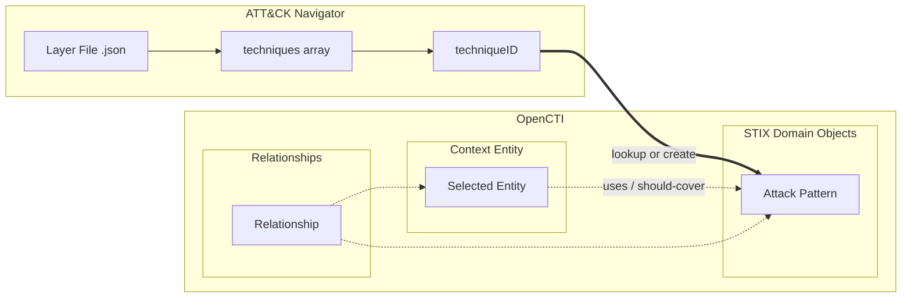
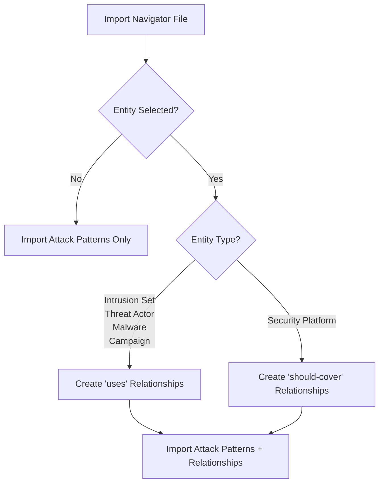

# OpenCTI Import ATT&CK Navigator TTPs Connector

| Status            | Date | Comment |
|-------------------|------|---------|
| Filigran Verified | -    | -       |

## Table of Contents

- [OpenCTI Import ATT&CK Navigator TTPs Connector](#opencti-import-attck-navigator-ttps-connector)
  - [Introduction](#introduction)
  - [Installation](#installation)
    - [Requirements](#requirements)
  - [Configuration variables](#configuration-variables)
    - [OpenCTI environment variables](#opencti-environment-variables)
    - [Base connector environment variables](#base-connector-environment-variables)
  - [Deployment](#deployment)
    - [Docker Deployment](#docker-deployment)
    - [Manual Deployment](#manual-deployment)
  - [Usage](#usage)
  - [Behavior](#behavior)
    - [Mapping to OpenCTI entities](#mapping-to-opencti-entities)
    - [Contextual import relationships](#contextual-import-relationships)
  - [Supported formats](#supported-formats)
  - [Debugging](#debugging)
  - [Additional information](#additional-information)

## Introduction

This connector ingests techniques defined in an **ATT&CK Navigator layer file**, converting them into Attack Patterns in OpenCTI.

The [ATT&CK Navigator](https://mitre-attack.github.io/attack-navigator/) is a web-based tool used to visualize and annotate different tactics and techniques from the MITRE ATT&CK framework. A "layer file" is a JSON file format that represents saved visualizations (layers) of selected techniques within the Navigator tool.

When importing a layer file from ATT&CK Navigator, you have the option to associate the imported techniques with an existing entity in the platform. The connector will create appropriate relationships based on the entity type selected during import.

## Installation

### Requirements

- OpenCTI Platform >= 6.7.10

## Configuration variables

There are a number of configuration options, which are set either in `docker-compose.yml` (for Docker) or in `config.yml` (for manual deployment).

### OpenCTI environment variables

Below are the parameters you'll need to set for OpenCTI:

| Parameter     | config.yml `opencti` | Docker environment variable | Default | Mandatory | Description                                          |
|---------------|----------------------|-----------------------------|---------|-----------|------------------------------------------------------|
| OpenCTI URL   | `url`                | `OPENCTI_URL`               | /       | Yes       | The URL of the OpenCTI platform.                     |
| OpenCTI Token | `token`              | `OPENCTI_TOKEN`             | /       | Yes       | The default admin token set in the OpenCTI platform. |

### Base connector environment variables

Below are the parameters you'll need to set for running the connector properly:

| Parameter                | config.yml `connector`  | Docker environment variable        | Default                 | Mandatory | Description                                                                                         |
|--------------------------|-------------------------|------------------------------------|-------------------------|-----------|-----------------------------------------------------------------------------------------------------|
| Connector ID             | `id`                    | `CONNECTOR_ID`                     | /                       | Yes       | A unique `UUIDv4` identifier for this connector instance.                                           |
| Connector Name           | `name`                  | `CONNECTOR_NAME`                   | ImportTTPsFileNavigator | No        | Name of the connector.                                                                              |
| Connector Scope          | `scope`                 | `CONNECTOR_SCOPE`                  | application/json        | Yes       | The MIME type of files this connector handles. Must be `application/json`.                          |
| Connector Auto           | `auto`                  | `CONNECTOR_AUTO`                   | false                   | No        | Enable/disable automatic import of files matching the scope.                                        |
| Validate Before Import   | `validate_before_import`| `CONNECTOR_VALIDATE_BEFORE_IMPORT` | false                   | No        | If enabled, bundles are sent for validation before import.                                          |
| Log Level                | `log_level`             | `CONNECTOR_LOG_LEVEL`              | error                   | No        | Determines the verbosity of the logs. Options are `debug`, `info`, `warn`, or `error`.              |

## Deployment

### Docker Deployment

Before building the Docker container, you need to set the version of pycti in `requirements.txt` equal to whatever version of OpenCTI you're running. Example, `pycti==6.9.23`. If you don't, it will take the latest version, but sometimes the OpenCTI SDK fails to initialize.

Build a Docker Image using the provided `Dockerfile`.

Example:

```shell
# Replace the IMAGE NAME with the appropriate value
docker build . -t [IMAGE NAME]:latest
```

Make sure to replace the environment variables in `docker-compose.yml` with the appropriate configurations for your environment. Then, start the docker container with the provided `docker-compose.yml`.

```shell
docker compose up -d
# -d for detached
```

### Manual Deployment

Create a file `config.yml` based on the provided `config.yml.sample`.

Replace the configuration variables (especially the "**ChangeMe**" variables) with the appropriate configurations for your environment.

Install the required python dependencies (preferably in a virtual environment):

```shell
pip3 install -r requirements.txt
```

Then, start the connector from the `src` directory:

```shell
python3 main.py
```

## Usage

This is an **Internal Import File** connector. It processes files uploaded to OpenCTI rather than fetching data from external sources.

To use this connector:

1. Navigate to **Data** → **Import** in the OpenCTI platform
2. Upload a JSON file exported from ATT&CK Navigator
3. Select this connector to process the file
4. Optionally, select an entity to associate the imported techniques with (contextual import)

The connector will parse the layer file and create Attack Pattern entities for each technique found.

## Behavior

The connector parses ATT&CK Navigator JSON layer files and converts each technique into an OpenCTI Attack Pattern.

### Mapping to OpenCTI entities



#### Technique processing logic

For each technique in the Navigator layer file:

| Step | Action | Description |
|------|--------|-------------|
| 1 | Extract `techniqueID` | Read the technique ID from the Navigator JSON (e.g., `T1059.001`) |
| 2 | Search OpenCTI | Query for existing Attack Pattern with matching `x_mitre_id` |
| 3a | If found | Use the existing Attack Pattern from OpenCTI |
| 3b | If not found | Create a new Attack Pattern with `name` = `techniqueID` and `x_mitre_id` = `techniqueID` |

### Contextual import relationships

When importing with a selected entity, the connector creates relationships based on the entity type:

| Entity Type | Relationship Type | Direction | Description |
|-------------|-------------------|-----------|-------------|
| Intrusion Set | `uses` | Entity → Attack Pattern | The intrusion set uses this technique |
| Threat Actor | `uses` | Entity → Attack Pattern | The threat actor uses this technique |
| Malware | `uses` | Entity → Attack Pattern | The malware uses this technique |
| Campaign | `uses` | Entity → Attack Pattern | The campaign uses this technique |
| Security Platform | `should-cover` | Entity → Attack Pattern | The security platform should cover/mitigate this technique |
| No entity selected | - | - | Techniques are imported globally without relationships |



## Supported formats

The connector only supports **JSON files** exported from the ATT&CK Navigator tool.

**Important**: Ensure your files have the `.json` extension so that they are recognized by the connector (MIME type `application/json`).

### Expected JSON structure

The connector expects the standard ATT&CK Navigator layer file format:

```json
{
  "name": "layer name",
  "versions": { ... },
  "domain": "enterprise-attack",
  "techniques": [
    {
      "techniqueID": "T1059.001",
      "tactic": "execution",
      "color": "#ff6666",
      "comment": "",
      "enabled": true,
      ...
    },
    {
      "techniqueID": "T1566.001",
      ...
    }
  ],
  ...
}
```

The connector specifically reads the `techniques` array and extracts the `techniqueID` field from each technique object.

## Debugging

The connector can be debugged by setting the appropriate log level. Set `CONNECTOR_LOG_LEVEL=debug` for verbose logging.

Note that logging messages can be added using `self.helper.connector_logger.{LOG_LEVEL}("Sample message")`, e.g., `self.helper.connector_logger.error("An error message")`.

## Additional information

- **Pre-requisite**: For best results, ensure the MITRE ATT&CK dataset is imported in OpenCTI before using this connector. This allows the connector to find and reuse existing Attack Patterns with full metadata rather than creating minimal placeholder Attack Patterns.
- The connector uses deterministic ID generation (`AttackPattern.generate_id()`) based on technique name and `x_mitre_id` to ensure idempotent imports.
- When an Attack Pattern is not found in OpenCTI, a minimal Attack Pattern is created with only the `name` and `x_mitre_id` fields populated.
- File markings provided during import are applied to the generated STIX bundle.
- If `validate_before_import` is enabled, the bundle will be sent for validation before being imported.
