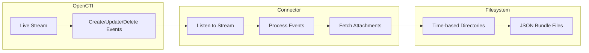

# OpenCTI Backup Files Connector

The Backup Files connector streams OpenCTI data to local filesystem storage, creating JSON backup files organized by time-based directories.

| Status            | Date | Comment |
|-------------------|------|---------|
| Filigran Verified | -    | -       |

## Table of Contents

- [OpenCTI Backup Files Connector](#opencti-backup-files-connector)
  - [Table of Contents](#table-of-contents)
  - [Introduction](#introduction)
  - [Installation](#installation)
    - [Requirements](#requirements)
  - [Configuration variables](#configuration-variables)
    - [OpenCTI environment variables](#opencti-environment-variables)
    - [Base connector environment variables](#base-connector-environment-variables)
    - [Connector extra parameters environment variables](#connector-extra-parameters-environment-variables)
  - [Deployment](#deployment)
    - [Docker Deployment](#docker-deployment)
    - [Manual Deployment](#manual-deployment)
  - [Usage](#usage)
  - [Behavior](#behavior)
  - [Debugging](#debugging)
  - [Additional information](#additional-information)

## Introduction

The Backup Files connector is a stream connector that consumes events from an OpenCTI live stream and writes STIX bundles as JSON files to a configurable local directory. This provides a simple backup mechanism for disaster recovery, archival purposes, or integration with file-based systems.

Key features:
- Real-time backup of OpenCTI data to filesystem
- Time-based directory organization (hourly buckets)
- Automatic file attachment handling
- Create, update, and delete event support
- Simple JSON file format for easy processing

## Installation

### Requirements

- OpenCTI Platform >= 6.8.0
- A directory accessible by the connector with write permissions

## Configuration variables

There are a number of configuration options, which are set either in `docker-compose.yml` (for Docker) or in `config.yml` (for manual deployment).

### OpenCTI environment variables

| Parameter     | config.yml | Docker environment variable | Mandatory | Description                                          |
|---------------|------------|-----------------------------|-----------|------------------------------------------------------|
| OpenCTI URL   | url        | `OPENCTI_URL`               | Yes       | The URL of the OpenCTI platform.                     |
| OpenCTI Token | token      | `OPENCTI_TOKEN`             | Yes       | The default admin token set in the OpenCTI platform. |

### Base connector environment variables

| Parameter             | config.yml        | Docker environment variable  | Default | Mandatory | Description                                                                   |
|-----------------------|-------------------|------------------------------|---------|-----------|-------------------------------------------------------------------------------|
| Connector ID          | id                | `CONNECTOR_ID`               |         | Yes       | A unique `UUIDv4` identifier for this connector instance.                     |
| Connector Name        | name              | `CONNECTOR_NAME`             |         | Yes       | Name of the connector.                                                        |
| Connector Scope       | scope             | `CONNECTOR_SCOPE`            |         | Yes       | Must be `synchronizer`, not used in this connector.                           |
| Live Stream ID        | live_stream_id    | `CONNECTOR_LIVE_STREAM_ID`   |         | Yes       | The Live Stream ID of the stream created in the OpenCTI interface.            |
| Log Level             | log_level         | `CONNECTOR_LOG_LEVEL`        | info    | No        | Determines the verbosity of the logs: `debug`, `info`, `warn`, or `error`.    |

### Connector extra parameters environment variables

| Parameter        | config.yml      | Docker environment variable | Default | Mandatory | Description                                                    |
|------------------|-----------------|------------------------------|---------|-----------|----------------------------------------------------------------|
| Backup Protocol  | backup.protocol | `BACKUP_PROTOCOL`            |         | Yes       | Protocol for file copy (only `local` is supported for now).    |
| Backup Path      | backup.path     | `BACKUP_PATH`                |         | Yes       | Path to be used to copy the data, can be relative or absolute. |
| Backup Login     | backup.login    | `BACKUP_LOGIN`               |         | No        | The login if the selected protocol needs login authentication. |
| Backup Password  | backup.password | `BACKUP_PASSWORD`            |         | No        | The password if the selected protocol needs login authentication. |

## Deployment

### Docker Deployment

Build the Docker image:

```bash
docker build -t opencti/connector-backup-files:latest .
```

Configure the connector in `docker-compose.yml`:

```yaml
  connector-backup-files:
    image: opencti/connector-backup-files:latest
    environment:
      - OPENCTI_URL=http://localhost
      - OPENCTI_TOKEN=ChangeMe
      - CONNECTOR_ID=ChangeMe
      - CONNECTOR_NAME=BackupFiles
      - CONNECTOR_SCOPE=synchronizer
      - CONNECTOR_LOG_LEVEL=info
      - CONNECTOR_LIVE_STREAM_ID=ChangeMe
      - BACKUP_PROTOCOL=local
      - BACKUP_PATH=/backup
    volumes:
      - /path/to/backup:/backup
    restart: always
```

Start the connector:

```bash
docker compose up -d
```

### Manual Deployment

1. Create `config.yml` based on `config.yml.sample`.

2. Install dependencies:

```bash
pip3 install -r requirements.txt
```

3. Start the connector from the `src` directory:

```bash
python3 backup-files.py
```

## Usage

The connector automatically processes events from the configured OpenCTI live stream:

1. Create a Live Stream in OpenCTI (Data Management → Data Sharing → Live Streams)
2. Configure the stream with desired filters (entity types, markings, etc.)
3. Copy the Live Stream ID to the connector configuration
4. Start the connector

The connector will begin backing up data to the configured path.

## Behavior

The connector listens to OpenCTI live stream events and writes STIX bundles as JSON files to the filesystem.

### Data Flow



### Directory Structure

Files are organized by creation timestamp, rounded to the nearest hour:

```
/backup/opencti_data/
├── 20240115T140000Z/
│   ├── indicator--abc123.json
│   └── malware--def456.json
├── 20240115T150000Z/
│   ├── report--ghi789.json
│   └── threat-actor--jkl012.json
```

### Event Processing

| Event Type | Action                                                    |
|------------|-----------------------------------------------------------|
| create     | Creates JSON file with STIX bundle including attachments  |
| update     | Overwrites existing JSON file with updated bundle         |
| delete     | Removes the JSON file from the filesystem                 |

### File Format

Each file contains a STIX 2.1 bundle:

```json
{
  "type": "bundle",
  "objects": [
    {
      "type": "indicator",
      "id": "indicator--abc123",
      "name": "Example Indicator",
      "...": "..."
    }
  ]
}
```

### Attachment Handling

When entities have attached files, the connector:
1. Fetches the file content from OpenCTI
2. Serializes the binary data as base64
3. Includes the data in the `files` extension of the entity

## Debugging

Enable verbose logging by setting:

```env
CONNECTOR_LOG_LEVEL=debug
```

Log output includes:
- Event processing status
- File path for each backup operation
- Entity ID being processed

### Common Issues

| Issue                    | Solution                                              |
|--------------------------|-------------------------------------------------------|
| Permission denied        | Ensure backup path has write permissions              |
| Path does not exist      | Create the backup directory before starting           |
| Disk full                | Monitor disk space and implement rotation             |
| Missing attachments      | Verify OpenCTI URL is accessible from connector       |

## Additional information

- **Backup Strategy**: Combine with file synchronization tools (rsync, etc.) for off-site backup
- **Storage Growth**: Monitor disk usage as backup size grows over time
- **File Retention**: Implement external cleanup scripts for old backup files
- **Timestamp Rounding**: Files are grouped by hour based on `created_at` timestamp
- **Administrator Token**: Recommended to use a dedicated admin token for complete data access
- **Live Stream Filters**: Use stream filters to backup only specific entity types or markings
