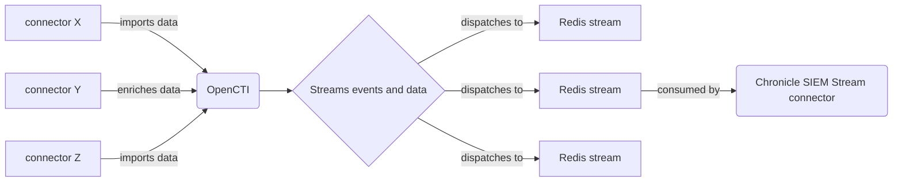
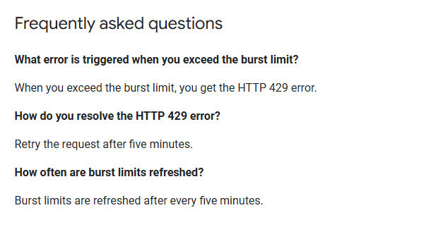

# OpenCTI Google SecOps Chronicle SIEM

Table of Contents

- [OpenCTI Chronicle SIEM Intel Stream Connector](#opencti-stream-harfanglab-intel)
    - [Introduction](#introduction)
    - [Installation](#installation)
        - [Requirements](#requirements)
    - [Configuration variables](#configuration-variables)
        - [OpenCTI environment variables](#opencti-environment-variables)
        - [Base connector environment variables](#base-connector-environment-variables)
        - [Connector extra parameters environment variables](#connector-extra-parameters-environment-variables)
    - [Deployment](#deployment)
        - [Docker Deployment](#docker-deployment)
        - [Manual Deployment](#manual-deployment)
    - [Usage](#usage)
    - [Known Behavior](#known-behavior)
    - [Limitations](#limitations)
    - [Debugging](#debugging)

## Introduction

This connector enables the dissemination of OpenCTI STIX indicators into Google Chronicle SIEM.
The connector consumes indicators from an OpenCTI stream, convert them as [UDM entities](https://cloud.google.com/chronicle/docs/reference/udm-field-list#securityresult) and push them into Google Chronicle using the ["entities.import"](https://cloud.google.com/chronicle/docs/reference/rest/v1alpha/projects.locations.instances.entities/import) API.


OpenCTI data is coming from import connectors. Once this data is ingested in OpenCTI, it is pushed to a Redis event
stream. This stream is consumed by the Chronicle SIEM connector to insert intel (IOCs) in the
Google SecOps Chronicle SIEM platform.



## Installation

### Requirements

- Python = 3.11.X (not compatible with 3.12 and above for now)
- OpenCTI Platform >= 6.4.X
- pycti >= 6.4.X

## Configuration variables

There are a number of configuration options, which are set either in `docker-compose.yml` (for Docker) or
in `config.yml` (for manual deployment).

### OpenCTI environment variables

Below are the parameters you'll need to set for OpenCTI:

| Parameter     | config.yml `opencti` | Docker environment variable | Default | Mandatory | Description                                          |
|---------------|----------------------|-----------------------------|---------|-----------|------------------------------------------------------|
| OpenCTI URL   | url                  | `OPENCTI_URL`               | /       | Yes       | The URL of the OpenCTI platform.                     |
| OpenCTI Token | token                | `OPENCTI_TOKEN`             | /       | Yes       | The default admin token set in the OpenCTI platform. |

### Base connector environment variables

Below are the parameters you'll need to set for running the connector properly:

| Parameter                             | config.yml `connector`      | Docker environment variable             | Default | Mandatory | Description                                                                                                                                            |
|---------------------------------------|-----------------------------|-----------------------------------------|---------|-----------|--------------------------------------------------------------------------------------------------------------------------------------------------------|
| Connector ID                          | id                          | `CONNECTOR_ID`                          | /       | Yes       | A unique `UUIDv4` identifier for this connector instance.                                                                                              |
| Connector Type                        | type                        | `CONNECTOR_TYPE`                        | STREAM  | Yes       | Should always be set to `STREAM` for this connector.                                                                                                   |
| Connector Name                        | name                        | `CONNECTOR_NAME`                        |         | Yes       | Name of the connector.                                                                                                                                 |
| Log Level                             | log_level                   | `CONNECTOR_LOG_LEVEL`                   | info    | Yes       | Determines the verbosity of the logs. Options are `debug`, `info`, `warn`, or `error`.                                                                 |
| Connector Live Stream ID              | live_stream_id              | `CONNECTOR_LIVE_STREAM_ID`              | /       | Yes       | ID of the live stream created in the OpenCTI UI                                                                                                        |
| Connector Live Stream Listen Delete   | live_stream_listen_delete   | `CONNECTOR_LIVE_STREAM_LISTEN_DELETE`   | true    | Yes       | Listen to all delete events concerning the entity, depending on the filter set for the OpenCTI stream.                                                 |
| Connector Live Stream No dependencies | live_stream_no_dependencies | `CONNECTOR_LIVE_STREAM_NO_DEPENDENCIES` | true    | Yes       | Always set to `True` unless you are synchronizing 2 OpenCTI platforms and you want to get an entity and all context (relationships and related entity) |

### Connector extra parameters environment variables

Below are the parameters you'll need to set for the connector:

| Parameter                    | config.yml `chronicle`   | Docker environment variable    | Default | Mandatory   | Description                                                                |
|------------------------------|--------------------------|--------------------------------|---------|-------------|----------------------------------------------------------------------------|
| Chronicle Project Region     | `project_region`         | `CHRONICLE_PROJECT_REGION`     | /       | Yes         | The Region where the Chronicle instance is located                         |
| Chronicle Project Id         | `project_id`             | `CHRONICLE_PROJECT_ID`         | /       | Yes         | The Chronicle project Id                                                   |
| Chronicle Project Instance   | `project_instance`       | `CHRONICLE_PROJECT_INSTANCE`   | /       | Yes         | The Chronicle project instance                                             |
| Chronicle Private Key Id     | `private_key_id`         | `CHRONICLE_PRIVATE_KEY_ID`     | /       | Yes         | Google service account private_key_id value (in account.json)              |
| Chronicle Private Key        | `private_key`            | `CHRONICLE_PRIVATE_KEY`        | /       | Yes         | Google service account private_key value (in account.json)                 |
| Chronicle Client Email       | `client_email`           | `CHRONICLE_CLIENT_EMAIL`       | /       | Yes         | Google service account client_email value(in account.json)                 |
| Chronicle Client Id          | `client_id`              | `CHRONICLE_CLIENT_ID`          | /       | Yes         | Google service account client_id value (in account.json)                   |
| Chronicle Auth URI           | `auth_uri`               | `CHRONICLE_AUTH_URI`           | /       | Yes         | Google service account auth_uri value (in account.json)                    |
| Chronicle Token URI          | `token_uri`              | `CHRONICLE_TOKEN_URI`          | /       | Yes         | Google service account token_uri value (in account.json)                   |
| Chronicle Auth Provider Cert | `auth_provider_cert`     | `CHRONICLE_AUTH_PROVIDER_CERT` | /       | Yes         | Google service account auth_provider_x509_cert_url value (in account.json) |
| Chronicle Client Cert URL    | `client_cert_url`        | `CHRONICLE_CLIENT_CERT_URL`    | /       | Yes         | Google service account client_x509_cert_url value (in account.json)        |

## Deployment

### Docker Deployment

Before building the Docker container, you need to set the version of pycti in `requirements.txt` equal to whatever
version of OpenCTI you're running. Example, `pycti==6.4.1`. If you don't, it will take the latest version, but
sometimes the OpenCTI SDK fails to initialize.

Build a Docker Image using the provided `Dockerfile`.

Example:

```shell
# Replace the IMAGE NAME with the appropriate value
docker build . -t [IMAGE NAME]:6.4.1
```

Make sure to replace the environment variables in `docker-compose.yml` with the appropriate configurations for your
environment. Then, start the docker container with the provided docker-compose.yml

```shell
docker compose up -d
# -d for detached
```

### Manual Deployment

Create a file `config.yml` based on the provided `config.yml.sample`.

Replace the configuration variables (especially the "**ChangeMe**" variables) with the appropriate configurations for
you environment.

Install the required python dependencies (preferably in a virtual environment):

```shell
pip3 install -r requirements.txt
```

Then, start the connector from chronicle-siem-udm/src:

```shell
python3 main.py
```

## Usage

After Installation, the connector should require minimal interaction to use, and should update automatically at a
regular interval specified in your `docker-compose.yml` or `config.yml` in `duration_period`.

However, if you would like to force an immediate download of a new batch of entities, navigate to:

`Data management` -> `Ingestion` -> `Connectors` in the OpenCTI platform.

Find the connector, and click on the refresh button to reset the connector's state and force a new
download of data by re-running the connector.

## Known Behavior

## Limitations

Here's the rewritten section formatted for a README documentation:

---

## Known Limitations and Issues

This section outlines some current limitations and issues you may encounter while using this integration. Please consider these points during implementation and operation.

### Quota and Rate Limits
- **Quota Limits:** Refer to the official [service limits documentation](https://cloud.google.com/chronicle/docs/reference/service-limits) for detailed quota constraints.
- **Rate-Limiting (429 Errors):** It is recommended to implement error-handling mechanisms with incremental backoff to manage rate-limit scenarios effectively.
    
  More details: [Burst Limits FAQ](https://cloud.google.com/chronicle/docs/ingestion/burst-limits#frequently_asked_questions)

### OAuth Token Expiry
- By default, OAuth access tokens expire after **1 hour (3,600 seconds)**. Ensure your token management system requests a new token upon expiration.  
- To adjust token lifetimes:
  - Use the [`serviceAccounts.generateAccessToken`](https://cloud.google.com/iam/docs/reference/credentials/rest/v1/projects.serviceAccounts/generateAccessToken) method for custom token lifetimes (up to **12 hours**).
  - Extend token lifetimes beyond default by enabling the [`iam.allowServiceAccountCredentialLifetimeExtension`](https://cloud.google.com/resource-manager/docs/organization-policy/restricting-service-accounts#extend_oauth_ttl) constraint through an organizational policy. For additional details, see [Create a Short-Lived Access Token](https://cloud.google.com/iam/docs/create-short-lived-credentials-direct#sa-credentials-oauth).

### Update Latency
- **Indicator of Compromise (IOC) Updates:** Changes to IOCs are reflected in Chronicle SIEM within **2 to 3 hours** on a custom dashboard and **5 minutes** on direct search.  
- **Role Updates:** Role updates are processed within **30 minutes**.

## Tests Coverage

The tests cover in first place if the connector converter handle properly the UDM entity generation according to the following observables:
- Domain
- Hostname
- IPV4
- IPV6
- URL
- File

## Debugging

The connector can be debugged by setting the appropriate log level.
Note that logging messages can be added using `self.helper.connector_logger,{LOG_LEVEL}("Sample message")`, i.
e., `self.helper.connector_logger.error("An error message")`.

