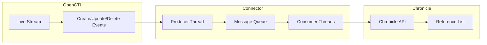

# OpenCTI Chronicle Connector

| Status | Date | Comment |
|--------|------|---------|
| Filigran Verified | -    | -       |

The Chronicle connector streams OpenCTI threat intelligence data to Google Chronicle reference lists for threat detection and investigation purposes.

## Table of Contents

- [OpenCTI Chronicle Connector](#opencti-chronicle-connector)
  - [Table of Contents](#table-of-contents)
  - [Introduction](#introduction)
  - [Installation](#installation)
    - [Requirements](#requirements)
  - [Configuration variables](#configuration-variables)
    - [OpenCTI environment variables](#opencti-environment-variables)
    - [Base connector environment variables](#base-connector-environment-variables)
    - [Connector extra parameters environment variables](#connector-extra-parameters-environment-variables)
  - [Deployment](#deployment)
    - [Docker Deployment](#docker-deployment)
    - [Manual Deployment](#manual-deployment)
  - [Usage](#usage)
  - [Behavior](#behavior)
  - [Debugging](#debugging)
  - [Additional information](#additional-information)

## Introduction

The Chronicle connector is a stream connector that listens to OpenCTI live stream events and pushes threat intelligence data to Google Chronicle reference lists. This enables security teams to enrich their Chronicle SIEM with indicators and entities from OpenCTI for enhanced threat detection and correlation.

Key features:
- Real-time streaming of OpenCTI data to Chronicle reference lists
- Support for create, update, and delete operations
- Multi-threaded consumer architecture for high throughput
- Configurable entity type filtering
- Optional Prometheus metrics for monitoring

## Installation

### Requirements

- OpenCTI Platform >= 6.0.0
- Google Chronicle account with API access
- Google Cloud service account with Chronicle Backstory API permissions

## Configuration variables

There are a number of configuration options, which are set either in `docker-compose.yml` (for Docker) or in `config.yml` (for manual deployment).

### OpenCTI environment variables

| Parameter     | config.yml | Docker environment variable | Mandatory | Description                                          |
|---------------|------------|-----------------------------|-----------|------------------------------------------------------|
| OpenCTI URL   | url        | `OPENCTI_URL`               | Yes       | The URL of the OpenCTI platform.                     |
| OpenCTI Token | token      | `OPENCTI_TOKEN`             | Yes       | The default admin token set in the OpenCTI platform. |

### Base connector environment variables

| Parameter                  | config.yml                | Docker environment variable             | Default | Mandatory | Description                                                                    |
|----------------------------|---------------------------|-----------------------------------------|---------|-----------|--------------------------------------------------------------------------------|
| Connector ID               | id                        | `CONNECTOR_ID`                          |         | Yes       | A unique `UUIDv4` identifier for this connector instance.                      |
| Connector Name             | name                      | `CONNECTOR_NAME`                        |         | Yes       | Name of the connector.                                                         |
| Connector Scope            | scope                     | `CONNECTOR_SCOPE`                       |         | Yes       | Must be `chronicle`, not used in this connector.                               |
| Live Stream ID             | live_stream_id            | `CONNECTOR_LIVE_STREAM_ID`              |         | Yes       | The Live Stream ID of the stream created in the OpenCTI interface.             |
| Live Stream Start Timestamp| live_stream_start_timestamp| `CONNECTOR_LIVE_STREAM_START_TIMESTAMP`|         | No        | Start timestamp used on connector first start.                                 |
| Log Level                  | log_level                 | `CONNECTOR_LOG_LEVEL`                   | info    | No        | Determines the verbosity of the logs: `debug`, `info`, `warn`, or `error`.     |
| Consumer Count             | consumer_count            | `CONNECTOR_CONSUMER_COUNT`              | 10      | No        | Number of consumer/worker threads that will push data to Chronicle.            |

### Connector extra parameters environment variables

| Parameter                  | config.yml                | Docker environment variable       | Default | Mandatory | Description                                                |
|----------------------------|---------------------------|-----------------------------------|---------|-----------|-----------------------------------------------------------|
| Chronicle URL              | chronicle.url             | `CHRONICLE_URL`                   |         | Yes       | The Chronicle API URL (e.g., https://backstory.googleapis.com). |
| Chronicle List Name        | chronicle.list_name       | `CHRONICLE_LIST_NAME`             |         | Yes       | The name of the Chronicle reference list to populate.      |
| Chronicle Project ID       | chronicle.project_id      | `CHRONICLE_PROJECT_ID`            |         | Yes       | The `project_id` from your Google service account JSON.    |
| Chronicle Private Key ID   | chronicle.private_key_id  | `CHRONICLE_PRIVATE_KEY_ID`        |         | Yes       | The `private_key_id` from your Google service account JSON.|
| Chronicle Private Key      | chronicle.private_key     | `CHRONICLE_PRIVATE_KEY`           |         | Yes       | The `private_key` from your Google service account JSON.   |
| Chronicle Client Email     | chronicle.client_email    | `CHRONICLE_CLIENT_EMAIL`          |         | Yes       | The `client_email` from your Google service account JSON.  |
| Chronicle Client ID        | chronicle.client_id       | `CHRONICLE_CLIENT_ID`             |         | Yes       | The `client_id` from your Google service account JSON.     |
| Chronicle Auth URI         | chronicle.auth_uri        | `CHRONICLE_AUTH_URI`              |         | Yes       | The `auth_uri` from your Google service account JSON.      |
| Chronicle Token URI        | chronicle.token_uri       | `CHRONICLE_TOKEN_URI`             |         | Yes       | The `token_uri` from your Google service account JSON.     |
| Chronicle Auth Provider Cert| chronicle.auth_provider_cert| `CHRONICLE_AUTH_PROVIDER_CERT`  |         | Yes       | The `auth_provider_x509_cert_url` from your service account.|
| Chronicle Client Cert URL  | chronicle.client_cert_url | `CHRONICLE_CLIENT_CERT_URL`       |         | Yes       | The `client_x509_cert_url` from your service account.      |
| Chronicle Ignore Types     | chronicle.ignore_types    | `CHRONICLE_IGNORE_TYPES`          |         | Yes       | Comma-separated list of entity types to ignore from the stream.|
| Metrics Enable             | metrics.enable            | `METRICS_ENABLE`                  | false   | No        | Whether to enable Prometheus metrics.                      |
| Metrics Address            | metrics.addr              | `METRICS_ADDR`                    | 0.0.0.0 | No        | Bind IP address for metrics endpoint.                      |
| Metrics Port               | metrics.port              | `METRICS_PORT`                    | 9113    | No        | Port for metrics endpoint.                                 |

## Deployment

### Docker Deployment

Build the Docker image:

```bash
docker build -t opencti/connector-chronicle:latest .
```

Configure the connector in `docker-compose.yml`:

```yaml
  connector-chronicle:
    image: opencti/connector-chronicle:latest
    environment:
      - OPENCTI_URL=http://localhost
      - OPENCTI_TOKEN=ChangeMe
      - CONNECTOR_ID=ChangeMe
      - CONNECTOR_NAME=Chronicle
      - CONNECTOR_SCOPE=chronicle
      - CONNECTOR_LOG_LEVEL=info
      - CONNECTOR_LIVE_STREAM_ID=ChangeMe
      - CONNECTOR_CONSUMER_COUNT=10
      - CHRONICLE_URL=https://backstory.googleapis.com
      - CHRONICLE_LIST_NAME=opencti_indicators
      - CHRONICLE_PROJECT_ID=ChangeMe
      - CHRONICLE_PRIVATE_KEY_ID=ChangeMe
      - CHRONICLE_PRIVATE_KEY=ChangeMe
      - CHRONICLE_CLIENT_EMAIL=ChangeMe
      - CHRONICLE_CLIENT_ID=ChangeMe
      - CHRONICLE_AUTH_URI=https://accounts.google.com/o/oauth2/auth
      - CHRONICLE_TOKEN_URI=https://oauth2.googleapis.com/token
      - CHRONICLE_AUTH_PROVIDER_CERT=https://www.googleapis.com/oauth2/v1/certs
      - CHRONICLE_CLIENT_CERT_URL=ChangeMe
      - CHRONICLE_IGNORE_TYPES=relationship,marking-definition
      - METRICS_ENABLE=false
    restart: always
```

Start the connector:

```bash
docker compose up -d
```

### Manual Deployment

1. Create `config.yml` based on `config.yml.sample`.

2. Install dependencies:

```bash
pip3 install -r requirements.txt
```

3. Start the connector from the `src` directory:

```bash
python3 chronicle.py
```

## Usage

The connector automatically processes events from the configured OpenCTI live stream:

1. Create a Google Cloud service account with Chronicle Backstory API permissions
2. Download the service account JSON key file
3. Create a Live Stream in OpenCTI (Data Management -> Data Sharing -> Live Streams)
4. Configure the stream with desired filters (entity types, markings, etc.)
5. Copy the Live Stream ID to the connector configuration
6. Extract the required fields from your service account JSON and configure the connector
7. Start the connector

The connector will begin streaming OpenCTI data to Chronicle reference lists.

## Behavior

The connector listens to OpenCTI live stream events and maintains a Chronicle reference list with the entity names.

### Data Flow



### Event Processing

| Event Type | Action                                                        |
|------------|---------------------------------------------------------------|
| create     | Adds entity name to the Chronicle reference list              |
| update     | Updates the entity name in the reference list (if changed)    |
| delete     | Removes the entity name from the Chronicle reference list     |

### Entity Mapping

| OpenCTI Data        | Chronicle Reference List | Description                              |
|---------------------|--------------------------|------------------------------------------|
| Entity Name         | List Entry               | The entity's `name` field is added to list |
| -                   | List Name                | Configurable via `CHRONICLE_LIST_NAME`   |

### Filtering

The connector supports filtering out specific entity types via `CHRONICLE_IGNORE_TYPES`. Common types to ignore include:

- `relationship` - STIX relationships between entities
- `marking-definition` - TLP and other marking definitions
- `identity` - Organization and individual identities

### Multi-threaded Processing

The connector uses a producer-consumer architecture:

1. **Producer**: Listens to the OpenCTI live stream and queues messages
2. **Queue**: Thread-safe message queue (size = 2 x consumer count)
3. **Consumers**: Multiple worker threads process messages in parallel

Configure thread count via `CONNECTOR_CONSUMER_COUNT` (default: 10).

## Debugging

Enable verbose logging by setting:

```env
CONNECTOR_LOG_LEVEL=debug
```

Log output includes:
- Message processing status
- Create/update/delete operations
- Chronicle API response status codes
- Filtered entity notifications

### Prometheus Metrics

When enabled (`METRICS_ENABLE=true`), the following metrics are exposed:

| Metric              | Type    | Description                                |
|---------------------|---------|-------------------------------------------|
| processed_messages  | Counter | Number of processed messages by action    |
| current_state       | Gauge   | Current connector state (event timestamp) |

### Common Issues

| Issue                          | Solution                                              |
|--------------------------------|-------------------------------------------------------|
| Authentication errors          | Verify service account credentials are correct        |
| API 400/403 errors             | Check Chronicle API permissions for service account   |
| Missing Live Stream ID         | Create a live stream in OpenCTI and configure the ID  |
| High memory usage              | Reduce `CONNECTOR_CONSUMER_COUNT`                     |
| Duplicate entries in list      | Normal behavior - connector checks before adding      |

## Additional information

- **Service Account Setup**: Create a service account in Google Cloud Console with Chronicle Backstory API access
- **Reference List Limits**: Be aware of Chronicle reference list size limits
- **Authentication**: Uses Google OAuth 2.0 with service account credentials
- **API Scope**: `https://www.googleapis.com/auth/chronicle-backstory`
- **Filtering Strategy**: Use `CHRONICLE_IGNORE_TYPES` to reduce noise in reference lists
- **Performance Tuning**: Adjust `CONNECTOR_CONSUMER_COUNT` based on throughput requirements

