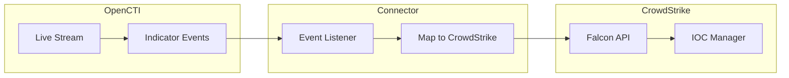

# OpenCTI CrowdStrike Endpoint Security Connector

| Status | Date | Comment |
|--------|------|---------|
| Filigran Verified | -    | -       |

The CrowdStrike Endpoint Security connector streams OpenCTI indicators to CrowdStrike Falcon for endpoint protection and threat detection.

## Table of Contents

- [OpenCTI CrowdStrike Endpoint Security Connector](#opencti-crowdstrike-endpoint-security-connector)
  - [Table of Contents](#table-of-contents)
  - [Introduction](#introduction)
  - [Installation](#installation)
    - [Requirements](#requirements)
  - [Configuration variables](#configuration-variables)
    - [OpenCTI environment variables](#opencti-environment-variables)
    - [Base connector environment variables](#base-connector-environment-variables)
    - [Connector extra parameters environment variables](#connector-extra-parameters-environment-variables)
  - [Deployment](#deployment)
    - [Docker Deployment](#docker-deployment)
    - [Manual Deployment](#manual-deployment)
  - [Usage](#usage)
  - [Behavior](#behavior)
    - [Dissemination assurance (deployment write-back)](#dissemination-assurance-deployment-write-back)
  - [Debugging](#debugging)
  - [Additional information](#additional-information)

## Introduction

[CrowdStrike](https://www.crowdstrike.com/about-us/) is a technology company specializing in cybersecurity, providing cloud-based solutions to protect organizations from cyber threats. The CrowdStrike Falcon platform utilizes real-time attack indicators, continuously updated threat intelligence, and extensive telemetry data to provide threat detection, automated protection, and incident response.

This connector monitors events from an OpenCTI live stream and synchronizes indicators (IOCs) to CrowdStrike Falcon using the [FalconPy SDK](https://www.falconpy.io/Home.html). It supports create, update, and delete operations for maintaining synchronized threat intelligence.

Key features:
- Real-time synchronization of indicators to CrowdStrike Falcon
- Support for multiple observable types (domain, IP, hash)
- Platform-specific IOC targeting (Windows, Mac, Linux, mobile)
- Configurable permanent or soft delete behavior
- Prometheus metrics for monitoring
- Dissemination assurance: deployment status, periodic IOC reconciliation and alert hits reported back to OpenCTI

## Installation

### Requirements

- OpenCTI Platform >= 5.0.0
- CrowdStrike Falcon account with API access
- API credentials (Client ID and Client Secret) with IOC Manager permissions (**IOC Management: Read and Write**), plus
  **Alerts: Read** to report hits (see [Dissemination assurance](#dissemination-assurance-deployment-write-back))

## Configuration variables

Find all the configuration variables available here: [Connector Configurations](./__metadata__/CONNECTOR_CONFIG_DOC.md)

_The `opencti` and `connector` options in the `docker-compose.yml` and `config.yml` are the same as for any other connector.
For more information regarding these variables, please refer to [OpenCTI's documentation on connectors](https://docs.opencti.io/latest/deployment/connectors/)._

## Deployment

### Docker Deployment

Build the Docker image:

```bash
docker build -t opencti/connector-crowdstrike-endpoint-security:latest .
```

Configure the connector in `docker-compose.yml`:

```yaml
  connector-crowdstrike-endpoint-security:
    image: opencti/connector-crowdstrike-endpoint-security:latest
    environment:
      - OPENCTI_URL=http://localhost
      - OPENCTI_TOKEN=ChangeMe
      - CONNECTOR_ID=ChangeMe
      - CONNECTOR_LIVE_STREAM_ID=ChangeMe
      - CROWDSTRIKE_CLIENT_ID=ChangeMe
      - CROWDSTRIKE_CLIENT_SECRET=ChangeMe
    restart: always
```

Start the connector:

```bash
docker compose up -d
```

### Manual Deployment

1. Create `config.yml` based on `config.yml.sample`.

2. Install dependencies:

```bash
pip3 install -r requirements.txt
```

3. Start the connector from the `src` directory:

```bash
python3 main.py
```

## Usage

After installation, the connector processes events from the configured OpenCTI live stream:

1. Create a Live Stream in OpenCTI (Data Management -> Data Sharing -> Live Streams)
2. Configure the stream with filters: Entity type = `Indicator`, Revoked = `No`
3. Copy the Live Stream ID to the connector configuration
4. Start the connector

On first run, the connector synchronizes all existing indicators matching the stream filters to CrowdStrike.

## Behavior

The connector listens to OpenCTI live stream events and manages IOCs in CrowdStrike Falcon.

### Data Flow


```mermaid
graph LR
    subgraph OpenCTI
        Stream[Live Stream]
        Indicators[Indicator Events]
    end

    subgraph Connector
        Listen[Event Listener]
        Map[Map to CrowdStrike]
    end

    subgraph CrowdStrike
        API[Falcon API]
        IOCs[IOC Manager]
    end

    Stream --> Indicators
    Indicators --> Listen
    Listen --> Map
    Map --> API
    API --> IOCs
```

### Event Processing

| Event Type | Action                                                        |
|------------|---------------------------------------------------------------|
| create     | Creates IOC in CrowdStrike (or updates if exists with soft delete) |
| update     | Updates IOC in CrowdStrike                                    |
| delete     | Permanently deletes or marks as `TO_DELETE` based on configuration |

### Entity Mapping

| OpenCTI Observable Type | CrowdStrike IOC Type | Description                              |
|-------------------------|----------------------|------------------------------------------|
| Domain-Name             | domain               | Domain name indicators                   |
| Hostname                | domain               | Hostname indicators (mapped to domain)   |
| IPv4-Addr               | ipv4                 | IPv4 address indicators                  |
| IPv6-Addr               | ipv6                 | IPv6 address indicators                  |
| File (SHA-256)          | sha256               | SHA-256 file hash indicators             |
| File (MD5)              | md5                  | MD5 file hash indicators                 |

### Severity Mapping

| OpenCTI Score | CrowdStrike Severity |
|---------------|----------------------|
| 0-19          | informational        |
| 20-39         | low                  |
| 40-59         | medium               |
| 60-79         | high                 |
| 80-100        | critical             |

### Platform Mapping

| OpenCTI Platform | CrowdStrike Platform | Notes                           |
|------------------|----------------------|---------------------------------|
| windows          | windows              | Always available                |
| macos            | mac                  | Always available                |
| linux            | linux                | Always available                |
| android          | android              | Requires `falcon_for_mobile_active=true` |
| ios              | ios                  | Requires `falcon_for_mobile_active=true` |

### Dissemination assurance (deployment write-back)

The connector reports to OpenCTI whether each indicator is actually live in CrowdStrike Falcon. The status is stored on
the `deployed-on` relationship between the indicator and the `CrowdStrike Falcon` Security Platform entity (created if
it does not exist), and detection hits are counted with a sighting of the indicator on that entity.

| When                                      | Reported to OpenCTI                                                                                  |
|-------------------------------------------|------------------------------------------------------------------------------------------------------|
| IOC created, updated or already present   | `deployed`, with the CrowdStrike IOC id as external id                                               |
| IOC rejected by CrowdStrike               | `failed`, with a short reason such as "CrowdStrike refused the IOC push: invalid request" or "CrowdStrike could not be reached for the IOC push" (the CrowdStrike error and HTTP status are written to the connector log) |
| Unsupported IOC type (URL, email...)      | Nothing: the indicator is not disseminated to CrowdStrike                                            |
| Delete event, `CROWDSTRIKE_PERMANENT_DELETE=true` | `removed` once every connector IOC of the value is deleted (or none is left)                 |
| Delete event, `CROWDSTRIKE_PERMANENT_DELETE=false` | Nothing: the IOC is only tagged `TO_DELETE` and keeps detecting                             |
| Reconciliation, IOC present               | `active`                                                                                             |
| Reconciliation, IOC absent                | `removed` (deleted or expired in CrowdStrike)                                                        |
| Reconciliation, `pending` (analyst retry) | The indicator is pushed again and reported `deployed` or `failed`; an IOC still present is confirmed `active` instead |
| Reconciliation, withdrawal or expiry      | Revoked, expired or withdrawn indicators still present are withdrawn and reported `removed`          |
| Hits                                      | Falcon alerts whose IOC value matches a deployed indicator                                            |

- **Reconciliation**: every `DEPLOYMENT_RECONCILIATION_INTERVAL` minutes, the IOCs created by the connector API client
  (`created_by`) with the `OpenCTI IOC` source are read back with the IOC API (500 per page). Deleted IOCs are ignored.
  Expired IOCs, and IOCs withdrawn by the connector (tagged `TO_DELETE` with the `no_action` action), are not live: they
  never confirm a deployment, but a withdrawal or an expiry still deletes or deactivates them. Deployments are
  matched by IOC id, then by the IOC value the connector pushes (the first value of the pattern: an IOC holding
  another value of a composite pattern never confirms nor withdraws it). A withdrawal deletes the IOC when
  `CROWDSTRIKE_PERMANENT_DELETE=true`;
  otherwise the IOC is kept, tagged `TO_DELETE` and its action set to `no_action` so that it stops detecting. A
  read-back error skips the run: IOCs are never reported `removed` from a partial listing.
- **Hits**: during each reconciliation, the Falcon alerts created since the previous run are read (at most 10,000 per
  run, oldest first; when the limit is reached the next run resumes at the newest alert read). An alert counts one hit
  for every deployed indicator whose pushed IOC value (the first value of its pattern) is the alert IOC value, at the
  alert creation time; hits already reported
  are never counted twice. An alert without a creation time or with malformed IOC fields fails the read: the next run
  reads the same alerts again. The API client needs the **Alerts: Read** scope; without it, set
  `HITS_REPORTING_ENABLED=false`.
- **Graceful degradation**: on OpenCTI platforms without the deployment write-back API the feature is a no-op (logged
  once). Write-back errors are logged as warnings and never block the dissemination.

| Environment variable                 | Default              | Description                                                           |
|--------------------------------------|----------------------|-----------------------------------------------------------------------|
| `DEPLOYMENT_REPORTING_ENABLED`       | `true`               | Report the deployment status of the pushed indicators.                |
| `DEPLOYMENT_RECONCILIATION_INTERVAL` | `60`                 | Minutes between two reconciliations, `0` disables the reconciliation. |
| `HITS_REPORTING_ENABLED`             | `true`               | Report the alert hits of the deployed indicators.                     |
| `SECURITY_PLATFORM_NAME`             | `CrowdStrike Falcon` | Name of the Security Platform entity in OpenCTI.                      |
| `SECURITY_PLATFORM_TYPE`             | `EDR`                | Type of the Security Platform entity (`security_platform_type_ov`).    |
| `SECURITY_PLATFORM_ID`               |                      | Id of an existing Security Platform entity, used instead of the name. |

## Debugging

Enable verbose logging by setting:

```env
CONNECTOR_LOG_LEVEL=debug
```

### Common Issues

| Issue                          | Solution                                              |
|--------------------------------|-------------------------------------------------------|
| API authentication errors      | Verify Client ID and Client Secret are correct        |
| IOC not created                | Check if observable type is supported (see mapping)   |
| Mobile platforms ignored       | Enable `CROWDSTRIKE_FALCON_FOR_MOBILE_ACTIVE=true`    |

## Additional information

- **API Regions**: Use the appropriate API base URL for your region (US-1, US-2, EU-1, US-GOV-1)
- **Pattern Type**: Only STIX pattern indicators are processed
- **Soft Delete**: Use `permanent_delete=false` for audit trails and recovery capability
- [CrowdStrike Falcon IOC Manager](https://falcon.crowdstrike.com/iocs/indicators)
- [FalconPy Python SDK](https://pypi.org/project/crowdstrike-falconpy/)
