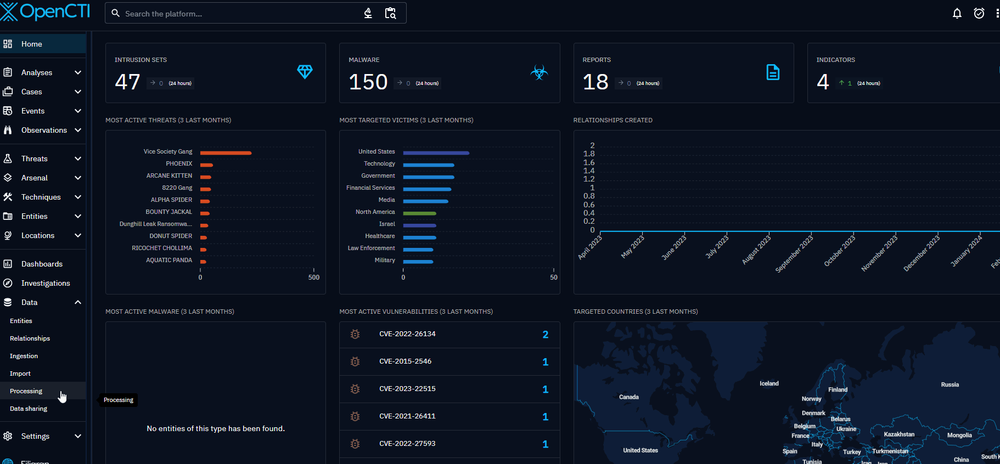

# OpenCTI CrowdStrike Endpoint Security connector

The Crowdstrike Endpoint Security connector is a standalone Python process that monitors events from OpenCTI and executes related actions to create, update or delete a data in Crowdstrike.

Summary

- [OpenCTI CrowdStrike Endpoint Security connector](#opencti-crowdstrike-endpoint-security-connector)
  - [Introduction](#introduction)
  - [Requirements](#requirements)
  - [Configuration variables](#configuration-variables)
    - [OpenCTI environment variables](#opencti-environment-variables)
    - [Base connector environment variables](#base-connector-environment-variables)
    - [Crowdstrike Endpoint Security connector environment variables](#crowdstrike-endpoint-security-connector-environment-variables)
  - [Deployment](#deployment)
    - [Docker Deployment](#docker-deployment)
    - [Manual Deployment](#manual-deployment)
  - [Usage](#usage)
    - [Attention ! ⚠️](#attention--️)
    - [Create a stream](#create-a-stream)
    - [Event stream and first run](#event-stream-and-first-run)
  - [Behavior](#behavior)
    - [Common behavior](#common-behavior)
    - [Search an IOC](#search-an-ioc)
      - [Specifications](#specifications)
      - [Method and API response](#method-and-api-response)
    - [Create an IOC](#create-an-ioc)
      - [Specifications](#specifications-1)
      - [Method and API response](#method-and-api-response-1)
    - [Update an IOC](#update-an-ioc)
      - [Specifications](#specifications-2)
      - [Method and API response](#method-and-api-response-2)
    - [Delete an IOC](#delete-an-ioc)
      - [Specifications](#specifications-3)
      - [Method and API response](#method-and-api-response-3)
  - [Known Issues and Workarounds](#known-issues-and-workarounds)
  - [Useful Resources](#useful-resources)

---

## Introduction

[CrowdStrike](https://www.crowdstrike.com/about-us/) is a technology company that specializes in cybersecurity. It is well-known for providing cloud-based solutions to protect organizations from cyber threats. The company offers a range of services, including endpoint security, threat intelligence, and incident response.

One of CrowdStrike's flagship products is CrowdStrike Falcon® platform. The CrowdStrike Falcon® platform utilizes real-time attack indicators, continuously updated threat intelligence, and extensive telemetry data from across the enterprise to provide highly precise threat detection, automated protection and remediation, expert threat hunting, and prioritized vulnerability observability. All of these capabilities are delivered through a single, lightweight agent.

The connector will use the [FalconPy SDK](https://www.falconpy.io/Home.html) that contains a collection of Python classes that abstract CrowdStrike Falcon OAuth2 API interaction.

## Requirements

To use the connector, you need to have a Crowdstrike account.

- OpenCTI Platform version 5.0.0 or higher
- An API Key for accessing

## Configuration variables

There are a number of configuration options, which are set either in `docker-compose.yml` (for Docker) or in `config.yml` (for manual deployment).

### OpenCTI environment variables

Below are the parameters you'll need to set for OpenCTI:

| Parameter     | config.yml | Docker environment variable | Mandatory | Description                                          |
| ------------- | ---------- | --------------------------- | --------- | ---------------------------------------------------- |
| OpenCTI URL   | url        | `OPENCTI_URL`               | Yes       | The URL of the OpenCTI platform.                     |
| OpenCTI Token | token      | `OPENCTI_TOKEN`             | Yes       | The default admin token set in the OpenCTI platform. |


### Base connector environment variables

Below are the parameters you'll need to set for running the connector properly:

| Parameter                             | config.yml                  | Docker environment variable             | Default                           | Mandatory | Description                                                                                                                                            |
| ------------------------------------- | --------------------------- | --------------------------------------- | --------------------------------- | --------- | ------------------------------------------------------------------------------------------------------------------------------------------------------ |
| Connector ID                          | id                          | `CONNECTOR_ID`                          | /                                 | Yes       | A unique `UUIDv4` identifier for this connector instance.                                                                                              |
| Connector Type                        | type                        | `CONNECTOR_TYPE`                        | EXTERNAL_IMPORT                   | Yes       | Should always be set to `EXTERNAL_IMPORT` for this connector.                                                                                          |
| Connector Name                        | name                        | `CONNECTOR_NAME`                        | CrowdStrike Endpoint Security     | Yes       | Name of the connector.                                                                                                                                 |
| Connector Scope                       | scope                       | `CONNECTOR_SCOPE`                       | crowdstrike                       | Yes       | The scope or type of data the connector is importing, either a MIME type or Stix Object. Here it is a reserved scope for stream.                       |
| Log Level                             | log_level                   | `CONNECTOR_LOG_LEVEL`                   | info                              | Yes       | Determines the verbosity of the logs. Options are `debug`, `info`, `warn`, or `error`.                                                                 |
| Connector Live Stream ID              | live_stream_id              | `CONNECTOR_LIVE_STREAM_ID`              | /                                 | Yes       | ID of the live stream created in the OpenCTI UI                                                                                                        |
| Connector Live Stream Listen Delete   | live_stream_listen_delete   | `CONNECTOR_LIVE_STREAM_LISTEN_DELETE`   | true                              | Yes       | Listen to all delete events concerning the entity, depending on the filter set for the OpenCTI stream.                                                 |
| Connector Live Stream No dependencies | live_stream_no_dependencies | `CONNECTOR_LIVE_STREAM_NO_DEPENDENCIES` | true                              | Yes       | Always set to `True` unless you are synchronizing 2 OpenCTI platforms and you want to get an entity and all context (relationships and related entity) |
| Consumer Count                        | consumer_count              | `CONNECTOR_CONSUMER_COUNT`              | 10                                | No        | Number of consumers/workers used to push data                                                                                                          |
| Ignore Types                          | ignore_types                | `CONNECTOR_IGNORE_TYPES`                | label,marking-definition,identity | No        | Ignoring types from OpenCTI                                                                                                                            |

### Crowdstrike Endpoint Security connector environment variables

Below are the parameters you'll need to set for Crowdstrike Endpoint Security connector:


| Parameter | config.yml                 | Docker environment variable            | Default | Mandatory | Description                                                                                                                                                                     |
| --------- | -------------------------- | -------------------------------------- | ------- | --------- | ------------------------------------------------------------------------------------------------------------------------------------------------------------------------------- |
|           | `api_base_url`             | `CROWDSTRIKE_API_BASE_URL`             | /       | Yes       | Crowdstrike base url.                                                                                                                                                           |
|           | `client_id`                | `CROWDSTRIKE_CLIENT_ID`                | /       | Yes       | Crowdstrike client ID used to connect to the API.                                                                                                                               |
|           | `client_secret`            | `CROWDSTRIKE_CLIENT_SECRET`            | /       | Yes       | Crowdstrike client secret used to connect to the API.                                                                                                                           |
|           | `permanent_delete`         | `CROWDSTRIKE_PERMANENT_DELETE`         | False   | Yes       | Select whether or not to permanently delete data in Crowdstrike when data is deleted in OpenCTI. If set to `True`, `CONNECTOR_LIVE_STREAM_LISTEN_DELETE` must be set to `True`⚠️ |
|           | `falcon_for_mobile_active` | `CROWDSTRIKE_FALCON_FOR_MOBILE_ACTIVE` | False   | Yes       | Crowdstrike client secret used to connect to the API.                                                                                                                           |
|           | `enable`                   | `METRICS_ENABLE`                       | False   | No        | Whether or not Prometheus metrics should be enabled.                                                                                                                            |
|           | `addr`                     | `METRICS_ADDR`                         | /       | No        | Bind IP address to use for metrics endpoint.                                                                                                                                    |
|           | `port`                     | `METRICS_PORT`                         | /       | No        | Port to use for metrics endpoint.                                                                                                                                               |


## Deployment

### Docker Deployment

Before building the Docker container, you need to set the version of pycti in `requirements.txt` equal to whatever version of OpenCTI you're running. Example, `pycti==5.12.20`. If you don't, it will take the latest version, but sometimes the OpenCTI SDK fails to initialize.

Build a Docker Image using the provided `Dockerfile`.

Example:

```shell
# Replace the IMAGE NAME with the appropriate value
docker build . -t [IMAGE NAME]:latest
```

Make sure to replace the environment variables in `docker-compose.yml` with the appropriate configurations for your
environment. Then, start the docker container with the provided docker-compose.yml

```shell
docker compose up -d
# -d for detached
```

### Manual Deployment

Create a file `config.yml` based on the provided `config.yml.sample`.

Replace the configuration variables (especially the "**ChangeMe**" variables) with the appropriate configurations for
you environment.

Install the required python dependencies (preferably in a virtual environment):

```shell
pip3 install -r requirements.txt
```

Then, start the connector from crowdstrike-endpoint-security/src:

```shell
python3 main.py
```

## Usage

After installation, the connector should require minimal interaction to use, and some configurations should be specified in your `docker-compose.yml` or `config.yml`.

### Attention ! ⚠️ 

If you have the falcon for mobile active in Crowdstrike, you can change `falcon_for_mobile_active` (config.yml) or `CROWDSTRIKE_FALCON_FOR_MOBILE_ACTIVE` (docker-compose.yml) to `True`.

You have the possibility to delete permanently a data into Crowdstrike **OR NOT**. For this, you can change `permanent_delete` (config.yml) or `CROWDSTRIKE_PERMANENT_DELETE` (docker-compose.yml) configuration.

### Create a stream

The type of connector is a `stream` and has the capability to listen a live stream from the platform. A stream connector can react and take decision in real time.

In most cases, they are used to consume OpenCTI data and insert them in third-party platforms such as SIEMs, XDRs, EDRS, etc. In some cases, stream connectors can also query the external system on a regular basis and act as import connector for instance to gather alerts and sightings related to CTI data and push them to OpenCTI (bi-directional).

In our case with Crowdstrike Endpoint Security connector, we will only listen to OpenCTI platform stream and continously *do* something with the received event (uni-directional).

In order to use a specific stream for the connector to listen to, you need to create it on OpenCTI platform in `Data sharing` -> `Live streams`


For the connector case, you **should** configure your stream to listen to `Entity type = Indicator` as the connector only handles IOC (Indicator Of Compromise) and add the `Revoked` field to `No` as we want to listen to any event from an IOC that it is NOT revoked at this time.

You can add more filters to get only the events you are interested in. 
For example, in the case where you only want to listen to all IOC events EXCEPT file hashes:


### Event stream and first run

On the first run of the connector, according to your filters, it will create all entities in OpenCTI to Crowdstrike instance.

The event stream will start from the current date (`now`) and will add to a queue all actions taken on the OpenCTI platform. The connector will take these events one by one and apply the appropriate action.

Example of events added in queue on OpenCTI action:

*Left panel: stream on IOC / Right panel: action on OpenCTI platform*


However, if you would like to force an immediate reset of the state, go to:

`Data management` -> `Ingestion` -> `Connectors` in the OpenCTI platform. 

Find the "Crowdstrike Endpoint Security" connector, and click on the refresh button to reset the connector's state and force a new creation of data by re-running the connector.



## Behavior

### Common behavior

When creating an IOC, you can specify a `platform' on which the IOC have been seen.
Only these platform are accepted on Crowdstrike instance:
- linux
- windows
- mac
- android (only accepted if `falcon for mobile` is active)
- ios (only accepted if `falcon for mobile` is active)

If you specify another platform, you will see it into OpenCTI platform and NOT on Crowdstrike.

### Search an IOC

Searching for an IOC on the Crowdstrike platform allows you to confirm whether or not an IOC already exists.

#### Specifications

For the connector usage, we will search the IOC only with its value.

#### Method and API response

**indicator_search method behavior**

Indicator does not exists:

```python
cs.indicator_search(filter=f'value:"{ioc_value}"+created_by:"{self.config.client_id}"')

# API Crowdstrike response
{
    "status_code": 200,
    "headers": {
        "Server": "nginx",
        "Date": "Wed, 20 Dec 2023 15:13:08 GMT",
        "Content-Type": "application/json",
        "Content-Length": "199",
        "Connection": "keep-alive",
        "Content-Encoding": "gzip",
        "Strict-Transport-Security": "max-age=15724800; includeSubDomains, max-age=31536000; includeSubDomains",
        "X-Cs-Region": "eu-1",
        "X-Cs-Traceid": "61003bcd-xxxx-436a-939e-0d74bb9570c6",
        "X-Ratelimit-Limit": "6000",
        "X-Ratelimit-Remaining": "5997",
    },
    "body": {
        "meta": {
            "query_time": 0.008002393,
            "pagination": {
                "limit": 100,
                "total": 1,
                "offset": 1,
                "after": "WzE3MTQ0NjU5ODE4MjcsIjIwMjIxODIzYzUwNmRjZTQ4MGNmM2RlNGMzYjFhNWUzNmYxNTQxOGZjOGE4N2M5MTdjZmMyOGVjYzU2MDQyNDgiXQ=="
            },
            "powered_by": "ioc-manager",
            "trace_id": "8f0d3453-dc83-4c29-a85d-e1e8270776f1"
        },
        "errors": null,
        "resources": []
    },
}
```

Indicator exists, a resource is found:

```python
cs.indicator_search(filter=f'value:"{ioc_value}"+created_by:"{self.config.client_id}"')

# API Crowdstrike response
{
    "status_code": 200,
    "headers": {
        "Server": "nginx",
        "Date": "Wed, 20 Dec 2023 15:18:34 GMT",
        "Content-Type": "application/json",
        "Content-Length": "366",
        "Connection": "keep-alive",
        "Content-Encoding": "gzip",
        "Strict-Transport-Security": "max-age=15724800; includeSubDomains, max-age=31536000; includeSubDomains",
        "X-Cs-Region": "eu-1",
        "X-Cs-Traceid": "ac585ad4-xxxx-4cee-9913-6e1edbd4e339",
        "X-Ratelimit-Limit": "6000",
        "X-Ratelimit-Remaining": "5995",
    },
    "body": {
        "meta": {
            "query_time": 0.083197836,
            "pagination": {
                "limit": 100,
                "total": 1,
                "offset": 1,
                "after": "WzE2OTI5NTQ...==",
            },
            "powered_by": "ioc-manager",
            "trace_id": "ac585ad4-xxxx-4cee-9913-6e1edbd4e339",
        },
        "resources": [
            "b595be8339d106fb9fd84366133e4bac557efbf8f5ca7f7a11b6e2524a57bf2d"
        ],
        "errors": [],
    },
}
```

### Create an IOC

After searching for an IOC, if no resource is found, the connector will **create** the IOC from OpenCTI in the Crowdstrike instance.

#### Specifications

If `CROWDSTRIKE_PERMANENT_DELETE` is `False`, if you re-create an IOC on OpenCTI platform with the same value, it will **update** the data that already exist on Crowdstrike platform.

If you create an IOC with a platform that is not on the accepted list, it will be ignored when the IOC is created in Crowdstrike.

#### Method and API response

**indicator_create method behavior**

```python
cs.indicator_create(
    body={
        "comment": "OpenCTI IOC",
        "indicators": [
            {
                "source": "OpenCTI IOC",
                "applied_globally": True,
                "type": "domain",
                "value": "test.aztyop.local",
                "platforms": [
                    "windows",
                    "mac",
                    "linux",
                ],
            }
        ],
    }
)

# API Crowdstrike response
{
    "status_code": 201,
    "headers": {
        "Server": "nginx",
        "Date": "Wed, 20 Dec 2023 15:23:16 GMT",
        "Content-Type": "application/json",
        "Content-Length": "476",
        "Connection": "keep-alive",
        "Content-Encoding": "gzip",
        "Strict-Transport-Security": "max-age=15724800; includeSubDomains, max-age=31536000; includeSubDomains",
        "X-Cs-Region": "eu-1",
        "X-Cs-Traceid": "e3af1a02-xxxx-462a-8acd-b4f817252944",
        "X-Ratelimit-Limit": "6000",
        "X-Ratelimit-Remaining": "5995",
    },
    "body": {
        "meta": {
            "query_time": 0.335613776,
            "pagination": {"limit": 0, "total": 1},
            "powered_by": "ioc-manager",
            "trace_id": "e3af1a02-xxxx-462a-8acd-b4f817252944",
        },
        "resources": [
            {
                "id": "8de59b570d3fb6aecb0e872cc2dece513aa3f121e94be2803423372eef2023a5",
                "type": "domain",
                "value": "test.aztyop.local",
                "source": "OpenCTI IOC",
                "action": "no_action",
                "mobile_action": "no_action",
                "severity": "",
                "platforms": ["windows", "mac", "linux"],
                "expired": False,
                "deleted": False,
                "applied_globally": True,
                "from_parent": False,
                "created_on": "2023-12-20T15:23:16.135988021Z",
                "created_by": "ed578da6b8d84d1e9312e833e493773a",
                "modified_on": "2023-12-20T15:23:16.135988021Z",
                "modified_by": "ed578da6b8d84d1e9312e833e493773a",
            }
        ],
        "errors": [],
    },
}
```

### Update an IOC

After searching for an IOC, if the resource is found, the connector will **update** the IOC from OpenCTI in the Crowdstrike instance.

#### Specifications

There are some specific cases where `update` an IOC will be used especially when `permanent_delete` is on `False`.

When an update is made instead of a *true* delete on Crowdstrike when `permanent_delete` is `False`, the update will add a label `TO_DELETE`.

When an update is made instead of a *true* creation of IOC on Crowdstrike, it will remove `TO_DELETE` tag. An example of case is when `permanent_delete` is `false` and an IOC is deleted from OpenCTI, if you re-create the same entity, it will be updated instead.

If `falcon_for_mobile` is `false` and you try anyway to add `android`, here an example of logs you may have:


#### Method and API response

**indicator_update method behavior**

```python
cs.indicator_update(
    body={
        "comment": "OpenCTI IOC",
        "indicators": [
            {
                "source": "OpenCTI IOC",
                "applied_globally": True,
                "type": "domain",
                "value": "test.aztyop.local",
                "platforms": [
                    "windows",
                    "mac",
                    "linux",
                ],
            }
        ],
    }
)

# API Crowdstrike response
{
    "status_code": 200,
    "headers": {
        "Server": "nginx",
        "Date": "Wed, 20 Dec 2023 15:23:16 GMT",
        "Content-Type": "application/json",
        "Content-Length": "476",
        "Connection": "keep-alive",
        "Content-Encoding": "gzip",
        "Strict-Transport-Security": "max-age=15724800; includeSubDomains, max-age=31536000; includeSubDomains",
        "X-Cs-Region": "eu-1",
        "X-Cs-Traceid": "e3af1a02-xxxx-462a-8acd-b4f817252944",
        "X-Ratelimit-Limit": "6000",
        "X-Ratelimit-Remaining": "5995",
    },
    "body": {
        "meta": {
            "query_time": 0.335613776,
            "pagination": {"limit": 0, "total": 1},
            "powered_by": "ioc-manager",
            "trace_id": "e3af1a02-xxxx-462a-8acd-b4f817252944",
        },
        "resources": [
            {
                "id": "8de59b570d3fb6aecb0e872cc2dece513aa3f121e94be2803423372eef2023a5",
                "type": "domain",
                "value": "test.aztyop.local",
                "source": "OpenCTI IOC",
                "action": "no_action",
                "mobile_action": "no_action",
                "severity": "",
                "platforms": ["windows", "mac", "linux"],
                "expired": False,
                "deleted": False,
                "applied_globally": True,
                "from_parent": False,
                "created_on": "2023-12-20T15:23:16.135988021Z",
                "created_by": "ed578da6b8d84d1e9312e833e493773a",
                "modified_on": "2023-12-20T15:23:16.135988021Z",
                "modified_by": "ed578da6b8d84d1e9312e833e493773a",
            }
        ],
        "errors": [],
    },
}
```

### Delete an IOC

After searching for an IOC, if the resource is found, the connector will **delete** the IOC from OpenCTI in the Crowdstrike instance.

#### Specifications

There are some specific cases where `update` an IOC will be used instead of `delete` the IOC especially when `permanent_delete` is on `False`.

When an update is made instead of a *true* delete on Crowdstrike when `permanent_delete` is `False`, the update will add a label `TO_DELETE`.

#### Method and API response

**indicator_delete method behavior**

```python
cs.indicator_delete(
    body={
        "ids": [
            "8de59b570d3fb6aecb0e872cc2dece513aa3f121e94be2803423372eef2023a5"
        ]
    }
)

# API Crowdstrike response
{
    "status_code": 200,
    "headers": {
        "Server": "nginx",
        "Date": "Wed, 20 Dec 2023 15:23:16 GMT",
        "Content-Type": "application/json",
        "Content-Length": "476",
        "Connection": "keep-alive",
        "Content-Encoding": "gzip",
        "Strict-Transport-Security": "max-age=15724800; includeSubDomains, max-age=31536000; includeSubDomains",
        "X-Cs-Region": "eu-1",
        "X-Cs-Traceid": "e3af1a02-xxxx-462a-8acd-b4f817252944",
        "X-Ratelimit-Limit": "6000",
        "X-Ratelimit-Remaining": "5995",
    },
    "body": {
        "meta": {
            "query_time": 0.116738247,
            "powered_by": "ioc-manager",
            "trace_id": "26e28d2a-dd11-4960-8d98-b12c5ec0cefa"
        },
        "errors": null,
        "resources": [
            "8de59b570d3fb6aecb0e872cc2dece513aa3f121e94be2803423372eef2023a5"
        ]
    },
}
```


## IOC supported

For now, only these observable types are handled:

```python
observable_type_mapper = {
    "domain-name:value": "domain",
    "hostname:value": "domain",
    "ipv4-addr:value": "ipv4",
    "ipv6-addr:value": "ipv6",
    "file:hashes.'SHA-256'": "sha256",
    "file:hashes.'MD5'": "md5",
}
```

---

## Useful Resources

OpenCTI documentation for connectors:

- [OpenCTI Ecosystem](https://filigran.notion.site/OpenCTI-Ecosystem-868329e9fb734fca89692b2ed6087e76)
- [Connectors Deployment](https://docs.opencti.io/latest/deployment/connectors/)
- [Connectors Development](https://docs.opencti.io/latest/development/connectors/)
- [Connectors Stream](https://docs.opencti.io/latest/deployment/connectors/#:~:text=the%20concerned%20object.-,Stream,-These%20connectors%20connect)

You will find IOC on the web UI:
- [falcon.eu-1.crowdstrike.com/iocs/indicators](https://falcon.eu-1.crowdstrike.com/iocs/indicators).

Documentation references:
- [Crowdstrike OAuth2 API](https://falcon.eu-1.crowdstrike.com/documentation/page/a2a7fc0e/crowdstrike-oauth2-based-apis)
- [Swagger API spec](https://assets.falcon.eu-1.crowdstrike.com/support/api/swagger-eu.html)
- [crowdstrike-falconpy - Python SDK](https://pypi.org/project/crowdstrike-falconpy/)
