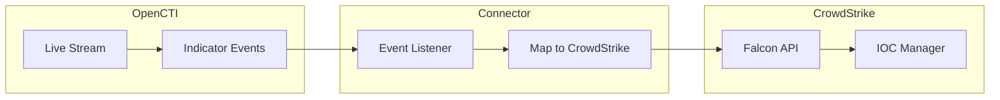

# OpenCTI CrowdStrike Endpoint Security Connector

| Status | Date | Comment |
|--------|------|---------|
| Filigran Verified | -    | -       |

The CrowdStrike Endpoint Security connector streams OpenCTI indicators to CrowdStrike Falcon for endpoint protection and threat detection.

## Table of Contents

- [OpenCTI CrowdStrike Endpoint Security Connector](#opencti-crowdstrike-endpoint-security-connector)
  - [Table of Contents](#table-of-contents)
  - [Introduction](#introduction)
  - [Installation](#installation)
    - [Requirements](#requirements)
  - [Configuration variables](#configuration-variables)
    - [OpenCTI environment variables](#opencti-environment-variables)
    - [Base connector environment variables](#base-connector-environment-variables)
    - [Connector extra parameters environment variables](#connector-extra-parameters-environment-variables)
  - [Deployment](#deployment)
    - [Docker Deployment](#docker-deployment)
    - [Manual Deployment](#manual-deployment)
  - [Usage](#usage)
  - [Behavior](#behavior)
  - [Debugging](#debugging)
  - [Additional information](#additional-information)

## Introduction

[CrowdStrike](https://www.crowdstrike.com/about-us/) is a technology company specializing in cybersecurity, providing cloud-based solutions to protect organizations from cyber threats. The CrowdStrike Falcon platform utilizes real-time attack indicators, continuously updated threat intelligence, and extensive telemetry data to provide threat detection, automated protection, and incident response.

This connector monitors events from an OpenCTI live stream and synchronizes indicators (IOCs) to CrowdStrike Falcon using the [FalconPy SDK](https://www.falconpy.io/Home.html). It supports create, update, and delete operations for maintaining synchronized threat intelligence.

Key features:
- Real-time synchronization of indicators to CrowdStrike Falcon
- Support for multiple observable types (domain, IP, hash)
- Platform-specific IOC targeting (Windows, Mac, Linux, mobile)
- Configurable permanent or soft delete behavior
- Prometheus metrics for monitoring

## Installation

### Requirements

- OpenCTI Platform >= 5.0.0
- CrowdStrike Falcon account with API access
- API credentials (Client ID and Client Secret) with IOC Manager permissions

## Configuration variables

Find all the configuration variables available here: [Connector Configurations](./__metadata__/CONNECTOR_CONFIG_DOC.md)

_The `opencti` and `connector` options in the `docker-compose.yml` and `config.yml` are the same as for any other connector.
For more information regarding these variables, please refer to [OpenCTI's documentation on connectors](https://docs.opencti.io/latest/deployment/connectors/)._

## Deployment

### Docker Deployment

Build the Docker image:

```bash
docker build -t opencti/connector-crowdstrike-endpoint-security:latest .
```

Configure the connector in `docker-compose.yml`:

```yaml
  connector-crowdstrike-endpoint-security:
    image: opencti/connector-crowdstrike-endpoint-security:latest
    environment:
      - OPENCTI_URL=http://localhost
      - OPENCTI_TOKEN=ChangeMe
      - CONNECTOR_ID=ChangeMe
      - CONNECTOR_LIVE_STREAM_ID=ChangeMe
      - CROWDSTRIKE_CLIENT_ID=ChangeMe
      - CROWDSTRIKE_CLIENT_SECRET=ChangeMe
    restart: always
```

Start the connector:

```bash
docker compose up -d
```

### Manual Deployment

1. Create `config.yml` based on `config.yml.sample`.

2. Install dependencies:

```bash
pip3 install -r requirements.txt
```

3. Start the connector from the `src` directory:

```bash
python3 main.py
```

## Usage

After installation, the connector processes events from the configured OpenCTI live stream:

1. Create a Live Stream in OpenCTI (Data Management -> Data Sharing -> Live Streams)
2. Configure the stream with filters: Entity type = `Indicator`, Revoked = `No`
3. Copy the Live Stream ID to the connector configuration
4. Start the connector

On first run, the connector synchronizes all existing indicators matching the stream filters to CrowdStrike.

## Behavior

The connector listens to OpenCTI live stream events and manages IOCs in CrowdStrike Falcon.

### Data Flow



### Event Processing

| Event Type | Action                                                        |
|------------|---------------------------------------------------------------|
| create     | Creates IOC in CrowdStrike (or updates if exists with soft delete) |
| update     | Updates IOC in CrowdStrike                                    |
| delete     | Permanently deletes or marks as `TO_DELETE` based on configuration |

### Entity Mapping

| OpenCTI Observable Type | CrowdStrike IOC Type | Description                              |
|-------------------------|----------------------|------------------------------------------|
| Domain-Name             | domain               | Domain name indicators                   |
| Hostname                | domain               | Hostname indicators (mapped to domain)   |
| IPv4-Addr               | ipv4                 | IPv4 address indicators                  |
| IPv6-Addr               | ipv6                 | IPv6 address indicators                  |
| File (SHA-256)          | sha256               | SHA-256 file hash indicators             |
| File (MD5)              | md5                  | MD5 file hash indicators                 |

### Severity Mapping

| OpenCTI Score | CrowdStrike Severity |
|---------------|----------------------|
| 0-19          | informational        |
| 20-39         | low                  |
| 40-59         | medium               |
| 60-79         | high                 |
| 80-100        | critical             |

### Platform Mapping

| OpenCTI Platform | CrowdStrike Platform | Notes                           |
|------------------|----------------------|---------------------------------|
| windows          | windows              | Always available                |
| macos            | mac                  | Always available                |
| linux            | linux                | Always available                |
| android          | android              | Requires `falcon_for_mobile_active=true` |
| ios              | ios                  | Requires `falcon_for_mobile_active=true` |

## Debugging

Enable verbose logging by setting:

```env
CONNECTOR_LOG_LEVEL=debug
```

### Common Issues

| Issue                          | Solution                                              |
|--------------------------------|-------------------------------------------------------|
| API authentication errors      | Verify Client ID and Client Secret are correct        |
| IOC not created                | Check if observable type is supported (see mapping)   |
| Mobile platforms ignored       | Enable `CROWDSTRIKE_FALCON_FOR_MOBILE_ACTIVE=true`    |

## Additional information

- **API Regions**: Use the appropriate API base URL for your region (US-1, US-2, EU-1, US-GOV-1)
- **Pattern Type**: Only STIX pattern indicators are processed
- **Soft Delete**: Use `permanent_delete=false` for audit trails and recovery capability
- [CrowdStrike Falcon IOC Manager](https://falcon.crowdstrike.com/iocs/indicators)
- [FalconPy Python SDK](https://pypi.org/project/crowdstrike-falconpy/)
