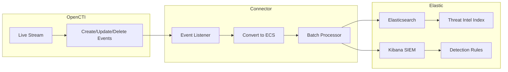

# OpenCTI Elastic Security Intel Connector

| Status | Date | Comment |
|--------|------|---------|
| Community | -    | -       |

The Elastic Security Intel connector streams threat intelligence from OpenCTI to Elastic Security, creating threat indicators and SIEM detection rules.

## Table of Contents

- [OpenCTI Elastic Security Intel Connector](#opencti-elastic-security-intel-connector)
  - [Table of Contents](#table-of-contents)
  - [Introduction](#introduction)
  - [Installation](#installation)
    - [Requirements](#requirements)
  - [Configuration variables](#configuration-variables)
    - [OpenCTI environment variables](#opencti-environment-variables)
    - [Base connector environment variables](#base-connector-environment-variables)
    - [Connector extra parameters environment variables](#connector-extra-parameters-environment-variables)
  - [Deployment](#deployment)
    - [Docker Deployment](#docker-deployment)
    - [Manual Deployment](#manual-deployment)
  - [Usage](#usage)
  - [Behavior](#behavior)
  - [Debugging](#debugging)
  - [Additional information](#additional-information)

## Introduction

The Elastic Security Intel connector is a stream connector that listens to OpenCTI live stream events and synchronizes threat intelligence to Elastic Security. It creates threat indicators in Elasticsearch's threat intelligence index and can also generate SIEM detection rules for pattern-based indicators.

Key features:
- Real-time synchronization of OpenCTI observables and indicators to Elastic
- SIEM rule management for pattern-based indicators
- Support for custom Elastic pattern types (KQL, Lucene, EQL, ES|QL)
- Elastic Common Schema (ECS) compliant data format
- Bulk operations for efficient data transfer
- Configurable indicator expiration

## Installation

### Requirements

- OpenCTI Platform >= 6.0.0
- Elasticsearch Cluster version 8.x or higher with Security features enabled
- API Key with permissions for managing threat intelligence indices and detection rules

## Configuration variables

There are a number of configuration options, which are set either in `docker-compose.yml` (for Docker) or in `config.yml` (for manual deployment).

### OpenCTI environment variables

| Parameter     | config.yml | Docker environment variable | Mandatory | Description                                          |
|---------------|------------|-----------------------------|-----------|------------------------------------------------------|
| OpenCTI URL   | url        | `OPENCTI_URL`               | Yes       | The URL of the OpenCTI platform.                     |
| OpenCTI Token | token      | `OPENCTI_TOKEN`             | Yes       | The default admin token set in the OpenCTI platform. |

### Base connector environment variables

| Parameter             | config.yml        | Docker environment variable  | Default                  | Mandatory | Description                                                              |
|-----------------------|-------------------|------------------------------|--------------------------|-----------|--------------------------------------------------------------------------|
| Connector ID          | id                | `CONNECTOR_ID`               |                          | Yes       | A unique `UUIDv4` identifier for this connector instance.                |
| Connector Name        | name              | `CONNECTOR_NAME`             | Elastic Security Intel   | No        | Name of the connector.                                                   |
| Connector Scope       | scope             | `CONNECTOR_SCOPE`            | elastic-security-intel   | No        | The scope of the connector.                                              |
| Live Stream ID        | live_stream_id    | `CONNECTOR_LIVE_STREAM_ID`   |                          | Yes       | The Live Stream ID of the stream created in the OpenCTI interface.       |
| Log Level             | log_level         | `CONNECTOR_LOG_LEVEL`        | info                     | No        | Determines the verbosity of the logs: `debug`, `info`, `warn`, or `error`.|

### Connector extra parameters environment variables

| Parameter                  | config.yml                             | Docker environment variable              | Default                          | Mandatory | Description                                                       |
|----------------------------|----------------------------------------|------------------------------------------|----------------------------------|-----------|-------------------------------------------------------------------|
| Elastic URL                | elastic_security.url                   | `ELASTIC_SECURITY_URL`                   |                                  | Yes       | Elasticsearch cluster URL.                                        |
| Elastic API Key            | elastic_security.api_key               | `ELASTIC_SECURITY_API_KEY`               |                                  | Yes       | API key for Elasticsearch (Base64 encoded id:api_key).            |
| Elastic client certificate | elastic_security.client_cert           | `ELASTIC_SECURITY_CLIENT_CERT`           |                                  | No        | Path to client certificate file (PEM format)                      |
| Elastic client key         | elastic_security.client_key            | `ELASTIC_SECURITY_CLIENT_KEY`            |                                  | No        | Path to client key file (PEM format)                              |
| Kibana URL                 | elastic_security.kibana_url            | `ELASTIC_SECURITY_KIBANA_URL`            |                                  | No        | Kibana URL for SIEM rules (auto-detected from ES URL if not set). |
| OpenCTI External URL       | elastic_security.opencti_external_url  | `ELASTIC_SECURITY_OPENCTI_EXTERNAL_URL`  |                                  | No        | Public URL for OpenCTI reference links in Elastic docs.           |
| Verify SSL                 | elastic_security.verify_ssl            | `ELASTIC_SECURITY_VERIFY_SSL`            | true                             | No        | Verify SSL certificates.                                          |
| CA Certificate             | elastic_security.ca_cert               | `ELASTIC_SECURITY_CA_CERT`               |                                  | No        | Path to CA certificate file.                                      |
| Index Name                 | elastic_security.index_name            | `ELASTIC_SECURITY_INDEX_NAME`            | logs-ti_custom_opencti.indicator | No        | Threat intelligence index name.                                   |
| Indicator Expire Time      | elastic_security.indicator_expire_time | `ELASTIC_SECURITY_INDICATOR_EXPIRE_TIME` | 90                               | No        | Days before indicators expire.                                    |
| Batch Size                 | elastic_security.batch_size            | `ELASTIC_SECURITY_BATCH_SIZE`            | 100                              | No        | Batch size for bulk operations.                                   |

## Deployment

### Docker Deployment

Build the Docker image:

```bash
docker build -t opencti/connector-elastic-security-intel:latest .
```

Configure the connector in `docker-compose.yml`:

```yaml
  connector-elastic-security-intel:
    image: opencti/connector-elastic-security-intel:latest
    environment:
      - OPENCTI_URL=http://localhost
      - OPENCTI_TOKEN=ChangeMe
      - CONNECTOR_ID=ChangeMe
      - CONNECTOR_NAME=Elastic Security Intel
      - CONNECTOR_SCOPE=elastic-security-intel
      - CONNECTOR_LOG_LEVEL=info
      - CONNECTOR_LIVE_STREAM_ID=ChangeMe
      - ELASTIC_SECURITY_URL=https://localhost:9200
      - ELASTIC_SECURITY_API_KEY=ChangeMe
      - ELASTIC_SECURITY_VERIFY_SSL=true
      - ELASTIC_SECURITY_INDEX_NAME=logs-ti_custom_opencti.indicator
      - ELASTIC_SECURITY_INDICATOR_EXPIRE_TIME=90
      - ELASTIC_SECURITY_BATCH_SIZE=100
    restart: always
```

Start the connector:

```bash
docker compose up -d
```

### Manual Deployment

1. Create `config.yml` based on `config.yml.sample`.

2. Install dependencies:

```bash
pip3 install -r requirements.txt
```

3. Start the connector from the `src` directory:

```bash
python3 main.py
```

## Usage

The connector automatically processes events from the configured OpenCTI live stream:

1. Create an API key in Elasticsearch with appropriate permissions
2. Create a Live Stream in OpenCTI (Data Management -> Data Sharing -> Live Streams)
3. Configure the stream to include indicators and observables
4. Copy the Live Stream ID to the connector configuration
5. Start the connector

The connector will begin streaming OpenCTI data to Elastic Security.

## Behavior

The connector listens to OpenCTI live stream events and manages threat indicators in Elastic Security.

### Data Flow



### Event Processing

| Event Type | Action                                                        |
|------------|---------------------------------------------------------------|
| create     | Creates threat indicator in Elastic (and SIEM rule if pattern-based) |
| update     | Updates threat indicator and/or SIEM rule                     |
| delete     | Removes threat indicator and/or SIEM rule from Elastic        |

### Entity Mapping

| OpenCTI Entity Type     | Elastic Output              | Description                              |
|-------------------------|----------------------------|------------------------------------------|
| Observable              | Threat Indicator           | Converted to ECS format in threat intel index |
| Indicator (no pattern)  | Threat Indicators          | Extracted observables converted to indicators |
| Indicator (with pattern)| SIEM Rule + Threat Indicator | Creates detection rule and threat indicator |

### Custom Pattern Types

The connector automatically creates vocabulary entries in OpenCTI for Elastic-specific pattern types:

| Pattern Type | Description                                                  |
|--------------|-------------------------------------------------------------|
| kql          | Kibana Query Language - Simplified query syntax for Kibana   |
| lucene       | Lucene Query Syntax - Full Lucene query language             |
| eql          | Event Query Language - For event-based searches and correlations |
| esql         | Elasticsearch SQL - SQL-like query language for Elasticsearch |

### Observable Type Mapping

| OpenCTI Observable Type | Elastic ECS Field          |
|-------------------------|----------------------------|
| IPv4-Addr               | threat.indicator.ip        |
| IPv6-Addr               | threat.indicator.ip        |
| Domain-Name             | threat.indicator.domain    |
| URL                     | threat.indicator.url.full  |
| File (MD5)              | threat.indicator.file.hash.md5 |
| File (SHA-1)            | threat.indicator.file.hash.sha1 |
| File (SHA-256)          | threat.indicator.file.hash.sha256 |
| Email-Addr              | threat.indicator.email.address |

## Debugging

Enable verbose logging by setting:

```env
CONNECTOR_LOG_LEVEL=debug
```

Log output includes:
- Event processing status
- Bulk operation results
- SIEM rule creation/update status
- Connection and API errors

### Common Issues

| Issue                          | Solution                                              |
|--------------------------------|-------------------------------------------------------|
| Connection refused             | Verify Elasticsearch URL and network connectivity     |
| Authentication failed          | Check API key is correctly formatted (Base64)         |
| SSL certificate errors         | Set `ELASTIC_SECURITY_VERIFY_SSL=false` for testing   |
| Index creation failed          | Ensure API key has index management permissions       |
| SIEM rule creation failed      | Verify Kibana URL and detection engine privileges     |

## Additional information

- **ECS Compliance**: All indicators are converted to Elastic Common Schema format
- **Index Template**: The connector automatically sets up an index template with proper mappings
- **Indicator Expiration**: Indicators automatically expire after the configured time (default: 90 days)
- **Bulk Operations**: Use batch size configuration to optimize throughput
- **API Key Permissions**: The API key needs permissions for:
  - Managing threat intelligence indices
  - Creating and managing detection rules (Kibana privileges)
- **Pattern Types**: Custom pattern types are registered as vocabulary entries in OpenCTI
