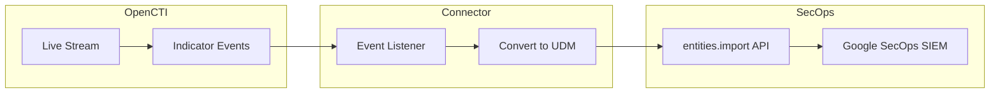

# OpenCTI Google SecOps SIEM Connector

| Status | Date | Comment |
|--------|------|---------|
| Filigran Verified | -    | -       |

The Google SecOps SIEM connector streams OpenCTI STIX indicators to Google SecOps SIEM as UDM entities for threat detection and correlation.

## Table of Contents

- [OpenCTI Google SecOps SIEM Connector](#opencti-google-secops-siem-connector)
  - [Table of Contents](#table-of-contents)
  - [Introduction](#introduction)
  - [Installation](#installation)
    - [Requirements](#requirements)
  - [Configuration variables](#configuration-variables)
    - [OpenCTI environment variables](#opencti-environment-variables)
    - [Base connector environment variables](#base-connector-environment-variables)
    - [Connector extra parameters environment variables](#connector-extra-parameters-environment-variables)
  - [Deployment](#deployment)
    - [Docker Deployment](#docker-deployment)
    - [Manual Deployment](#manual-deployment)
  - [Usage](#usage)
  - [Behavior](#behavior)
  - [Debugging](#debugging)
  - [Additional information](#additional-information)

## Introduction

This connector enables the dissemination of OpenCTI STIX indicators into Google SecOps SIEM. The connector consumes indicators from an OpenCTI stream, converts them to [UDM entities](https://cloud.google.com/chronicle/docs/reference/udm-field-list#securityresult), and pushes them into Google SecOps SIEM using the [entities.import](https://cloud.google.com/chronicle/docs/reference/rest/v1alpha/projects.locations.instances.entities/import) API.

Key features:
- Real-time synchronization of STIX indicators to Google SecOps SIEM
- Conversion to Unified Data Model (UDM) format
- Support for multiple observable types (IP, Domain, URL, File)
- Delete event handling for indicator lifecycle management
- Includes dashboard template for visualization

## Installation

### Requirements

- Python 3.11.x (not compatible with 3.12 and above)
- OpenCTI Platform >= 6.4.x
- pycti >= 6.4.x
- Google Cloud service account with SecOps SIEM API access

## Configuration variables

There are a number of configuration options, which are set either in `docker-compose.yml` (for Docker) or in `config.yml` (for manual deployment).

### OpenCTI environment variables

| Parameter     | config.yml | Docker environment variable | Mandatory | Description                                          |
|---------------|------------|-----------------------------|-----------|------------------------------------------------------|
| OpenCTI URL   | url        | `OPENCTI_URL`               | Yes       | The URL of the OpenCTI platform.                     |
| OpenCTI Token | token      | `OPENCTI_TOKEN`             | Yes       | The default admin token set in the OpenCTI platform. |

### Base connector environment variables

| Parameter                      | config.yml                | Docker environment variable             | Default | Mandatory | Description                                                                    |
|--------------------------------|---------------------------|-----------------------------------------|---------|-----------|--------------------------------------------------------------------------------|
| Connector ID                   | id                        | `CONNECTOR_ID`                          |         | Yes       | A unique `UUIDv4` identifier for this connector instance.                      |
| Connector Type                 | type                      | `CONNECTOR_TYPE`                        | STREAM  | Yes       | Should always be set to `STREAM` for this connector.                           |
| Connector Name                 | name                      | `CONNECTOR_NAME`                        |         | Yes       | Name of the connector.                                                         |
| Live Stream ID                 | live_stream_id            | `CONNECTOR_LIVE_STREAM_ID`              |         | Yes       | The Live Stream ID of the stream created in the OpenCTI interface.             |
| Live Stream Listen Delete      | live_stream_listen_delete | `CONNECTOR_LIVE_STREAM_LISTEN_DELETE`   | true    | Yes       | Listen to delete events for the entity.                                        |
| Live Stream No Dependencies    | live_stream_no_dependencies| `CONNECTOR_LIVE_STREAM_NO_DEPENDENCIES`| true    | Yes       | Set to `true` unless synchronizing between OpenCTI platforms.                  |
| Log Level                      | log_level                 | `CONNECTOR_LOG_LEVEL`                   | info    | No        | Determines the verbosity of the logs: `debug`, `info`, `warn`, or `error`.     |

### Connector extra parameters environment variables

| Parameter                  | config.yml              | Docker environment variable      | Default | Mandatory | Description                                                |
|----------------------------|-------------------------|----------------------------------|---------|-----------|-----------------------------------------------------------|
| Google Project Region      | secops_siem.project_region | `SECOPS_SIEM_PROJECT_REGION`  |         | Yes       | Region where the Google SecOps instance is located.        |
| Google Project ID          | secops_siem.project_id  | `SECOPS_SIEM_PROJECT_ID`         |         | Yes       | GCP Project ID.                                            |
| Google Project Instance    | secops_siem.project_instance | `SECOPS_SIEM_PROJECT_INSTANCE` |       | Yes       | Google SecOps customer ID.                                 |
| Google Private Key ID      | secops_siem.private_key_id | `SECOPS_SIEM_PRIVATE_KEY_ID`  |         | Yes       | Service account `private_key_id` value.                    |
| Google Private Key         | secops_siem.private_key | `SECOPS_SIEM_PRIVATE_KEY`        |         | Yes       | Service account `private_key` value.                       |
| Google Client Email        | secops_siem.client_email | `SECOPS_SIEM_CLIENT_EMAIL`      |         | Yes       | Service account `client_email` value.                      |
| Google Client ID           | secops_siem.client_id   | `SECOPS_SIEM_CLIENT_ID`          |         | Yes       | Service account `client_id` value.                         |
| Google Auth URI            | secops_siem.auth_uri    | `SECOPS_SIEM_AUTH_URI`           |         | Yes       | Service account `auth_uri` value.                          |
| Google Token URI           | secops_siem.token_uri   | `SECOPS_SIEM_TOKEN_URI`          |         | Yes       | Service account `token_uri` value.                         |
| Google Auth Provider Cert  | secops_siem.auth_provider_cert | `SECOPS_SIEM_AUTH_PROVIDER_CERT` |     | Yes       | Service account `auth_provider_x509_cert_url` value.       |
| Google Client Cert URL     | secops_siem.client_cert_url | `SECOPS_SIEM_CLIENT_CERT_URL` |         | Yes       | Service account `client_x509_cert_url` value.              |

## Deployment

### Docker Deployment

Before building the Docker container, ensure you have set the version of `pycti` in `requirements.txt` to match the version of OpenCTI you are running.

Build the Docker image:

```bash
docker build -t opencti/connector-google-secops-siem:latest .
```

Configure the connector in `docker-compose.yml`:

```yaml
  connector-google-secops-siem:
    image: opencti/connector-google-secops-siem:latest
    environment:
      - OPENCTI_URL=http://localhost
      - OPENCTI_TOKEN=ChangeMe
      - CONNECTOR_ID=ChangeMe
      - CONNECTOR_NAME=Google SecOps SIEM
      - CONNECTOR_LOG_LEVEL=info
      - CONNECTOR_LIVE_STREAM_ID=ChangeMe
      - CONNECTOR_LIVE_STREAM_LISTEN_DELETE=true
      - CONNECTOR_LIVE_STREAM_NO_DEPENDENCIES=true
      - SECOPS_SIEM_PROJECT_REGION=us
      - SECOPS_SIEM_PROJECT_ID=ChangeMe
      - SECOPS_SIEM_PROJECT_INSTANCE=ChangeMe
      - SECOPS_SIEM_PRIVATE_KEY_ID=ChangeMe
      - SECOPS_SIEM_PRIVATE_KEY=ChangeMe
      - SECOPS_SIEM_CLIENT_EMAIL=ChangeMe
      - SECOPS_SIEM_CLIENT_ID=ChangeMe
      - SECOPS_SIEM_AUTH_URI=ChangeMe
      - SECOPS_SIEM_TOKEN_URI=ChangeMe
      - SECOPS_SIEM_AUTH_PROVIDER_CERT=ChangeMe
      - SECOPS_SIEM_CLIENT_CERT_URL=ChangeMe
    restart: always
```

Start the connector:

```bash
docker compose up -d
```

### Manual Deployment

1. Create `config.yml` based on `config.yml.sample`.

2. Install dependencies:

```bash
pip3 install -r requirements.txt
```

3. Start the connector from the `src` directory:

```bash
python3 main.py
```

## Usage

The connector only supports the ingestion of Indicator entities with a STIX pattern into Google SecOps SIEM. Configure the OpenCTI stream to only expose indicators with a STIX pattern:

1. Create a Live Stream in OpenCTI (Data Management -> Data Sharing -> Live Streams)
2. Configure the stream with filters:
   - Entity type = `Indicator`
   - Pattern type = `stix`
3. Copy the Live Stream ID to the connector configuration
4. Start the connector

## Behavior

The connector listens to OpenCTI live stream events and converts indicators to UDM entities for Google SecOps SIEM.

### Data Flow



### Event Processing

| Event Type | Action                                                        |
|------------|---------------------------------------------------------------|
| create     | Creates UDM entity in Google SecOps SIEM                      |
| update     | Updates UDM entity in Google SecOps SIEM                      |
| delete     | Removes UDM entity from Google SecOps SIEM                    |

### Entity Mapping

| OpenCTI Observable Type | Google SecOps UDM Entity Type |
|-------------------------|-------------------------------|
| IPv4-Addr               | IP_ADDRESS                    |
| IPv6-Addr               | IP_ADDRESS                    |
| Domain-Name             | DOMAIN_NAME                   |
| Hostname                | DOMAIN_NAME                   |
| URL                     | URL                           |
| File                    | FILE                          |

### UDM Field Mapping

| Google SecOps UDM Field             | OpenCTI Source                                   |
|-------------------------------------|--------------------------------------------------|
| metadata.vendor_name                | `FILIGRAN`                                       |
| metadata.product_name               | `OPENCTI`                                        |
| metadata.collected_timestamp        | UTC timestamp when indicator is submitted        |
| metadata.product_entity_id          | Indicator `identifier` value                     |
| metadata.description                | Indicator `description` value                    |
| metadata.interval.start_time        | Indicator `valid_from` value                     |
| metadata.interval.end_time          | Indicator `valid_until` value                    |
| metadata.entity_type                | Mapped from observable type                      |
| metadata.threat.confidence_details  | Indicator `confidence` value                     |
| metadata.threat.confidence_score    | Indicator `confidence` value                     |
| metadata.threat.risk_score          | Indicator `score` value                          |
| metadata.threat.category_details    | Indicator associated labels                      |
| metadata.threat.url_back_to_product | OpenCTI URL link to the indicator                |

## Debugging

Enable verbose logging by setting:

```env
CONNECTOR_LOG_LEVEL=debug
```

Log output includes:
- Event processing status
- UDM entity conversion details
- API request/response information

### Common Issues

| Issue                          | Solution                                              |
|--------------------------------|-------------------------------------------------------|
| Rate limiting (429 errors)     | Implement backoff mechanism; check quota limits       |
| OAuth token expiry             | Tokens expire after 1 hour; refresh automatically     |
| Update latency                 | Changes reflect in 2-3 hours on dashboard, 5 min on search |
| Authentication errors          | Verify service account credentials                    |

## Additional information

- **Dashboard**: A dashboard template is included in the `dashboard/` folder for visualizing ingested indicators
- **Quota Limits**: Refer to [service limits documentation](https://cloud.google.com/chronicle/docs/reference/service-limits)
- **Rate Limiting**: See [burst limits FAQ](https://cloud.google.com/chronicle/docs/ingestion/burst-limits#frequently_asked_questions)
- **Token Management**: OAuth tokens expire after 1 hour by default; use `serviceAccounts.generateAccessToken` for custom lifetimes up to 12 hours
- **Update Latency**: IOC updates appear in custom dashboards within 2-3 hours, direct search within 5 minutes
- **Supported Observables**: Domain, Hostname, IPv4, IPv6, URL, File
