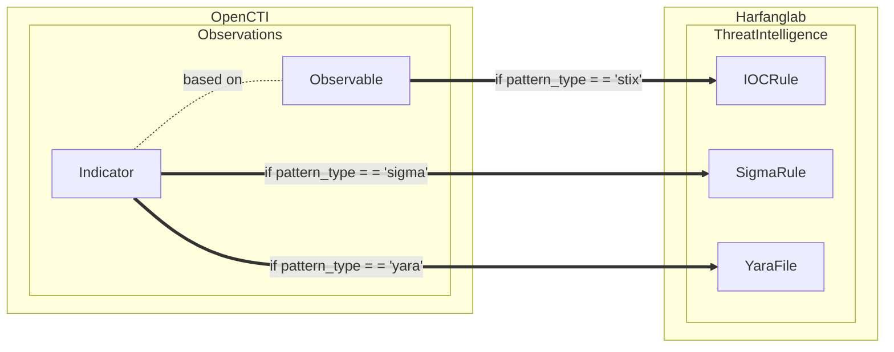
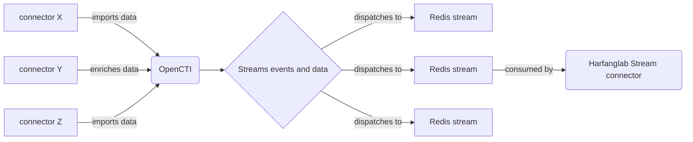

# OpenCTI HarfangLab Intel Stream Connector

Table of Contents

- [OpenCTI Harfanglab Intel Stream Connector](#opencti-stream-harfanglab-intel)
    - [Introduction](#introduction)
    - [Installation](#installation)
        - [Requirements](#requirements)
    - [Configuration variables](#configuration-variables)
        - [OpenCTI environment variables](#opencti-environment-variables)
        - [Base connector environment variables](#base-connector-environment-variables)
        - [Connector extra parameters environment variables](#connector-extra-parameters-environment-variables)
    - [Deployment](#deployment)
        - [Docker Deployment](#docker-deployment)
        - [Manual Deployment](#manual-deployment)
    - [Usage](#usage)
    - [Limitations](#limitations)
    - [Debugging](#debugging)

## Introduction

This connector allows organizations to feed the HarfangLab EDR using OpenCTI knowledge.



OpenCTI data is coming from import connectors. Once this data is ingested in OpenCTI, it is pushed to a Redis event
stream. This stream is consumed by the HarfangLab connector to insert intel (IOCs, Sigma rules and Yara files) in the
HarfangLab platform.



## Installation

### Requirements

- Python = 3.11.X (not compatible with 3.12 and above for now)
- OpenCTI Platform >= 6.4.X
- HarfangLab Threat Response >= 2.X.X
- pycti >= 6.4.X

## Configuration variables

There are a number of configuration options, which are set either in `docker-compose.yml` (for Docker) or
in `config.yml` (for manual deployment).

### OpenCTI environment variables

Below are the parameters you'll need to set for OpenCTI:

| Parameter     | config.yml `opencti` | Docker environment variable | Default | Mandatory | Description                                          |
|---------------|----------------------|-----------------------------|---------|-----------|------------------------------------------------------|
| OpenCTI URL   | url                  | `OPENCTI_URL`               | /       | Yes       | The URL of the OpenCTI platform.                     |
| OpenCTI Token | token                | `OPENCTI_TOKEN`             | /       | Yes       | The default admin token set in the OpenCTI platform. |

### Base connector environment variables

Below are the parameters you'll need to set for running the connector properly:

| Parameter                             | config.yml `connector`      | Docker environment variable             | Default | Mandatory | Description                                                                                                                                            |
|---------------------------------------|-----------------------------|-----------------------------------------|---------|-----------|--------------------------------------------------------------------------------------------------------------------------------------------------------|
| Connector ID                          | id                          | `CONNECTOR_ID`                          | /       | Yes       | A unique `UUIDv4` identifier for this connector instance.                                                                                              |
| Connector Type                        | type                        | `CONNECTOR_TYPE`                        | STREAM  | Yes       | Should always be set to `STREAM` for this connector.                                                                                                   |
| Connector Name                        | name                        | `CONNECTOR_NAME`                        |         | Yes       | Name of the connector.                                                                                                                                 |
| Connector Scope                       | scope                       | `CONNECTOR_SCOPE`                       |         | Yes       | The scope or type of data the connector is importing, either a MIME type or Stix Object.                                                               |
| Log Level                             | log_level                   | `CONNECTOR_LOG_LEVEL`                   | info    | Yes       | Determines the verbosity of the logs. Options are `debug`, `info`, `warn`, or `error`.                                                                 |
| Connector Live Stream ID              | live_stream_id              | `CONNECTOR_LIVE_STREAM_ID`              | /       | Yes       | ID of the live stream created in the OpenCTI UI                                                                                                        |
| Connector Live Stream Listen Delete   | live_stream_listen_delete   | `CONNECTOR_LIVE_STREAM_LISTEN_DELETE`   | true    | Yes       | Listen to all delete events concerning the entity, depending on the filter set for the OpenCTI stream.                                                 |
| Connector Live Stream No dependencies | live_stream_no_dependencies | `CONNECTOR_LIVE_STREAM_NO_DEPENDENCIES` | true    | Yes       | Always set to `True` unless you are synchronizing 2 OpenCTI platforms and you want to get an entity and all context (relationships and related entity) |

### Connector extra parameters environment variables

Below are the parameters you'll need to set for the connector:

| Parameter                   | config.yml `harfanglab_intel` | Docker environment variable         | Default | Mandatory | Description                                                                                |
|-----------------------------|-------------------------------|-------------------------------------|---------|-----------|--------------------------------------------------------------------------------------------|
| HarfangLab url              | `url`                         | `HARFANGLAB_INTEL_URL`              | /       | Yes       | The HarfangLab instance URL                                                                |
| HarfangLab SSL verify       | `ssl_verify`                  | `HARFANGLAB_INTEL_SSL_VERIFY`       | true    | No        | Enable the SSL certificate check                                                           |
| HarfangLab Token            | `token`                       | `HARFANGLAB_INTEL_TOKEN`            | /       | Yes       | The token of the HarfangLab user                                                           |
| HarfangLab Source list name | `source_list_name`            | `HARFANGLAB_INTEL_SOURCE_LIST_NAME` | /       | Yes       | Must be `from_OpenCTI`                                                                     |
| HarfangLab Remove indicator | `remove_indicator`            | `HARFANGLAB_INTEL_REMOVE_INDICATOR` | false   | No        | Choose between permanent deletion or deactivation of indicators in the HarfangLab platform |
| HarfangLab Rule maturity    | `rule_maturity`               | `HARFANGLAB_INTEL_RULE_MATURITY`    | /       | Yes       | Allows you to create rules with the `stable` or `testing` status in HarfangLab platform    |

## Deployment

### Docker Deployment

Before building the Docker container, you need to set the version of pycti in `requirements.txt` equal to whatever
version of OpenCTI you're running. Example, `pycti==6.6.17`. If you don't, it will take the latest version, but
sometimes the OpenCTI SDK fails to initialize.

Build a Docker Image using the provided `Dockerfile`.

Example:

```shell
# Replace the IMAGE NAME with the appropriate value
docker build . -t [IMAGE NAME]:6.3.11
```

Make sure to replace the environment variables in `docker-compose.yml` with the appropriate configurations for your
environment. Then, start the docker container with the provided docker-compose.yml

```shell
docker compose up -d
# -d for detached
```

### Manual Deployment

Create a file `config.yml` based on the provided `config.yml.sample`.

Replace the configuration variables (especially the "**ChangeMe**" variables) with the appropriate configurations for
you environment.

Install the required python dependencies (preferably in a virtual environment):

```shell
pip3 install -r requirements.txt
```

Then, start the connector from recorded-future/src:

```shell
python3 main.py
```

## Usage

After Installation, the connector should require minimal interaction to use, and should update automatically at a
regular interval specified in your `docker-compose.yml` or `config.yml` in `duration_period`.

However, if you would like to force an immediate download of a new batch of entities, navigate to:

`Data management` -> `Ingestion` -> `Connectors` in the OpenCTI platform.

Find the connector, and click on the refresh button to reset the connector's state and force a new
download of data by re-running the connector.

## Limitations

- Indicator's pattern changes:  
  When an indicator is updated on OpenCTI, the connector handles this event _but_ only name changes are managed
  correctly for now.  
  If an indicator's pattern is changed, _it will not_ be reflected to Harfanglab and can lead to unexpected behavior.  
  Patterns changes will be managed in a future release.

- IOCs deletion:  
  When an indicator of type "stix" is deleted on OpenCTI, all its corresponding IOCs on Harfanglab will be
  deleted/disabled too, even
  though they are still referenced by other indicators on OpenCTI.

- Sigma rules and Yara files:  
  The connector is currently able to parse STIX patterns only. Indicators of type "sigma" or "yara" are sent as they
  are on Harfanglab without any further verification/modification.  
  Since sigma/yara patterns are not parsed, the connector relies on indicator's name to reflect changes on Harfanglab.
  Harfanglab API may then return some errors due to duplicated data (e.g. "Yara file with this Id already exists.")

## Debugging

The connector can be debugged by setting the appropiate log level.
Note that logging messages can be added using `self.helper.connector_logger,{LOG_LEVEL}("Sample message")`, i.
e., `self.helper.connector_logger.error("An error message")`.

