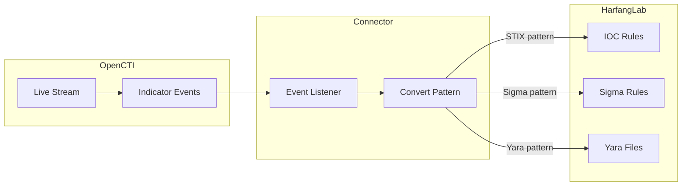

# OpenCTI HarfangLab Intel Connector

| Status | Date | Comment |
|--------|------|---------|
| Filigran Verified | -    | -       |

The HarfangLab Intel connector streams OpenCTI indicators to HarfangLab EDR platform, creating IOC rules, Sigma rules, and Yara files for endpoint threat detection.

## Table of Contents

- [OpenCTI HarfangLab Intel Connector](#opencti-harfanglab-intel-connector)
  - [Table of Contents](#table-of-contents)
  - [Introduction](#introduction)
  - [Installation](#installation)
    - [Requirements](#requirements)
  - [Configuration variables](#configuration-variables)
    - [OpenCTI environment variables](#opencti-environment-variables)
    - [Base connector environment variables](#base-connector-environment-variables)
    - [Connector extra parameters environment variables](#connector-extra-parameters-environment-variables)
  - [Deployment](#deployment)
    - [Docker Deployment](#docker-deployment)
    - [Manual Deployment](#manual-deployment)
  - [Usage](#usage)
  - [Behavior](#behavior)
  - [Debugging](#debugging)
  - [Additional information](#additional-information)

## Introduction

This connector enables organizations to feed the HarfangLab EDR platform using OpenCTI threat intelligence. It consumes indicators from an OpenCTI live stream and creates corresponding IOC rules, Sigma rules, and Yara files in HarfangLab for endpoint detection and response.

Key features:
- Real-time synchronization of indicators to HarfangLab EDR
- Support for STIX patterns (converted to IOC rules)
- Support for Sigma rules (forwarded directly)
- Support for Yara files (forwarded directly)
- Configurable rule maturity status (stable/testing)
- Optional permanent deletion or deactivation of indicators

## Installation

### Requirements

- Python 3.11.x (not compatible with 3.12 and above)
- OpenCTI Platform >= 6.4.x
- HarfangLab Threat Response >= 2.x.x
- pycti >= 6.4.x

## Configuration variables

There are a number of configuration options, which are set either in `docker-compose.yml` (for Docker) or in `config.yml` (for manual deployment).

### OpenCTI environment variables

| Parameter     | config.yml | Docker environment variable | Mandatory | Description                                          |
|---------------|------------|-----------------------------|-----------|------------------------------------------------------|
| OpenCTI URL   | url        | `OPENCTI_URL`               | Yes       | The URL of the OpenCTI platform.                     |
| OpenCTI Token | token      | `OPENCTI_TOKEN`             | Yes       | The default admin token set in the OpenCTI platform. |

### Base connector environment variables

| Parameter                      | config.yml                | Docker environment variable             | Default | Mandatory | Description                                                                    |
|--------------------------------|---------------------------|-----------------------------------------|---------|-----------|--------------------------------------------------------------------------------|
| Connector ID                   | id                        | `CONNECTOR_ID`                          |         | Yes       | A unique `UUIDv4` identifier for this connector instance.                      |
| Connector Type                 | type                      | `CONNECTOR_TYPE`                        | STREAM  | Yes       | Should always be set to `STREAM` for this connector.                           |
| Connector Name                 | name                      | `CONNECTOR_NAME`                        |         | Yes       | Name of the connector.                                                         |
| Connector Scope                | scope                     | `CONNECTOR_SCOPE`                       |         | Yes       | The scope of the connector (e.g., `harfanglab`).                               |
| Live Stream ID                 | live_stream_id            | `CONNECTOR_LIVE_STREAM_ID`              |         | Yes       | The Live Stream ID of the stream created in the OpenCTI interface.             |
| Live Stream Listen Delete      | live_stream_listen_delete | `CONNECTOR_LIVE_STREAM_LISTEN_DELETE`   | true    | Yes       | Listen to delete events for the entity.                                        |
| Live Stream No Dependencies    | live_stream_no_dependencies| `CONNECTOR_LIVE_STREAM_NO_DEPENDENCIES`| true    | Yes       | Set to `true` unless synchronizing between OpenCTI platforms.                  |
| Log Level                      | log_level                 | `CONNECTOR_LOG_LEVEL`                   | info    | No        | Determines the verbosity of the logs: `debug`, `info`, `warn`, or `error`.     |

### Connector extra parameters environment variables

| Parameter                  | config.yml                    | Docker environment variable         | Default      | Mandatory | Description                                                |
|----------------------------|-------------------------------|-------------------------------------|--------------|-----------|------------------------------------------------------------|
| HarfangLab URL             | harfanglab.url                | `HARFANGLAB_INTEL_URL`              |              | Yes       | The HarfangLab instance URL.                               |
| HarfangLab SSL Verify      | harfanglab.ssl_verify         | `HARFANGLAB_INTEL_SSL_VERIFY`       | true         | No        | Enable SSL certificate verification.                       |
| HarfangLab Token           | harfanglab.token              | `HARFANGLAB_INTEL_TOKEN`            |              | Yes       | The HarfangLab API token for authentication.               |
| HarfangLab Source List Name| harfanglab.source_list_name   | `HARFANGLAB_INTEL_SOURCE_LIST_NAME` | from_OpenCTI | Yes       | Must be `from_OpenCTI`.                                    |
| HarfangLab Remove Indicator| harfanglab.remove_indicator   | `HARFANGLAB_INTEL_REMOVE_INDICATOR` | false        | No        | Permanent deletion (true) or deactivation (false) of indicators. |
| HarfangLab Rule Maturity   | harfanglab.rule_maturity      | `HARFANGLAB_INTEL_RULE_MATURITY`    |              | Yes       | Rule status: `stable` or `testing`.                        |

## Deployment

### Docker Deployment

Before building the Docker container, ensure you have set the version of `pycti` in `requirements.txt` to match the version of OpenCTI you are running.

Build the Docker image:

```bash
docker build -t opencti/connector-harfanglab-intel:latest .
```

Configure the connector in `docker-compose.yml`:

```yaml
  connector-harfanglab-intel:
    image: opencti/connector-harfanglab-intel:latest
    environment:
      - OPENCTI_URL=http://localhost
      - OPENCTI_TOKEN=ChangeMe
      - CONNECTOR_ID=ChangeMe
      - CONNECTOR_NAME=HarfangLab Intel
      - CONNECTOR_SCOPE=harfanglab
      - CONNECTOR_LOG_LEVEL=info
      - CONNECTOR_LIVE_STREAM_ID=ChangeMe
      - CONNECTOR_LIVE_STREAM_LISTEN_DELETE=true
      - CONNECTOR_LIVE_STREAM_NO_DEPENDENCIES=true
      - HARFANGLAB_INTEL_URL=https://harfanglab.example.com
      - HARFANGLAB_INTEL_SSL_VERIFY=true
      - HARFANGLAB_INTEL_TOKEN=ChangeMe
      - HARFANGLAB_INTEL_SOURCE_LIST_NAME=from_OpenCTI
      - HARFANGLAB_INTEL_REMOVE_INDICATOR=false
      - HARFANGLAB_INTEL_RULE_MATURITY=stable
    restart: always
```

Start the connector:

```bash
docker compose up -d
```

### Manual Deployment

1. Create `config.yml` based on `config.yml.sample`.

2. Install dependencies:

```bash
pip3 install -r requirements.txt
```

3. Start the connector from the `src` directory:

```bash
python3 main.py
```

## Usage

The connector automatically processes events from the configured OpenCTI live stream:

1. Create a Live Stream in OpenCTI (Data Management -> Data Sharing -> Live Streams)
2. Configure the stream to include indicators (STIX, Sigma, Yara pattern types)
3. Copy the Live Stream ID to the connector configuration
4. Start the connector

To force an immediate resynchronization, navigate to **Data Management -> Ingestion -> Connectors**, find the connector, and click the refresh button.

## Behavior

The connector listens to OpenCTI live stream events and creates corresponding threat intelligence objects in HarfangLab.

### Data Flow



### Event Processing

| Event Type | Action                                                        |
|------------|---------------------------------------------------------------|
| create     | Creates IOC rule, Sigma rule, or Yara file in HarfangLab      |
| update     | Updates the corresponding rule in HarfangLab                  |
| delete     | Deletes or deactivates rule based on `remove_indicator` setting |

### Entity Mapping

| OpenCTI Pattern Type | HarfangLab Object  | Description                              |
|----------------------|--------------------|------------------------------------------|
| stix                 | IOC Rule           | STIX pattern converted to IOC rule       |
| sigma                | Sigma Rule         | Sigma rule forwarded directly            |
| yara                 | Yara File          | Yara file forwarded directly             |

### IOC Rule Types

| OpenCTI Observable Type | HarfangLab IOC Type |
|-------------------------|---------------------|
| IPv4-Addr               | ip_both             |
| IPv6-Addr               | ip_both             |
| Domain-Name             | hostname            |
| URL                     | filepath            |
| File (MD5)              | hash                |
| File (SHA-1)            | hash                |
| File (SHA-256)          | hash                |

### IOC Rule Structure

| Field       | Description                              |
|-------------|------------------------------------------|
| id          | Unique identifier for the IOC rule       |
| type        | Type of IOC (ip_both, hostname, etc.)    |
| value       | The actual indicator value               |
| description | Description from OpenCTI indicator       |
| comment     | Additional context and metadata          |
| hl_status   | Rule maturity status (stable/testing)    |
| enabled     | Whether the rule is active               |

## Debugging

Enable verbose logging by setting:

```env
CONNECTOR_LOG_LEVEL=debug
```

Log output includes:
- Event processing status
- IOC/Sigma/Yara creation details
- HarfangLab API responses

### Common Issues

| Issue                          | Solution                                              |
|--------------------------------|-------------------------------------------------------|
| Authentication errors          | Verify HarfangLab API token is correct                |
| SSL certificate errors         | Set `HARFANGLAB_INTEL_SSL_VERIFY=false` for testing   |
| Duplicate data errors          | Normal for Sigma/Yara; connector relies on name matching |
| Pattern not updated            | Pattern changes not fully supported yet; delete and recreate |

## Additional information

### Known Limitations

- **Pattern Changes**: When an indicator's pattern is changed in OpenCTI, it will not be reflected in HarfangLab. Only name changes are managed correctly. Delete and recreate the indicator for pattern changes.

- **IOC Deletion**: When a STIX indicator is deleted in OpenCTI, all corresponding IOCs in HarfangLab are deleted/disabled, even if referenced by other OpenCTI indicators.

- **Sigma/Yara Parsing**: The connector forwards Sigma and Yara patterns directly without parsing or verification. The connector relies on indicator names for change detection.

### Resources

- [HarfangLab Documentation](https://docs.harfanglab.io/)
- [OpenCTI Connectors Documentation](https://docs.opencti.io/latest/deployment/connectors/)
