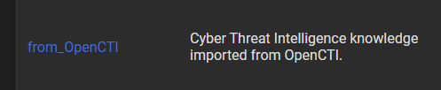

# OpenCTI HarfangLab Connector

This connector allows organizations to feed the HarfangLab EDR using OpenCTI knowledge.

This connector leverages the OpenCTI events stream, so it consumes knowledge in real time and, depending on its settings, create detection and hunting intel pieces in the HarfangLab platform.

## General overview

OpenCTI data is coming from import connectors. Once this data is ingested in OpenCTI, it is pushed to a Redis event stream. This stream is consumed by the HarfangLab connector to insert intel in the HarfangLab platform.

## Requirements

- OpenCTI Platform >= 5.0.0
- HarfangLab Threat Response >= 2.X.X
- pycti >= 5.X.X
- stix-shifter >= 6.X.X
- stix-shifter-utils >= 6.X.X
- stix-shifter-modules-splunk >= 6.X.X

## Configuration variables

There are a number of configuration options, which are set either in `docker-compose.yml` (for Docker) or in `config.yml` (for manual deployment).

## OpenCTI environment variables

Below are the parameters you'll need to set for OpenCTI:


| Parameter     | config.yml | Docker environment variable | Mandatory | Description                                                                                                                |
|---------------|------------|-----------------------------|-----------|----------------------------------------------------------------------------------------------------------------------------|
| OpenCTI URL   | `url`      | `OPENCTI_URL`               | Yes       | The URL of the OpenCTI platform.                                                                                           |
| OpenCTI Token | `token`    | `OPENCTI_TOKEN`             | Yes       | The token of the OpenCTI user (it's recommanded to create a dedicated user for the connector with the Administrator role). |

### Base connector environment variables

Below are the parameters you'll need to set for running the connector properly:

| Parameter                             | config.yml                    | Docker environment variable             | Default | Mandatory | Description                                                                                                 |
|---------------------------------------|-------------------------------|-----------------------------------------|---------|-----------|-------------------------------------------------------------------------------------------------------------|
| Connector ID                          | `id`                          | `CONNECTOR_ID`                          | /       | Yes       | A valid arbitrary `UUIDv4` that must be unique for this connector.                                          |
| Connector Live stream id              | `live_stream_id`              | `CONNECTOR_LIVE_STREAM_ID`              | /       | Yes       | The Live Stream ID of the stream created in the OpenCTI interface.                                          |
| Connector Live stream listen delete   | `live_stream_listen_delete`   | `CONNECTOR_LIVE_STREAM_LISTEN_DELETE`   | /       | Yes       | The Live Stream listen delete must be `true`.                                                               |
| Connector Live stream no dependencies | `live_stream_no_dependencies` | `CONNECTOR_LIVE_STREAM_NO_DEPENDENCIES` | /       | Yes       | The Live Stream no dependencies must be `false` because it's necessary to detect observables in the stream. |
| Connector Name                        | `name`                        | `CONNECTOR_NAME`                        | /       | Yes       | The name of the HarfangLab instance, to identify it if you have multiple HarfangLab connectors.             |
| Connector Scope                       | `scope`                       | `CONNECTOR_SCOPE`                       | /       | Yes       | Must be `harfanglab`, not used in this connector.                                                           |
| Connector Log Level                   | `log_level`                   | `CONNECTOR_LOG_LEVEL`                   | /       | Yes       | Determines the verbosity of the logs. Options are `debug`, `info`, `warn`, or `error`.                      |

### URLScan Enrichment connector environment variables

Below are the parameters you'll need to set for HarfangLab connector:

| Parameter                                      | config.yml                                 | Docker environment variable                           | Default | Mandatory | Description                                                                                                                   |
|------------------------------------------------|--------------------------------------------|-------------------------------------------------------|---------|-----------|-------------------------------------------------------------------------------------------------------------------------------|
| HarfangLab url                                 | `url`                                      | `HARFANGLAB_URL`                                      | /       | Yes       | The HarfangLab instance URL                                                                                                   |
| HarfangLab SSL verify                          | `ssl_verify`                               | `HARFANGLAB_SSL_VERIFY`                               | /       | Yes       | Enable the SSL certificate check                                                                                              |
| HarfangLab Token                               | `token`                                    | `HARFANGLAB_TOKEN`                                    | /       | Yes       | The token of the HarfangLab user                                                                                              |
| HarfangLab Login                               | `login`                                    | `HARFANGLAB_LOGIN`                                    | /       | Yes       | The HarfangLab login user                                                                                                     |
| HarfangLab Password                            | `password`                                 | `HARFANGLAB_PASSWORD`                                 | /       | Yes       | The HarfangLab password                                                                                                       |
| HarfangLab Source list name                    | `source_list_name`                         | `HARFANGLAB_SOURCE_LIST_NAME`                         | /       | Yes       | Must be `from_OpenCTI`                                                                                                        |
| HarfangLab Remove indicator                    | `remove_indicator`                         | `HARFANGLAB_REMOVE_INDICATOR`                         | /       | Yes       | Choose between permanent deletion or deactivation of indicators in the HarfangLab platform                                    |
| HarfangLab Rule maturity                       | `rule_maturity`                            | `HARFANGLAB_RULE_MATURITY`                            | /       | Yes       | Allows you to create rules with the `stable` or `testing` status in HarfangLab platform                                       |
| HarfangLab Import security events as incidents | `import_security_events_as_incidents`      | `HARFANGLAB_IMPORT_SECURITY_EVENTS_AS_INCIDENTS`      | /       | Yes       | Import security events as incidents, from HarfangLab to openCTI                                                               |
| HarfangLab Import threats as case incidents    | `import_threats_as_case_incidents`         | `HARFANGLAB_IMPORT_THREATS_AS_CASE_INCIDENTS`         | /       | Yes       | Import threats as case incidents, from HarfangLab to openCTI. If `true`, "import security events as sightings" must be `true` |
| HarfangLab Security events filters by status   | `import_security_events_filters_by_status` | `HARFANGLAB_IMPORT_SECURITY_EVENTS_FILTERS_BY_STATUS` | /       | Yes       | Filters available : `new`, `investigating`, `false_positive`, `closed` - example : 'new, investigating'                       |
| HarfangLab Import filters by alert type        | `import_filters_by_alert_type`             | `HARFANGLAB_IMPORT_FILTERS_BY_ALERT_TYPE`             | /       | Yes       | Filters available : `yara`, `sigma`, `ioc` - example : 'sigma, ioc'                                                           |
| HarfangLab Default markings                    | `default_markings`                         | `HARFANGLAB_DEFAULT_MARKINGS`                         | /       | Yes       | Choose one marking by default. Markings available : `TLP:CLEAR` - `TLP:GREEN` - `TLP:AMBER` - `TLP:RED`                       |
| HarfangLab Default score                       | `default_score`                            | `HARFANGLAB_DEFAULT_SCORE`                            | /       | Yes       | Default_score allows you to add a default score for an indicator and its observable (a number between 1 and 100)              |

## Deployment

### Docker Deployment

Before building the Docker container, you need to set the version of pycti in `requirements.txt` equal to whatever version of OpenCTI you're running. Example, `pycti==6.1.3`. If you don't, it will take the latest version, but sometimes the OpenCTI SDK fails to initialize.

Build a Docker Image using the provided `Dockerfile`.

Example:

```shell
# Replace the IMAGE NAME with the appropriate value
docker build . -t [IMAGE NAME]:latest
```

Make sure to replace the environment variables in `docker-compose.yml` with the appropriate configurations for your
environment. Then, start the docker container with the provided docker-compose.yml

```shell
docker compose up -d
# -d for detached
```

### Manual Deployment

Create a file `config.yml` based on the provided `config.yml.sample`.

Replace the configuration variables (especially the "**ChangeMe**" variables) with the appropriate configurations for
you environment.

Install the required python dependencies (preferably in a virtual environment):

```shell
pip3 install -r requirements.txt
```

Then, start the connector from crowdstrike-endpoint-security/src:

```shell
python3 main.py
```

## Usage

After installation, the connector should require minimal interaction to use, and some configurations should be specified in your `docker-compose.yml` or `config.yml`.

## Launch the connector and test it

After launching the connector, you should see a new source list for Yara / Sigma / IoC within the HarfangLab platform under "Threat Intelligence" :



## Warnings


- Creation and Configuration of a Custom Data Stream:
    In OpenCTI - Data / Data sharing / Live streams:
    - Create a new live stream using the "+" button.
    - Define the name and add these filters:
    - Revoked = No (this filter ensures that only active indicators are considered).
    - Is detected = Yes (if you want to control the indicators sent to HarfangLab, by default when creating an indicator, the detection is set to false).
    - Entity type = Indicator (only events on indicators are considered).
    - Pattern type = stix or sigma or yara (it is important to specify these 3 types of patterns).
    - Once the live stream is created and configured, you will have a unique identifier for the connector.
    - You will need to place this unique identifier in the environment variable named "LIVE_STREAM_ID". This procedure is crucial to properly link the connector to the custom Stream with the correct filters.
    - Then, you just have to start it and have the status "started".
- For more details, read the article that talks about the Harfanglab connector. https://blog.filigran.io/opencti-harfanglab-a-connector-to-enrich-cti-data-and-optimize-incident-response-0784b5c0717e