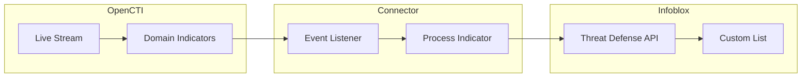

# OpenCTI Infoblox Threat Defense Connector

| Status | Date | Comment |
|--------|------|---------|
| Community | -    | -       |

The Infoblox Threat Defense connector streams OpenCTI domain indicators to Infoblox Threat Defense (BloxOne) custom lists for DNS-based threat protection.

## Table of Contents

- [OpenCTI Infoblox Threat Defense Connector](#opencti-infoblox-threat-defense-connector)
  - [Table of Contents](#table-of-contents)
  - [Introduction](#introduction)
  - [Installation](#installation)
    - [Requirements](#requirements)
  - [Configuration variables](#configuration-variables)
    - [OpenCTI environment variables](#opencti-environment-variables)
    - [Base connector environment variables](#base-connector-environment-variables)
    - [Connector extra parameters environment variables](#connector-extra-parameters-environment-variables)
  - [Deployment](#deployment)
    - [Docker Deployment](#docker-deployment)
    - [Manual Deployment](#manual-deployment)
  - [Usage](#usage)
  - [Behavior](#behavior)
  - [Debugging](#debugging)
  - [Additional information](#additional-information)

## Introduction

This connector enables organizations to stream OpenCTI domain indicators to Infoblox Threat Defense (BloxOne). It maintains a custom list within Infoblox by automatically adding active indicators and removing revoked ones.

Key features:
- Real-time synchronization of domain indicators to Infoblox
- Automatic addition of active indicators
- Automatic removal of revoked or deleted indicators
- Retry mechanism with exponential backoff for API reliability

## Installation

### Requirements

- OpenCTI Platform >= 6.5.3
- Infoblox Threat Defense (BloxOne) account with API access
- A custom list created in Infoblox Threat Defense

## Configuration variables

There are a number of configuration options, which are set either in `docker-compose.yml` (for Docker) or in `config.yml` (for manual deployment).

### OpenCTI environment variables

| Parameter     | config.yml | Docker environment variable | Mandatory | Description                                          |
|---------------|------------|-----------------------------|-----------|------------------------------------------------------|
| OpenCTI URL   | url        | `OPENCTI_URL`               | Yes       | The URL of the OpenCTI platform.                     |
| OpenCTI Token | token      | `OPENCTI_TOKEN`             | Yes       | The default admin token set in the OpenCTI platform. |

### Base connector environment variables

| Parameter                      | config.yml                | Docker environment variable             | Default                  | Mandatory | Description                                                                    |
|--------------------------------|---------------------------|-----------------------------------------|--------------------------|-----------|--------------------------------------------------------------------------------|
| Connector ID                   | id                        | `CONNECTOR_ID`                          |                          | Yes       | A unique `UUIDv4` identifier for this connector instance.                      |
| Connector Type                 | type                      | `CONNECTOR_TYPE`                        | STREAM                   | Yes       | Should always be set to `STREAM` for this connector.                           |
| Connector Name                 | name                      | `CONNECTOR_NAME`                        | Infoblox Threat Defense  | No        | Name of the connector.                                                         |
| Connector Scope                | scope                     | `CONNECTOR_SCOPE`                       | infoblox threat defense  | Yes       | The scope of the connector.                                                    |
| Live Stream ID                 | live_stream_id            | `CONNECTOR_LIVE_STREAM_ID`              |                          | Yes       | The Live Stream ID of the stream created in the OpenCTI interface.             |
| Live Stream Listen Delete      | live_stream_listen_delete | `CONNECTOR_LIVE_STREAM_LISTEN_DELETE`   | true                     | Yes       | Listen to delete events for the entity.                                        |
| Live Stream No Dependencies    | live_stream_no_dependencies| `CONNECTOR_LIVE_STREAM_NO_DEPENDENCIES`| true                     | Yes       | Set to `true` unless synchronizing between OpenCTI platforms.                  |
| Confidence Level               | confidence_level          | `CONNECTOR_CONFIDENCE_LEVEL`            | 100                      | No        | The default confidence level (0-100).                                          |
| Log Level                      | log_level                 | `CONNECTOR_LOG_LEVEL`                   | info                     | No        | Determines the verbosity of the logs: `debug`, `info`, `warn`, or `error`.     |

### Connector extra parameters environment variables

| Parameter                | config.yml              | Docker environment variable  | Default | Mandatory | Description                                                |
|--------------------------|-------------------------|------------------------------|---------|-----------|------------------------------------------------------------|
| Infoblox API Key         | infoblox.api_key        | `INFOBLOX_API_KEY`           |         | Yes       | API key generated in Infoblox Threat Defense console.      |
| Infoblox Verify SSL      | infoblox.verify_ssl     | `INFOBLOX_VERIFY_SSL`        | true    | No        | Whether to verify SSL certificates.                        |
| Infoblox Custom List ID  | infoblox.custom_list_id | `INFOBLOX_CUSTOM_LIST_ID`    |         | Yes       | The custom list ID where indicators will be added/removed. |

## Deployment

### Docker Deployment

Build the Docker image:

```bash
docker build -t opencti/connector-infoblox-threat-defense:latest .
```

Configure the connector in `docker-compose.yml`:

```yaml
  connector-infoblox-threat-defense:
    image: opencti/connector-infoblox-threat-defense:latest
    environment:
      - OPENCTI_URL=http://localhost
      - OPENCTI_TOKEN=ChangeMe
      - CONNECTOR_ID=ChangeMe
      - CONNECTOR_NAME=Infoblox Threat Defense
      - CONNECTOR_SCOPE=infoblox threat defense
      - CONNECTOR_LOG_LEVEL=info
      - CONNECTOR_LIVE_STREAM_ID=ChangeMe
      - CONNECTOR_LIVE_STREAM_LISTEN_DELETE=true
      - CONNECTOR_LIVE_STREAM_NO_DEPENDENCIES=true
      - INFOBLOX_API_KEY=ChangeMe
      - INFOBLOX_VERIFY_SSL=true
      - INFOBLOX_CUSTOM_LIST_ID=ChangeMe
    restart: always
```

Start the connector:

```bash
docker compose up -d
```

### Manual Deployment

1. Create `config.yml` based on `config.yml.sample`.

2. Install dependencies:

```bash
pip3 install -r requirements.txt
```

3. Start the connector from the `src` directory:

```bash
python3 main.py
```

## Usage

Before starting the connector:

1. Create a custom list in Infoblox Threat Defense
2. Get the custom list ID by running:

```bash
curl -X GET "https://csp.infoblox.com/api/atcfw/v1/named_lists" \
  -H "Authorization: Token YOUR_API_TOKEN" \
  -H "Content-Type: application/json"
```

3. Create a Live Stream in OpenCTI (Data Management -> Data Sharing -> Live Streams)
4. Configure the stream to include Domain-Name indicators
5. Copy the Live Stream ID to the connector configuration
6. Start the connector

## Behavior

The connector listens to OpenCTI live stream events and manages domain indicators in Infoblox custom lists.

### Data Flow



### Event Processing

| Event Type | Revoked Status | Action                                       |
|------------|----------------|----------------------------------------------|
| create     | false          | Adds indicator to Infoblox custom list       |
| update     | false          | Adds indicator to Infoblox custom list       |
| create     | true           | Removes indicator from Infoblox custom list  |
| update     | true           | Removes indicator from Infoblox custom list  |
| delete     | -              | Removes indicator from Infoblox custom list  |

### Entity Mapping

| OpenCTI Observable Type | Infoblox Custom List | Description                              |
|-------------------------|----------------------|------------------------------------------|
| Domain-Name             | Named List Item      | Domain added to custom list for blocking |

### Supported Observable Types

The connector only processes indicators with:
- `main_observable_type` = `Domain-Name`
- `pattern_type` starting with `stix`

## Debugging

Enable verbose logging by setting:

```env
CONNECTOR_LOG_LEVEL=debug
```

Log output includes:
- Event processing status
- Items added to or removed from custom list
- API request/response details

### Common Issues

| Issue                          | Solution                                              |
|--------------------------------|-------------------------------------------------------|
| Authentication failed          | Verify Infoblox API key is correct                    |
| Custom list not found          | Verify custom list ID exists in Infoblox              |
| Rate limiting                  | Connector includes 5-second delay between operations  |
| SSL certificate errors         | Set `INFOBLOX_VERIFY_SSL=false` for testing           |

## Additional information

- **API Documentation**: [Infoblox Public API](https://csp.infoblox.com/apidoc?url=https%3A%2F%2Fcsp.infoblox.com%2Fapidoc%2Fdocs%2FAtcfw#/named_lists/named_listsUpdateNamedList)
- **Rate Limiting**: The connector includes a 5-second delay between operations to avoid rate limiting
- **Retry Logic**: Failed requests are retried up to 3 times with exponential backoff
- **Custom List Types**: Only named lists (custom lists) are supported
- **Indicator Filtering**: Configure your OpenCTI stream to include only domain-name indicators
