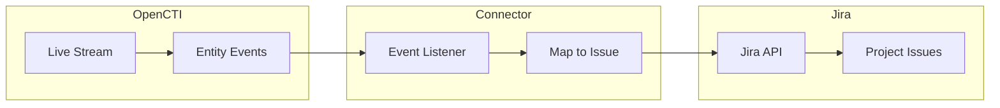

# OpenCTI Jira Connector

| Status | Date | Comment |
|--------|------|---------|
| Filigran Verified | -    | -       |

The Jira connector streams OpenCTI entities to Atlassian Jira, automatically creating issues for incidents, reports, cases, and groupings.

## Table of Contents

- [OpenCTI Jira Connector](#opencti-jira-connector)
  - [Table of Contents](#table-of-contents)
  - [Introduction](#introduction)
  - [Installation](#installation)
    - [Requirements](#requirements)
  - [Configuration variables](#configuration-variables)
    - [OpenCTI environment variables](#opencti-environment-variables)
    - [Base connector environment variables](#base-connector-environment-variables)
    - [Connector extra parameters environment variables](#connector-extra-parameters-environment-variables)
  - [Deployment](#deployment)
    - [Docker Deployment](#docker-deployment)
    - [Manual Deployment](#manual-deployment)
  - [Usage](#usage)
  - [Behavior](#behavior)
  - [Debugging](#debugging)
  - [Additional information](#additional-information)

## Introduction

This connector enables organizations to automatically create Jira issues from OpenCTI entities. When incidents, reports, cases, or groupings are created in OpenCTI, the connector creates corresponding Jira issues with relevant metadata.

Key features:
- Automatic issue creation from OpenCTI entities
- Support for incidents, reports, cases, and groupings
- Configurable issue types (Epic, Task, etc.)
- Custom field mapping support
- Labels transferred from OpenCTI to Jira

## Installation

### Requirements

- OpenCTI Platform >= 6.2.16
- Atlassian Jira account with API access
- Jira project with appropriate permissions

## Configuration variables

There are a number of configuration options, which are set either in `docker-compose.yml` (for Docker) or in `config.yml` (for manual deployment).

### OpenCTI environment variables

| Parameter     | config.yml | Docker environment variable | Mandatory | Description                                          |
|---------------|------------|-----------------------------|-----------|------------------------------------------------------|
| OpenCTI URL   | url        | `OPENCTI_URL`               | Yes       | The URL of the OpenCTI platform.                     |
| OpenCTI Token | token      | `OPENCTI_TOKEN`             | Yes       | The default admin token set in the OpenCTI platform. |

### Base connector environment variables

| Parameter                      | config.yml                | Docker environment variable             | Default        | Mandatory | Description                                                                    |
|--------------------------------|---------------------------|-----------------------------------------|----------------|-----------|--------------------------------------------------------------------------------|
| Connector ID                   | id                        | `CONNECTOR_ID`                          |                | Yes       | A unique `UUIDv4` identifier for this connector instance.                      |
| Connector Name                 | name                      | `CONNECTOR_NAME`                        | Atlassian JIRA | No        | Name of the connector.                                                         |
| Connector Scope                | scope                     | `CONNECTOR_SCOPE`                       | jira           | Yes       | The scope of the connector.                                                    |
| Live Stream ID                 | live_stream_id            | `CONNECTOR_LIVE_STREAM_ID`              |                | Yes       | The Live Stream ID of the stream created in the OpenCTI interface.             |
| Live Stream Listen Delete      | live_stream_listen_delete | `CONNECTOR_LIVE_STREAM_LISTEN_DELETE`   | false          | Yes       | Listen to delete events (not currently implemented).                           |
| Live Stream No Dependencies    | live_stream_no_dependencies| `CONNECTOR_LIVE_STREAM_NO_DEPENDENCIES`| true           | Yes       | Set to `true` unless synchronizing between OpenCTI platforms.                  |
| Log Level                      | log_level                 | `CONNECTOR_LOG_LEVEL`                   | info           | No        | Determines the verbosity of the logs: `debug`, `info`, `warn`, or `error`.     |

### Connector extra parameters environment variables

| Parameter                  | config.yml                  | Docker environment variable    | Default | Mandatory | Description                                                |
|----------------------------|-----------------------------|--------------------------------|---------|-----------|------------------------------------------------------------|
| Jira URL                   | jira.url                    | `JIRA_URL`                     |         | Yes       | URL to Jira server (e.g., https://yourinstance.atlassian.net). |
| Jira SSL Verify            | jira.ssl_verify             | `JIRA_SSL_VERIFY`              | true    | No        | Whether to verify SSL certificates.                        |
| Jira Login Email           | jira.login_email            | `JIRA_LOGIN_EMAIL`             |         | Yes       | Email for Jira account with API access.                    |
| Jira API Token             | jira.api_token              | `JIRA_API_TOKEN`               |         | Yes       | API token for Jira authentication.                         |
| Jira Project Key           | jira.project_key            | `JIRA_PROJECT_KEY`             |         | Yes       | Jira project key (not name) for issue creation.            |
| Jira Issue Type Name       | jira.issue_type_name        | `JIRA_ISSUE_TYPE_NAME`         | Task    | Yes       | Issue type to create (Epic, Task, etc.).                   |
| Jira Custom Fields Keys    | jira.custom_fields_keys     | `JIRA_CUSTOM_FIELDS_KEYS`      |         | No        | Comma-separated custom field IDs (e.g., customfield_10039).|
| Jira Custom Fields Values  | jira.custom_fields_values   | `JIRA_CUSTOM_FIELDS_VALUES`    |         | No        | Comma-separated values for custom fields (same order).     |

## Deployment

### Docker Deployment

Build the Docker image:

```bash
docker build -t opencti/connector-jira:latest .
```

Configure the connector in `docker-compose.yml`:

```yaml
  connector-jira:
    image: opencti/connector-jira:latest
    environment:
      - OPENCTI_URL=http://localhost
      - OPENCTI_TOKEN=ChangeMe
      - CONNECTOR_ID=ChangeMe
      - CONNECTOR_NAME=JIRA
      - CONNECTOR_SCOPE=jira
      - CONNECTOR_LOG_LEVEL=info
      - CONNECTOR_LIVE_STREAM_ID=ChangeMe
      - CONNECTOR_LIVE_STREAM_LISTEN_DELETE=false
      - CONNECTOR_LIVE_STREAM_NO_DEPENDENCIES=true
      - JIRA_URL=https://yourinstance.atlassian.net
      - JIRA_SSL_VERIFY=true
      - JIRA_LOGIN_EMAIL=your-email@example.com
      - JIRA_API_TOKEN=ChangeMe
      - JIRA_PROJECT_KEY=PROJ
      - JIRA_ISSUE_TYPE_NAME=Task
    restart: always
```

Start the connector:

```bash
docker compose up -d
```

### Manual Deployment

1. Create `config.yml` based on `config.yml.sample`.

2. Install dependencies:

```bash
pip3 install -r requirements.txt
```

3. Start the connector from the `src` directory:

```bash
python3 main.py
```

## Usage

1. Create a Live Stream in OpenCTI (Data Management -> Data Sharing -> Live Streams)
2. Configure the stream to include desired entity types (incidents, reports, cases, groupings)
3. Optionally add filters (e.g., Status = NEW, Creator = specific source)
4. Copy the Live Stream ID to the connector configuration
5. Start the connector

Example stream filters:
- Entity = Incident Response AND Status = NEW
- Entity = Report AND Creator = CrowdStrike

## Behavior

The connector listens to OpenCTI live stream events and creates Jira issues for supported entity types.

### Data Flow



### Event Processing

| Event Type | Action                                       |
|------------|----------------------------------------------|
| create     | Creates Jira issue for supported entity types|
| update     | Not currently implemented                    |
| delete     | Not currently implemented                    |

### Supported Entity Types

| OpenCTI Entity Type | Jira Issue Created |
|---------------------|--------------------|
| Incident            | Yes                |
| Report              | Yes                |
| Case-Incident       | Yes                |
| Case-RFI            | Yes                |
| Case-RFT            | Yes                |
| Grouping            | Yes                |

### Issue Field Mapping

| OpenCTI Field | Jira Issue Field |
|---------------|------------------|
| name          | summary          |
| description   | description      |
| labels        | labels           |
| -             | project (config) |
| -             | issuetype (config)|

## Debugging

Enable verbose logging by setting:

```env
CONNECTOR_LOG_LEVEL=debug
```

Log output includes:
- Object processing status
- Issue creation details
- Error messages for failed operations

### Finding Custom Field IDs

To find custom field IDs in your Jira instance:

```bash
curl -u <email>:<api_token> -X GET -H "Content-Type: application/json" \
  https://<your_jira_instance>.atlassian.net/rest/api/2/field
```

### Common Issues

| Issue                          | Solution                                              |
|--------------------------------|-------------------------------------------------------|
| Authentication failed          | Verify email and API token are correct                |
| Project not found              | Use project key (e.g., PROJ), not project name        |
| Issue type not found           | Verify issue type exists in target project            |
| Custom field mismatch          | Ensure keys and values lists have same length         |

## Additional information

- **One-way Sync**: The connector currently only supports creating issues (one-way from OpenCTI to Jira)
- **Update/Delete**: Update and delete events are received but not yet implemented
- **Project Key**: The project key is typically a 3-character code visible in Jira URLs
- **Custom Fields**: Custom field IDs follow the format `customfield_XXXXX`
- **Issue Types**: Common types include `Epic`, `Task`, `Bug`, `Story` - verify available types in your project
