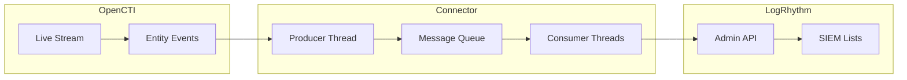

# OpenCTI LogRhythm Connector

| Status | Date | Comment |
|--------|------|---------|
| Community | -    | -       |

The LogRhythm connector streams OpenCTI threat intelligence to LogRhythm SIEM lists for threat detection and correlation.

## Table of Contents

- [OpenCTI LogRhythm Connector](#opencti-logrhythm-connector)
  - [Table of Contents](#table-of-contents)
  - [Introduction](#introduction)
  - [Installation](#installation)
    - [Requirements](#requirements)
  - [Configuration variables](#configuration-variables)
    - [OpenCTI environment variables](#opencti-environment-variables)
    - [Base connector environment variables](#base-connector-environment-variables)
    - [Connector extra parameters environment variables](#connector-extra-parameters-environment-variables)
  - [Deployment](#deployment)
    - [Docker Deployment](#docker-deployment)
    - [Manual Deployment](#manual-deployment)
  - [Usage](#usage)
  - [Behavior](#behavior)
  - [Debugging](#debugging)
  - [Additional information](#additional-information)

## Introduction

This connector enables organizations to feed LogRhythm SIEM lists using OpenCTI threat intelligence. It automatically creates type-specific lists based on the configured base name (e.g., `opencti_Url`, `opencti_Domain-Name`) and maintains them with create and delete events.

Key features:
- Automatic list creation per observable type
- Multi-threaded consumer architecture for high throughput
- Entity type filtering
- Optional Prometheus metrics for monitoring
- Support for create and delete events

## Installation

### Requirements

- OpenCTI Platform >= 5.0.0
- LogRhythm SIEM with Admin API access
- API token with list management permissions

## Configuration variables

There are a number of configuration options, which are set either in `docker-compose.yml` (for Docker) or in `config.yml` (for manual deployment).

### OpenCTI environment variables

| Parameter     | config.yml | Docker environment variable | Mandatory | Description                                          |
|---------------|------------|-----------------------------|-----------|------------------------------------------------------|
| OpenCTI URL   | url        | `OPENCTI_URL`               | Yes       | The URL of the OpenCTI platform.                     |
| OpenCTI Token | token      | `OPENCTI_TOKEN`             | Yes       | The default admin token set in the OpenCTI platform. |

### Base connector environment variables

| Parameter                      | config.yml                | Docker environment variable             | Default   | Mandatory | Description                                                                    |
|--------------------------------|---------------------------|-----------------------------------------|-----------|-----------|--------------------------------------------------------------------------------|
| Connector ID                   | id                        | `CONNECTOR_ID`                          |           | Yes       | A unique `UUIDv4` identifier for this connector instance.                      |
| Connector Name                 | name                      | `CONNECTOR_NAME`                        | Logrhythm | No        | Name of the connector.                                                         |
| Connector Scope                | scope                     | `CONNECTOR_SCOPE`                       | Logrhythm | Yes       | The scope of the connector.                                                    |
| Live Stream ID                 | live_stream_id            | `CONNECTOR_LIVE_STREAM_ID`              |           | Yes       | The Live Stream ID of the stream created in the OpenCTI interface.             |
| Live Stream Listen Delete      | live_stream_listen_delete | `CONNECTOR_LIVE_STREAM_LISTEN_DELETE`   | true      | Yes       | Listen to delete events for the entity.                                        |
| Live Stream No Dependencies    | live_stream_no_dependencies| `CONNECTOR_LIVE_STREAM_NO_DEPENDENCIES`| true      | Yes       | Set to `true` unless synchronizing between OpenCTI platforms.                  |
| Live Stream Start Timestamp    | live_stream_start_timestamp| `CONNECTOR_LIVE_STREAM_START_TIMESTAMP`|           | No        | Start timestamp used on connector first start.                                 |
| Confidence Level               | confidence_level          | `CONNECTOR_CONFIDENCE_LEVEL`            | 20        | No        | The default confidence level (0-100).                                          |
| Consumer Count                 | consumer_count            | `CONNECTOR_CONSUMER_COUNT`              | 10        | No        | Number of consumer/worker threads.                                             |
| Log Level                      | log_level                 | `CONNECTOR_LOG_LEVEL`                   | info      | No        | Determines the verbosity of the logs: `debug`, `info`, `warn`, or `error`.     |

### Connector extra parameters environment variables

| Parameter            | config.yml             | Docker environment variable | Default | Mandatory | Description                                                     |
|----------------------|------------------------|-----------------------------|---------|-----------|-----------------------------------------------------------------|
| LogRhythm URL        | logrhythm.url          | `LOGRHYTHM_URL`             |         | Yes       | LogRhythm Admin API URL (e.g., https://LRIP:8501/lr-admin-api). |
| LogRhythm Token      | logrhythm.token        | `LOGRHYTHM_TOKEN`           |         | Yes       | LogRhythm API token for authentication.                         |
| LogRhythm SSL Verify | logrhythm.ssl_verify   | `LOGRHYTHM_SSL_VERIFY`      | true    | No        | Whether to verify SSL certificates.                             |
| LogRhythm Entity     | logrhythm.entity       | `LOGRHYTHM_entity`          |         | Yes       | Entity name from LogRhythm (from database or API /identities/). |
| LogRhythm List Name  | logrhythm.list_name    | `LOGRHYTHM_LIST_NAME`       |         | Yes       | Base name for lists (e.g., `opencti` creates `opencti_Type`).   |
| LogRhythm Ignore Types| logrhythm.ignore_types| `LOGRHYTHM_IGNORE_TYPES`    |         | Yes       | Comma-separated list of entity types to ignore.                 |
| Metrics Enable       | metrics.enable         | `METRICS_ENABLE`            | false   | No        | Whether to enable Prometheus metrics.                           |
| Metrics Address      | metrics.addr           | `METRICS_ADDR`              | 0.0.0.0 | No        | Bind IP address for metrics endpoint.                           |
| Metrics Port         | metrics.port           | `METRICS_PORT`              | 9113    | No        | Port for metrics endpoint.                                      |

## Deployment

### Docker Deployment

Build the Docker image:

```bash
docker build -t opencti/connector-logrhythm:latest .
```

Configure the connector in `docker-compose.yml`:

```yaml
  connector-logrhythm:
    image: opencti/connector-logrhythm:latest
    environment:
      - OPENCTI_URL=http://localhost
      - OPENCTI_TOKEN=ChangeMe
      - CONNECTOR_ID=ChangeMe
      - CONNECTOR_NAME=Logrhythm
      - CONNECTOR_SCOPE=Logrhythm
      - CONNECTOR_LOG_LEVEL=info
      - CONNECTOR_LIVE_STREAM_ID=ChangeMe
      - CONNECTOR_LIVE_STREAM_LISTEN_DELETE=true
      - CONNECTOR_LIVE_STREAM_NO_DEPENDENCIES=true
      - CONNECTOR_CONSUMER_COUNT=5
      - LOGRHYTHM_URL=https://LRIP:8501/lr-admin-api
      - LOGRHYTHM_TOKEN=ChangeMe
      - LOGRHYTHM_SSL_VERIFY=false
      - LOGRHYTHM_entity=Entity Name
      - LOGRHYTHM_LIST_NAME=opencti
      - LOGRHYTHM_IGNORE_TYPES=label,marking-definition,identity,organization
      - METRICS_ENABLE=true
      - METRICS_PORT=9113
    restart: always
```

Start the connector:

```bash
docker compose up -d
```

### Manual Deployment

1. Create `config.yml` based on `config.yml.sample`.

2. Install dependencies:

```bash
pip3 install -r requirements.txt
```

3. Start the connector from the `src` directory:

```bash
python3 logrhythm.py
```

## Usage

1. Get the entity name from LogRhythm console or via API call to `/identities/`
2. Create a Live Stream in OpenCTI (Data Management -> Data Sharing -> Live Streams)
3. Configure the stream to include desired entity types
4. Copy the Live Stream ID to the connector configuration
5. Start the connector

## Behavior

The connector listens to OpenCTI live stream events and manages LogRhythm lists.

### Data Flow



### Event Processing

| Event Type | Action                                                |
|------------|-------------------------------------------------------|
| create     | Creates list item (auto-creates list if not exists)   |
| update     | Not supported by LogRhythm API                        |
| delete     | Removes item from LogRhythm list                      |

### List Naming Convention

Lists are automatically created with the format: `{base_name}_{observable_type}`

| Base Name | Observable Type | Resulting List Name |
|-----------|-----------------|---------------------|
| opencti   | Url             | opencti_Url         |
| opencti   | Domain-Name     | opencti_Domain-Name |
| opencti   | IPv4-Addr       | opencti_IPv4-Addr   |

### List Configuration

Lists are created with the following default settings:

| Setting            | Value                                           |
|--------------------|-------------------------------------------------|
| listType           | GeneralValue                                    |
| status             | Active                                          |
| useContext         | DomainOrigin, DomainImpacted, Subject, Object, Hash |
| readAccess         | PublicAll                                       |
| writeAccess        | PublicAll                                       |
| timeToLiveSeconds  | 1200                                            |
| doesExpire         | false                                           |

## Debugging

Enable verbose logging by setting:

```env
CONNECTOR_LOG_LEVEL=debug
```

Log output includes:
- Message processing status
- List creation/update operations
- API response status codes

### Prometheus Metrics

When enabled (`METRICS_ENABLE=true`), the following metrics are exposed:

| Metric              | Type    | Description                                |
|---------------------|---------|-------------------------------------------|
| processed_messages  | Counter | Number of processed messages by action    |
| current_state       | Gauge   | Current connector state (event timestamp) |

### Common Issues

| Issue                          | Solution                                              |
|--------------------------------|-------------------------------------------------------|
| Authentication errors          | Verify LogRhythm API token is correct                 |
| Entity not found               | Get correct entity name from LR console or /identities/ API |
| List creation failed           | Check API permissions for list management             |
| SSL certificate errors         | Set `LOGRHYTHM_SSL_VERIFY=false` for testing          |

## Additional information

- **List Segregation**: Lists are created per observable type for better organization and use case building
- **Update Limitation**: LogRhythm API does not support list item updates; items are only created or deleted
- **Entity Name**: The entity name must match exactly as shown in LogRhythm database or console
- **Ignore Types**: Common types to ignore: `label`, `marking-definition`, `identity`, `organization`
- **Multi-threading**: Adjust `CONNECTOR_CONSUMER_COUNT` based on throughput requirements
