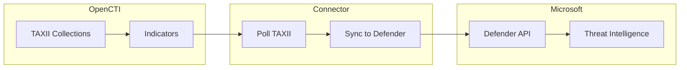

# OpenCTI Microsoft Defender Intel Synchronizer Connector

| Status | Date | Comment |
|--------|------|---------|
| Filigran Verified | -    | -       |

The Microsoft Defender Intel Synchronizer connector synchronizes OpenCTI TAXII collections with Microsoft Defender legacy intelligence (maximum 15,000 indicators, most recent first).

## Table of Contents

- [OpenCTI Microsoft Defender Intel Synchronizer Connector](#opencti-microsoft-defender-intel-synchronizer-connector)
  - [Table of Contents](#table-of-contents)
  - [Introduction](#introduction)
  - [Installation](#installation)
    - [Requirements](#requirements)
  - [Configuration variables](#configuration-variables)
    - [OpenCTI environment variables](#opencti-environment-variables)
    - [Base connector environment variables](#base-connector-environment-variables)
    - [Connector extra parameters environment variables](#connector-extra-parameters-environment-variables)
  - [Deployment](#deployment)
    - [Docker Deployment](#docker-deployment)
    - [Manual Deployment](#manual-deployment)
  - [Usage](#usage)
  - [Behavior](#behavior)
  - [Debugging](#debugging)
  - [Additional information](#additional-information)

## Introduction

This connector enables organizations to synchronize OpenCTI TAXII collections with Microsoft Defender for Endpoint. Unlike the stream-based connector, this synchronizer pulls indicators from TAXII collections at regular intervals.

Key features:
- TAXII collection-based synchronization
- Support for up to 15,000 indicators (most recent)
- Configurable sync interval
- Support for RBAC group assignment
- Custom notification URLs for Block/Warn actions

## Installation

### Requirements

- OpenCTI Platform >= 6.4
- Azure AD Application with appropriate permissions
- Microsoft Defender for Endpoint license
- OpenCTI user with "Access data sharing → Manage data sharing" capability

### Azure AD Application Setup

1. Register an application in Azure AD (Entra portal)
2. Note the `tenant_id`, `client_id`, and `client_secret`
3. Configure API permissions: **Ti.ReadWrite.All**


View indicators in: **Microsoft Defender > Settings > Endpoints > Indicators**

## Configuration variables

There are a number of configuration options, which are set either in `docker-compose.yml` (for Docker) or in `config.yml` (for manual deployment).

### OpenCTI environment variables

| Parameter     | config.yml | Docker environment variable | Mandatory | Description                                          |
|---------------|------------|-----------------------------|-----------|------------------------------------------------------|
| OpenCTI URL   | url        | `OPENCTI_URL`               | Yes       | The URL of the OpenCTI platform.                     |
| OpenCTI Token | token      | `OPENCTI_TOKEN`             | Yes       | Token with "Manage data sharing" capability.         |

### Base connector environment variables

| Parameter             | config.yml  | Docker environment variable  | Default | Mandatory | Description                                                              |
|-----------------------|-------------|------------------------------|---------|-----------|--------------------------------------------------------------------------|
| Connector ID          | id          | `CONNECTOR_ID`               |         | Yes       | A unique `UUIDv4` identifier for this connector instance.                |
| Connector Name        | name        | `CONNECTOR_NAME`             |         | Yes       | Name of the connector.                                                   |
| Connector Scope       | scope       | `CONNECTOR_SCOPE`            | sentinel| Yes       | The scope of the connector.                                              |
| Log Level             | log_level   | `CONNECTOR_LOG_LEVEL`        | info    | No        | Determines the verbosity of the logs: `debug`, `info`, `warn`, or `error`.|

### Connector extra parameters environment variables

| Parameter             | config.yml                                              | Docker environment variable                                     | Default                                     | Mandatory | Description                                                |
|-----------------------|---------------------------------------------------------|-----------------------------------------------------------------|---------------------------------------------|-----------|------------------------------------------------------------|
| Tenant ID             | microsoft_defender_intel_synchronizer.tenant_id         | `MICROSOFT_DEFENDER_INTEL_SYNCHRONIZER_TENANT_ID`               |                                             | Yes       | Azure AD Tenant ID.                                        |
| Client ID             | microsoft_defender_intel_synchronizer.client_id         | `MICROSOFT_DEFENDER_INTEL_SYNCHRONIZER_CLIENT_ID`               |                                             | Yes       | Azure AD Application Client ID.                            |
| Client Secret         | microsoft_defender_intel_synchronizer.client_secret     | `MICROSOFT_DEFENDER_INTEL_SYNCHRONIZER_CLIENT_SECRET`           |                                             | Yes       | Azure AD Application Client Secret.                        |
| Login URL             | microsoft_defender_intel_synchronizer.login_url         | `MICROSOFT_DEFENDER_INTEL_SYNCHRONIZER_LOGIN_URL`               | https://login.microsoft.com                 | No        | Microsoft login URL.                                       |
| API Base URL          | microsoft_defender_intel_synchronizer.base_url          | `MICROSOFT_DEFENDER_INTEL_SYNCHRONIZER_BASE_URL`                | https://api.securitycenter.microsoft.com    | No        | Microsoft Defender API base URL.                           |
| Resource Path         | microsoft_defender_intel_synchronizer.resource_path     | `MICROSOFT_DEFENDER_INTEL_SYNCHRONIZER_RESOURCE_PATH`           | /api/indicators                             | No        | API endpoint path for indicators.                          |
| Expire Time           | microsoft_defender_intel_synchronizer.expire_time       | `MICROSOFT_DEFENDER_INTEL_SYNCHRONIZER_EXPIRE_TIME`             | 30                                          | Yes       | Days before indicators expire in Defender.                 |
| Action                | microsoft_defender_intel_synchronizer.action            | `MICROSOFT_DEFENDER_INTEL_SYNCHRONIZER_ACTION`                  | Audit                                       | No        | Default action: Allowed, Audit, Block, BlockAndRemediate, Warn. |
| Passive Only          | microsoft_defender_intel_synchronizer.passive_only      | `MICROSOFT_DEFENDER_INTEL_SYNCHRONIZER_PASSIVE_ONLY`            | false                                       | No        | Silent/audit mode without user notification.               |
| TAXII Collections     | microsoft_defender_intel_synchronizer.taxii_collections | `MICROSOFT_DEFENDER_INTEL_SYNCHRONIZER_TAXII_COLLECTIONS`       |                                             | Yes       | Comma-separated list of TAXII collection IDs.              |
| Interval              | microsoft_defender_intel_synchronizer.interval          | `MICROSOFT_DEFENDER_INTEL_SYNCHRONIZER_INTERVAL`                | 300                                         | No        | Sync interval in seconds.                                  |
| Recommended Actions   | microsoft_defender_intel_synchronizer.recommended_actions| `MICROSOFT_DEFENDER_INTEL_SYNCHRONIZER_RECOMMENDED_ACTIONS`    |                                             | No        | Recommended actions for TI indicator alerts.               |
| RBAC Group Names      | microsoft_defender_intel_synchronizer.rbac_group_names  | `MICROSOFT_DEFENDER_INTEL_SYNCHRONIZER_RBAC_GROUP_NAMES`        | []                                          | No        | JSON array of RBAC group names.                            |
| Educate URL           | microsoft_defender_intel_synchronizer.educate_url       | `MICROSOFT_DEFENDER_INTEL_SYNCHRONIZER_EDUCATE_URL`             |                                             | No        | Custom notification URL for Block/Warn actions.            |

## Deployment

### Docker Deployment

Build the Docker image:

```bash
docker build -t opencti/connector-microsoft-defender-intel-synchronizer:latest .
```

Configure the connector in `docker-compose.yml`:

```yaml
  connector-microsoft-defender-intel-synchronizer:
    image: opencti/connector-microsoft-defender-intel-synchronizer:latest
    environment:
      - OPENCTI_URL=http://localhost
      - OPENCTI_TOKEN=ChangeMe
      - CONNECTOR_ID=ChangeMe
      - CONNECTOR_NAME=Microsoft Defender Intel Synchronizer
      - CONNECTOR_SCOPE=sentinel
      - CONNECTOR_LOG_LEVEL=info
      - MICROSOFT_DEFENDER_INTEL_SYNCHRONIZER_TENANT_ID=ChangeMe
      - MICROSOFT_DEFENDER_INTEL_SYNCHRONIZER_CLIENT_ID=ChangeMe
      - MICROSOFT_DEFENDER_INTEL_SYNCHRONIZER_CLIENT_SECRET=ChangeMe
      - MICROSOFT_DEFENDER_INTEL_SYNCHRONIZER_EXPIRE_TIME=30
      - MICROSOFT_DEFENDER_INTEL_SYNCHRONIZER_TAXII_COLLECTIONS=collection1,collection2
      - MICROSOFT_DEFENDER_INTEL_SYNCHRONIZER_INTERVAL=300
    restart: always
```

Start the connector:

```bash
docker compose up -d
```

### Manual Deployment

1. Create `config.yml` based on `config.yml.sample`.

2. Install dependencies:

```bash
pip3 install -r requirements.txt
```

3. Start the connector from the `src` directory:

```bash
python3 main.py
```

## Usage

1. Create TAXII collections in OpenCTI with the indicators you want to sync
2. Note the TAXII collection IDs
3. Set up Azure AD Application with `Ti.ReadWrite.All` permissions
4. Configure the connector with the TAXII collection IDs
5. Start the connector

The connector will pull indicators from TAXII collections at the configured interval.

## Behavior

The connector polls TAXII collections at regular intervals and synchronizes indicators to Microsoft Defender.

### Data Flow



### Synchronization Process

| Step | Description                                              |
|------|----------------------------------------------------------|
| 1    | Poll TAXII collections at configured interval            |
| 2    | Retrieve up to 15,000 most recent indicators             |
| 3    | Convert indicators to Defender format                    |
| 4    | Sync to Microsoft Defender (create/update/delete)        |

### Available Actions

| Action           | Description                                              |
|------------------|----------------------------------------------------------|
| Allowed          | Explicitly allow the indicator                           |
| Audit            | Log only, no action                                      |
| Block            | Block the indicator                                      |
| BlockAndRemediate| Block and remediate                                      |
| Warn             | Generate warning without blocking                        |

## Debugging

Enable verbose logging by setting:

```env
CONNECTOR_LOG_LEVEL=debug
```

### Common Issues

| Issue                          | Solution                                              |
|--------------------------------|-------------------------------------------------------|
| FORBIDDEN_ACCESS error         | Ensure user has "Manage data sharing" capability      |
| Authentication errors          | Verify tenant_id, client_id, and client_secret        |
| Permission denied              | Ensure Ti.ReadWrite.All permission is granted         |
| Indicator not appearing        | Wait a few minutes; sync is not instant               |

## Additional information

- **Indicator Limit**: Maximum 15,000 indicators, most recent first
- **Sync Delay**: Indicators may take a few minutes to appear in Microsoft Defender
- **RBAC Groups**: Use JSON array format: `["Group1", "Group2"]`
- **Educate URL**: Custom support URL shown during Block/Warn actions
- **Permission Required**: OpenCTI user must have "Access data sharing → Manage data sharing" capability
