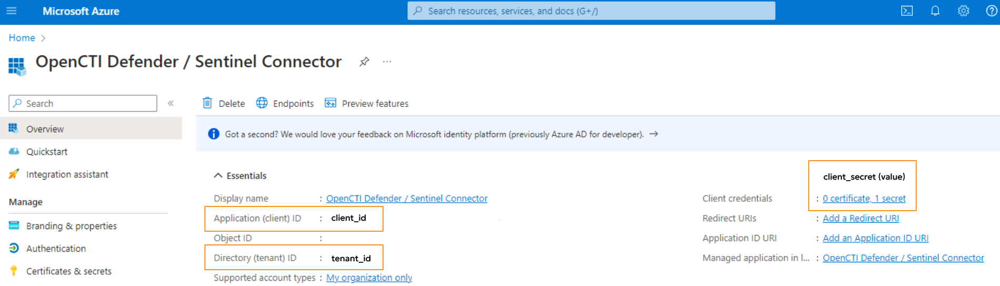
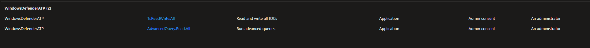
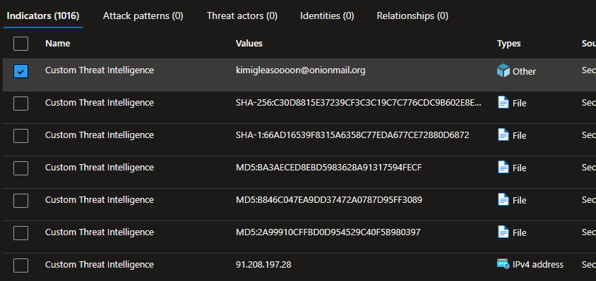

# OpenCTI Microsoft Defender Intelligence Synchronizer Connector

This OpenCTI connector allows to synchronize OpenCTI TAXII collections with Microsoft Defender legacy intelligence (15 000 indicators maximum, taking the most recent ones).

## Installation

If you don't know how to get the `tenant_id`, `client_id`, and `client_secret` information, here's a screenshot to
help !

It's also important to define the necessary permissions in Sentinel for the connector to work.

In the Entra portal, you need to set :
Home > Application Registration > OpenCTI (your name) > API Permissions
and prioritize the "Ti.ReadWrite.All" permissions.

You will then be able to view the data (indicators) in :
Home > Microsoft Defender > Settings > Endpoints > Indicators

For more information, visit:

- [Microsoft Security-Authorization](https://learn.microsoft.com/en-us/graph/security-authorization)
- [Microsoft Connect-Threat-Intelligence-Tip](https://learn.microsoft.com/en-us/azure/sentinel/connect-threat-intelligence-tip)

Another interesting link:

- [Microsoft Sentinel-Threat-Intelligence](https://learn.microsoft.com/en-us/azure/architecture/example-scenario/data/sentinel-threat-intelligence#import-threat-indicators-with-the-platforms-data-connector)

### Requirements

- OpenCTI Platform >= 6.4

### Configuration variables

Below are the parameters you'll need to set for OpenCTI:

| Parameter `opencti` | config.yml | Docker environment variable | Mandatory | Description                                          |
|---------------------|------------|-----------------------------|-----------|------------------------------------------------------|
| URL                 | `url`      | `OPENCTI_URL`               | Yes       | The URL of the OpenCTI platform.                     |
| Token               | `token`    | `OPENCTI_TOKEN`             | Yes       | The default admin token set in the OpenCTI platform. |

Below are the parameters you'll need to set for running the connector properly:

| Parameter `connector`       | config.yml                    | Docker environment variable             | Default | Mandatory | Example                                | Description                                                                            |
|-----------------------------|-------------------------------|-----------------------------------------|---------|-----------|----------------------------------------|----------------------------------------------------------------------------------------|
| ID                          | `id`                          | `CONNECTOR_ID`                          | /       | Yes       | `fe418972-1b42-42c9-a665-91544c1a9939` | A unique `UUIDv4` identifier for this connector instance.                              |
| Name                        | `name`                        | `CONNECTOR_NAME`                        | /       | Yes       | `Microsoft Sentinel`                   | Full name of the connector : `Microsoft Sentinel`.                                     |
| Scope                       | `scope`                       | `CONNECTOR_SCOPE`                       | /       | Yes       | `sentinel`                             | Must be `sentinel`, not used in this connector.                                        |
| Log Level                   | `log_level`                   | `CONNECTOR_LOG_LEVEL`                   | /       | Yes       | `error`                                | Determines the verbosity of the logs. Options are `debug`, `info`, `warn`, or `error`. |

Below are the parameters you'll need to set for Sentinel Connector:

| Parameter `microsoft_defender_intel_synchronizer` | config.yml          | Docker environment variable                                     | Default  | Mandatory | Example                                    | Description                                                                                                                                                                                                                                                                                                                                                       |
|---------------------------------------------------|---------------------|-----------------------------------------------------------------|----------|-----------|--------------------------------------------|-------------------------------------------------------------------------------------------------------------------------------------------------------------------------------------------------------------------------------------------------------------------------------------------------------------------------------------------------------------------|
| Tenant ID                                         | `tenant_id`         | `MICROSOFT_DEFENDER_INTEL_SYNCHRONIZER_TENANT_ID`               | /        | Yes       | /                                          | Your Azure App Tenant ID, see the screenshot to help you find this information.                                                                                                                                                                                                                                                                                   |
| Client ID                                         | `client_id`         | `MICROSOFT_DEFENDER_INTEL_SYNCHRONIZER_CLIENT_ID`               | /        | Yes       | /                                          | Your Azure App Client ID, see the screenshot to help you find this information.                                                                                                                                                                                                                                                                                   |
| Client Secret                                     | `client_secret`     | `MICROSOFT_DEFENDER_INTEL_SYNCHRONIZER_CLIENT_SECRET`           | /        | Yes       | /                                          | Your Azure App Client secret, See the screenshot to help you find this information.                                                                                                                                                                                                                                                                               |
| Login Url                                         | `login_url`         | `MICROSOFT_DEFENDER_INTEL_SYNCHRONIZER_LOGIN_URL`               | /        | No        | `https://login.microsoft.com`              | Login URL for Microsoft which is `https://login.microsoft.com`                                                                                                                                                                                                                                                                                                    |
| API Base URL                                      | `base_url`          | `MICROSOFT_DEFENDER_INTEL_SYNCHRONIZER_BASE_URL`                | /        | No        | `https://api.securitycenter.microsoft.com` | The resource the API will use which is `https://api.securitycenter.microsoft.com`                                                                                                                                                                                                                                                                                 |
| Resource Url Path                                 | `resource_path`     | `MICROSOFT_DEFENDER_INTEL_SYNCHRONIZER_RESOURCE_PATH`           | /        | No        | `/api/indicators`                          | The request URL that will be used which is `/api/indicators`                                                                                                                                                                                                                                                                                                      |
| Expire Time                                       | `expire_time`       | `MICROSOFT_DEFENDER_INTEL_SYNCHRONIZER_EXPIRE_TIME`             | /        | Yes       | `30`                                       | Number of days for your indicator to expire in Sentinel. Suggestion of `30` as a default                                                                                                                                                                                                                                                                          |
| Action                                            | `action`            | `MICROSOFT_DEFENDER_INTEL_SYNCHRONIZER_ACTION`                  | /        | No        | `alert`                                    | The action to apply if the indicator is matched from within the targetProduct security tool. Possible values are: `Audit`, `Block`, `Alert`, `Warn`.                                                                                                                                                                                                              |
| Passive Only                                      | `passive_only`      | `MICROSOFT_DEFENDER_INTEL_SYNCHRONIZER_PASSIVE_ONLY`            | /        | No        | `true`                                     | Determines if the indicator should trigger an event that is visible to an end-user. When set to `True` security tools will not notify the end user that a ‘hit’ has occurred. This is most often treated as audit or silent mode by security products where they will simply log that a match occurred but will not perform the action. Default value is `False`. |
| TAXII Collections                                 | `taxii_collections` | `MICROSOFT_DEFENDER_INTEL_SYNCHRONIZER_TAXII_COLLECTIONS`       | /        | Yes       | `ID1,ID2`                                  | List of TAXII collections, separated by commas.                                                                                                                                                                                                                                                                                                                   |
| Interval                                          | `interval`          | `MICROSOFT_DEFENDER_INTEL_SYNCHRONIZER_INTERVAL`                | /        | No        | `300`                                      | Interval for pulling TAXII collections and sync to Defender.                                                                                                                                                                                                                                                                                                      |

### Known Behavior

- When creating, updating or deleting and IOC, it can take few minutes before seeing it into Microsoft Sentinel TI
- When creating an email address, it will display the `Types` as `Other`

