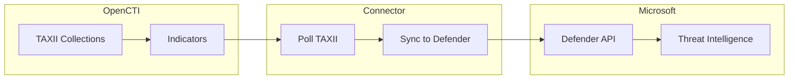

# OpenCTI Microsoft Defender Intel Synchronizer Connector

| Status | Date | Comment |
|--------|------|---------|
| Filigran Verified | -    | -       |

The Microsoft Defender Intel Synchronizer connector synchronizes OpenCTI TAXII collections with Microsoft Defender legacy intelligence (maximum 15,000 indicators, most recent first).

## Table of Contents

- [OpenCTI Microsoft Defender Intel Synchronizer Connector](#opencti-microsoft-defender-intel-synchronizer-connector)
  - [Table of Contents](#table-of-contents)
  - [Introduction](#introduction)
  - [Installation](#installation)
    - [Requirements](#requirements)
    - [Microsoft Entra ID (formerly Azure AD) Application Setup](#microsoft-entra-id-formerly-azure-ad-application-setup)
    - [Configuration variables](#configuration-variables)
    - [Important Note on Permissions](#important-note-on-permissions)
  - [Usage](#usage)
  - [Behavior](#behavior)
    - [Data Flow](#data-flow)
    - [Synchronization Process](#synchronization-process)
    - [Available Actions](#available-actions)
  - [Debugging](#debugging)
    - [Common Issues](#common-issues)
  - [Additional information](#additional-information)

## Introduction

This connector enables organizations to synchronize OpenCTI TAXII collections with Microsoft Defender for Endpoint. Unlike the stream-based connector, this synchronizer pulls indicators from TAXII collections at regular intervals.

Key features:
- TAXII collection-based synchronization
- Support for up to 15,000 indicators (Microsoft Defender limit)
- Configurable sync interval
- Support for RBAC group assignment
- Custom notification URLs for Block/Warn actions

## Installation

### Requirements

- OpenCTI Platform >= 6.4
- Microsoft Entra ID (formerly Azure AD) Application with appropriate permissions
- Microsoft Defender for Endpoint license
- OpenCTI user with "Access data sharing → Manage data sharing" capability

### Microsoft Entra ID (formerly Azure AD) Application Setup

If you don't know how to get the `tenant_id`, `client_id`, and `client_secret` information, here's a screenshot to
help.


It's also important to define the necessary permissions in Microsoft Entra ID (formerly Azure AD) for the connector to work.

In the Entra portal, set:

Home > Application registrations > OpenCTI (your app name) > API permissions

The connector requires the following application permissions for Microsoft Defender XDR / Microsoft 365 Defender APIs:

| Permission                 | Purpose                                                                                                         |
| -------------------------- | --------------------------------------------------------------------------------------------------------------- |
| `Ti.ReadWrite.All`         | Create, update, and delete indicators.                                                                          |
| `Indicators.ReadWrite.All` | (Equivalent to above; exact name depends on portal version.)                                                    |
| `Score.Read.All`           | Required for RBAC-scoped synchronization — used to list device groups via `/api/exposureScore/ByMachineGroups`. |

After adding these permissions, click Grant admin consent.

You will then be able to view the data (indicators) in:
Home > Microsoft Defender > Settings > Endpoints > Indicators

### Configuration variables

Below are the parameters you'll need to set for OpenCTI:

| Parameter `opencti` | config.yml | Docker environment variable | Mandatory | Description                                          |
|---------------------|------------|-----------------------------|-----------|------------------------------------------------------|
| URL                 | `url`      | `OPENCTI_URL`               | Yes       | The URL of the OpenCTI platform.                     |
| Token               | `token`    | `OPENCTI_TOKEN`             | Yes       | The default admin token set in the OpenCTI platform. |

Below are the parameters you'll need to set for running the connector properly:

| Parameter `connector`       | config.yml                    | Docker environment variable             | Default | Mandatory | Example                                | Description                                                                            |
|-----------------------------|-------------------------------|-----------------------------------------|---------|-----------|----------------------------------------|----------------------------------------------------------------------------------------|
| ID                          | `id`                          | `CONNECTOR_ID`                          | /       | Yes       | `fe418972-1b42-42c9-a665-91544c1a9939` | A unique `UUIDv4` identifier for this connector instance.                              |
| Name                        | `name`                        | `CONNECTOR_NAME`                        | /       | Yes       | `Microsoft Defender Intel Synchronizer`                   | Full name of the connector : `Microsoft Defender Intel Synchronizer`.                                     |
| Scope                       | `scope`                       | `CONNECTOR_SCOPE`                       | /       | Yes       | `sentinel`                             | Must be `sentinel`, not used in this connector.                                        |
| Log Level                   | `log_level`                   | `CONNECTOR_LOG_LEVEL`                   | /       | Yes       | `error`                                | Determines the verbosity of the logs. Options are `debug`, `info`, `warn`, or `error`. |

Below are the parameters you'll need to set for Microsoft Defender Intel Synchronizer:

| Parameter `microsoft_defender_intel_synchronizer` | config.yml          | Docker environment variable                                     | Default  | Mandatory | Example                                    | Description                                                                                                                                                                                                                                                                                                                                                       |
|---------------------------------------------------|---------------------|-----------------------------------------------------------------|----------|-----------|--------------------------------------------|-------------------------------------------------------------------------------------------------------------------------------------------------------------------------------------------------------------------------------------------------------------------------------------------------------------------------------------------------------------------|
| Tenant ID                                         | `tenant_id`         | `MICROSOFT_DEFENDER_INTEL_SYNCHRONIZER_TENANT_ID`               | /        | Yes       | /                                          | Your Microsoft Entra ID (formerly Azure AD) App Tenant ID, see the screenshot to help you find this information.                                                                                                                                                                                                                                                                                   |
| Client ID                                         | `client_id`         | `MICROSOFT_DEFENDER_INTEL_SYNCHRONIZER_CLIENT_ID`               | /        | Yes       | /                                          | Your Microsoft Entra ID (formerly Azure AD) App Client ID, see the screenshot to help you find this information.                                                                                                                                                                                                                                                                                   |
| Client Secret                                     | `client_secret`     | `MICROSOFT_DEFENDER_INTEL_SYNCHRONIZER_CLIENT_SECRET`           | /        | Yes       | /                                          | Your Microsoft Entra ID (formerly Azure AD) App Client secret, See the screenshot to help you find this information.                                                                                                                                                                                                                                                                               |
| Login URL                                         | `login_url`         | `MICROSOFT_DEFENDER_INTEL_SYNCHRONIZER_LOGIN_URL`               | /        | No        | `https://login.microsoftonline.com`              | Login URL for Microsoft which is `https://login.microsoftonline.com`                                                                                                                                                                                                                                                                                                    |
| API Base URL                                      | `base_url`          | `MICROSOFT_DEFENDER_INTEL_SYNCHRONIZER_BASE_URL`                | /        | No        | `https://api.securitycenter.microsoft.com` | The resource the API will use which is `https://api.securitycenter.microsoft.com`                                                                                                                                                                                                                                                                                 |
| Resource URL Path                                 | `resource_path`     | `MICROSOFT_DEFENDER_INTEL_SYNCHRONIZER_RESOURCE_PATH`           | /        | No        | `/api/indicators`                          | The request URL that will be used which is `/api/indicators`                                                                                                                                                                                                                                                                                                      |
| Expire Time                                       | `expire_time`       | `MICROSOFT_DEFENDER_INTEL_SYNCHRONIZER_EXPIRE_TIME`             | /        | Yes       | `30`                                       | Number of days for your indicator to expire in Defender. Suggestion of `30` as a default                                                                                                                                                                                                                                                                          |
| Action                                            | `action`            | `MICROSOFT_DEFENDER_INTEL_SYNCHRONIZER_ACTION`                  | /        | No        | `Audit`                                    | The action to apply if the indicator is matched from within the targetProduct security tool. Possible values are: `Allowed`, `Audit`, `Block`, `BlockAndRemediate`, `Warn`.                                                                                                                                                                                                              |
| Passive Only                                      | `passive_only`      | `MICROSOFT_DEFENDER_INTEL_SYNCHRONIZER_PASSIVE_ONLY`            | /        | No        | `true`                                     | Run without modifying Defender. When true the connector performs full planning and logging but skips POST/PUT/PATCH/DELETE calls. No changes are made in Defender. |
| TAXII Collections | `taxii_collections` | `MICROSOFT_DEFENDER_INTEL_SYNCHRONIZER_TAXII_COLLECTIONS` | / | Yes | `ID1,ID2` or `{"COLL1":{"action":"Block","expire_time":30,"rbac_group_names":["Linux"]},"COLL2":{}}` | Comma-separated list of TAXII collection IDs or a JSON object map for per-collection overrides. |
| Interval                                          | `interval`          | `MICROSOFT_DEFENDER_INTEL_SYNCHRONIZER_INTERVAL`                | /        | No        | `300`                                      | Interval for pulling TAXII collections and sync to Defender.                                                                                                                                                                                                                                                                                                      |
| Recommended Actions                                 | `recommended_actions` | `MICROSOFT_DEFENDER_INTEL_SYNCHRONIZER_RECOMMENDED_ACTIONS` | /        | No        | `Block immediately`                           | Recommended actions for the TI indicator alert. |
| RBAC Group Names                                   | `rbac_group_names`    | `MICROSOFT_DEFENDER_INTEL_SYNCHRONIZER_RBAC_GROUP_NAMES`    | `[]`     | No        | `["group1", "group2"]`                        | JSON array of RBAC group names. Example: `["My Team", "The Other Team - Linux Servers"]`. |
| Educate URL                                        | `educate_url`         | `MICROSOFT_DEFENDER_INTEL_SYNCHRONIZER_EDUCATE_URL`         | /        | No        | `https://support.example.com`                  | Custom notification/support URL for Block/Warn actions. |
| Update Only Owned Indicators                        | `update_only_owned`  | `MICROSOFT_DEFENDER_INTEL_SYNCHRONIZER_UPDATE_ONLY_OWNED`   | `true`   | No        | `true`                  | Controls whether the connector will manage only owned indicators. |

`taxii_collections` supports:

- **Simple list:** `COLL1,COLL2` (or `["COLL1","COLL2"]`) to use global defaults.
- **Advanced map:** JSON (or YAML) object where each key is a collection ID and the value is a policy override, e.g.:

```json
  {
    "COLL1": { "action": "Block", "expire_time": 30, "recommended_actions": "Block immediately", "educate_url": "https://support.example.com", "rbac_group_names": ["Linux","Servers"] },
    "COLL2": {}
  }
```

Supported keys: `action`, `expire_time`, `recommended_actions`, `educate_url`, and `rbac_group_names`.
Per-collection overrides always take precedence over global settings.

### Important Note on Permissions

The user impersonating this connector **must** have the capability "Access data sharing → Manage data sharing" in OpenCTI. Without this permission, the connector will fail with a `FORBIDDEN_ACCESS` error, and you will see a message similar to:

```txt
ValueError: {'name': 'FORBIDDEN_ACCESS', 'error_message': 'You are not allowed to do this.'}
```

Please ensure the connector's user has this permission assigned, in addition to the usual required permissions.

## Usage

1. Create TAXII collections in OpenCTI with the indicators you want to sync
2. Note the TAXII collection IDs
3. Set up Microsoft Entra ID (formerly Azure AD) Application with `Ti.ReadWrite.All` permissions
4. Configure the connector with the TAXII collection IDs
5. Start the connector

The connector will pull indicators from TAXII collections at the configured interval.

## Behavior

The connector polls TAXII collections at regular intervals and synchronizes indicators to Microsoft Defender.

### Data Flow



### Synchronization Process

| Step | Description                                              |
|------|----------------------------------------------------------|
| 1    | Poll TAXII collections at configured interval            |
| 2    | Retrieve up to 15,000 most recent indicators             |
| 3    | Convert indicators to Defender format                    |
| 4    | Sync to Microsoft Defender (create/update/delete)        |

### Available Actions

| Action           | Description                                              |
|------------------|----------------------------------------------------------|
| Allowed          | Explicitly allow the indicator                           |
| Audit            | Log only, no action                                      |
| Block            | Block the indicator                                      |
| BlockAndRemediate| Block and remediate                                      |
| Warn             | Generate warning without blocking                        |

## Debugging

Enable verbose logging by setting:

```env
CONNECTOR_LOG_LEVEL=debug
```

### Common Issues

| Issue                                     | Solution                                              |
|-------------------------------------------|-------------------------------------------------------|
| FORBIDDEN_ACCESS error                    | Ensure user has "Manage data sharing" capability      |
| Authentication errors                     | Verify tenant_id, client_id, and client_secret        |
| Permission denied                         | Ensure Ti.ReadWrite.All permission is granted         |
| Indicator not appearing                   | Wait a few minutes; sync is not instant               |
| 401 Unauthorized during RBAC group lookup | Ensure the application has the `Score.Read.All` permission and admin consent has been granted. Without this permission, the `/api/exposureScore/ByMachineGroups` endpoint cannot be accessed, and RBAC-scoped indicator synchronization will fail. |

## Additional information

- **Indicator Limit**: Maximum 15,000 indicators, most recent first
- **Sync Delay**: Indicators may take a few minutes to appear in Microsoft Defender
- **RBAC Groups**: Use JSON array format: `["Group1", "Group2"]`
- **Educate URL**: Custom support URL shown during Block/Warn actions
- **Permission Required**: OpenCTI user must have "Access data sharing → Manage data sharing" capability
