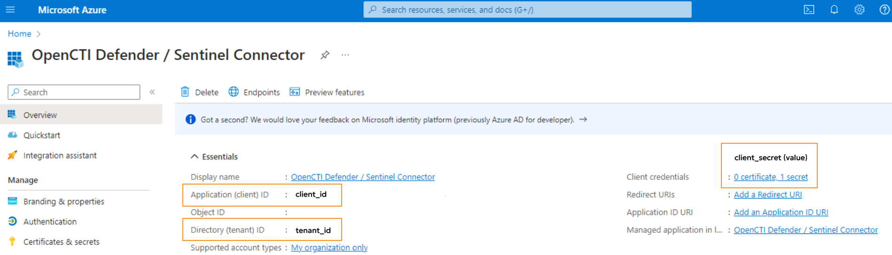
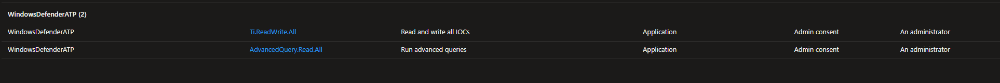
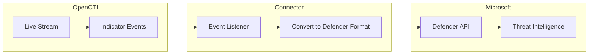

# OpenCTI Microsoft Defender Intel Connector

| Status | Date | Comment |
|--------|------|---------|
| Filigran Verified | -    | -       |

The Microsoft Defender Intel connector streams OpenCTI indicators to Microsoft Defender for Endpoint for threat detection and protection.

## Table of Contents

- [OpenCTI Microsoft Defender Intel Connector](#opencti-microsoft-defender-intel-connector)
  - [Table of Contents](#table-of-contents)
  - [Introduction](#introduction)
  - [Installation](#installation)
    - [Requirements](#requirements)
  - [Configuration variables](#configuration-variables)
    - [OpenCTI environment variables](#opencti-environment-variables)
    - [Base connector environment variables](#base-connector-environment-variables)
    - [Connector extra parameters environment variables](#connector-extra-parameters-environment-variables)
  - [Deployment](#deployment)
    - [Docker Deployment](#docker-deployment)
    - [Manual Deployment](#manual-deployment)
  - [Usage](#usage)
  - [Behavior](#behavior)
  - [Debugging](#debugging)
  - [Additional information](#additional-information)

## Introduction

This connector enables organizations to stream threat indicators from OpenCTI to Microsoft Defender for Endpoint using native Microsoft APIs. Indicators are synced in real-time and can trigger alerts, blocks, or audits based on configurable actions.

Key features:
- Real-time synchronization of indicators to Microsoft Defender
- Support for multiple observable types (IP, domain, URL, file hash, email)
- Automatic score-based action assignment
- Configurable indicator expiration
- Support for create, update, and delete operations

## Installation

### Requirements

- OpenCTI Platform >= 6.4
- Azure AD Application with appropriate permissions
- Microsoft Defender for Endpoint license

### Azure AD Application Setup

1. Register an application in Azure AD (Entra portal)
2. Note the `tenant_id`, `client_id`, and `client_secret`
3. Configure API permissions: **Ti.ReadWrite.All**




For more information:
- [Microsoft Security Authorization](https://learn.microsoft.com/en-us/graph/security-authorization)
- [Connect Threat Intelligence](https://learn.microsoft.com/en-us/azure/sentinel/connect-threat-intelligence-tip)

## Configuration variables

There are a number of configuration options, which are set either in `docker-compose.yml` (for Docker) or in `config.yml` (for manual deployment).

### OpenCTI environment variables

| Parameter     | config.yml | Docker environment variable | Mandatory | Description                                          |
|---------------|------------|-----------------------------|-----------|------------------------------------------------------|
| OpenCTI URL   | url        | `OPENCTI_URL`               | Yes       | The URL of the OpenCTI platform.                     |
| OpenCTI Token | token      | `OPENCTI_TOKEN`             | Yes       | The default admin token set in the OpenCTI platform. |

### Base connector environment variables

| Parameter                      | config.yml                | Docker environment variable             | Default | Mandatory | Description                                                                    |
|--------------------------------|---------------------------|-----------------------------------------|---------|-----------|--------------------------------------------------------------------------------|
| Connector ID                   | id                        | `CONNECTOR_ID`                          |         | Yes       | A unique `UUIDv4` identifier for this connector instance.                      |
| Connector Name                 | name                      | `CONNECTOR_NAME`                        |         | Yes       | Name of the connector.                                                         |
| Live Stream ID                 | live_stream_id            | `CONNECTOR_LIVE_STREAM_ID`              |         | Yes       | The Live Stream ID of the stream created in the OpenCTI interface.             |
| Live Stream Listen Delete      | live_stream_listen_delete | `CONNECTOR_LIVE_STREAM_LISTEN_DELETE`   | true    | No        | Listen to delete events for the entity.                                        |
| Live Stream No Dependencies    | live_stream_no_dependencies| `CONNECTOR_LIVE_STREAM_NO_DEPENDENCIES`| true    | No        | Set to `true` unless synchronizing between OpenCTI platforms.                  |
| Log Level                      | log_level                 | `CONNECTOR_LOG_LEVEL`                   | error   | No        | Determines the verbosity of the logs: `debug`, `info`, `warn`, or `error`.     |

### Connector extra parameters environment variables

| Parameter        | config.yml                              | Docker environment variable              | Default                                     | Mandatory | Description                                                |
|------------------|-----------------------------------------|------------------------------------------|---------------------------------------------|-----------|------------------------------------------------------------|
| Tenant ID        | microsoft_defender_intel.tenant_id      | `MICROSOFT_DEFENDER_INTEL_TENANT_ID`     |                                             | Yes       | Azure AD Tenant ID.                                        |
| Client ID        | microsoft_defender_intel.client_id      | `MICROSOFT_DEFENDER_INTEL_CLIENT_ID`     |                                             | Yes       | Azure AD Application Client ID.                            |
| Client Secret    | microsoft_defender_intel.client_secret  | `MICROSOFT_DEFENDER_INTEL_CLIENT_SECRET` |                                             | Yes       | Azure AD Application Client Secret.                        |
| Login URL        | microsoft_defender_intel.login_url      | `MICROSOFT_DEFENDER_INTEL_LOGIN_URL`     | https://login.microsoft.com                 | No        | Microsoft login URL.                                       |
| API Base URL     | microsoft_defender_intel.base_url       | `MICROSOFT_DEFENDER_INTEL_BASE_URL`      | https://api.securitycenter.microsoft.com    | No        | Microsoft Defender API base URL.                           |
| Resource Path    | microsoft_defender_intel.resource_path  | `MICROSOFT_DEFENDER_INTEL_RESOURCE_PATH` | /api/indicators                             | No        | API endpoint path for indicators.                          |
| Expire Time      | microsoft_defender_intel.expire_time    | `MICROSOFT_DEFENDER_INTEL_EXPIRE_TIME`   | 30                                          | No        | Days before indicators expire in Defender.                 |
| Action           | microsoft_defender_intel.action         | `MICROSOFT_DEFENDER_INTEL_ACTION`        | Alert                                       | No        | Default action for matched indicators.                     |
| Passive Only     | microsoft_defender_intel.passive_only   | `MICROSOFT_DEFENDER_INTEL_PASSIVE_ONLY`  | false                                       | No        | Silent/audit mode without user notification.               |

## Deployment

### Docker Deployment

Build the Docker image:

```bash
docker build -t opencti/connector-microsoft-defender-intel:latest .
```

Configure the connector in `docker-compose.yml`:

```yaml
  connector-microsoft-defender-intel:
    image: opencti/connector-microsoft-defender-intel:latest
    environment:
      - OPENCTI_URL=http://localhost
      - OPENCTI_TOKEN=ChangeMe
      - CONNECTOR_ID=ChangeMe
      - CONNECTOR_NAME=Microsoft Defender Intel
      - CONNECTOR_LIVE_STREAM_ID=ChangeMe
      - CONNECTOR_LIVE_STREAM_LISTEN_DELETE=true
      - CONNECTOR_LIVE_STREAM_NO_DEPENDENCIES=true
      - CONNECTOR_LOG_LEVEL=error
      - MICROSOFT_DEFENDER_INTEL_TENANT_ID=ChangeMe
      - MICROSOFT_DEFENDER_INTEL_CLIENT_ID=ChangeMe
      - MICROSOFT_DEFENDER_INTEL_CLIENT_SECRET=ChangeMe
      - MICROSOFT_DEFENDER_INTEL_EXPIRE_TIME=30
      - MICROSOFT_DEFENDER_INTEL_ACTION=Alert
    restart: always
```

Start the connector:

```bash
docker compose up -d
```

### Manual Deployment

1. Create `config.yml` based on `config.yml.sample`.

2. Install dependencies:

```bash
pip3 install -r requirements.txt
```

3. Start the connector from the `src` directory:

```bash
python3 main.py
```

## Usage

1. Set up an Azure AD Application with `Ti.ReadWrite.All` permissions
2. Create a Live Stream in OpenCTI (Data Management -> Data Sharing -> Live Streams)
3. Configure the stream to include indicators
4. Copy the Live Stream ID to the connector configuration
5. Start the connector

View indicators in Microsoft Defender at: **Security Center > Threat Intelligence > Indicators**

## Behavior

The connector listens to OpenCTI live stream events and manages indicators in Microsoft Defender for Endpoint.

### Data Flow



### Event Processing

| Event Type | Action                                       |
|------------|----------------------------------------------|
| create     | Creates indicator in Microsoft Defender      |
| update     | Updates indicator in Microsoft Defender      |
| delete     | Removes indicator from Microsoft Defender    |

### Entity Mapping

| OpenCTI Observable Type | Microsoft Defender IOC Type |
|-------------------------|-----------------------------|
| IPv4-Addr               | IpAddress                   |
| IPv6-Addr               | IpAddress                   |
| Domain-Name             | DomainName                  |
| Hostname                | DomainName                  |
| URL                     | Url                         |
| File (MD5)              | FileMd5                     |
| File (SHA-1)            | FileSha1                    |
| File (SHA-256)          | FileSha256                  |

### Score-based Action Mapping

| OpenCTI Score | Defender Action | Severity      |
|---------------|-----------------|---------------|
| >= 60         | Block           | High          |
| 30-59         | Alert           | Medium        |
| 1-29          | Warn            | Low           |
| 0             | Audit           | Informational |

### Available Actions

| Action           | Description                                              |
|------------------|----------------------------------------------------------|
| Warn             | Generate warning without blocking                        |
| Block            | Block the indicator                                      |
| Audit            | Log only, no action                                      |
| Alert            | Generate alert                                           |
| AlertAndBlock    | Generate alert and block                                 |
| BlockAndRemediate| Block and remediate (not for network indicators)         |
| Allowed          | Explicitly allow                                         |

## Debugging

Enable verbose logging by setting:

```env
CONNECTOR_LOG_LEVEL=debug
```

Log output includes:
- Event processing status
- API request/response details
- Indicator creation/update/deletion status

### Common Issues

| Issue                          | Solution                                              |
|--------------------------------|-------------------------------------------------------|
| Authentication errors          | Verify tenant_id, client_id, and client_secret        |
| Permission denied              | Ensure Ti.ReadWrite.All permission is granted         |
| Indicator not appearing        | Wait a few minutes; sync is not instant               |
| Email displays as "Other"      | Known behavior for email address indicators           |

## Additional information

- **Sync Delay**: Indicators may take a few minutes to appear in Microsoft Defender
- **Expiration**: Indicators expire after the configured `expire_time` (default: 30 days)
- **Tags**: All indicators are tagged with "opencti" plus any OpenCTI labels
- **Passive Mode**: Set `passive_only=true` for audit/silent mode
- **BlockAndRemediate**: Not compatible with network indicators (IP, domain, URL)
