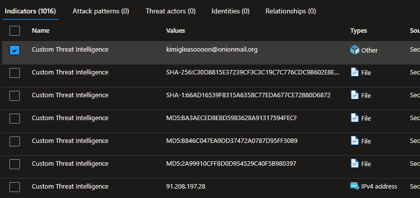

# OpenCTI Microsoft Defender Intel Connector

| Status | Date | Comment |
|--------|------|---------|
| Filigran Verified | -    | -       |

The Microsoft Defender Intel connector streams OpenCTI indicators to Microsoft Defender for Endpoint for threat detection and protection.

## Table of Contents

- [OpenCTI Microsoft Defender Intel Connector](#opencti-microsoft-defender-intel-connector)
  - [Table of Contents](#table-of-contents)
  - [Introduction](#introduction)
  - [Installation](#installation)
    - [Requirements](#requirements)
  - [Configuration variables](#configuration-variables)
    - [OpenCTI environment variables](#opencti-environment-variables)
    - [Base connector environment variables](#base-connector-environment-variables)
    - [Connector extra parameters environment variables](#connector-extra-parameters-environment-variables)
  - [Deployment](#deployment)
    - [Docker Deployment](#docker-deployment)
    - [Manual Deployment](#manual-deployment)
  - [Usage](#usage)
  - [Behavior](#behavior)
  - [Debugging](#debugging)
  - [Additional information](#additional-information)

## Introduction

This connector enables organizations to stream threat indicators from OpenCTI to Microsoft Defender for Endpoint using native Microsoft APIs. Indicators are synced in real-time and can trigger alerts, blocks, or audits based on configurable actions.

Key features:
- Real-time synchronization of indicators to Microsoft Defender
- Support for multiple observable types (IP, domain, URL, file hash, email)
- Automatic score-based action assignment
- Configurable indicator expiration
- Support for create, update, and delete operations

## Installation

### Requirements

- OpenCTI Platform >= 6.4

### Configuration variables

Find all the configuration variables available here: [Connector Configurations](./__metadata__/CONNECTOR_CONFIG_DOC.md)

_The `opencti` and `connector` options in the `docker-compose.yml` and `config.yml` are the same as for any other connector.
For more information regarding these variables, please refer to [OpenCTI's documentation on connectors](https://docs.opencti.io/latest/deployment/connectors/)._

### Known Behavior

- When creating, updating or deleting and IOC, it can take few minutes before seeing it into Microsoft Sentinel TI
- When creating an email address, it will display the `Types` as `Other`

