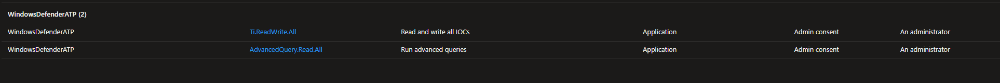
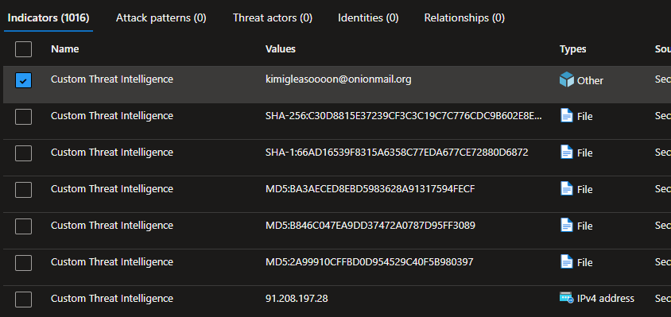

# OpenCTI Microsoft Defender Intel

This connector allows you to stream indicators from OpenCTI to Microsoft Defender Intelligence utilizing native
Microsoft Defender APIs.

## Installation

If you don't know how to get the `tenant_id`, `client_id`, and `client_secret` information, here's a screenshot to
help !

It's also important to define the necessary permissions in Sentinel for the connector to work.

In the Entra portal, you need to set :
Home > Application Registration > OpenCTI (your name) > API Permissions
and prioritize the "Ti.ReadWrite.All" permissions.

You will then be able to view the data (indicators) in :
Home > Microsoft Sentinel > OpenCTI (Your Name) > Threat Indicators

For more information, visit:

- [Microsoft Security-Authorization](https://learn.microsoft.com/en-us/graph/security-authorization)
- [Microsoft Connect-Threat-Intelligence-Tip](https://learn.microsoft.com/en-us/azure/sentinel/connect-threat-intelligence-tip)

Another interesting link:

- [Microsoft Sentinel-Threat-Intelligence](https://learn.microsoft.com/en-us/azure/architecture/example-scenario/data/sentinel-threat-intelligence#import-threat-indicators-with-the-platforms-data-connector)

### Requirements

- OpenCTI Platform >= 6.4

### Configuration variables

Find all the configuration variables available here: [Connector Configurations](./__metadata__/CONNECTOR_CONFIG_DOC.md)

_The `opencti` and `connector` options in the `docker-compose.yml` and `config.yml` are the same as for any other connector.
For more information regarding these variables, please refer to [OpenCTI's documentation on connectors](https://docs.opencti.io/latest/deployment/connectors/)._

### Known Behavior

- When creating, updating or deleting and IOC, it can take few minutes before seeing it into Microsoft Sentinel TI
- When creating an email address, it will display the `Types` as `Other`

