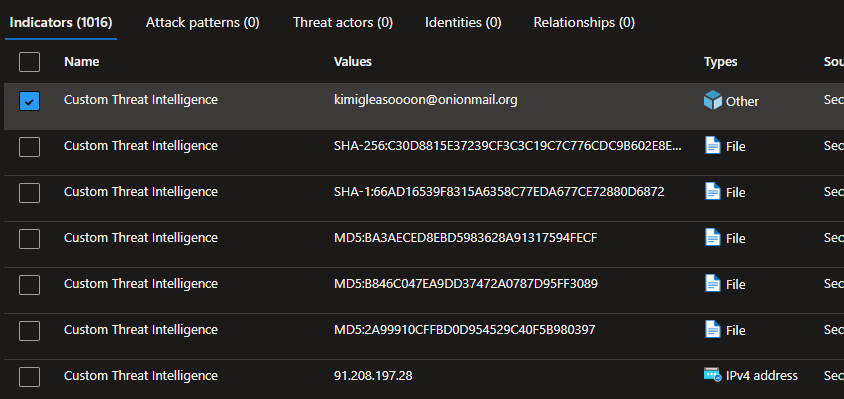

# OpenCTI Microsoft Defender Intel Connector

| Status | Date | Comment |
|--------|------|---------|
| Filigran Verified | -    | -       |

The Microsoft Defender Intel connector streams OpenCTI indicators to Microsoft Defender for Endpoint for threat detection and protection.

## Table of Contents

- [OpenCTI Microsoft Defender Intel Connector](#opencti-microsoft-defender-intel-connector)
  - [Table of Contents](#table-of-contents)
  - [Introduction](#introduction)
  - [Installation](#installation)
    - [Requirements](#requirements)
  - [Configuration variables](#configuration-variables)
    - [OpenCTI environment variables](#opencti-environment-variables)
    - [Base connector environment variables](#base-connector-environment-variables)
    - [Connector extra parameters environment variables](#connector-extra-parameters-environment-variables)
  - [Deployment](#deployment)
    - [Docker Deployment](#docker-deployment)
    - [Manual Deployment](#manual-deployment)
  - [Usage](#usage)
  - [Behavior](#behavior)
    - [Dissemination assurance (deployment write-back)](#dissemination-assurance-deployment-write-back)
  - [Debugging](#debugging)
  - [Additional information](#additional-information)

## Introduction

This connector enables organizations to stream threat indicators from OpenCTI to Microsoft Defender for Endpoint using native Microsoft APIs. Indicators are synced in real-time and can trigger alerts, blocks, or audits based on configurable actions.

Key features:
- Real-time synchronization of indicators to Microsoft Defender
- Support for multiple observable types (IP, domain, URL, file hash, email)
- Automatic score-based action assignment
- Configurable indicator expiration
- Support for create, update, and delete operations
- Dissemination assurance: deployment status, periodic reconciliation and alert hits reported back to OpenCTI

## Installation

### Requirements

- OpenCTI Platform >= 6.4

### Configuration variables

Find all the configuration variables available here: [Connector Configurations](./__metadata__/CONNECTOR_CONFIG_DOC.md)

_The `opencti` and `connector` options in the `docker-compose.yml` and `config.yml` are the same as for any other connector.
For more information regarding these variables, please refer to [OpenCTI's documentation on connectors](https://docs.opencti.io/latest/deployment/connectors/)._

### Known Behavior

- When creating, updating or deleting and IOC, it can take few minutes before seeing it into Microsoft Sentinel TI
- When creating an email address, it will display the `Types` as `Other`

## Behavior

### Dissemination assurance (deployment write-back)

The connector reports to OpenCTI whether each indicator is actually live in Microsoft Defender for Endpoint. The status
is stored on the `deployed-on` relationship between the indicator and the `Microsoft Defender for Endpoint` Security
Platform entity (created if it does not exist), and detection hits are counted with a sighting of the indicator on that
entity. Observables streamed directly (not as indicators) are pushed as before and not reported.

| When                                      | Reported to OpenCTI                                                                                  |
|-------------------------------------------|------------------------------------------------------------------------------------------------------|
| Indicator created or updated in Defender  | `deployed`, with the Defender indicator id as external id                                            |
| Indicator rejected by Defender            | `failed`, with the API error and the Defender response                                               |
| Update of an indicator absent from Defender | Nothing: the indicator was never pushed                                                            |
| Delete event processed                    | `removed` (also when the indicator was already absent from Defender)                                 |
| Reconciliation, indicator present         | `active`                                                                                             |
| Reconciliation, indicator absent          | `removed` (deleted or expired in Defender)                                                           |
| Reconciliation, `pending` (analyst retry) | The indicator is pushed again and reported `deployed` or `failed`                                    |
| Reconciliation, withdrawal or expiry      | Revoked, expired or withdrawn indicators still present are deleted from Defender and reported `removed` |
| Reconciliation, unknown indicator         | Defender indicators of the connector with no deployment yet are reported `active` (backfill)         |
| Hits                                      | Defender alerts whose evidence carries the value of a deployed indicator                             |

- **Reconciliation**: every `DEPLOYMENT_RECONCILIATION_INTERVAL` minutes, the active Defender indicators of the
  connector (`application eq 'OpenCTI Microsoft Defender Intel'`) are read back with the indicators API (10,000 per
  page). Each one carries the OpenCTI id submitted by the connector (`externalId`); deployments are matched by OpenCTI
  id, Defender id, then value. A read-back error skips the run: indicators are never reported `removed` from a partial
  listing.
- **Hits**: during each reconciliation, the alerts created since the previous run are read with their evidence (alerts
  API, `$expand=evidence`, at most 10,000 per run). An alert counts one hit for every deployed indicator whose value is
  one of its evidence file hashes, IP addresses or URLs (domain indicators match the URL host); hits already reported
  are never counted twice.
- **Permissions**: the application needs `Ti.ReadWrite.All` (already required) and `Alert.Read.All` (WindowsDefenderATP
  API) to report hits; without the latter, set `HITS_REPORTING_ENABLED=false`.
- **Graceful degradation**: on OpenCTI platforms without the deployment write-back API the feature is a no-op (logged
  once). Write-back errors are logged as warnings and never block the dissemination.

| Environment variable                 | Default                           | Description                                                           |
|--------------------------------------|-----------------------------------|-----------------------------------------------------------------------|
| `DEPLOYMENT_REPORTING_ENABLED`       | `true`                            | Report the deployment status of the pushed indicators.                |
| `DEPLOYMENT_RECONCILIATION_INTERVAL` | `60`                              | Minutes between two reconciliations, `0` disables the reconciliation. |
| `HITS_REPORTING_ENABLED`             | `true`                            | Report the alert hits of the deployed indicators.                     |
| `SECURITY_PLATFORM_NAME`             | `Microsoft Defender for Endpoint` | Name of the Security Platform entity in OpenCTI.                      |
| `SECURITY_PLATFORM_TYPE`             | `EDR`                             | Type of the Security Platform entity (`security_platform_type_ov`).    |
| `SECURITY_PLATFORM_ID`               |                                   | Id of an existing Security Platform entity, used instead of the name. |
