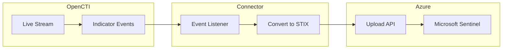

# OpenCTI Microsoft Sentinel Intel Connector

| Status | Date | Comment |
|--------|------|---------|
| Filigran Verified | -    | -       |

The Microsoft Sentinel Intel connector streams OpenCTI indicators to Microsoft Sentinel using the Upload Indicators API for threat intelligence integration.

## Table of Contents

- [OpenCTI Microsoft Sentinel Intel Connector](#opencti-microsoft-sentinel-intel-connector)
  - [Table of Contents](#table-of-contents)
  - [Introduction](#introduction)
  - [Installation](#installation)
    - [Requirements](#requirements)
  - [Configuration variables](#configuration-variables)
    - [OpenCTI environment variables](#opencti-environment-variables)
    - [Base connector environment variables](#base-connector-environment-variables)
    - [Connector extra parameters environment variables](#connector-extra-parameters-environment-variables)
  - [Deployment](#deployment)
    - [Docker Deployment](#docker-deployment)
    - [Manual Deployment](#manual-deployment)
  - [Usage](#usage)
  - [Behavior](#behavior)
  - [Debugging](#debugging)
  - [Additional information](#additional-information)

## Introduction

This connector enables organizations to create, update, and delete threat indicators from OpenCTI to Microsoft Sentinel. It uses the modern Upload Indicators API for reliable integration.

Key features:
- Real-time synchronization of indicators to Microsoft Sentinel
- Support for create, update, and delete operations
- Managed identity or app registration authentication
- Configurable source system and extra labels
- STIX bundle format for comprehensive threat intelligence

## Installation

### Requirements

- OpenCTI Platform >= 6.9.23
- Azure subscription with Microsoft Sentinel
- Azure AD Application or Managed Identity with appropriate permissions

### Azure AD Application Setup

1. Register an application in Azure AD (Entra portal)
2. Note the `tenant_id`, `client_id`, and `client_secret`
3. Configure API permissions: **ThreatIndicators.ReadWrite.OwnedBy**
4. In the Log Analytics Workspace, add **Microsoft Sentinel Contributor** role to the application


View indicators in: **Microsoft Sentinel > Threat Intelligence > Indicators**

For more information:
- [Microsoft Connect Threat Intelligence](https://learn.microsoft.com/en-us/azure/sentinel/connect-threat-intelligence-upload-api)
- [Microsoft Security Authorization](https://learn.microsoft.com/en-us/graph/security-authorization)

## Configuration variables

There are a number of configuration options, which are set either in `docker-compose.yml` (for Docker) or in `config.yml` (for manual deployment).

### OpenCTI environment variables

| Parameter     | config.yml | Docker environment variable | Mandatory | Description                                          |
|---------------|------------|-----------------------------|-----------|------------------------------------------------------|
| OpenCTI URL   | url        | `OPENCTI_URL`               | Yes       | The URL of the OpenCTI platform.                     |
| OpenCTI Token | token      | `OPENCTI_TOKEN`             | Yes       | The default admin token set in the OpenCTI platform. |

### Base connector environment variables

| Parameter                      | config.yml                | Docker environment variable             | Default                          | Mandatory | Description                                                                    |
|--------------------------------|---------------------------|-----------------------------------------|----------------------------------|-----------|--------------------------------------------------------------------------------|
| Connector ID                   | id                        | `CONNECTOR_ID`                          |                                  | Yes       | A unique `UUIDv4` identifier for this connector instance.                      |
| Connector Name                 | name                      | `CONNECTOR_NAME`                        | Microsoft Sentinel Intel Master  | No        | Name of the connector.                                                         |
| Connector Scope                | scope                     | `CONNECTOR_SCOPE`                       | sentinel                         | No        | The scope of the connector.                                                    |
| Live Stream ID                 | live_stream_id            | `CONNECTOR_LIVE_STREAM_ID`              |                                  | Yes       | The Live Stream ID of the stream created in the OpenCTI interface.             |
| Live Stream Listen Delete      | live_stream_listen_delete | `CONNECTOR_LIVE_STREAM_LISTEN_DELETE`   | true                             | No        | Listen to delete events.                                                       |
| Live Stream No Dependencies    | live_stream_no_dependencies| `CONNECTOR_LIVE_STREAM_NO_DEPENDENCIES`| true                             | No        | Set to `true` unless synchronizing between OpenCTI platforms.                  |
| Log Level                      | log_level                 | `CONNECTOR_LOG_LEVEL`                   | error                            | No        | Determines the verbosity of the logs.                                          |

### Connector extra parameters environment variables

| Parameter              | config.yml                                        | Docker environment variable                         | Default                    | Mandatory | Description                                                |
|------------------------|---------------------------------------------------|-----------------------------------------------------|----------------------------|-----------|------------------------------------------------------------|
| Tenant ID              | microsoft_sentinel_intel.tenant_id                | `MICROSOFT_SENTINEL_INTEL_TENANT_ID`                |                            | Yes       | Azure AD Tenant ID.                                        |
| Client ID              | microsoft_sentinel_intel.client_id                | `MICROSOFT_SENTINEL_INTEL_CLIENT_ID`                |                            | Yes       | Azure AD Application Client ID.                            |
| Client Secret          | microsoft_sentinel_intel.client_secret            | `MICROSOFT_SENTINEL_INTEL_CLIENT_SECRET`            |                            | Yes       | Azure AD Application Client Secret.                        |
| Workspace ID           | microsoft_sentinel_intel.workspace_id             | `MICROSOFT_SENTINEL_INTEL_WORKSPACE_ID`             |                            | Yes       | Azure Log Analytics Workspace ID.                          |
| Workspace Name         | microsoft_sentinel_intel.workspace_name           | `MICROSOFT_SENTINEL_INTEL_WORKSPACE_NAME`           |                            | Yes       | Log Analytics Workspace name (for deletion).               |
| Subscription ID        | microsoft_sentinel_intel.subscription_id          | `MICROSOFT_SENTINEL_INTEL_SUBSCRIPTION_ID`          |                            | Yes       | Azure Subscription ID (for deletion).                      |
| Resource Group         | microsoft_sentinel_intel.resource_group           | `MICROSOFT_SENTINEL_INTEL_RESOURCE_GROUP`           | default                    | No        | Resource group name for Log Analytics.                     |
| Source System          | microsoft_sentinel_intel.source_system            | `MICROSOFT_SENTINEL_INTEL_SOURCE_SYSTEM`            | Opencti Stream Connector   | No        | Source system name displayed in Sentinel.                  |
| Delete Extensions      | microsoft_sentinel_intel.delete_extensions        | `MICROSOFT_SENTINEL_INTEL_DELETE_EXTENSIONS`        | true                       | No        | Delete extensions from STIX bundles.                       |
| Extra Labels           | microsoft_sentinel_intel.extra_labels             | `MICROSOFT_SENTINEL_INTEL_EXTRA_LABELS`             | []                         | No        | Extra labels added to bundles (comma-separated).           |
| Workspace API Version  | microsoft_sentinel_intel.workspace_api_version    | `MICROSOFT_SENTINEL_INTEL_WORKSPACE_API_VERSION`    | 2024-02-01-preview         | No        | Log Analytics Workspace API version.                       |
| Management API Version | microsoft_sentinel_intel.management_api_version   | `MICROSOFT_SENTINEL_INTEL_MANAGEMENT_API_VERSION`   | 2025-03-01                 | No        | Microsoft Management API version.                          |

## Deployment

### Docker Deployment

Build the Docker image:

```bash
docker build -t opencti/connector-microsoft-sentinel-intel:latest .
```

Configure the connector in `docker-compose.yml`:

```yaml
  connector-microsoft-sentinel-intel:
    image: opencti/connector-microsoft-sentinel-intel:latest
    environment:
      - OPENCTI_URL=http://localhost
      - OPENCTI_TOKEN=ChangeMe
      - CONNECTOR_ID=ChangeMe
      - CONNECTOR_NAME=Microsoft Sentinel Intel
      - CONNECTOR_SCOPE=sentinel
      - CONNECTOR_LOG_LEVEL=info
      - CONNECTOR_LIVE_STREAM_ID=ChangeMe
      - CONNECTOR_LIVE_STREAM_LISTEN_DELETE=true
      - CONNECTOR_LIVE_STREAM_NO_DEPENDENCIES=true
      - MICROSOFT_SENTINEL_INTEL_TENANT_ID=ChangeMe
      - MICROSOFT_SENTINEL_INTEL_CLIENT_ID=ChangeMe
      - MICROSOFT_SENTINEL_INTEL_CLIENT_SECRET=ChangeMe
      - MICROSOFT_SENTINEL_INTEL_WORKSPACE_ID=ChangeMe
      - MICROSOFT_SENTINEL_INTEL_WORKSPACE_NAME=ChangeMe
      - MICROSOFT_SENTINEL_INTEL_SUBSCRIPTION_ID=ChangeMe
    restart: always
```

Start the connector:

```bash
docker compose up -d
```

### Manual Deployment

1. Create `config.yml` based on `config.yml.sample`.

2. Install dependencies:

```bash
pip3 install -r requirements.txt
```

3. Start the connector from the `src` directory:

```bash
python3 main.py
```

## Usage

1. Set up Azure AD Application with required permissions
2. Assign Microsoft Sentinel Contributor role in Log Analytics Workspace
3. Create a Live Stream in OpenCTI (Data Management -> Data Sharing -> Live Streams)
4. Configure the stream to include indicators
5. Start the connector

## Behavior

The connector listens to OpenCTI live stream events and manages indicators in Microsoft Sentinel.

### Data Flow



### Event Processing

| Event Type | Action                                       |
|------------|----------------------------------------------|
| create     | Creates indicator in Microsoft Sentinel      |
| update     | Updates indicator in Microsoft Sentinel      |
| delete     | Removes indicator via Management API         |

### Deletion Requirements

For deletion to work properly, the following must be configured:
- `source_system`
- `workspace_name`
- `subscription_id`

## Debugging

Enable verbose logging by setting:

```env
CONNECTOR_LOG_LEVEL=debug
```

### Common Issues

| Issue                          | Solution                                              |
|--------------------------------|-------------------------------------------------------|
| Permission denied              | Ensure Microsoft Sentinel Contributor role is assigned |
| Role not propagated            | Wait for role assignment to propagate                 |
| Indicator not appearing        | Wait a few minutes; sync is not instant               |
| Deletion not working           | Verify source_system, workspace_name, subscription_id |

## Additional information

- **Role Propagation**: Role assignments on Log Analytics Workspace can take time to propagate
- **Authentication**: Managed identity is recommended over app registration
- **STIX Bundles**: Indicators are sent as STIX bundles to preserve threat intelligence context
- **Extra Labels**: Add comma-separated labels to all indicators sent to Sentinel
- **Delete Extensions**: Set to `true` to remove OpenCTI-specific extensions from bundles
