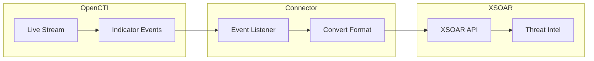

# OpenCTI PAN Cortex XSOAR Intel Connector

| Status | Date | Comment |
|--------|------|---------|
| Filigran Verified | -    | -       |

The PAN Cortex XSOAR Intel connector streams OpenCTI indicators to Palo Alto Networks Cortex XSOAR for threat intelligence and security orchestration.

## Table of Contents

- [OpenCTI PAN Cortex XSOAR Intel Connector](#opencti-pan-cortex-xsoar-intel-connector)
  - [Table of Contents](#table-of-contents)
  - [Introduction](#introduction)
  - [Installation](#installation)
    - [Requirements](#requirements)
  - [Configuration variables](#configuration-variables)
    - [OpenCTI environment variables](#opencti-environment-variables)
    - [Base connector environment variables](#base-connector-environment-variables)
    - [Connector extra parameters environment variables](#connector-extra-parameters-environment-variables)
  - [Deployment](#deployment)
    - [Docker Deployment](#docker-deployment)
    - [Manual Deployment](#manual-deployment)
  - [Usage](#usage)
  - [Behavior](#behavior)
  - [Debugging](#debugging)
  - [Additional information](#additional-information)

## Introduction

This connector enables organizations to push threat indicators from OpenCTI to PAN Cortex XSOAR (formerly Demisto). It synchronizes indicators in real-time for use in security orchestration, automation, and response workflows.

Key features:
- Real-time streaming of indicators to Cortex XSOAR
- Multi-threaded consumer architecture
- Optional Prometheus metrics for monitoring
- Support for create, update, and delete operations

## Installation

### Requirements

- OpenCTI Platform >= 6.0.0
- PAN Cortex XSOAR instance with API access
- XSOAR API key with appropriate permissions

## Configuration variables

There are a number of configuration options, which are set either in `docker-compose.yml` (for Docker) or in `config.yml` (for manual deployment).

### OpenCTI environment variables

| Parameter     | config.yml | Docker environment variable | Mandatory | Description                                          |
|---------------|------------|-----------------------------|-----------|------------------------------------------------------|
| OpenCTI URL   | url        | `OPENCTI_URL`               | Yes       | The URL of the OpenCTI platform.                     |
| OpenCTI Token | token      | `OPENCTI_TOKEN`             | Yes       | The default admin token set in the OpenCTI platform. |

### Base connector environment variables

| Parameter                      | config.yml                | Docker environment variable             | Default              | Mandatory | Description                                                                    |
|--------------------------------|---------------------------|-----------------------------------------|----------------------|-----------|--------------------------------------------------------------------------------|
| Connector ID                   | id                        | `CONNECTOR_ID`                          |                      | Yes       | A unique `UUIDv4` identifier for this connector instance.                      |
| Connector Name                 | name                      | `CONNECTOR_NAME`                        | PAN Cortex XSOAR Intel | No      | Name of the connector.                                                         |
| Connector Scope                | scope                     | `CONNECTOR_SCOPE`                       | xsoar                | Yes       | The scope of the connector.                                                    |
| Live Stream ID                 | live_stream_id            | `CONNECTOR_LIVE_STREAM_ID`              |                      | Yes       | The Live Stream ID of the stream created in the OpenCTI interface.             |
| Live Stream Listen Delete      | live_stream_listen_delete | `CONNECTOR_LIVE_STREAM_LISTEN_DELETE`   | true                 | No        | Listen to delete events.                                                       |
| Live Stream No Dependencies    | live_stream_no_dependencies| `CONNECTOR_LIVE_STREAM_NO_DEPENDENCIES`| true                 | No        | Set to `true` unless synchronizing between OpenCTI platforms.                  |
| Live Stream Start Timestamp    | live_stream_start_timestamp| `CONNECTOR_LIVE_STREAM_START_TIMESTAMP`|                      | No        | Start timestamp used on connector first start.                                 |
| Consumer Count                 | consumer_count            | `CONNECTOR_CONSUMER_COUNT`              | 5                    | No        | Number of consumer/worker threads.                                             |
| Confidence Level               | confidence_level          | `CONNECTOR_CONFIDENCE_LEVEL`            |                      | Yes       | Default confidence level (1-4).                                                |
| Log Level                      | log_level                 | `CONNECTOR_LOG_LEVEL`                   | info                 | No        | Determines the verbosity of the logs.                                          |

### Connector extra parameters environment variables

| Parameter        | config.yml     | Docker environment variable | Default | Mandatory | Description                                                |
|------------------|----------------|-----------------------------|---------|-----------|------------------------------------------------------------|
| XSOAR URL        | xsoar.url      | `XSOAR_URL`                 |         | Yes       | XSOAR API URL (often prefixed with "api-" in PAN cloud).   |
| XSOAR Key ID     | xsoar.key_id   | `XSOAR_KEY_ID`              |         | Yes       | XSOAR API key ID.                                          |
| XSOAR Key        | xsoar.key      | `XSOAR_KEY`                 |         | Yes       | XSOAR API key.                                             |
| Metrics Enable   | metrics.enable | `METRICS_ENABLE`            | false   | No        | Whether to enable Prometheus metrics.                      |
| Metrics Address  | metrics.addr   | `METRICS_ADDR`              | 0.0.0.0 | No        | Bind IP address for metrics endpoint.                      |
| Metrics Port     | metrics.port   | `METRICS_PORT`              | 9113    | No        | Port for metrics endpoint.                                 |

## Deployment

### Docker Deployment

Build the Docker image:

```bash
docker build -t opencti/connector-pan-cortex-xsoar-intel:latest .
```

Configure the connector in `docker-compose.yml`:

```yaml
  connector-pan-cortex-xsoar-intel:
    image: opencti/connector-pan-cortex-xsoar-intel:latest
    environment:
      - OPENCTI_URL=http://localhost
      - OPENCTI_TOKEN=ChangeMe
      - CONNECTOR_ID=ChangeMe
      - CONNECTOR_NAME=PAN Cortex XSOAR Intel
      - CONNECTOR_SCOPE=xsoar
      - CONNECTOR_LOG_LEVEL=info
      - CONNECTOR_LIVE_STREAM_ID=ChangeMe
      - CONNECTOR_CONFIDENCE_LEVEL=80
      - XSOAR_URL=https://api-xsoar.example.com
      - XSOAR_KEY_ID=ChangeMe
      - XSOAR_KEY=ChangeMe
    restart: always
```

Start the connector:

```bash
docker compose up -d
```

### Manual Deployment

1. Create `config.yml` based on `config.yml.sample`.

2. Install dependencies:

```bash
pip3 install -r requirements.txt
```

3. Start the connector from the `src` directory:

```bash
python3 main.py
```

## Usage

1. Create API credentials in Cortex XSOAR
2. Create a Live Stream in OpenCTI (Data Management -> Data Sharing -> Live Streams)
3. Configure the stream to include indicators
4. Copy the Live Stream ID to the connector configuration
5. Start the connector

## Behavior

The connector listens to OpenCTI live stream events and pushes indicators to Cortex XSOAR.

### Data Flow



### Event Processing

| Event Type | Action                                       |
|------------|----------------------------------------------|
| create     | Creates indicator in Cortex XSOAR            |
| update     | Updates indicator in Cortex XSOAR            |
| delete     | Removes indicator from Cortex XSOAR          |

## Debugging

Enable verbose logging by setting:

```env
CONNECTOR_LOG_LEVEL=debug
```

### Prometheus Metrics

When enabled (`METRICS_ENABLE=true`), metrics are exposed on the configured port.

### Common Issues

| Issue                          | Solution                                              |
|--------------------------------|-------------------------------------------------------|
| Authentication errors          | Verify XSOAR key ID and key are correct               |
| API URL issues                 | Ensure URL is correct (check for "api-" prefix)       |
| Connection refused             | Verify network connectivity to XSOAR instance         |

## Additional information

- **API Prefix**: PAN cloud instances often use "api-" prefix in the URL
- **Multi-threading**: Adjust `CONNECTOR_CONSUMER_COUNT` based on throughput requirements
- **Metrics**: Enable Prometheus metrics for monitoring connector health
