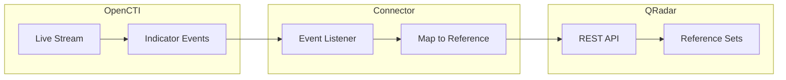

# OpenCTI QRadar Connector

| Status | Date | Comment |
|--------|------|---------|
| Filigran Verified | -    | -       |

The QRadar connector streams OpenCTI threat intelligence to IBM QRadar reference sets for SIEM correlation and threat detection.

## Table of Contents

- [OpenCTI QRadar Connector](#opencti-qradar-connector)
  - [Table of Contents](#table-of-contents)
  - [Introduction](#introduction)
  - [Installation](#installation)
    - [Requirements](#requirements)
  - [Configuration variables](#configuration-variables)
    - [OpenCTI environment variables](#opencti-environment-variables)
    - [Base connector environment variables](#base-connector-environment-variables)
    - [Connector extra parameters environment variables](#connector-extra-parameters-environment-variables)
  - [Deployment](#deployment)
    - [Docker Deployment](#docker-deployment)
    - [Manual Deployment](#manual-deployment)
  - [Usage](#usage)
  - [Behavior](#behavior)
  - [Debugging](#debugging)
  - [Additional information](#additional-information)

## Introduction

This connector enables organizations to feed QRadar reference sets with OpenCTI threat intelligence. Reference sets can be used in QRadar rules and searches for threat detection and correlation.

Key features:
- Real-time streaming of indicators to QRadar reference sets
- Automatic reference set creation per observable type
- Multi-threaded consumer architecture
- Entity type filtering
- Support for create, update, and delete operations

## Installation

### Requirements

- OpenCTI Platform >= 5.0.0
- IBM QRadar >= 7.5.0
- QRadar API token with reference set management permissions

## Configuration variables

There are a number of configuration options, which are set either in `docker-compose.yml` (for Docker) or in `config.yml` (for manual deployment).

### OpenCTI environment variables

| Parameter     | config.yml | Docker environment variable | Mandatory | Description                                          |
|---------------|------------|-----------------------------|-----------|------------------------------------------------------|
| OpenCTI URL   | url        | `OPENCTI_URL`               | Yes       | The URL of the OpenCTI platform.                     |
| OpenCTI Token | token      | `OPENCTI_TOKEN`             | Yes       | The default admin token set in the OpenCTI platform. |

### Base connector environment variables

| Parameter                      | config.yml                | Docker environment variable             | Default | Mandatory | Description                                                                    |
|--------------------------------|---------------------------|-----------------------------------------|---------|-----------|--------------------------------------------------------------------------------|
| Connector ID                   | id                        | `CONNECTOR_ID`                          |         | Yes       | A unique `UUIDv4` identifier for this connector instance.                      |
| Connector Name                 | name                      | `CONNECTOR_NAME`                        | QRadar  | No        | Name of the connector.                                                         |
| Connector Scope                | scope                     | `CONNECTOR_SCOPE`                       | qradar  | Yes       | The scope of the connector.                                                    |
| Live Stream ID                 | live_stream_id            | `CONNECTOR_LIVE_STREAM_ID`              |         | Yes       | The Live Stream ID of the stream created in the OpenCTI interface.             |
| Live Stream Listen Delete      | live_stream_listen_delete | `CONNECTOR_LIVE_STREAM_LISTEN_DELETE`   | true    | No        | Listen to delete events.                                                       |
| Live Stream No Dependencies    | live_stream_no_dependencies| `CONNECTOR_LIVE_STREAM_NO_DEPENDENCIES`| true    | No        | Set to `true` unless synchronizing between OpenCTI platforms.                  |
| Live Stream Start Timestamp    | live_stream_start_timestamp| `CONNECTOR_LIVE_STREAM_START_TIMESTAMP`|         | No        | Start timestamp used on connector first start.                                 |
| Consumer Count                 | consumer_count            | `CONNECTOR_CONSUMER_COUNT`              | 10      | No        | Number of consumer/worker threads.                                             |
| Confidence Level               | confidence_level          | `CONNECTOR_CONFIDENCE_LEVEL`            |         | Yes       | Default confidence level (1-4).                                                |
| Log Level                      | log_level                 | `CONNECTOR_LOG_LEVEL`                   | error   | No        | Determines the verbosity of the logs.                                          |

### Connector extra parameters environment variables

| Parameter            | config.yml             | Docker environment variable | Default                            | Mandatory | Description                                                |
|----------------------|------------------------|-----------------------------|------------------------------------|-----------|-----------------------------------------------------------|
| QRadar URL           | qradar.url             | `QRADAR_URL`                |                                    | Yes       | QRadar REST API URL.                                       |
| QRadar SSL Verify    | qradar.ssl_verify      | `QRADAR_SSL_VERIFY`         | true                               | No        | Verify SSL certificates.                                   |
| QRadar Token         | qradar.token           | `QRADAR_TOKEN`              |                                    | Yes       | QRadar API token.                                          |
| QRadar Reference Name| qradar.reference_name  | `QRADAR_REFERENCE_NAME`     |                                    | Yes       | Base name for reference sets (e.g., `OpenCTI`).            |
| QRadar Ignore Types  | qradar.ignore_types    | `QRADAR_IGNORE_TYPES`       | label,marking-definition,identity  | No        | Comma-separated list of entity types to ignore.            |

## Deployment

### Docker Deployment

Build the Docker image:

```bash
docker build -t opencti/connector-qradar:latest .
```

Configure the connector in `docker-compose.yml`:

```yaml
  connector-qradar:
    image: opencti/connector-qradar:latest
    environment:
      - OPENCTI_URL=http://localhost
      - OPENCTI_TOKEN=ChangeMe
      - CONNECTOR_ID=ChangeMe
      - CONNECTOR_NAME=QRadar
      - CONNECTOR_SCOPE=qradar
      - CONNECTOR_LOG_LEVEL=info
      - CONNECTOR_LIVE_STREAM_ID=ChangeMe
      - CONNECTOR_CONFIDENCE_LEVEL=80
      - QRADAR_URL=https://qradar.example.com
      - QRADAR_SSL_VERIFY=true
      - QRADAR_TOKEN=ChangeMe
      - QRADAR_REFERENCE_NAME=OpenCTI
    restart: always
```

Start the connector:

```bash
docker compose up -d
```

### Manual Deployment

1. Create `config.yml` based on `config.yml.sample`.

2. Install dependencies:

```bash
pip3 install -r requirements.txt
```

3. Start the connector from the `src` directory:

```bash
python3 qradar.py
```

## Usage

1. Create an API token in QRadar with reference set permissions
2. Create a Live Stream in OpenCTI (Data Management -> Data Sharing -> Live Streams)
3. Configure the stream to include indicators
4. Copy the Live Stream ID to the connector configuration
5. Start the connector

## Behavior

The connector listens to OpenCTI live stream events and manages QRadar reference sets.

### Data Flow



### Event Processing

| Event Type | Action                                                |
|------------|-------------------------------------------------------|
| create     | Creates entry in QRadar reference set                 |
| update     | Updates entry in QRadar reference set                 |
| delete     | Removes entry from QRadar reference set               |

### Reference Set Naming

Reference sets are created per observable type using the format: `{base_name}_{type}`

| Base Name | Observable Type | Reference Set Name  |
|-----------|-----------------|---------------------|
| OpenCTI   | IPv4-Addr       | OpenCTI_IPv4-Addr   |
| OpenCTI   | Domain-Name     | OpenCTI_Domain-Name |
| OpenCTI   | URL             | OpenCTI_URL         |

## Debugging

Enable verbose logging by setting:

```env
CONNECTOR_LOG_LEVEL=debug
```

### Common Issues

| Issue                          | Solution                                              |
|--------------------------------|-------------------------------------------------------|
| Authentication errors          | Verify QRadar API token is correct                    |
| Reference set not created      | Check API permissions for reference set management    |
| SSL certificate errors         | Set `QRADAR_SSL_VERIFY=false` for testing             |
| Connection refused             | Verify network connectivity to QRadar instance        |

## Additional information

- **Reference Set Per Type**: Separate reference sets are created for each observable type
- **Multi-threading**: Adjust `CONNECTOR_CONSUMER_COUNT` based on throughput requirements
- **Ignore Types**: Common types to ignore: `label`, `marking-definition`, `identity`
- **QRadar Rules**: Reference sets can be used in QRadar rules for threat detection
