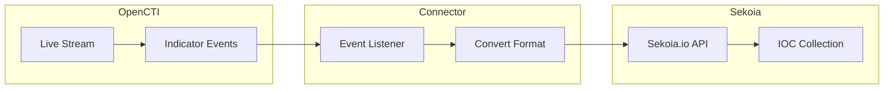

# OpenCTI Sekoia.io Intel Connector

| Status | Date | Comment |
|--------|------|---------|
| Filigran Verified | -    | -       |

The Sekoia.io Intel connector streams OpenCTI indicators to Sekoia.io IOC collections for threat detection and intelligence sharing.

## Table of Contents

- [OpenCTI Sekoia.io Intel Connector](#opencti-sekoiaio-intel-connector)
  - [Table of Contents](#table-of-contents)
  - [Introduction](#introduction)
  - [Installation](#installation)
    - [Requirements](#requirements)
  - [Configuration variables](#configuration-variables)
    - [OpenCTI environment variables](#opencti-environment-variables)
    - [Base connector environment variables](#base-connector-environment-variables)
    - [Connector extra parameters environment variables](#connector-extra-parameters-environment-variables)
  - [Deployment](#deployment)
    - [Docker Deployment](#docker-deployment)
    - [Manual Deployment](#manual-deployment)
  - [Usage](#usage)
  - [Behavior](#behavior)
  - [Debugging](#debugging)
  - [Additional information](#additional-information)

## Introduction

This connector enables organizations to feed Sekoia.io IOC collections with OpenCTI threat intelligence. It synchronizes indicators in real-time for threat detection and intelligence sharing.

Key features:
- Real-time streaming of indicators to Sekoia.io IOC collections
- STIX pattern support
- Delete events handled via revocation
- One connector per IOC collection architecture

## Installation

### Requirements

- Python 3.11.x (not compatible with 3.12 and above)
- OpenCTI Platform >= 6.8.x
- pycti >= 6.8.x
- stix-shifter >= 7.1.x
- Sekoia.io account with API access

## Configuration variables

There are a number of configuration options, which are set either in `docker-compose.yml` (for Docker) or in `config.yml` (for manual deployment).

### OpenCTI environment variables

| Parameter     | config.yml | Docker environment variable | Mandatory | Description                                          |
|---------------|------------|-----------------------------|-----------|------------------------------------------------------|
| OpenCTI URL   | url        | `OPENCTI_URL`               | Yes       | The URL of the OpenCTI platform.                     |
| OpenCTI Token | token      | `OPENCTI_TOKEN`             | Yes       | The default admin token set in the OpenCTI platform. |

### Base connector environment variables

| Parameter                      | config.yml                | Docker environment variable             | Default | Mandatory | Description                                                                    |
|--------------------------------|---------------------------|-----------------------------------------|---------|-----------|--------------------------------------------------------------------------------|
| Connector ID                   | id                        | `CONNECTOR_ID`                          |         | Yes       | A unique `UUIDv4` identifier for this connector instance.                      |
| Connector Type                 | type                      | `CONNECTOR_TYPE`                        | STREAM  | Yes       | Should always be set to `STREAM` for this connector.                           |
| Connector Name                 | name                      | `CONNECTOR_NAME`                        |         | Yes       | Name of the connector.                                                         |
| Connector Scope                | scope                     | `CONNECTOR_SCOPE`                       |         | Yes       | The scope of the connector.                                                    |
| Live Stream ID                 | live_stream_id            | `CONNECTOR_LIVE_STREAM_ID`              |         | Yes       | The Live Stream ID of the stream created in the OpenCTI interface.             |
| Live Stream Listen Delete      | live_stream_listen_delete | `CONNECTOR_LIVE_STREAM_LISTEN_DELETE`   | true    | Yes       | Listen to delete events.                                                       |
| Live Stream No Dependencies    | live_stream_no_dependencies| `CONNECTOR_LIVE_STREAM_NO_DEPENDENCIES`| true    | Yes       | Set to `true` unless synchronizing between OpenCTI platforms.                  |
| Log Level                      | log_level                 | `CONNECTOR_LOG_LEVEL`                   | info    | No        | Determines the verbosity of the logs.                                          |

### Connector extra parameters environment variables

| Parameter            | config.yml                   | Docker environment variable        | Default | Mandatory | Description                                                |
|----------------------|------------------------------|------------------------------------|---------|-----------|------------------------------------------------------------|
| Sekoia URL           | sekoia_intel.url             | `SEKOIA_INTEL_URL`                 |         | Yes       | Sekoia.io API URL.                                         |
| Sekoia API Key       | sekoia_intel.apikey          | `SEKOIA_INTEL_APIKEY`              |         | Yes       | Sekoia.io API key.                                         |
| IOC Collection UUID  | sekoia_intel.ioc_collection_uuid | `SEKOIA_INTEL_IOC_COLLECTION_UUID` |     | Yes       | UUID of the Sekoia.io IOC collection.                      |

## Deployment

### Docker Deployment

Before building the Docker container, ensure you have set the version of `pycti` in `requirements.txt` to match the version of OpenCTI you are running.

Build the Docker image:

```bash
docker build -t opencti/connector-sekoia-intel:latest .
```

Configure the connector in `docker-compose.yml`:

```yaml
  connector-sekoia-intel:
    image: opencti/connector-sekoia-intel:latest
    environment:
      - OPENCTI_URL=http://localhost
      - OPENCTI_TOKEN=ChangeMe
      - CONNECTOR_ID=ChangeMe
      - CONNECTOR_TYPE=STREAM
      - CONNECTOR_NAME=Sekoia Intel
      - CONNECTOR_SCOPE=sekoia
      - CONNECTOR_LOG_LEVEL=info
      - CONNECTOR_LIVE_STREAM_ID=ChangeMe
      - CONNECTOR_LIVE_STREAM_LISTEN_DELETE=true
      - CONNECTOR_LIVE_STREAM_NO_DEPENDENCIES=true
      - SEKOIA_INTEL_URL=https://api.sekoia.io
      - SEKOIA_INTEL_APIKEY=ChangeMe
      - SEKOIA_INTEL_IOC_COLLECTION_UUID=ChangeMe
    restart: always
```

Start the connector:

```bash
docker compose up -d
```

### Manual Deployment

1. Create `config.yml` based on `config.yml.sample`.

2. Install dependencies:

```bash
pip3 install -r requirements.txt
```

3. Start the connector from the `src` directory:

```bash
python3 main.py
```

## Usage

1. Create an IOC collection in Sekoia.io (the connector does not create collections)
2. Note the IOC collection UUID
3. Create a Live Stream in OpenCTI (Data Management -> Data Sharing -> Live Streams)
4. Configure the stream with filters for your use case
5. Copy the Live Stream ID to the connector configuration
6. Start the connector

To force resynchronization, navigate to **Data Management -> Ingestion -> Connectors**, find the connector, and click refresh.

## Behavior

The connector listens to OpenCTI live stream events and synchronizes indicators to Sekoia.io IOC collections.

### Data Flow



### Event Processing

| Event Type | Action                                               |
|------------|------------------------------------------------------|
| create     | Creates IOC in Sekoia.io collection                  |
| update     | Updates IOC in Sekoia.io collection                  |
| delete     | Revokes IOC in Sekoia.io collection (not deleted)    |

## Debugging

Enable verbose logging by setting:

```env
CONNECTOR_LOG_LEVEL=debug
```

### Common Issues

| Issue                          | Solution                                              |
|--------------------------------|-------------------------------------------------------|
| Collection not found           | Create the collection in Sekoia.io first              |
| Authentication errors          | Verify Sekoia.io API key is correct                   |
| IOC not created                | Check indicator has valid STIX pattern                |

## Additional information

- **Collection Limit**: Maximum 500,000 indicators per collection
- **Architecture**: One connector = one stream = one collection
- **Delete Behavior**: Indicators are revoked, not permanently deleted
- **Collection Creation**: The connector does not create collections; create them in Sekoia.io first
- **Multiple Collections**: Create multiple connector instances for multiple collections
