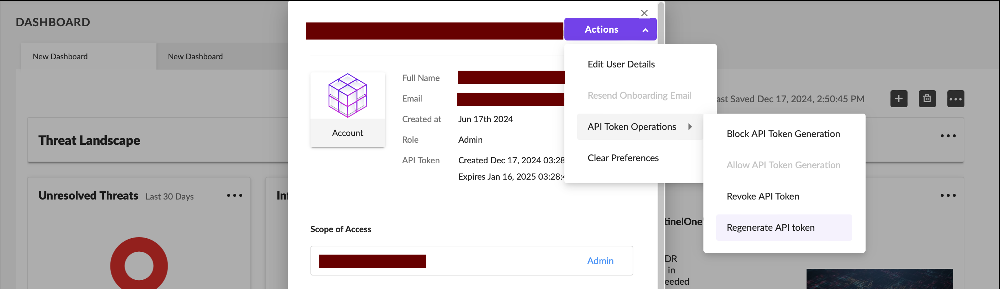
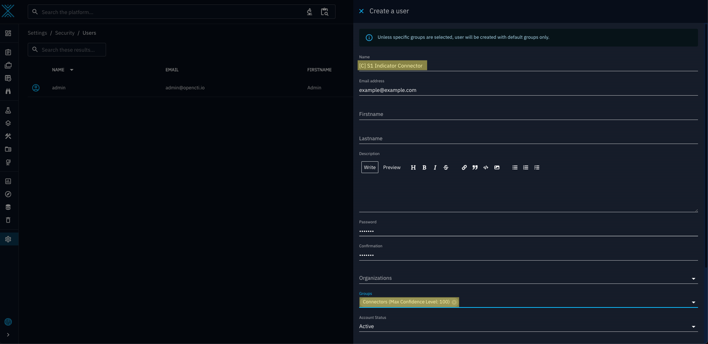
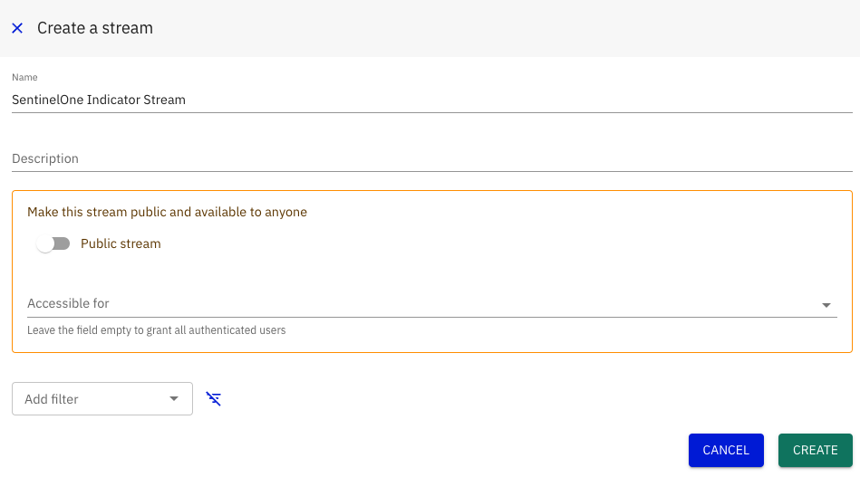

# OpenCTI SentinelOne Intel Stream Connector

This connector works autonomously to allow Indicators created within the attached OpenCTI instance to be synchronised to a SentinelOne account. The connector simply pushes Indicators as they are created within OpenCTI. This covers the majority of use cases, such as Indicators created in consumption of a MISP feed, manual creation, etc.

 

**Note:** 
<strong>This software is provided as a community-driven project and is not officially supported by SentinelOne. It is offered on an "as-is" basis, without warranties or guarantees, either express or implied. Users are encouraged to thoroughly test and validate the software before deploying it in their environments. While community contributions and feedback are welcome, SentinelOne does not provide formal technical support, maintenance, or updates for this project.</strong>

 

## Connector Features and Notes

 

- Optional logging that will provide you with the UUIDs SentinelOne generates for Indicators upon a successful bundle pushing can be enabled by setting the `LOG_S1_RESPONSE` variable in the docker-compose file to `true`. This feature will allow you to confirm the presence of Indicators in your SentinelOne instance.

- Real-time monitoring capabilities with basic statistics are available at the `info` log level, allowing you to see how many Indicators have been pushed in the current session.

- Detailed troubleshooting information is also available at `debug` log level in case of Error.

 

#### This version of the connector:
- only supports STIX patterns.
- only allows for pushing to SentinelOne accounts.

 

#### SentinelOne will only accept Indicators of the following types:
- SHA-256 File Hash
- SHA-1 File Hash
- MD5 File Hash
- IPV4 Address
- URL
- DNS Domain Name
        

 

## Implementation
After appending the container to your compose file, you will need to create a new user in your OpenCTI instance and retrieve some information for your SentinelOne Account in order to interface with it.

If you don't want to use the default stream, you will also need to create your own.

 

### Retrieving Your Account ID

- Click on the settings icon at the bottom of the left panel on the console. 
- From the `Settings` menu, select `ACCOUNTS` and click on the account you seek to use in the below list.
- You will now be in the `Sentinels` menu. From here, select `ACCOUNT INFO` (you may need to scroll to the right on smaller monitors to see it).
- Underneath your account name you will see your account ID in the field `ACCOUNT ID`

 

### Generating an API Key

- Click on your email address in the top right corner of the menu on the SentinelOne Console. 
- Click the `Actions` dropdown button and hover over `API Token Operations`.
- Click `Regenerate API token` and proceed with the required Authentication.
- **Note:** you do not need to include the `'APIToken '`component of the string in any configs

 

### Determining Your SentinelOne URL
Your SentinelOne URL is simply the first component of the URL you use to access the console.

When configuring the connector, do not include the terminating `/`. For example, for the above image, you would input `https://mysentinelone.instance.net`

 

### Creating the Connector User
It is best practice to create a new user under the `Connectors` group and to use its token to interface with your instance.

- Locate the gear (Settings) icon on the left menu and click `Security`.
- On the menu on the right click on the `Users` option. 
- Click the blue `+` icon at the bottom of the list
- Enter `[C] S1 Indicator Connector`. **Note:** you can name this whatever you'd like, but you should include `[C]` at the start regardless.
- Enter the required information and ensure that under the `Groups` field `Connectors` is this selected option. 

 

### Creating a dedicated Stream (optional)

- To create a dedicated stream for this connector head to `Data sharing` -> `Live streams` in the OpenCTI platform.

- Give the stream a name so that it can be identified
- Optional filters can be applied to determine what kind of data goes into the connector. It is recommended to not set any filters as to allow SentinelOne to consume all types it can.
- Copy the streams ID to be you used in your environment variables. 

 

## Configuration

The following are required parameters that are necessary for your connector to function.

### OpenCTI Parameters
##### OpenCTI Instance URL
- The URL of your OpenCTI instance within its internal network.
- Example: `http://opencti:8080`
- Environment Variable: `OPENCTI_URL`
- Config.yml: `url`

##### OpenCTI User Token
- The token of the user specifically created for this Connector, under the `Connectors` group.
- Example: `11111111-2222-3333-4444-555555555555`
- Environment Variable: `OPENCTI_TOKEN`
- Config.yml: `token`

 

### Connector Parameters

##### Connector ID
- Unique UUIDv4 identifier for the connector.
- Example: `11111111-2222-3333-4444-555555555555`
- Environment Variable: `CONNECTOR_ID`
- Config.yml: `id`

##### Connector Name
- The Connector's name as it will appear in OpenCTI.
- Example: `SentinelOne Indicator Export Stream`
- Environment Variable: `CONNECTOR_NAME`
- Config.yml: `name`

##### Connector Scope
- The scope applied to the connector.
- Example: `all`
- Environment Variable: `CONNECTOR_SCOPE`
- Config.yml: `scope`

##### Connector Log Level
- The level of logs/outputs presented. `info` is recommended.
- Example: `info`
- Environment Variable: `CONNECTOR_LOG_LEVEL`
- Config.yml: `log_level`

##### Connector Live Stream ID
- The id of the stream to listen into, the default `live` is okay to use.
- Example: `live`
- Environment Variable: `CONNECTOR_LIVE_STREAM_ID`
- Config.yml: `live_stream_id`

##### Connector Live Stream Listen Delete
- Whether or not the connector will delete REDIS events after processing them.
- Example: `true`
- Environment Variable: `CONNECTOR_LIVE_STREAM_LISTEN_DELETE`
- Config.yml: `live_stream_listen_delete`
 
##### Connector Live Stream No Dependencies
- Determines whether the stream will require dependency on other entities.
- Example: `true`
- Environment Variable: `CONNECTOR_LIVE_STREAM_NO_DEPENDENCIES`
- Config.yml: `live_stream_no_dependencies`

 

### SentinelOne Parameters

##### SentinelOne URL
- The SentinelOne URL used to access the console. **NOTE:** The URL should not end with a `/`.
- Example: `https://usea1-purple.sentinelone.net`
- Environment Variable: `S1_URL`
- Config.yml: `url`

##### SentinelOne API Key
- The API key for your SentinelOne account (JWT). **NOTE:** Should not include `APIToken`.
- Example: `eyJraWQiO...`
- Environment Variable: `S1_API_KEY`
- Config.yml: `api_key`

##### SentinelOne Account ID
- The ID of your SentinelOne Account.
- Example: `1234567890123456789`
- Environment Variable: `S1_ACCOUNT_ID`
- Config.yml: `account_id`

##### Maximum API Attempts
- The maximum number of times the connector will retry push attempts when they fail. `5` is recommended as failures almost only ever occur due to the API rate limits Exponential backoffs are implemented alongside this to handle the rate limits.
- Example: `5`
- Environment Variable: `MAX_API_ATTEMPTS`
- Config.yml: `max_api_attempts`

##### Log SentinelOne Response
- Enabling this will log a list of UUIDs of the IOCs SentinelOne created for each bundle, allowing you to check/confirm their presence in your instance.
- Example: `true`
- Environment Variable: `LOG_S1_RESPONSE`
- Config.yml: `log_s1_response`

 
