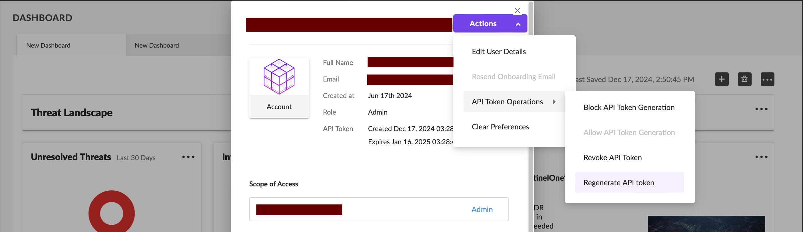
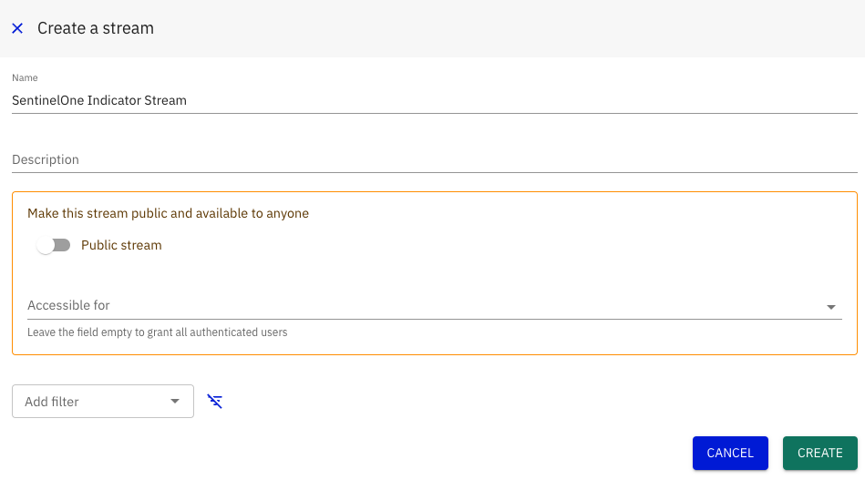

# OpenCTI SentinelOne Intel Stream Connector

| Status            | Date | Comment |
|-------------------|------|---------|
| Filigran Verified | -    | -       |


## Table of Contents

- [OpenCTI SentinelOne Intel Stream Connector](#opencti-sentinelone-intel-stream-connector)
    - [Introduction](#introduction)
    - [Installation](#installation)
        - [Requirements](#requirements)
        - [SentinelOne Setup](#sentinelone-setup)
        - [OpenCTI Setup](#opencti-setup)
    - [Configuration variables](#configuration-variables)
        - [OpenCTI environment variables](#opencti-environment-variables)
        - [Base connector environment variables](#base-connector-environment-variables)
        - [Connector extra parameters environment variables](#connector-extra-parameters-environment-variables)
    - [Deployment](#deployment)
        - [Docker Deployment](#docker-deployment)
        - [Manual Deployment](#manual-deployment)
    - [Usage](#usage)
    - [Behavior](#behavior)
        - [Dissemination assurance (deployment write-back)](#dissemination-assurance-deployment-write-back)
    - [Known Limitations](#known-limitations)
    - [Debugging](#debugging)

## Introduction

The SentinelOne Intel Stream Connector enables real-time synchronization of threat intelligence indicators from OpenCTI to SentinelOne's threat intelligence platform as Indicators of compromise. Upon the creation of Indicators within the OpenCTI platform, the connector automatically evaluates their STIX patterns and pushes compatible indicators to a SentinelOne Instance. 

SentinelOne supports the following Indicator of Compromise (IOC) types:
- **File Hashes**: SHA-256, SHA-1, MD5
- **Network Indicators**: URLs, Domain names, IPv4 addresses

As such, the connector supports Indicators with **single-element** patterns corresponding to the above STIX SCOs. 

## Installation

### Requirements

- **OpenCTI Platform** >= 6.7.11
- **Python** 3.x (for manual deployment)
- **SentinelOne** management console access with API permissions
- **Docker** (for Docker deployment)

### SentinelOne Setup

#### Generating an API Key



- Click on your email address in the top right corner of the menu on the SentinelOne Console. 
- Click the `Actions` dropdown button and hover over `API Token Operations`.
- Click `Regenerate API token` and proceed with the required Authentication.
- **Note:** you do not need to include the `'APIToken '`component of the string in any configs

<br>

#### Determining Your SentinelOne URL
Your SentinelOne URL is simply the first component of the URL you use to access the console.

When configuring the connector, do not include the terminating `/`. For example, for the above image, you would input `https://mysentinelone.instance.net`

## Configuration variables

There are a number of configuration options, which are set either in `docker-compose.yml` (for Docker) or
in `config.yml` (for manual deployment).

### OpenCTI environment variables

Below are the parameters you'll need to set for OpenCTI:

| Parameter     | config.yml | Docker environment variable | Mandatory | Description                                          |
|---------------|------------|-----------------------------|-----------|------------------------------------------------------|
| OpenCTI URL   | url        | `OPENCTI_URL`               | Yes       | The URL of the OpenCTI platform.                     |
| OpenCTI Token | token      | `OPENCTI_TOKEN`             | Yes       | The default admin token set in the OpenCTI platform. |

### Base connector environment variables

Below are the parameters you'll need to set for running the connector properly:

| Parameter                               | config.yml                  | Docker environment variable             | Default                              | Mandatory | Description                                                                                                                                            |
|-----------------------------------------|-----------------------------|-----------------------------------------|--------------------------------------|-----------|--------------------------------------------------------------------------------------------------------------------------------------------------------|
| Connector ID                            | id                          | `CONNECTOR_ID`                          | /                                    | Yes       | A unique `UUIDv4` identifier for this connector instance.                                                                                              |
| Connector Type                          | type                        | `CONNECTOR_TYPE`                        | STREAM                               | Yes       | Should always be set to `STREAM` for this connector.                                                                                                   |
| Connector Name                          | name                        | `CONNECTOR_NAME`                        | SentinelOne Intel Stream Connector   | Yes       | Name of the connector.                                                                                                                                 |
| Connector Scope                         | scope                       | `CONNECTOR_SCOPE`                       | sentinelone                          | Yes       | The scope or type of data the connector is importing, either a MIME type or Stix Object.                                                               |
| Log Level                               | log_level                   | `CONNECTOR_LOG_LEVEL`                   | error                                | Yes       | Determines the verbosity of the logs. Options are `debug`, `info`, `warn`, `warning`, or `error`.                                                      |
| Connector Live Stream ID                | live_stream_id              | `CONNECTOR_LIVE_STREAM_ID`              | live                                 | Yes       | ID of the live stream created in the OpenCTI UI                                                                                                        |
| Connector Live Stream Listen Delete     | live_stream_listen_delete   | `CONNECTOR_LIVE_STREAM_LISTEN_DELETE`   | true                                 | Yes       | Listen to all delete events concerning the entity, depending on the filter set for the OpenCTI stream.                                                 |
| Connector Live Stream No dependencies   | live_stream_no_dependencies | `CONNECTOR_LIVE_STREAM_NO_DEPENDENCIES` | true                                 | Yes       | Always set to `True` unless you are synchronizing 2 OpenCTI platforms and you want to get an entity and all context (relationships and related entity) |

### Connector extra parameters environment variables

Below are the parameters you'll need to set for the connector:

#### Scoping Parameters

SentinelOne uses a hierarchical structure: **Account → Site → Group**. These parameters define at which level in the hierarchy the uploaded IOCs will be applied:

- **Account ID**: Applies IOCs to the entire account.
- **Site ID**: Applies IOCs only to a specific site within an account.
- **Group ID**: Applies IOCs only to a specific endpoint group.

> **Note:** At least one scope ID (Account, Site, or Group) must be configured. Account ID and Site ID cannot be used together.

| Parameter    | config.yml  | Docker environment variable     | Mandatory | Description                                                                                      |
|--------------|-------------|---------------------------------|-----------|--------------------------------------------------------------------------------------------------|
| API URL      | api_url     | `SENTINELONE_INTEL_API_URL`     | Yes       | The base URL of your SentinelOne management console (e.g., https://your-console.sentinelone.net) |
| API Key      | api_key     | `SENTINELONE_INTEL_API_KEY`     | Yes       | SentinelOne API token for authentication                                                         |
| Account ID   | account_id  | `SENTINELONE_INTEL_ACCOUNT_ID`  | No        | SentinelOne Account ID — applies IOCs account-wide (cannot be used with Site ID)                 |
| Site ID      | site_id     | `SENTINELONE_INTEL_SITE_ID`     | No        | SentinelOne Site ID — applies IOCs to a specific site (cannot be used with Account ID)           |
| Group ID     | group_id    | `SENTINELONE_INTEL_GROUP_ID`    | No        | SentinelOne Group ID — applies IOCs to a specific endpoint group                                 |

## Deployment

### Docker Deployment

Before building the Docker container, you need to set the version of pycti in `requirements.txt` equal to whatever
version of OpenCTI you're running. Example, `pycti==5.12.20`. If you don't, it will take the latest version, but
sometimes the OpenCTI SDK fails to initialize.

Build a Docker Image using the provided `Dockerfile`.

Example:

```shell
docker build . -t opencti/connector-sentinelone-intel:latest
```

Make sure to replace the environment variables in `docker-compose.yml` with the appropriate configurations for your
environment. Then, start the docker container with the provided docker-compose.yml

```shell
docker compose up -d
# -d for detached
```

### Manual Deployment

Create a file `config.yml` based on the provided `config.yml.sample`.

Replace the configuration variables (especially the "**ChangeMe**" variables) with the appropriate configurations for
you environment.

Install the required python dependencies (preferably in a virtual environment):

```shell
pip3 install -r requirements.txt
```

Then, start the connector from sentinelone-intel/src:

```shell
python3 main.py
```

## Usage

After Installation, the connector should require minimal interaction to use, and should update automatically at a
regular interval specified in your `docker-compose.yml` or `config.yml` in `duration_period`.

### Creating a Dedicated Stream

- To create a dedicated stream for this connector head to `Data sharing` -> `Live streams` in the OpenCTI platform.



- Provide the stream with a relevant name so that it can be easily identified. 
- Optional filters can be applied to determine which OpenCTI events the connector receives. You should set at least the following filters to ensure the stream only handles Indicators with STIX patterns:
  - **Entity Type**: Set to `Indicator`
  - **Pattern Type**: Set to `stix`
- Further filters based on your needs (e.g., specific labels or creators)
- From here, the stream's ID can be utilized as the value of the `CONNECTOR_LIVE_STREAM_ID` variable.

<br>

## Behavior

The connector simply consumes the assigned stream, filtering for events where Indicators that use STIX patterns are found. The connector will determine if the Indicator's pattern is of a format SentinelOne can accept and will enact the required processing in order to push it to a SentinelOne instance as such. 

Based on the IOC types SentinelOne supports, the connector can only process Indicators from OpenCTI whose pattern references the following STIX Cyber Observable Objects (SCOs):
- **File Hashes**: SHA-256, SHA-1, MD5
- **Network Indicators**: URLs, Domain names, IPv4 addresses

Alongside this, the connector is only able to consume basic **single-expression** STIX patterns (e.g., file:hashes.'SHA-256' = '<hash>').

Compound patterns containing logical operators (AND, OR, FOLLOWEDBY, etc.) or multiple observables are **not supported** and will thus be ignored.

When an Indicator is deleted from the stream (deleted in OpenCTI or no longer matching the stream filters), the IOCs of
the connector's scope whose external id is the STIX id of the Indicator are deleted from SentinelOne. An update event
that changes the pattern replaces these IOCs: they are deleted, then the current pattern is created. Other update events
change nothing in SentinelOne.

### Dissemination assurance (deployment write-back)

The connector reports to OpenCTI whether each indicator is actually live in SentinelOne. The status is stored on the
`deployed-on` relationship between the indicator and the `SentinelOne` Security Platform entity (created if it does not
exist).

| When                                      | Reported to OpenCTI                                                                                           |
|-------------------------------------------|---------------------------------------------------------------------------------------------------------------|
| Indicator created in SentinelOne          | `deployed`, with the `uuid` of the first IOC returned by SentinelOne as external id (when returned)           |
| Indicator rejected by SentinelOne         | `failed`, with a short reason such as "SentinelOne refused the IOC creation: permission denied" (the SentinelOne response is written to the connector log) |
| Indicator with an unsupported pattern     | Nothing: the indicator is never pushed                                                                        |
| Update event changing the pattern         | The former IOCs are deleted, then the indicator is created and reported like a create (`deployed` or `failed`); `failed` when the former IOCs cannot be deleted; `removed` when the new pattern is not supported, once no IOC of the indicator is left (former IOCs deleted, or none found for a supported former pattern; nothing is reported when neither pattern is supported) |
| Delete event, IOCs of the indicator found | `removed` once they are deleted (nothing is deleted nor reported when one of them has no `uuid` or the lookup fails) |
| Delete event, no IOC of the indicator     | `removed`: the lookup completed and no IOC carries the STIX id of the indicator, so it is already absent (nothing is reported for an unsupported pattern, never pushed) |
| Reconciliation, indicator present         | `active` when an IOC holds the value of the current pattern; IOCs of an earlier pattern (an update whose replacement failed) do not confirm it: the indicator is pushed again, a `failed` one stays `failed` |
| Reconciliation, indicator absent          | `removed` (deleted or expired in SentinelOne)                                                                 |
| Reconciliation, `pending` (analyst retry) | The indicator is pushed again and reported `deployed` or `failed`; an indicator the read-back still finds in SentinelOne is confirmed `active` instead |
| Reconciliation, withdrawal or expiry      | Revoked, expired or withdrawn indicators still present are deleted from SentinelOne and reported `removed`    |
| Reconciliation, unknown indicator         | IOCs whose external id is the STIX id of an indicator with no deployment yet are reported `active` (backfill) |

- **Reconciliation**: every `DEPLOYMENT_RECONCILIATION_INTERVAL` minutes, the IOCs of the connector's scope (account
  and/or site) are read back with the Threat Intelligence IOCs API (1,000 per page, `cursor` pagination); IOCs
  whose `validUntil` is in the past are not live: they never confirm a deployment, and the ones of a withdrawn or
  expired indicator are deleted. Only the IOCs whose external id is the STIX id of an indicator (the ones the
  connector creates) are read back, and deployments are matched by that id or by IOC `uuid`, never by value: an IOC
  of the same value created by another source neither confirms a deployment nor blocks its withdrawal. A read-back error, a cursor repeated by the API, malformed pagination
  metadata or a malformed IOC (without a non-empty `uuid` or value, or with a `validUntil` that is not an ISO 8601
  date) skips the run: indicators are never reported `removed` from a
  partial listing.
- **Scope with a group**: the Threat Intelligence IOCs API lists IOCs by account or site only, so the IOCs of a group
  cannot be read back apart from those of the other groups of its site or account. When `SENTINELONE_INTEL_GROUP_ID`
  is set, the deployments come from the pushes, pattern updates and deletions of the stream (`deployed`, `failed`,
  `removed`), and the
  reconciliation only pushes the `pending` ones again (analyst retry): presence, absence, withdrawal and backfill need
  a scope without group. A delete event looks the IOCs of the indicator up by external id in the site or account of
  the group (the whole API token scope for a group alone) and deletes them with the group in the deletion filter; when
  none is found, the indicator is reported `removed` all the same, which is how a deployment whose IOCs were deleted in
  SentinelOne is repaired without read-back. The connector logs this mode when it starts.
- **Withdrawal safety**: only the IOCs whose external id is the STIX id of the indicator are deleted; an IOC of the same
  value created by another source is left in place.
- **Hits**: not reported. The Threat Intelligence IOCs API exposes no detection or match count for the uploaded IOCs.
- **IOC validation requests**: OpenAEV runs the benign validation tests requested in OpenCTI and writes their results;
  the requests only target indicators this connector reports `deployed` or `active`. The two analyst requests carried by
  a deployment are handled by the reconciliation: a retry (`pending`) pushes the indicator again, a withdrawal deletes
  its IOCs from SentinelOne.
- **Permissions**: the API token user needs to view, create and delete Threat Intelligence IOCs in the configured scope.
- **Graceful degradation**: on OpenCTI platforms without the deployment write-back API the feature is a no-op (logged
  once). Write-back errors are logged as warnings and never block the dissemination.

#### What you see in OpenCTI

The [Deployments tabs](https://docs.opencti.io/latest/usage/dissemination-assurance/#viewing-deployments) of an
indicator and of the `SentinelOne` Security Platform show one row per deployment, with its status and the time of the
last report (no hit count: SentinelOne exposes none for these IOCs).

- A `failed` deployment shows the reason the connector reported, for example "SentinelOne refused the IOC creation:
  permission denied" or "SentinelOne could not be reached for the IOC creation"; the HTTP status and the SentinelOne
  response are in the connector log.
- **Deploy again** sets the deployment to `pending`: the next reconciliation pushes the indicator again and reports
  `deployed` or `failed` (an indicator the read-back still finds live in SentinelOne is confirmed `active` without a
  new push).
- **Remove from this platform** withdraws the indicator: the next reconciliation deletes the IOCs created from it and
  reports it `removed`.

| Environment variable                 | Default       | Description                                                           |
|--------------------------------------|---------------|-----------------------------------------------------------------------|
| `DEPLOYMENT_REPORTING_ENABLED`       | `true`        | Report the deployment status of the pushed indicators.                |
| `DEPLOYMENT_RECONCILIATION_INTERVAL` | `60`          | Minutes between two reconciliations, `0` disables the reconciliation. |
| `SECURITY_PLATFORM_NAME`             | `SentinelOne` | Name of the Security Platform entity in OpenCTI.                      |
| `SECURITY_PLATFORM_TYPE`             | `EDR`         | Type of the Security Platform entity (`security_platform_type_ov`).   |
| `SECURITY_PLATFORM_ID`               |               | Id of an existing Security Platform entity, used instead of the name. |

## Known Limitations

- **IOCs not visible in the Management Console**: Threat intelligence data uploaded via the API cannot be configured or viewed through the SentinelOne Management Console and is accessible only via the API. See [SentinelOne's API documentation](https://usea1-partners.sentinelone.net/api-doc/api-details?category=threat-intelligence&api=get-iocs) for details.
- **Single-expression patterns only**: Compound STIX patterns containing logical operators (AND, OR, FOLLOWEDBY, etc.) are not supported and will be silently ignored.
- **Limited IOC types**: Only file hashes (SHA-256, SHA-1, MD5) and network indicators (URLs, domains, IPv4) are supported.

## Debugging

The connector can be debugged by setting the appropriate log level.
Note that logging messages can be added using `self.helper.connector_logger.<level>("Sample message")`, where `<level>` is one of `debug`, `info`, `warning`, or `error` (e.g., `self.helper.connector_logger.error("An error message")`).
