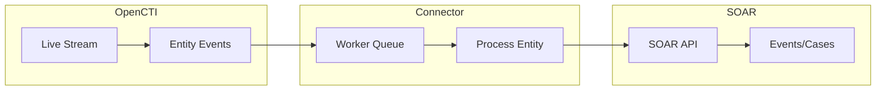

# OpenCTI Splunk SOAR Push Connector

| Status | Date | Comment |
|--------|------|---------|
| Community | -    | -       |

The Splunk SOAR Push connector streams OpenCTI incidents and containers to Splunk SOAR (formerly Phantom) for security orchestration and automated response.

## Table of Contents

- [OpenCTI Splunk SOAR Push Connector](#opencti-splunk-soar-push-connector)
  - [Table of Contents](#table-of-contents)
  - [Introduction](#introduction)
  - [Installation](#installation)
    - [Requirements](#requirements)
  - [Configuration variables](#configuration-variables)
    - [OpenCTI environment variables](#opencti-environment-variables)
    - [Base connector environment variables](#base-connector-environment-variables)
    - [Connector extra parameters environment variables](#connector-extra-parameters-environment-variables)
  - [Deployment](#deployment)
    - [Docker Deployment](#docker-deployment)
    - [Manual Deployment](#manual-deployment)
  - [Usage](#usage)
  - [Behavior](#behavior)
  - [Debugging](#debugging)
  - [Additional information](#additional-information)

## Introduction

This connector pushes threat intelligence from OpenCTI to Splunk SOAR, creating:
- **Events** from OpenCTI Incidents
- **Cases** from OpenCTI Containers (Reports, Groupings, Case-Incident, Case-RFI, Case-RFT)

Key features:
- Real-time synchronization of incidents and containers
- Automatic artifact creation from related entities
- Bidirectional linking via external references
- Queue-based processing for reliability
- Support for create, update, and delete operations

## Installation

### Requirements

- OpenCTI Platform >= 5.12.0
- Splunk SOAR >= 5.0
- Python >= 3.9
- SOAR API access with appropriate permissions

## Configuration variables

There are a number of configuration options, which are set either in `docker-compose.yml` (for Docker) or in `config.yml` (for manual deployment).

### OpenCTI environment variables

| Parameter     | config.yml | Docker environment variable | Mandatory | Description                                          |
|---------------|------------|-----------------------------|-----------|------------------------------------------------------|
| OpenCTI URL   | url        | `OPENCTI_URL`               | Yes       | The URL of the OpenCTI platform.                     |
| OpenCTI Token | token      | `OPENCTI_TOKEN`             | Yes       | The default admin token set in the OpenCTI platform. |

### Base connector environment variables

| Parameter             | config.yml        | Docker environment variable  | Default | Mandatory | Description                                                              |
|-----------------------|-------------------|------------------------------|---------|-----------|--------------------------------------------------------------------------|
| Connector ID          | id                | `CONNECTOR_ID`               |         | Yes       | A unique `UUIDv4` identifier for this connector instance.                |
| Connector Name        | name              | `CONNECTOR_NAME`             |         | Yes       | Name of the connector.                                                   |
| Live Stream ID        | live_stream_id    | `CONNECTOR_LIVE_STREAM_ID`   |         | Yes       | The Live Stream ID of the stream created in the OpenCTI interface.       |
| Log Level             | log_level         | `CONNECTOR_LOG_LEVEL`        | info    | No        | Determines the verbosity of the logs.                                    |

### Connector extra parameters environment variables

| Parameter        | config.yml           | Docker environment variable | Default | Mandatory | Description                                                |
|------------------|----------------------|-----------------------------|---------|-----------|------------------------------------------------------------|
| SOAR URL         | splunk_soar.url      | `SPLUNK_SOAR_URL`           |         | Yes       | Splunk SOAR instance URL.                                  |
| SOAR API Token   | splunk_soar.api_token| `SPLUNK_SOAR_API_TOKEN`     |         | Yes       | Splunk SOAR API automation token.                          |
| SSL Verify       | splunk_soar.ssl_verify| `SPLUNK_SOAR_SSL_VERIFY`   | true    | No        | Verify SSL certificates.                                   |

## Deployment

### Docker Deployment

Build the Docker image:

```bash
docker build -t opencti/connector-splunk-soar-push:latest .
```

Configure the connector in `docker-compose.yml`:

```yaml
  connector-splunk-soar-push:
    image: opencti/connector-splunk-soar-push:latest
    environment:
      - OPENCTI_URL=http://localhost
      - OPENCTI_TOKEN=ChangeMe
      - CONNECTOR_ID=ChangeMe
      - CONNECTOR_LIVE_STREAM_ID=ChangeMe
      - SPLUNK_SOAR_URL=https://soar.example.com
      - SPLUNK_SOAR_API_TOKEN=ChangeMe
    restart: always
```

Start the connector:

```bash
docker compose up -d
```

### Manual Deployment

1. Create `config.yml` based on `config.yml.sample`.

2. Install dependencies:

```bash
pip3 install -r requirements.txt
```

3. Start the connector from the `src` directory:

```bash
python3 main.py
```

## Usage

1. Generate a SOAR API token: **Administration > User Management > Users > Automation API Token**
2. Create a Live Stream in OpenCTI (Data Management -> Data Sharing -> Live Streams)
3. Configure the stream to include incidents and containers
4. Start the connector

## Behavior

The connector listens to OpenCTI live stream events and creates events/cases in Splunk SOAR.

### Data Flow



### Event Processing

| Event Type | Action                                               |
|------------|------------------------------------------------------|
| create     | Creates SOAR event/case with artifacts               |
| update     | Updates SOAR event/case                              |
| delete     | Removes external references; optionally closes entity|

### Entity Mapping

| OpenCTI Entity Type | SOAR Entity Type |
|---------------------|------------------|
| Incident            | Event            |
| Report              | Case             |
| Grouping            | Case             |
| Case-Incident       | Case             |
| Case-RFI            | Case             |
| Case-RFT            | Case             |

### Artifact Mapping

| OpenCTI Entity    | SOAR Artifact Type | Key CEF Fields                |
|-------------------|-------------------|-------------------------------|
| IPv4/IPv6 Address | IP Address        | sourceAddress                 |
| Domain-Name       | Domain            | destinationDnsDomain          |
| URL               | URL               | requestURL                    |
| File              | File              | fileName, fileHash            |
| Email-Addr        | Email             | sourceUserName                |
| Malware           | Malware           | malwareName, malwareTypes     |
| Threat Actor      | Threat Actor      | threatActorName               |
| Attack Pattern    | Attack Pattern    | attackPatternName, mitreAttackId |
| Vulnerability     | Vulnerability     | cve                           |
| Indicator         | Indicator         | indicatorPattern              |

## Debugging

Enable verbose logging by setting:

```env
CONNECTOR_LOG_LEVEL=debug
```

### Common Issues

| Issue                          | Solution                                              |
|--------------------------------|-------------------------------------------------------|
| Connection failed              | Verify URLs and credentials                           |
| Stream timeout                 | Connector uses worker queue; increase queue size if needed |
| Missing entities               | Check stream filters in OpenCTI                       |
| SSL errors                     | Set `SPLUNK_SOAR_SSL_VERIFY=false` for testing        |

## Additional information

- **External References**: Bidirectional linking between OpenCTI and SOAR
- **Queue Processing**: Worker queue prevents stream timeouts for large entities
- **Artifact Bulk Creation**: Related entities added as artifacts in bulk
- **Documentation**: [OpenCTI Docs](https://docs.opencti.io), [Splunk SOAR Docs](https://docs.splunk.com/Documentation/SOAR)
