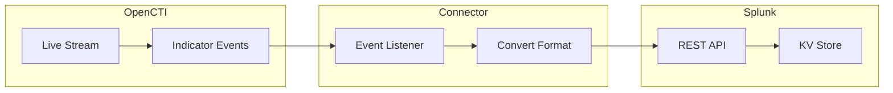

# OpenCTI Splunk Connector

| Status | Date | Comment |
|--------|------|---------|
| Filigran Verified | -    | -       |

The Splunk connector streams OpenCTI threat intelligence to Splunk KV Store for SIEM correlation and threat detection.

## Table of Contents

- [OpenCTI Splunk Connector](#opencti-splunk-connector)
  - [Table of Contents](#table-of-contents)
  - [Introduction](#introduction)
  - [Installation](#installation)
    - [Requirements](#requirements)
  - [Configuration variables](#configuration-variables)
    - [OpenCTI environment variables](#opencti-environment-variables)
    - [Base connector environment variables](#base-connector-environment-variables)
    - [Connector extra parameters environment variables](#connector-extra-parameters-environment-variables)
  - [Deployment](#deployment)
    - [Docker Deployment](#docker-deployment)
    - [Manual Deployment](#manual-deployment)
  - [Usage](#usage)
  - [Behavior](#behavior)
  - [Debugging](#debugging)
  - [Additional information](#additional-information)

## Introduction

This connector enables organizations to feed Splunk KV Store with OpenCTI threat intelligence. The KV Store can be used for lookups, correlations, and threat detection in Splunk searches and dashboards.

Key features:
- Real-time streaming of indicators to Splunk KV Store
- Multi-threaded consumer architecture
- Support for Bearer and Basic authentication
- Entity type filtering
- Optional Prometheus metrics for monitoring

## Installation

### Requirements

- OpenCTI Platform >= 5.0.0
- Splunk instance with KV Store support
- Splunk API token or Basic auth credentials

## Configuration variables

There are a number of configuration options, which are set either in `docker-compose.yml` (for Docker) or in `config.yml` (for manual deployment).

### OpenCTI environment variables

| Parameter     | config.yml | Docker environment variable | Mandatory | Description                                          |
|---------------|------------|-----------------------------|-----------|------------------------------------------------------|
| OpenCTI URL   | url        | `OPENCTI_URL`               | Yes       | The URL of the OpenCTI platform.                     |
| OpenCTI Token | token      | `OPENCTI_TOKEN`             | Yes       | The default admin token set in the OpenCTI platform. |

### Base connector environment variables

| Parameter                      | config.yml                | Docker environment variable             | Default | Mandatory | Description                                                                    |
|--------------------------------|---------------------------|-----------------------------------------|---------|-----------|--------------------------------------------------------------------------------|
| Connector ID                   | id                        | `CONNECTOR_ID`                          |         | Yes       | A unique `UUIDv4` identifier for this connector instance.                      |
| Connector Name                 | name                      | `CONNECTOR_NAME`                        |         | Yes       | Name of the connector.                                                         |
| Connector Scope                | scope                     | `CONNECTOR_SCOPE`                       | splunk  | Yes       | The scope of the connector.                                                    |
| Live Stream ID                 | live_stream_id            | `CONNECTOR_LIVE_STREAM_ID`              |         | Yes       | The Live Stream ID of the stream created in the OpenCTI interface.             |
| Live Stream Start Timestamp    | live_stream_start_timestamp| `CONNECTOR_LIVE_STREAM_START_TIMESTAMP`|         | No        | Start timestamp used on connector first start.                                 |
| Consumer Count                 | consumer_count            | `CONNECTOR_CONSUMER_COUNT`              | 10      | No        | Number of consumer/worker threads.                                             |
| Confidence Level               | confidence_level          | `CONNECTOR_CONFIDENCE_LEVEL`            |         | Yes       | Default confidence level (1-4).                                                |
| Log Level                      | log_level                 | `CONNECTOR_LOG_LEVEL`                   | info    | No        | Determines the verbosity of the logs.                                          |

### Connector extra parameters environment variables

| Parameter          | config.yml           | Docker environment variable | Default | Mandatory | Description                                                |
|--------------------|----------------------|-----------------------------|---------|-----------|------------------------------------------------------------|
| Splunk URL         | splunk.url           | `SPLUNK_URL`                |         | Yes       | Splunk REST API URL.                                       |
| Splunk Token       | splunk.token         | `SPLUNK_TOKEN`              |         | Yes       | Splunk API token or Base64(user:password) for Basic auth.  |
| Splunk Auth Type   | splunk.auth_type     | `SPLUNK_AUTH_TYPE`          | Bearer  | Yes       | Authentication type: `Bearer` or `Basic`.                  |
| Splunk Owner       | splunk.owner         | `SPLUNK_OWNER`              |         | Yes       | KV Store owner (recommended: `nobody`).                    |
| Splunk SSL Verify  | splunk.ssl_verify    | `SPLUNK_SSL_VERIFY`         | true    | No        | Verify SSL certificates.                                   |
| Splunk App         | splunk.app           | `SPLUNK_APP`                |         | Yes       | Splunk app name for the KV Store.                          |
| Splunk KV Store Name| splunk.kv_store_name| `SPLUNK_KV_STORE_NAME`      |         | Yes       | Name of the KV Store.                                      |
| Splunk Ignore Types| splunk.ignore_types  | `SPLUNK_IGNORE_TYPES`       |         | Yes       | Comma-separated list of entity types to ignore.            |
| Metrics Enable     | metrics.enable       | `METRICS_ENABLE`            | false   | No        | Whether to enable Prometheus metrics.                      |
| Metrics Address    | metrics.addr         | `METRICS_ADDR`              | 0.0.0.0 | No        | Bind IP address for metrics endpoint.                      |
| Metrics Port       | metrics.port         | `METRICS_PORT`              | 9113    | No        | Port for metrics endpoint.                                 |

## Deployment

### Docker Deployment

Build the Docker image:

```bash
docker build -t opencti/connector-splunk:latest .
```

Configure the connector in `docker-compose.yml`:

```yaml
  connector-splunk:
    image: opencti/connector-splunk:latest
    environment:
      - OPENCTI_URL=http://localhost
      - OPENCTI_TOKEN=ChangeMe
      - CONNECTOR_ID=ChangeMe
      - CONNECTOR_NAME=Splunk
      - CONNECTOR_SCOPE=splunk
      - CONNECTOR_LOG_LEVEL=info
      - CONNECTOR_LIVE_STREAM_ID=ChangeMe
      - CONNECTOR_CONFIDENCE_LEVEL=80
      - SPLUNK_URL=https://splunk.example.com:8089
      - SPLUNK_TOKEN=ChangeMe
      - SPLUNK_AUTH_TYPE=Bearer
      - SPLUNK_OWNER=nobody
      - SPLUNK_SSL_VERIFY=true
      - SPLUNK_APP=search
      - SPLUNK_KV_STORE_NAME=opencti_intel
      - SPLUNK_IGNORE_TYPES=label,marking-definition,identity
    restart: always
```

Start the connector:

```bash
docker compose up -d
```

### Manual Deployment

1. Create `config.yml` based on `config.yml.sample`.

2. Install dependencies:

```bash
pip3 install -r requirements.txt
```

3. Start the connector from the `src` directory:

```bash
python3 splunk.py
```

## Usage

1. Create an API token in Splunk: **Settings > Users and Authentication > Tokens**
2. Whitelist connector IP if needed: **Settings > Server Settings > IP allow list**
3. Create a Live Stream in OpenCTI (Data Management -> Data Sharing -> Live Streams)
4. Start the connector

After the KV Store is created, create lookup definitions in Splunk for searches.

## Behavior

The connector listens to OpenCTI live stream events and manages entries in Splunk KV Store.

### Data Flow



### Event Processing

| Event Type | Action                                       |
|------------|----------------------------------------------|
| create     | Creates entry in Splunk KV Store             |
| update     | Updates entry in Splunk KV Store             |
| delete     | Removes entry from Splunk KV Store           |

### Supported Observable Types and Fields

| Type        | Supported Fields                                                              |
|-------------|-------------------------------------------------------------------------------|
| domain-name | `_key,type,value,created_at,updated_at,score,labels,created_by`               |
| url         | `_key,type,value,created_at,updated_at,score,labels,created_by`               |
| ipv4-addr   | `_key,type,value,created_at,updated_at,score,labels,created_by`               |
| file        | `_key,type,hashes,created_at,updated_at,score,labels,created_by`              |
| indicator   | `_key,type,pattern,created_at,updated_at,score,labels,splunk_queries.queries,created_by` |

## Debugging

Enable verbose logging by setting:

```env
CONNECTOR_LOG_LEVEL=debug
```

### Common Issues

| Issue                          | Solution                                              |
|--------------------------------|-------------------------------------------------------|
| Authentication errors          | Verify token and auth type; use Basic for Splunk < 7.3 |
| KV Store not created           | Check app permissions and owner settings              |
| SSL certificate errors         | Set `SPLUNK_SSL_VERIFY=false` for testing             |
| IP blocked                     | Whitelist connector IP in Splunk settings             |

## Additional information

- **Search Head**: Use search head URL for KV Store replication across cluster
- **Token Expiration**: Monitor token expiration in Splunk
- **Basic Auth**: For Splunk < 7.3, use `Base64(user:password)` as token
- **KV Store Naming**: Ensure no other Splunk object has the same name as the KV Store
- **Lookup Definitions**: Create lookup definitions after KV Store is created for searches
