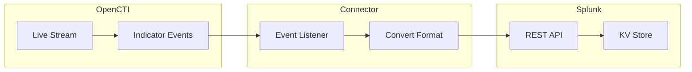

# OpenCTI Splunk Connector

| Status | Date | Comment |
|--------|------|---------|
| Filigran Verified | -    | -       |

The Splunk connector streams OpenCTI threat intelligence to Splunk KV Store for SIEM correlation and threat detection.

## Table of Contents

- [OpenCTI Splunk Connector](#opencti-splunk-connector)
  - [Table of Contents](#table-of-contents)
  - [Introduction](#introduction)
  - [Installation](#installation)
    - [Requirements](#requirements)
  - [Configuration variables](#configuration-variables)
    - [OpenCTI environment variables](#opencti-environment-variables)
    - [Base connector environment variables](#base-connector-environment-variables)
    - [Connector extra parameters environment variables](#connector-extra-parameters-environment-variables)
  - [Deployment](#deployment)
    - [Docker Deployment](#docker-deployment)
    - [Manual Deployment](#manual-deployment)
  - [Usage](#usage)
  - [Behavior](#behavior)
    - [Dissemination assurance (deployment write-back)](#dissemination-assurance-deployment-write-back)
  - [Debugging](#debugging)
  - [Additional information](#additional-information)

## Introduction

This connector enables organizations to feed Splunk KV Store with OpenCTI threat intelligence. The KV Store can be used for lookups, correlations, and threat detection in Splunk searches and dashboards.

Key features:
- Real-time streaming of indicators to Splunk KV Store
- Multi-threaded consumer architecture
- Support for Bearer and Basic authentication
- Entity type filtering
- Optional Prometheus metrics for monitoring
- Dissemination assurance: deployment status, periodic KV Store reconciliation and saved search hits reported back to OpenCTI

## Installation

### Requirements

- OpenCTI Platform >= 5.0.0
- Splunk instance with KV Store support
- Splunk API token or Basic auth credentials

## Configuration variables

There are a number of configuration options, which are set either in `docker-compose.yml` (for Docker) or in `config.yml` (for manual deployment).

### OpenCTI environment variables

| Parameter     | config.yml | Docker environment variable | Mandatory | Description                                          |
|---------------|------------|-----------------------------|-----------|------------------------------------------------------|
| OpenCTI URL   | url        | `OPENCTI_URL`               | Yes       | The URL of the OpenCTI platform.                     |
| OpenCTI Token | token      | `OPENCTI_TOKEN`             | Yes       | The default admin token set in the OpenCTI platform. |

### Base connector environment variables

| Parameter                      | config.yml                | Docker environment variable             | Default | Mandatory | Description                                                                    |
|--------------------------------|---------------------------|-----------------------------------------|---------|-----------|--------------------------------------------------------------------------------|
| Connector ID                   | id                        | `CONNECTOR_ID`                          |         | Yes       | A unique `UUIDv4` identifier for this connector instance.                      |
| Connector Name                 | name                      | `CONNECTOR_NAME`                        |         | Yes       | Name of the connector.                                                         |
| Connector Scope                | scope                     | `CONNECTOR_SCOPE`                       | splunk  | Yes       | The scope of the connector.                                                    |
| Live Stream ID                 | live_stream_id            | `CONNECTOR_LIVE_STREAM_ID`              |         | Yes       | The Live Stream ID of the stream created in the OpenCTI interface.             |
| Live Stream Start Timestamp    | live_stream_start_timestamp| `CONNECTOR_LIVE_STREAM_START_TIMESTAMP`|         | No        | Start timestamp used on connector first start.                                 |
| Consumer Count                 | consumer_count            | `CONNECTOR_CONSUMER_COUNT`              | 10      | No        | Number of consumer/worker threads.                                             |
| Confidence Level               | confidence_level          | `CONNECTOR_CONFIDENCE_LEVEL`            |         | Yes       | Default confidence level (1-4).                                                |
| Log Level                      | log_level                 | `CONNECTOR_LOG_LEVEL`                   | info    | No        | Determines the verbosity of the logs.                                          |

### Connector extra parameters environment variables

| Parameter          | config.yml           | Docker environment variable | Default | Mandatory | Description                                                |
|--------------------|----------------------|-----------------------------|---------|-----------|------------------------------------------------------------|
| Splunk URL         | splunk.url           | `SPLUNK_URL`                |         | Yes       | Splunk REST API URL.                                       |
| Splunk Token       | splunk.token         | `SPLUNK_TOKEN`              |         | Yes       | Splunk API token or Base64(user:password) for Basic auth.  |
| Splunk Auth Type   | splunk.auth_type     | `SPLUNK_AUTH_TYPE`          | Bearer  | Yes       | Authentication type: `Bearer` or `Basic`.                  |
| Splunk Owner       | splunk.owner         | `SPLUNK_OWNER`              |         | Yes       | KV Store owner (recommended: `nobody`).                    |
| Splunk SSL Verify  | splunk.ssl_verify    | `SPLUNK_SSL_VERIFY`         | true    | No        | Verify SSL certificates.                                   |
| Splunk App         | splunk.app           | `SPLUNK_APP`                |         | Yes       | Splunk app name for the KV Store.                          |
| Splunk KV Store Name| splunk.kv_store_name| `SPLUNK_KV_STORE_NAME`      |         | Yes       | Name of the KV Store.                                      |
| Splunk Ignore Types| splunk.ignore_types  | `SPLUNK_IGNORE_TYPES`       |         | Yes       | Comma-separated list of entity types to ignore.            |
| Splunk Hits Saved Search | splunk.hits_saved_search | `SPLUNK_HITS_SAVED_SEARCH` |  | No | Saved search returning the matches of the KV Store indicators (see [Dissemination assurance](#dissemination-assurance-deployment-write-back)). |
| Metrics Enable     | metrics.enable       | `METRICS_ENABLE`            | false   | No        | Whether to enable Prometheus metrics.                      |
| Metrics Address    | metrics.addr         | `METRICS_ADDR`              | 0.0.0.0 | No        | Bind IP address for metrics endpoint.                      |
| Metrics Port       | metrics.port         | `METRICS_PORT`              | 9113    | No        | Port for metrics endpoint.                                 |

## Deployment

### Docker Deployment

Build the Docker image:

```bash
docker build -t opencti/connector-splunk:latest .
```

Configure the connector in `docker-compose.yml`:

```yaml
  connector-splunk:
    image: opencti/connector-splunk:latest
    environment:
      - OPENCTI_URL=http://localhost
      - OPENCTI_TOKEN=ChangeMe
      - CONNECTOR_ID=ChangeMe
      - CONNECTOR_NAME=Splunk
      - CONNECTOR_SCOPE=splunk
      - CONNECTOR_LOG_LEVEL=info
      - CONNECTOR_LIVE_STREAM_ID=ChangeMe
      - CONNECTOR_CONFIDENCE_LEVEL=80
      - SPLUNK_URL=https://splunk.example.com:8089
      - SPLUNK_TOKEN=ChangeMe
      - SPLUNK_AUTH_TYPE=Bearer
      - SPLUNK_OWNER=nobody
      - SPLUNK_SSL_VERIFY=true
      - SPLUNK_APP=search
      - SPLUNK_KV_STORE_NAME=opencti_intel
      - SPLUNK_IGNORE_TYPES=label,marking-definition,identity
    restart: always
```

Start the connector:

```bash
docker compose up -d
```

### Manual Deployment

1. Create `config.yml` based on `config.yml.sample`.

2. Install dependencies:

```bash
pip3 install -r requirements.txt
```

3. Start the connector from the `src` directory:

```bash
python3 splunk.py
```

## Usage

1. Create an API token in Splunk: **Settings > Users and Authentication > Tokens**
2. Whitelist connector IP if needed: **Settings > Server Settings > IP allow list**
3. Create a Live Stream in OpenCTI (Data Management -> Data Sharing -> Live Streams)
4. Start the connector

After the KV Store is created, create lookup definitions in Splunk for searches.

## Behavior

The connector listens to OpenCTI live stream events and manages entries in Splunk KV Store.

### Data Flow


```mermaid
graph LR
    subgraph OpenCTI
        direction TB
        Stream[Live Stream]
        Indicators[Indicator Events]
    end

    subgraph Connector
        direction LR
        Listen[Event Listener]
        Convert[Convert Format]
    end

    subgraph Splunk
        direction TB
        API[REST API]
        KVStore[KV Store]
    end

    Stream --> Indicators
    Indicators --> Listen
    Listen --> Convert
    Convert --> API
    API --> KVStore
```

### Event Processing

| Event Type | Action                                       |
|------------|----------------------------------------------|
| create     | Creates entry in Splunk KV Store (replaces an entry already stored under the key) |
| update     | Updates entry in Splunk KV Store             |
| delete     | Removes entry from Splunk KV Store           |

### Supported Observable Types and Fields

| Type        | Supported Fields                                                              |
|-------------|-------------------------------------------------------------------------------|
| domain-name | `_key,type,value,created_at,updated_at,score,labels,created_by`               |
| url         | `_key,type,value,created_at,updated_at,score,labels,created_by`               |
| ipv4-addr   | `_key,type,value,created_at,updated_at,score,labels,created_by`               |
| file        | `_key,type,hashes,created_at,updated_at,score,labels,created_by`              |
| indicator   | `_key,type,pattern,created_at,updated_at,score,labels,splunk_queries.queries,created_by` |

### Dissemination assurance (deployment write-back)

The connector reports to OpenCTI whether each indicator is actually present in the Splunk KV Store. The status is
stored on the `deployed-on` relationship between the indicator and the `Splunk` Security Platform entity (created if it
does not exist), and hits are counted with a sighting of the indicator on that entity.

| When                                      | Reported to OpenCTI                                                                                      |
|-------------------------------------------|----------------------------------------------------------------------------------------------------------|
| KV Store write accepted (create, update)  | `deployed`, with the KV Store `_key` (the OpenCTI id of the indicator) as external id                    |
| KV Store write rejected                   | `failed`, with a short reason such as "Splunk refused the KV Store write: invalid request" (the Splunk response is written to the connector log) |
| Delete event processed                    | `removed` (also when the item was already absent)                                                        |
| Reconciliation, item present              | `active`; an item still holding an earlier pattern (failed update) does not confirm it: the indicator is written again, a `failed` one stays `failed` |
| Reconciliation, item absent               | `removed`                                                                                                |
| Reconciliation, `pending` (analyst retry) | The indicator is written again with the stream path and reported `deployed` or `failed`; an indicator still present is confirmed `active` instead |
| Reconciliation, withdrawal or expiry      | Revoked, expired or withdrawn indicators still present are deleted from the KV Store and reported `removed` |
| Reconciliation, unknown item              | KV Store indicators with no deployment yet are reported `active` (backfill)                              |
| Hits                                      | Results of the saved search `SPLUNK_HITS_SAVED_SEARCH`                                                   |

- **Reconciliation**: every `DEPLOYMENT_RECONCILIATION_INTERVAL` minutes, the indicator items of the collection are read
  back page by page (`_key` keyset pagination). A read-back error skips the run: items are never reported `removed`
  from a partial listing.
- **Hits**: Splunk does not match the KV Store content against your events by itself. Hits are read from a saved search
  you define, visible in the `SPLUNK_OWNER` / `SPLUNK_APP` namespace, run as a oneshot job over the time range of each
  hit collection (since the previous run). Each result carries `opencti_id` (the KV Store `_key`) or `value` (the
  matched observable value), `_time` and optionally `count`. A result with an `opencti_id` is a hit of that indicator
  only (none when it is not deployed); a result with a `value` alone is a hit of every deployed indicator carrying
  it. At most 10,000 results are read per run, oldest first
  (`| sort 0 _time` is appended), and when the limit is reached the next run resumes at the newest result read (when
  10,000 results or more share a single time, the hits of that instant are a lower bound and the next run starts just
  after it). A result
  without `_time` fails the hit read (logged), which is retried over the same time range on the next run.
  `count` is the number of matches at that `_time`: a result must not aggregate matches of several times (such as
  `stats count min(_time) BY opencti_id`), because successive reads overlap and a result at or before the last hit
  already reported is skipped as a whole. Example, with a lookup definition `opencti_lookup` on the KV Store
  collection:

  ```spl
  search index=network
  | lookup opencti_lookup values AS dest_ip OUTPUTNEW _key AS opencti_id
  | where isnotnull(opencti_id)
  | stats count BY _time opencti_id
  ```

  Without `SPLUNK_HITS_SAVED_SEARCH`, deployment statuses are reported and no hit is collected.
- **Graceful degradation**: on OpenCTI platforms without the deployment write-back API the feature is a no-op (logged
  once). Write-back errors are logged as warnings and never block the dissemination.

| Environment variable                 | Default  | Description                                                           |
|--------------------------------------|----------|-----------------------------------------------------------------------|
| `DEPLOYMENT_REPORTING_ENABLED`       | `true`   | Report the deployment status of the pushed indicators.                |
| `DEPLOYMENT_RECONCILIATION_INTERVAL` | `60`     | Minutes between two reconciliations, `0` disables the reconciliation. |
| `HITS_REPORTING_ENABLED`             | `true`   | Report the hits returned by `SPLUNK_HITS_SAVED_SEARCH`.               |
| `SECURITY_PLATFORM_NAME`             | `Splunk` | Name of the Security Platform entity in OpenCTI.                      |
| `SECURITY_PLATFORM_TYPE`             | `SIEM`   | Type of the Security Platform entity (`security_platform_type_ov`).    |
| `SECURITY_PLATFORM_ID`               |          | Id of an existing Security Platform entity, used instead of the name. |

## Debugging

Enable verbose logging by setting:

```env
CONNECTOR_LOG_LEVEL=debug
```

### Common Issues

| Issue                          | Solution                                              |
|--------------------------------|-------------------------------------------------------|
| Authentication errors          | Verify token and auth type; use Basic for Splunk < 7.3 |
| KV Store not created           | Check app permissions and owner settings              |
| SSL certificate errors         | Set `SPLUNK_SSL_VERIFY=false` for testing             |
| IP blocked                     | Whitelist connector IP in Splunk settings             |

## Additional information

- **Search Head**: Use search head URL for KV Store replication across cluster
- **Token Expiration**: Monitor token expiration in Splunk
- **Basic Auth**: For Splunk < 7.3, use `Base64(user:password)` as token
- **KV Store Naming**: Ensure no other Splunk object has the same name as the KV Store
- **Lookup Definitions**: Create lookup definitions after KV Store is created for searches
