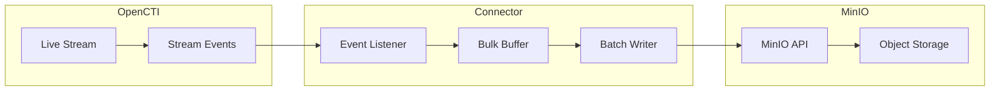

# OpenCTI Stream Exporter Connector

| Status | Date | Comment |
|--------|------|---------|
| Community | -    | -       |

The Stream Exporter connector exports OpenCTI live stream events to MinIO object storage for asynchronous synchronization between OpenCTI instances.

## Table of Contents

- [OpenCTI Stream Exporter Connector](#opencti-stream-exporter-connector)
  - [Table of Contents](#table-of-contents)
  - [Introduction](#introduction)
  - [Installation](#installation)
    - [Requirements](#requirements)
  - [Configuration variables](#configuration-variables)
    - [OpenCTI environment variables](#opencti-environment-variables)
    - [Base connector environment variables](#base-connector-environment-variables)
    - [Connector extra parameters environment variables](#connector-extra-parameters-environment-variables)
  - [Deployment](#deployment)
    - [Docker Deployment](#docker-deployment)
    - [Manual Deployment](#manual-deployment)
  - [Usage](#usage)
  - [Behavior](#behavior)
  - [Debugging](#debugging)
  - [Additional information](#additional-information)

## Introduction

This connector listens to an OpenCTI live stream and exports events to MinIO object storage. It is designed to work with the [stream-importer](../../external-import/stream-importer/) connector for synchronizing OpenCTI instances that don't have direct network access to each other.

Key features:
- Export live stream events to MinIO bucket
- Bulk writing for performance optimization
- State management for reliable synchronization
- Configurable write intervals
- Support for SSL and certificate verification

## Installation

### Requirements

- OpenCTI Platform >= 6.3.4
- MinIO or S3-compatible object storage
- Network access to MinIO endpoint

## Configuration variables

There are a number of configuration options, which are set either in `docker-compose.yml` (for Docker) or in `config.yml` (for manual deployment).

### OpenCTI environment variables

| Parameter     | config.yml | Docker environment variable | Mandatory | Description                                          |
|---------------|------------|-----------------------------|-----------|------------------------------------------------------|
| OpenCTI URL   | url        | `OPENCTI_URL`               | Yes       | The URL of the OpenCTI platform.                     |
| OpenCTI Token | token      | `OPENCTI_TOKEN`             | Yes       | The default admin token set in the OpenCTI platform. |

### Base connector environment variables

| Parameter                      | config.yml                | Docker environment variable             | Default         | Mandatory | Description                                                                    |
|--------------------------------|---------------------------|-----------------------------------------|-----------------|-----------|--------------------------------------------------------------------------------|
| Connector ID                   | id                        | `CONNECTOR_ID`                          |                 | Yes       | A unique `UUIDv4` identifier for this connector instance.                      |
| Connector Name                 | name                      | `CONNECTOR_NAME`                        |                 | Yes       | Name of the connector.                                                         |
| Connector Scope                | scope                     | `CONNECTOR_SCOPE`                       | stream-exporter | Yes       | The scope of the connector.                                                    |
| Live Stream Start Timestamp    | live_stream_start_timestamp| `CONNECTOR_LIVE_STREAM_START_TIMESTAMP`|                 | No        | Start timestamp on first start (default: all data).                            |
| Consumer Count                 | consumer_count            | `CONNECTOR_CONSUMER_COUNT`              | 10              | No        | Number of consumer/worker threads.                                             |
| Confidence Level               | confidence_level          | `CONNECTOR_CONFIDENCE_LEVEL`            |                 | Yes       | Default confidence level (1-4).                                                |
| Log Level                      | log_level                 | `CONNECTOR_LOG_LEVEL`                   | info            | No        | Determines the verbosity of the logs.                                          |

### Connector extra parameters environment variables

| Parameter        | config.yml        | Docker environment variable | Default | Mandatory | Description                                                |
|------------------|-------------------|-----------------------------|---------|-----------|------------------------------------------------------------|
| MinIO Endpoint   | minio.endpoint    | `MINIO_ENDPOINT`            |         | Yes       | MinIO server endpoint.                                     |
| MinIO Port       | minio.port        | `MINIO_PORT`                |         | Yes       | MinIO server port.                                         |
| MinIO Bucket     | minio.bucket      | `MINIO_BUCKET`              |         | Yes       | MinIO bucket name (created if not exists).                 |
| MinIO Folder     | minio.folder      | `MINIO_FOLDER`              |         | Yes       | Folder within bucket for messages.                         |
| MinIO Access Key | minio.access_key  | `MINIO_ACCESS_KEY`          |         | Yes       | MinIO access key.                                          |
| MinIO Secret Key | minio.secret_key  | `MINIO_SECRET_KEY`          |         | Yes       | MinIO secret key.                                          |
| MinIO Secure     | minio.secure      | `MINIO_SECURE`              | false   | No        | Whether to use SSL.                                        |
| MinIO Cert Check | minio.cert_check  | `MINIO_CERT_CHECK`          | true    | No        | Whether to verify SSL certificate.                         |
| Write Interval   | write_every_sec   | `WRITE_EVERY_SEC`           | 60      | No        | Seconds between MinIO writes.                              |

## Deployment

### Docker Deployment

Build the Docker image:

```bash
docker build -t opencti/connector-stream-exporter:latest .
```

Configure the connector in `docker-compose.yml`:

```yaml
  connector-stream-exporter:
    image: opencti/connector-stream-exporter:latest
    environment:
      - OPENCTI_URL=http://localhost
      - OPENCTI_TOKEN=ChangeMe
      - CONNECTOR_ID=ChangeMe
      - CONNECTOR_NAME=Stream Exporter
      - CONNECTOR_SCOPE=stream-exporter
      - CONNECTOR_LOG_LEVEL=info
      - CONNECTOR_CONFIDENCE_LEVEL=80
      - MINIO_ENDPOINT=minio.example.com
      - MINIO_PORT=9000
      - MINIO_BUCKET=opencti-export
      - MINIO_FOLDER=stream
      - MINIO_ACCESS_KEY=ChangeMe
      - MINIO_SECRET_KEY=ChangeMe
      - MINIO_SECURE=true
      - WRITE_EVERY_SEC=60
    restart: always
```

Start the connector:

```bash
docker compose up -d
```

### Manual Deployment

1. Create `config.yml` based on `config.yml.sample`.

2. Install dependencies:

```bash
pip3 install -r requirements.txt
```

3. Start the connector from the `src` directory:

```bash
python3 main.py
```

## Usage

1. Set up MinIO or S3-compatible storage
2. Create a Live Stream in OpenCTI (Data Management -> Data Sharing -> Live Streams)
3. Configure the stream with appropriate filters
4. Start the connector
5. Configure [stream-importer](../../external-import/stream-importer/) on the target OpenCTI instance

## Behavior

The connector listens to OpenCTI live stream events and batches them for export to MinIO.

### Data Flow



### Event Processing

| Step | Description                                              |
|------|----------------------------------------------------------|
| 1    | Listen to live stream events                             |
| 2    | Buffer events in memory                                  |
| 3    | Write to MinIO at configured interval                    |
| 4    | Update state with last written message ID                |

### State Management

The connector maintains two state values:
- `start_from`: Updated on each received message
- `last_written_msg_id`: Updated only after successful MinIO write

On restart, the connector uses `last_written_msg_id` to resume from the last successfully written position.

## Debugging

Enable verbose logging by setting:

```env
CONNECTOR_LOG_LEVEL=debug
```

### Common Issues

| Issue                          | Solution                                              |
|--------------------------------|-------------------------------------------------------|
| Connection refused             | Verify MinIO endpoint and port                        |
| Authentication failed          | Verify access key and secret key                      |
| Bucket not created             | Check MinIO permissions for bucket creation           |
| SSL errors                     | Set `MINIO_CERT_CHECK=false` for testing              |

## Additional information

- **Use Case**: Synchronize OpenCTI instances without direct network access
- **Companion Connector**: Use with [stream-importer](../../external-import/stream-importer/)
- **Write Interval**: Adjust `WRITE_EVERY_SEC` based on data volume and latency requirements
- **State Recovery**: Connector resumes from last successful write on restart
- **S3 Compatibility**: Works with any S3-compatible object storage
