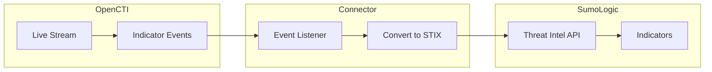

# OpenCTI Sumo Logic Intel Connector

| Status | Date | Comment |
|--------|------|---------|
| Filigran Verified | -    | -       |

The Sumo Logic Intel connector streams OpenCTI STIX indicators to Sumo Logic for threat intelligence integration.

## Table of Contents

- [OpenCTI Sumo Logic Intel Connector](#opencti-sumo-logic-intel-connector)
  - [Table of Contents](#table-of-contents)
  - [Introduction](#introduction)
  - [Installation](#installation)
    - [Requirements](#requirements)
  - [Configuration variables](#configuration-variables)
    - [OpenCTI environment variables](#opencti-environment-variables)
    - [Base connector environment variables](#base-connector-environment-variables)
    - [Connector extra parameters environment variables](#connector-extra-parameters-environment-variables)
  - [Deployment](#deployment)
    - [Docker Deployment](#docker-deployment)
    - [Manual Deployment](#manual-deployment)
  - [Usage](#usage)
  - [Behavior](#behavior)
  - [Debugging](#debugging)
  - [Additional information](#additional-information)

## Introduction

This connector enables organizations to create, update, and delete STIX indicator data from OpenCTI to Sumo Logic. It uses the Sumo Logic APIs to upload and manage threat intelligence.

Key features:
- Real-time synchronization of STIX indicators
- Support for create, update, and delete operations
- STIX 2.x JSON format support
- Automatic indicator expiration handling

## Installation

### Requirements

- OpenCTI Platform >= 6.7.8
- Sumo Logic account with API access

## Configuration variables

There are a number of configuration options, which are set either in `docker-compose.yml` (for Docker) or in `config.yml` (for manual deployment).

### OpenCTI environment variables

| Parameter     | config.yml | Docker environment variable | Mandatory | Description                                          |
|---------------|------------|-----------------------------|-----------|------------------------------------------------------|
| OpenCTI URL   | url        | `OPENCTI_URL`               | Yes       | The URL of the OpenCTI platform.                     |
| OpenCTI Token | token      | `OPENCTI_TOKEN`             | Yes       | The default admin token set in the OpenCTI platform. |

### Base connector environment variables

| Parameter                      | config.yml                | Docker environment variable             | Default          | Mandatory | Description                                                                    |
|--------------------------------|---------------------------|-----------------------------------------|------------------|-----------|--------------------------------------------------------------------------------|
| Connector ID                   | id                        | `CONNECTOR_ID`                          |                  | Yes       | A unique `UUIDv4` identifier for this connector instance.                      |
| Connector Type                 | type                      | `CONNECTOR_TYPE`                        | STREAM           | Yes       | Should always be set to `STREAM` for this connector.                           |
| Connector Name                 | name                      | `CONNECTOR_NAME`                        | Sumo Logic Intel | No        | Name of the connector.                                                         |
| Connector Scope                | scope                     | `CONNECTOR_SCOPE`                       | sumologic        | No        | The scope of the connector.                                                    |
| Live Stream ID                 | live_stream_id            | `CONNECTOR_LIVE_STREAM_ID`              |                  | Yes       | The Live Stream ID of the stream created in the OpenCTI interface.             |
| Live Stream Listen Delete      | live_stream_listen_delete | `CONNECTOR_LIVE_STREAM_LISTEN_DELETE`   | true             | Yes       | Listen to delete events.                                                       |
| Live Stream No Dependencies    | live_stream_no_dependencies| `CONNECTOR_LIVE_STREAM_NO_DEPENDENCIES`| true             | Yes       | Set to `true` unless synchronizing between OpenCTI platforms.                  |
| Log Level                      | log_level                 | `CONNECTOR_LOG_LEVEL`                   | error            | No        | Determines the verbosity of the logs.                                          |

### Connector extra parameters environment variables

| Parameter        | config.yml             | Docker environment variable      | Default | Mandatory | Description                                                |
|------------------|------------------------|----------------------------------|---------|-----------|------------------------------------------------------------|
| API Base URL     | sumologic.api_base_url | `SUMOLOGIC_INTEL_API_BASE_URL`   |         | Yes       | Sumo Logic API endpoint for your region.                   |
| Access ID        | sumologic.access_id    | `SUMOLOGIC_INTEL_ACCESS_ID`      |         | Yes       | Sumo Logic API Access ID.                                  |
| Access Key       | sumologic.access_key   | `SUMOLOGIC_INTEL_ACCESS_KEY`     |         | Yes       | Sumo Logic API Access Key.                                 |

## Deployment

### Docker Deployment

Before building the Docker container, ensure you have set the version of `pycti` in `requirements.txt` to match the version of OpenCTI you are running.

Build the Docker image:

```bash
docker build -t opencti/connector-sumologic-intel:latest .
```

Configure the connector in `docker-compose.yml`:

```yaml
  connector-sumologic-intel:
    image: opencti/connector-sumologic-intel:latest
    environment:
      - OPENCTI_URL=http://localhost
      - OPENCTI_TOKEN=ChangeMe
      - CONNECTOR_ID=ChangeMe
      - CONNECTOR_TYPE=STREAM
      - CONNECTOR_NAME=Sumo Logic Intel
      - CONNECTOR_SCOPE=sumologic
      - CONNECTOR_LOG_LEVEL=info
      - CONNECTOR_LIVE_STREAM_ID=ChangeMe
      - CONNECTOR_LIVE_STREAM_LISTEN_DELETE=true
      - CONNECTOR_LIVE_STREAM_NO_DEPENDENCIES=true
      - SUMOLOGIC_INTEL_API_BASE_URL=https://api.sumologic.com
      - SUMOLOGIC_INTEL_ACCESS_ID=ChangeMe
      - SUMOLOGIC_INTEL_ACCESS_KEY=ChangeMe
    restart: always
```

Start the connector:

```bash
docker compose up -d
```

### Manual Deployment

1. Create `config.yml` based on `config.yml.sample`.

2. Install dependencies:

```bash
pip3 install -r requirements.txt
```

3. Start the connector from the `src` directory:

```bash
python3 main.py
```

## Usage

1. Create API credentials in Sumo Logic
2. Determine your API endpoint based on geographic location
3. Create a Live Stream in OpenCTI (Data Management -> Data Sharing -> Live Streams)
4. Configure the stream to include indicators
5. Start the connector

## Behavior

The connector listens to OpenCTI live stream events and manages indicators in Sumo Logic.

### Data Flow



### Event Processing

| Event Type | Action                                       |
|------------|----------------------------------------------|
| create     | Uploads STIX indicator to Sumo Logic         |
| update     | Updates STIX indicator in Sumo Logic         |
| delete     | Removes indicator by ID from Sumo Logic      |

## Debugging

Enable verbose logging by setting:

```env
CONNECTOR_LOG_LEVEL=debug
```

To force resynchronization, navigate to **Data Management -> Ingestion -> Connectors**, find the connector, and click refresh.

### Common Issues

| Issue                          | Solution                                              |
|--------------------------------|-------------------------------------------------------|
| Authentication errors          | Verify Access ID and Access Key                       |
| Wrong API endpoint             | Check geographic endpoint documentation               |
| Indicator not created          | Verify indicator has valid STIX format                |

## Additional information

- **API Endpoints**: Check [Sumo Logic API documentation](https://api.sumologic.com/docs/#section/Getting-Started/API-Endpoints) for your geographic endpoint
- **STIX Format**: Indicators are uploaded in STIX 2.x JSON format
- **APIs Used**:
  - [Upload STIX Indicators](https://api.sumologic.com/docs/#operation/uploadStixIndicators)
  - [Remove Indicators](https://api.sumologic.com/docs/#operation/removeIndicators)
