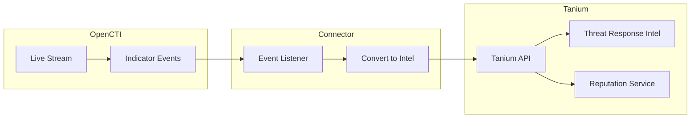

# OpenCTI Tanium Intel Connector

| Status | Date | Comment |
|--------|------|---------|
| Filigran Verified | -    | -       |

The Tanium Intel connector streams OpenCTI threat intelligence to Tanium Threat Response for endpoint detection and hunting.

## Table of Contents

- [OpenCTI Tanium Intel Connector](#opencti-tanium-intel-connector)
  - [Table of Contents](#table-of-contents)
  - [Introduction](#introduction)
  - [Installation](#installation)
    - [Requirements](#requirements)
  - [Configuration variables](#configuration-variables)
    - [OpenCTI environment variables](#opencti-environment-variables)
    - [Base connector environment variables](#base-connector-environment-variables)
    - [Connector extra parameters environment variables](#connector-extra-parameters-environment-variables)
  - [Deployment](#deployment)
    - [Docker Deployment](#docker-deployment)
    - [Manual Deployment](#manual-deployment)
  - [Usage](#usage)
  - [Behavior](#behavior)
  - [Debugging](#debugging)
  - [Additional information](#additional-information)

## Introduction

This connector enables organizations to feed Tanium Intels with OpenCTI threat intelligence. It consumes the OpenCTI events stream in real time and creates detection and hunting intel in the Tanium platform.

Key features:
- Real-time streaming of indicators to Tanium
- Hash management in Reputation shared service
- Automatic quickscan triggering on intel insertion
- Intel deployment to specified computer groups
- Support for create, update, and delete operations

## Installation

### Requirements

- OpenCTI Platform >= 5.0.0
- Tanium Threat Response >= 3.x.x
- Tanium API token with appropriate permissions

## Configuration variables

There are a number of configuration options, which are set either in `docker-compose.yml` (for Docker) or in `config.yml` (for manual deployment).

### OpenCTI environment variables

| Parameter     | config.yml | Docker environment variable | Mandatory | Description                                          |
|---------------|------------|-----------------------------|-----------|------------------------------------------------------|
| OpenCTI URL   | url        | `OPENCTI_URL`               | Yes       | The URL of the OpenCTI platform.                     |
| OpenCTI Token | token      | `OPENCTI_TOKEN`             | Yes       | The default admin token set in the OpenCTI platform. |

### Base connector environment variables

| Parameter                      | config.yml                | Docker environment variable             | Default | Mandatory | Description                                                                    |
|--------------------------------|---------------------------|-----------------------------------------|---------|-----------|--------------------------------------------------------------------------------|
| Connector ID                   | id                        | `CONNECTOR_ID`                          |         | Yes       | A unique `UUIDv4` identifier for this connector instance.                      |
| Connector Type                 | type                      | `CONNECTOR_TYPE`                        | STREAM  | Yes       | Should always be set to `STREAM` for this connector.                           |
| Connector Name                 | name                      | `CONNECTOR_NAME`                        |         | Yes       | Name of the connector.                                                         |
| Connector Scope                | scope                     | `CONNECTOR_SCOPE`                       |         | Yes       | The scope of the connector.                                                    |
| Live Stream ID                 | live_stream_id            | `CONNECTOR_LIVE_STREAM_ID`              |         | Yes       | The Live Stream ID of the stream created in the OpenCTI interface.             |
| Live Stream Listen Delete      | live_stream_listen_delete | `CONNECTOR_LIVE_STREAM_LISTEN_DELETE`   | true    | Yes       | Listen to delete events.                                                       |
| Live Stream No Dependencies    | live_stream_no_dependencies| `CONNECTOR_LIVE_STREAM_NO_DEPENDENCIES`| true    | Yes       | Set to `true` unless synchronizing between OpenCTI platforms.                  |
| Log Level                      | log_level                 | `CONNECTOR_LOG_LEVEL`                   | info    | No        | Determines the verbosity of the logs.                                          |

### Connector extra parameters environment variables

| Parameter              | config.yml                   | Docker environment variable          | Default | Mandatory | Description                                                     |
|------------------------|------------------------------|--------------------------------------|---------|-----------|-----------------------------------------------------------------|
| Tanium API URL         | tanium_intel.url             | `TANIUM_INTEL_URL`                   |         | Yes       | Tanium instance API URL.                                        |
| Tanium Console URL     | tanium_intel.url_console     | `TANIUM_INTEL_URL_CONSOLE`           |         | Yes       | Tanium instance console URL.                                    |
| SSL Verify             | tanium_intel.ssl_verify      | `TANIUM_INTEL_SSL_VERIFY`            | true    | No        | Enable SSL certificate verification.                            |
| Tanium API Token       | tanium_intel.token           | `TANIUM_INTEL_TOKEN`                 |         | Yes       | Tanium API token.                                               |
| Hashes in Reputation   | tanium_intel.hashes_in_reputation | `TANIUM_INTEL_HASHES_IN_REPUTATION` | true | No      | Put hashes in Reputation shared service.                        |
| No Hashes in Intels    | tanium_intel.no_hashes_in_intels | `TANIUM_INTEL_NO_HASHES_IN_INTELS` | true  | No        | Do not insert hashes in intel documents.                        |
| Auto On-Demand Scan    | tanium_intel.auto_ondemand_scan | `TANIUM_INTEL_AUTO_ONDEMAND_SCAN` | true   | No        | Trigger quickscan for each inserted intel.                      |
| Computer Groups        | tanium_intel.computer_groups | `TANIUM_INTEL_COMPUTER_GROUPS`       | 1       | No        | Comma-separated list of computer group IDs for quickscan.       |
| Deploy Intel           | tanium_intel.deploy_intel    | `TANIUM_INTEL_DEPLOY_INTEL`          | true    | No        | Deploy the intel in Tanium.                                     |

## Deployment

### Docker Deployment

Before building the Docker container, ensure you have set the version of `pycti` in `requirements.txt` to match the version of OpenCTI you are running.

Build the Docker image:

```bash
docker build -t opencti/connector-tanium-intel:latest .
```

Configure the connector in `docker-compose.yml`:

```yaml
  connector-tanium-intel:
    image: opencti/connector-tanium-intel:latest
    environment:
      - OPENCTI_URL=http://localhost
      - OPENCTI_TOKEN=ChangeMe
      - CONNECTOR_ID=ChangeMe
      - CONNECTOR_TYPE=STREAM
      - CONNECTOR_NAME=Tanium Intel
      - CONNECTOR_SCOPE=tanium
      - CONNECTOR_LOG_LEVEL=info
      - CONNECTOR_LIVE_STREAM_ID=ChangeMe
      - TANIUM_INTEL_URL=https://tanium.example.com/api/v2
      - TANIUM_INTEL_URL_CONSOLE=https://tanium.example.com
      - TANIUM_INTEL_SSL_VERIFY=true
      - TANIUM_INTEL_TOKEN=ChangeMe
      - TANIUM_INTEL_HASHES_IN_REPUTATION=true
      - TANIUM_INTEL_NO_HASHES_IN_INTELS=true
      - TANIUM_INTEL_AUTO_ONDEMAND_SCAN=true
      - TANIUM_INTEL_COMPUTER_GROUPS=1
      - TANIUM_INTEL_DEPLOY_INTEL=true
    restart: always
```

Start the connector:

```bash
docker compose up -d
```

### Manual Deployment

1. Create `config.yml` based on `config.yml.sample`.

2. Install dependencies:

```bash
pip3 install -r requirements.txt
```

3. Start the connector from the `src` directory:

```bash
python3 main.py
```

## Usage

1. Create a Live Stream in OpenCTI (Data Management -> Data Sharing -> Live Streams)
2. Configure the stream to include indicators
3. Copy the Live Stream ID to the connector configuration
4. Start the connector

To force resynchronization, navigate to **Data Management -> Ingestion -> Connectors**, find the connector, and click refresh.

## Behavior

The connector listens to OpenCTI live stream events and creates intel in Tanium.

### Data Flow



### Event Processing

| Event Type | Action                                       |
|------------|----------------------------------------------|
| create     | Creates intel and optionally triggers scan   |
| update     | Updates existing intel                       |
| delete     | Removes intel from Tanium                    |

### Hash Handling Options

| Setting                | Effect                                      |
|------------------------|---------------------------------------------|
| hashes_in_reputation=true | Hashes added to Reputation shared service |
| no_hashes_in_intels=true | Hashes not inserted in intel documents    |

## Debugging

Enable verbose logging by setting:

```env
CONNECTOR_LOG_LEVEL=debug
```

### Common Issues

| Issue                          | Solution                                              |
|--------------------------------|-------------------------------------------------------|
| Authentication errors          | Verify Tanium API token is correct                    |
| SSL certificate errors         | Set `TANIUM_INTEL_SSL_VERIFY=false` for testing       |
| Quickscan not triggered        | Verify computer group IDs are correct                 |
| Intel not deployed             | Check `deploy_intel` setting is enabled               |

## Additional information

- **Reputation Service**: Use for hash-based detections
- **Intel Documents**: Use for complex indicator patterns
- **Quickscan**: Automatically triggered on intel insertion if enabled
- **Computer Groups**: Target specific groups for quickscan operations
