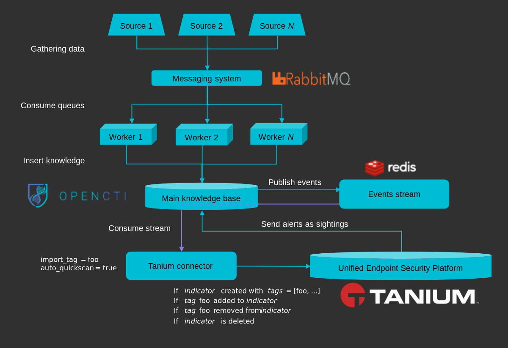

# OpenCTI Tanium Connector

This connector allows organizations to feed the **Tanium Intels** using OpenCTI knowledge.

This connector leverages the OpenCTI *events stream*, so it consumes knowledge in real time and, depending on its settings, create detection and hunting intel pieces in the Tanium platform.

## General overview

OpenCTI data is coming from *import* connectors. Once this data is ingested in OpenCTI, it is pushed to a Redis event stream. This stream is consumed by the Tanium connector to insert intel in the Tanium platform.

## Installation

### Requirements

- OpenCTI Platform >= 5.0.0
- Tanium Threat Response >= 3.X.X

### Configuration

| Parameter                     | Docker envvar                 | Mandatory    | Description                                                                                                                |
|-------------------------------|-------------------------------| ------------ |----------------------------------------------------------------------------------------------------------------------------|
| `opencti_url`                 | `OPENCTI_URL`                 | Yes          | The URL of the OpenCTI platform.                                                                                           |
| `opencti_token`               | `OPENCTI_TOKEN`               | Yes          | The token of the OpenCTI user (it's recommanded to create a dedicated user for the connector with the Administrator role). |
| `connector_id`                | `CONNECTOR_ID`                | Yes          | A valid arbitrary `UUIDv4` that must be unique for this connector.                                                         |
| `connector_live_stream_id`    | `CONNECTOR_LIVE_STREAM_ID`    | Yes          | The Live Stream ID of the stream created in the OpenCTI interface                                                          |
| `connector_name`              | `CONNECTOR_NAME`              | Yes          | The name of the Tanium instance, to identify it if you have multiple Tanium connectors.                                    |
| `connector_scope`             | `CONNECTOR_SCOPE`             | Yes          | Must be `tanium`, not used in this connector.                                                                              |
| `connector_confidence_level`  | `CONNECTOR_CONFIDENCE_LEVEL`  | Yes          | The default confidence level for created sightings (a number between 1 and 4).                                             |
| `connector_log_level`         | `CONNECTOR_LOG_LEVEL`         | Yes          | The log level for this connector, could be `debug`, `info`, `warn` or `error` (less verbose).                              |
| `tanium_url`                  | `TANIUM_URL`                  | Yes          | The Tanium instance API URL.                                                                                               |
| `tanium_url_console`          | `TANIUM_URL_CONSOLE`          | Yes          | The Tanium instance console URL.                                                                                           |
| `tanium_ssl_verify`           | `TANIUM_SSL_VERIFY`           | Yes          | Enable the SSL certificate check (default: `true`)                                                                         |
| `tanium_token`                | `TANIUM_TOKEN`                | Yes          | The Tanium login user.                                                                                                     |
| `tanium_hashes_in_reputation` | `TANIUM_HASHES_IN_REPUTATION` | Yes          | Put hashes in the Reputation shared service.                                                                               |
| `tanium_no_hashes_in_intels`  | `TANIUM_NO_HASHES_IN_INTELS`  | Yes          | Do not insert hashes in intel documents.                                                                                   |
| `auto_ondemand_scan`          | `TANIUM_AUTO_ONDEMAND_SCAN`   | No           | Trigger a quickscan for each inserted intel document in Tanium.                                                            |
| `tanium_computer_groups`      | `TANIUM_COMPUTER_GROUPS  `    | No           | A list of computer groups separated by `,`, which will be the targets of the automatic quickscan the automatic quickscan   |
