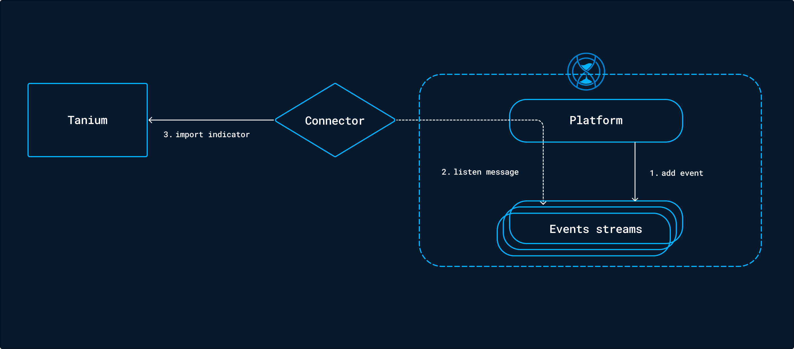

# OpenCTI Tanium Connector

# OpenCTI Stream Connector Template

<!--
General description of the connector
* What it does
* How it works
* Special requirements
* Use case description
* ...
-->

Table of Contents

- [OpenCTI Stream Connector Template](#opencti-stream-connector-template)
    - [Introduction](#introduction)
    - [Installation](#installation)
        - [Requirements](#requirements)
    - [Configuration variables](#configuration-variables)
        - [OpenCTI environment variables](#opencti-environment-variables)
        - [Base connector environment variables](#base-connector-environment-variables)
        - [Connector extra parameters environment variables](#connector-extra-parameters-environment-variables)
    - [Deployment](#deployment)
        - [Docker Deployment](#docker-deployment)
        - [Manual Deployment](#manual-deployment)
    - [Usage](#usage)
    - [Behavior](#behavior)
    - [Debugging](#debugging)
    - [Additional information](#additional-information)

## Introduction

This connector allows organizations to feed the **Tanium Intels** using OpenCTI knowledge.

This connector leverages the OpenCTI *events stream*, so it consumes knowledge in real time and, depending on its
settings, create detection and hunting intel pieces in the Tanium platform.

## General overview

OpenCTI data is coming from *import* connectors. Once this data is ingested in OpenCTI, it is pushed to a Redis event
stream. This stream is consumed by the Tanium connector to insert intel in the Tanium platform.



## Installation

### Requirements

- OpenCTI Platform >= 5.0.0
- Tanium Threat Response >= 3.X.X

## Configuration variables

There are a number of configuration options, which are set either in `docker-compose.yml` (for Docker) or
in `config.yml` (for manual deployment).

### OpenCTI environment variables

Below are the parameters you'll need to set for OpenCTI:

| Parameter     | config.yml | Docker environment variable | Mandatory | Description                                          |
|---------------|------------|-----------------------------|-----------|------------------------------------------------------|
| OpenCTI URL   | url        | `OPENCTI_URL`               | Yes       | The URL of the OpenCTI platform.                     |
| OpenCTI Token | token      | `OPENCTI_TOKEN`             | Yes       | The default admin token set in the OpenCTI platform. |

### Base connector environment variables

Below are the parameters you'll need to set for running the connector properly:

| Parameter                             | config.yml                  | Docker environment variable             | Default | Mandatory | Description                                                                                                                                            |
|---------------------------------------|-----------------------------|-----------------------------------------|---------|-----------|--------------------------------------------------------------------------------------------------------------------------------------------------------|
| Connector ID                          | id                          | `CONNECTOR_ID`                          | /       | Yes       | A unique `UUIDv4` identifier for this connector instance.                                                                                              |
| Connector Type                        | type                        | `CONNECTOR_TYPE`                        | STREAM  | Yes       | Should always be set to `STREAM` for this connector.                                                                                                   |
| Connector Name                        | name                        | `CONNECTOR_NAME`                        |         | Yes       | Name of the connector.                                                                                                                                 |
| Connector Scope                       | scope                       | `CONNECTOR_SCOPE`                       |         | Yes       | The scope or type of data the connector is importing, either a MIME type or Stix Object.                                                               |
| Log Level                             | log_level                   | `CONNECTOR_LOG_LEVEL`                   | info    | Yes       | Determines the verbosity of the logs. Options are `debug`, `info`, `warn`, or `error`.                                                                 |
| Connector Live Stream ID              | live_stream_id              | `CONNECTOR_LIVE_STREAM_ID`              | /       | Yes       | ID of the live stream created in the OpenCTI UI                                                                                                        |
| Connector Live Stream Listen Delete   | live_stream_listen_delete   | `CONNECTOR_LIVE_STREAM_LISTEN_DELETE`   | true    | Yes       | Listen to all delete events concerning the entity, depending on the filter set for the OpenCTI stream.                                                 |
| Connector Live Stream No dependencies | live_stream_no_dependencies | `CONNECTOR_LIVE_STREAM_NO_DEPENDENCIES` | true    | Yes       | Always set to `True` unless you are synchronizing 2 OpenCTI platforms and you want to get an entity and all context (relationships and related entity) |

### Connector extra parameters environment variables

Below are the parameters you'll need to set for the connector:

| Parameter              | config.yml                  | Docker environment variable   | Default | Mandatory | Description                                                                                                              |
|------------------------|-----------------------------|-------------------------------|---------|-----------|--------------------------------------------------------------------------------------------------------------------------|
| Tanium API base URL    | tanium_url                  | `TANIUM_URL`                  |         | Yes       | The Tanium instance API URL.                                                                                             |
| Tanium console URL     | tanium_url_console          | `TANIUM_URL_CONSOLE`          |         | Yes       | The Tanium instance console URL.                                                                                         |
| SSL verification       | tanium_ssl_verify           | `TANIUM_SSL_VERIFY`           | True    | Yes       | Enable the SSL certificate check                                                                                         |
| Tanium API token       | tanium_token                | `TANIUM_TOKEN`                |         | Yes       | The Tanium login user.                                                                                                   |
| Hashes in reputation   | tanium_hashes_in_reputation | `TANIUM_HASHES_IN_REPUTATION` | True    | Yes       | Put hashes in the Reputation shared service.                                                                             |
| No hashes in intels    | tanium_no_hashes_in_intels  | `TANIUM_NO_HASHES_IN_INTELS`  | True    | Yes       | Do not insert hashes in intel documents.                                                                                 |
| Auto on-demand scan    | auto_ondemand_scan          | `TANIUM_AUTO_ONDEMAND_SCAN`   | True    | No        | Trigger a quickscan for each inserted intel document in Tanium.                                                          |
| Tanium computer groups | tanium_computer_groups      | `TANIUM_COMPUTER_GROUPS`      | `1`     | No        | A list of computer groups separated by `,`, which will be the targets of the automatic quickscan the automatic quickscan |

## Deployment

### Docker Deployment

Before building the Docker container, you need to set the version of pycti in `requirements.txt` equal to whatever
version of OpenCTI you're running. Example, `pycti==5.12.20`. If you don't, it will take the latest version, but
sometimes the OpenCTI SDK fails to initialize.

Build a Docker Image using the provided `Dockerfile`.

Example:

```shell
# Replace the IMAGE NAME with the appropriate value
docker build . -t [IMAGE NAME]:latest
```

Make sure to replace the environment variables in `docker-compose.yml` with the appropriate configurations for your
environment. Then, start the docker container with the provided docker-compose.yml

```shell
docker compose up -d
# -d for detached
```

### Manual Deployment

Create a file `config.yml` based on the provided `config.yml.sample`.

Replace the configuration variables (especially the "**ChangeMe**" variables) with the appropriate configurations for
you environment.

Install the required python dependencies (preferably in a virtual environment):

```shell
pip3 install -r requirements.txt
```

Then, start the connector from recorded-future/src:

```shell
python3 main.py
```

## Usage

After Installation, the connector should require minimal interaction to use, and should update automatically at a
regular interval specified in your `docker-compose.yml` or `config.yml` in `duration_period`.

However, if you would like to force an immediate download of a new batch of entities, navigate to:

`Data management` -> `Ingestion` -> `Connectors` in the OpenCTI platform.

Find the connector, and click on the refresh button to reset the connector's state and force a new
download of data by re-running the connector.

## Behavior

<!--
Describe how the connector functions:
* What data is ingested, updated, or modified
* Important considerations for users when utilizing this connector
* Additional relevant details
-->

## Debugging

The connector can be debugged by setting the appropiate log level.
Note that logging messages can be added using `self.helper.connector_logger,{LOG_LEVEL}("Sample message")`, i.
e., `self.helper.connector_logger.error("An error message")`.

<!-- Any additional information to help future users debug and report detailed issues concerning this connector -->

## Additional information

<!--
Any additional information about this connector
* What information is ingested/updated/changed
* What should the user take into account when using this connector
* ...
-->