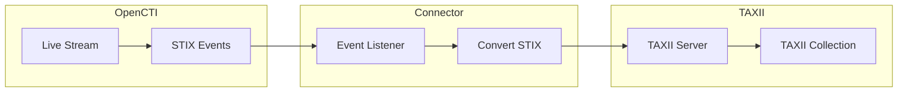

# OpenCTI TAXII POST Connector

| Status | Date | Comment |
|--------|------|---------|
| Filigran Verified | -    | -       |

The TAXII POST connector streams OpenCTI STIX knowledge to a TAXII server for threat intelligence sharing.

## Table of Contents

- [OpenCTI TAXII POST Connector](#opencti-taxii-post-connector)
  - [Table of Contents](#table-of-contents)
  - [Introduction](#introduction)
  - [Installation](#installation)
    - [Requirements](#requirements)
  - [Configuration variables](#configuration-variables)
    - [OpenCTI environment variables](#opencti-environment-variables)
    - [Base connector environment variables](#base-connector-environment-variables)
    - [Connector extra parameters environment variables](#connector-extra-parameters-environment-variables)
  - [Deployment](#deployment)
    - [Docker Deployment](#docker-deployment)
    - [Manual Deployment](#manual-deployment)
  - [Usage](#usage)
  - [Behavior](#behavior)
  - [Debugging](#debugging)
  - [Additional information](#additional-information)

## Introduction

This connector consumes an OpenCTI live stream and POSTs STIX knowledge and events to a TAXII server. It enables sharing threat intelligence with other organizations or security tools that support the TAXII protocol.

Key features:
- Real-time STIX knowledge sharing via TAXII
- Support for TAXII 2.0 and 2.1
- Bearer token and Basic authentication
- Configurable STIX version output

## Installation

### Requirements

- OpenCTI Platform >= 6.0.0
- TAXII 2.x server with write access

## Configuration variables

There are a number of configuration options, which are set either in `docker-compose.yml` (for Docker) or in `config.yml` (for manual deployment).

### OpenCTI environment variables

| Parameter     | config.yml | Docker environment variable | Mandatory | Description                                          |
|---------------|------------|-----------------------------|-----------|------------------------------------------------------|
| OpenCTI URL   | url        | `OPENCTI_URL`               | Yes       | The URL of the OpenCTI platform.                     |
| OpenCTI Token | token      | `OPENCTI_TOKEN`             | Yes       | The default admin token set in the OpenCTI platform. |

### Base connector environment variables

| Parameter                      | config.yml                | Docker environment variable             | Default    | Mandatory | Description                                                                    |
|--------------------------------|---------------------------|-----------------------------------------|------------|-----------|--------------------------------------------------------------------------------|
| Connector ID                   | id                        | `CONNECTOR_ID`                          |            | Yes       | A unique `UUIDv4` identifier for this connector instance.                      |
| Connector Name                 | name                      | `CONNECTOR_NAME`                        | TAXII POST | No        | Name of the connector.                                                         |
| Connector Scope                | scope                     | `CONNECTOR_SCOPE`                       | taxii      | Yes       | The scope of the connector.                                                    |
| Live Stream ID                 | live_stream_id            | `CONNECTOR_LIVE_STREAM_ID`              |            | Yes       | The Live Stream ID of the stream created in the OpenCTI interface.             |
| Live Stream Listen Delete      | live_stream_listen_delete | `CONNECTOR_LIVE_STREAM_LISTEN_DELETE`   | true       | No        | Listen to delete events.                                                       |
| Live Stream No Dependencies    | live_stream_no_dependencies| `CONNECTOR_LIVE_STREAM_NO_DEPENDENCIES`| true       | No        | Set to `true` unless synchronizing between OpenCTI platforms.                  |
| Confidence Level               | confidence_level          | `CONNECTOR_CONFIDENCE_LEVEL`            | 80         | No        | Default confidence level (0-100).                                              |
| Log Level                      | log_level                 | `CONNECTOR_LOG_LEVEL`                   | info       | No        | Determines the verbosity of the logs.                                          |

### Connector extra parameters environment variables

| Parameter        | config.yml          | Docker environment variable | Default | Mandatory | Description                                                |
|------------------|---------------------|-----------------------------|---------|-----------|------------------------------------------------------------|
| TAXII URL        | taxii.url           | `TAXII_URL`                 |         | Yes       | URL of the TAXII server.                                   |
| SSL Verify       | taxii.ssl_verify    | `TAXII_SSL_VERIFY`          | true    | No        | Verify SSL certificates.                                   |
| Collection ID    | taxii.collection_id | `TAXII_COLLECTION_ID`       |         | Yes       | TAXII collection ID to POST to.                            |
| Token            | taxii.token         | `TAXII_TOKEN`               |         | No        | Bearer token (if set, Basic auth is ignored).              |
| Login            | taxii.login         | `TAXII_LOGIN`               |         | No        | Username for Basic authentication.                         |
| Password         | taxii.password      | `TAXII_PASSWORD`            |         | No        | Password for Basic authentication.                         |
| TAXII Version    | taxii.version       | `TAXII_VERSION`             | 2.1     | No        | TAXII protocol version (2.0 or 2.1).                       |
| STIX Version     | taxii.stix_version  | `TAXII_STIX_VERSION`        | 2.1     | No        | STIX output version (2.0 or 2.1).                          |

## Deployment

### Docker Deployment

Build the Docker image:

```bash
docker build -t opencti/connector-taxii-post:latest .
```

Configure the connector in `docker-compose.yml`:

```yaml
  connector-taxii-post:
    image: opencti/connector-taxii-post:latest
    environment:
      - OPENCTI_URL=http://localhost
      - OPENCTI_TOKEN=ChangeMe
      - CONNECTOR_ID=ChangeMe
      - CONNECTOR_NAME=TAXII POST
      - CONNECTOR_SCOPE=taxii
      - CONNECTOR_LOG_LEVEL=info
      - CONNECTOR_LIVE_STREAM_ID=ChangeMe
      - TAXII_URL=https://taxii.example.com
      - TAXII_SSL_VERIFY=true
      - TAXII_COLLECTION_ID=ChangeMe
      - TAXII_TOKEN=ChangeMe
      - TAXII_VERSION=2.1
      - TAXII_STIX_VERSION=2.1
    restart: always
```

Start the connector:

```bash
docker compose up -d
```

### Manual Deployment

1. Create `config.yml` based on `config.yml.sample`.

2. Install dependencies:

```bash
pip3 install -r requirements.txt
```

3. Start the connector from the `src` directory:

```bash
python3 main.py
```

## Usage

1. Create a TAXII collection on your TAXII server
2. Note the collection ID
3. Create a Live Stream in OpenCTI (Data Management -> Data Sharing -> Live Streams)
4. Configure the stream with appropriate filters
5. Start the connector

## Behavior

The connector listens to OpenCTI live stream events and POSTs STIX objects to a TAXII server.

### Data Flow



### Event Processing

| Event Type | Action                                       |
|------------|----------------------------------------------|
| create     | POSTs STIX object to TAXII collection        |
| update     | POSTs updated STIX object to collection      |
| delete     | POSTs delete notification to collection      |

### Authentication Options

| Auth Type | Configuration                                |
|-----------|----------------------------------------------|
| Bearer    | Set `TAXII_TOKEN` (Basic auth ignored)       |
| Basic     | Set `TAXII_LOGIN` and `TAXII_PASSWORD`       |

## Debugging

Enable verbose logging by setting:

```env
CONNECTOR_LOG_LEVEL=debug
```

### Common Issues

| Issue                          | Solution                                              |
|--------------------------------|-------------------------------------------------------|
| Authentication errors          | Verify token or login/password credentials            |
| Collection not found           | Verify collection ID exists on TAXII server           |
| SSL certificate errors         | Set `TAXII_SSL_VERIFY=false` for testing              |
| Version mismatch               | Ensure TAXII/STIX versions match server requirements  |

## Additional information

- **TAXII Versions**: Supports TAXII 2.0 and 2.1
- **STIX Versions**: Can output STIX 2.0 or 2.1 format
- **Authentication**: Bearer token takes precedence over Basic auth
- **Use Cases**: Share threat intelligence with partners, feed other security tools
