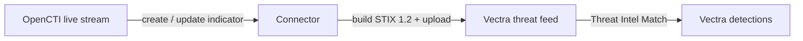

# OpenCTI Vectra AI Intel Connector

The Vectra AI Intel connector is a **stream** connector that pushes indicators of
compromise (IOCs) curated in OpenCTI to the [Vectra AI Platform](https://www.vectra.ai)
in real time. It listens to an OpenCTI live stream and maintains a Vectra
*threat feed* so that Vectra network detections (Threat Intel Match) fire on the
intelligence you trust.

Table of Contents

- [OpenCTI Vectra AI Intel Connector](#opencti-vectra-ai-intel-connector)
  - [Introduction](#introduction)
  - [Requirements](#requirements)
  - [Configuration variables](#configuration-variables)
    - [OpenCTI environment variables](#opencti-environment-variables)
    - [Base connector environment variables](#base-connector-environment-variables)
    - [Connector extra parameters environment variables](#connector-extra-parameters-environment-variables)
  - [Deployment](#deployment)
    - [Docker Deployment](#docker-deployment)
    - [Manual Deployment](#manual-deployment)
  - [Behavior](#behavior)
  - [Supported observables](#supported-observables)
  - [Development](#development)

## Introduction

The [Vectra AI Platform](https://www.vectra.ai) is a Network Detection and
Response (NDR) solution. It supports custom threat intelligence through
*threat feeds*: STIX documents of IP addresses, domains and URLs that Vectra
matches against observed network traffic.

This connector subscribes to an OpenCTI live stream and forwards every supported
indicator to a managed Vectra threat feed using the Vectra threat feed import
API. The feed is created automatically on the first run if it does not exist yet.

## Requirements

- OpenCTI Platform >= 7.260722.0
- A Vectra AI Platform / Brain reachable over HTTPS
- A Vectra API token with permission to manage threat feeds

## Configuration variables

Configuration parameters can be provided in either `config.yml` (see
`config.yml.sample`), `docker-compose.yml` (environment variables) or directly as
environment variables.

### OpenCTI environment variables

| Parameter     | config.yml | Docker environment variable | Mandatory | Description                                          |
| ------------- | ---------- | --------------------------- | --------- | ---------------------------------------------------- |
| OpenCTI URL   | `url`      | `OPENCTI_URL`               | Yes       | The URL of the OpenCTI platform.                     |
| OpenCTI Token | `token`    | `OPENCTI_TOKEN`             | Yes       | The default admin token set in the OpenCTI platform. |

### Base connector environment variables

| Parameter             | config.yml                  | Docker environment variable           | Default          | Mandatory | Description                                                       |
| --------------------- | --------------------------- | ------------------------------------- | ---------------- | --------- | ---------------------------------------------------------------- |
| Connector ID          | `id`                        | `CONNECTOR_ID`                        | /                | Yes       | A unique `UUIDv4` identifier for this connector instance.        |
| Connector Name        | `name`                      | `CONNECTOR_NAME`                      | `Vectra AI Intel`| No        | Name of the connector.                                           |
| Connector Scope       | `scope`                     | `CONNECTOR_SCOPE`                     | `vectra-ai`      | No        | The scope of the connector.                                      |
| Log Level             | `log_level`                 | `CONNECTOR_LOG_LEVEL`                 | `error`          | No        | Logs verbosity (`debug`, `info`, `warn`, `error`).               |
| Live Stream ID        | `live_stream_id`            | `CONNECTOR_LIVE_STREAM_ID`            | /                | Yes       | ID of the live stream created in the OpenCTI UI.                 |
| Listen Delete         | `live_stream_listen_delete` | `CONNECTOR_LIVE_STREAM_LISTEN_DELETE` | `true`           | No        | Whether to listen to delete events on the live stream.          |
| No Dependencies       | `live_stream_no_dependencies` | `CONNECTOR_LIVE_STREAM_NO_DEPENDENCIES` | `true`       | No        | Whether to ignore dependencies when processing stream events.   |

### Connector extra parameters environment variables

| Parameter      | config.yml       | Docker environment variable | Default   | Mandatory | Description                                                                       |
| -------------- | ---------------- | --------------------------- | --------- | --------- | -------------------------------------------------------------------------------- |
| API base URL   | `api_base_url`   | `VECTRA_AI_API_BASE_URL`    | /         | Yes       | Base URL of the Vectra AI Platform (e.g. `https://vectra.example.com`).           |
| API token      | `api_token`      | `VECTRA_AI_API_TOKEN`       | /         | Yes       | The Vectra AI API token used to authenticate.                                     |
| API version    | `api_version`    | `VECTRA_AI_API_VERSION`     | `v2.5`    | No        | Version of the Vectra API used to reach the threat feed endpoints.               |
| Feed name      | `feed_name`      | `VECTRA_AI_FEED_NAME`       | `OpenCTI` | No        | Name of the Vectra threat feed managed by the connector (created if missing).     |
| Feed category  | `feed_category`  | `VECTRA_AI_FEED_CATEGORY`   | `cnc`     | No        | Detection category of the feed (`cnc`, `malware`, `recon`, `exfil`, `lateral`).   |
| Feed certainty | `feed_certainty` | `VECTRA_AI_FEED_CERTAINTY`  | `High`    | No        | Certainty applied to matches (`Low`, `Medium`, `High`).                           |
| Feed duration  | `feed_duration`  | `VECTRA_AI_FEED_DURATION`   | `14`      | No        | Number of days indicators remain active before expiring.                         |
| SSL verify     | `ssl_verify`     | `VECTRA_AI_SSL_VERIFY`      | `true`    | No        | Whether to verify the SSL certificate of the Vectra API.                          |

## Deployment

### Docker Deployment

Build a Docker image using the provided `Dockerfile`:

```shell
docker build . -t opencti/connector-vectra-ai:latest
```

Make sure to replace the environment variables in `docker-compose.yml` with the
appropriate configurations, then start the connector:

```shell
docker compose up -d
```

### Manual Deployment

Create a `config.yml` file at the connector root from `config.yml.sample` and
fill in the values, then:

```shell
pip install -r src/requirements.txt
python src/main.py
```

## Behavior



- On indicator **create**/**update**: the connector extracts the observable from
  the STIX pattern, builds a STIX 1.2 document and uploads it to the managed
  Vectra threat feed (the feed is created automatically if needed).
- On indicator **delete**: Vectra threat feeds do not support per-indicator
  deletion through the API. Indicators expire automatically based on the
  configured `feed_duration`.

## Supported observables

The Vectra threat feed import API only ingests network indicators. The connector
forwards indicators whose STIX pattern is one of:

- `[ipv4-addr:value = '...']`
- `[ipv6-addr:value = '...']`
- `[domain-name:value = '...']`
- `[url:value = '...']`

Other patterns (file hashes, email addresses, compound patterns, etc.) are
ignored.

## Development

Run the linters and the test suite before opening a pull request:

```shell
isort --profile black --line-length 88 .
black .
flake8 --ignore=E,W .
pip install -r tests/test-requirements.txt
pytest tests
```
