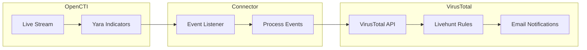

# OpenCTI VirusTotal Livehunt Stream Connector

| Status | Date | Comment |
|--------|------|---------|
| Community | -    | -       |

The VirusTotal Livehunt connector creates and manages VirusTotal Livehunt rules from OpenCTI Yara indicators.

## Table of Contents

- [OpenCTI VirusTotal Livehunt Stream Connector](#opencti-virustotal-livehunt-stream-connector)
  - [Table of Contents](#table-of-contents)
  - [Introduction](#introduction)
  - [Installation](#installation)
    - [Requirements](#requirements)
  - [Configuration variables](#configuration-variables)
    - [OpenCTI environment variables](#opencti-environment-variables)
    - [Base connector environment variables](#base-connector-environment-variables)
    - [Connector extra parameters environment variables](#connector-extra-parameters-environment-variables)
  - [Deployment](#deployment)
    - [Docker Deployment](#docker-deployment)
    - [Manual Deployment](#manual-deployment)
  - [Usage](#usage)
  - [Behavior](#behavior)
  - [Debugging](#debugging)
  - [Additional information](#additional-information)

## Introduction

This connector allows organizations to create and manage VirusTotal Livehunts from OpenCTI. When enabling a Yara rule indicator in OpenCTI (setting detection to true), the connector automatically creates a new Livehunt in VirusTotal.

Key features:
- Automatic Livehunt creation from Yara indicators
- Email notification support when rules trigger
- Shared ownership management for team collaboration
- Support for create, update, and delete operations
- Detection flag-based activation

## Installation

### Requirements

- OpenCTI Platform >= 5.0.0
- VirusTotal Premium API key with Livehunt access

## Configuration variables

There are a number of configuration options, which are set either in `docker-compose.yml` (for Docker) or in `config.yml` (for manual deployment).

### OpenCTI environment variables

| Parameter     | config.yml | Docker environment variable | Mandatory | Description                                          |
|---------------|------------|-----------------------------|-----------|------------------------------------------------------|
| OpenCTI URL   | url        | `OPENCTI_URL`               | Yes       | The URL of the OpenCTI platform.                     |
| OpenCTI Token | token      | `OPENCTI_TOKEN`             | Yes       | The default admin token set in the OpenCTI platform. |

### Base connector environment variables

| Parameter                      | config.yml                 | Docker environment variable              | Default             | Mandatory | Description                                                                    |
|--------------------------------|----------------------------|------------------------------------------|---------------------|-----------|--------------------------------------------------------------------------------|
| Connector ID                   | id                         | `CONNECTOR_ID`                           |                     | Yes       | A unique `UUIDv4` identifier for this connector instance.                      |
| Connector Name                 | name                       | `CONNECTOR_NAME`                         | VirusTotal LiveHunts | No       | Name of the connector.                                                         |
| Connector Scope                | scope                      | `CONNECTOR_SCOPE`                        | yara                | Yes       | Must be `yara` or `Yara`.                                                      |
| Live Stream ID                 | live_stream_id             | `CONNECTOR_LIVE_STREAM_ID`               |                     | Yes       | The Live Stream ID of the stream created in the OpenCTI interface.             |
| Live Stream Listen Delete      | live_stream_listen_delete  | `CONNECTOR_LIVE_STREAM_LISTEN_DELETE`    | true                | No        | Listen to delete events.                                                       |
| Live Stream No Dependencies    | live_stream_no_dependencies| `CONNECTOR_LIVE_STREAM_NO_DEPENDENCIES`  | true                | No        | Set to `true` unless synchronizing between OpenCTI platforms.                  |
| Confidence Level               | confidence_level           | `CONNECTOR_CONFIDENCE_LEVEL`             | 80                  | No        | Default confidence level (0-100).                                              |
| Log Level                      | log_level                  | `CONNECTOR_LOG_LEVEL`                    | info                | No        | Determines the verbosity of the logs.                                          |

### Connector extra parameters environment variables

| Parameter            | config.yml                       | Docker environment variable                | Default | Mandatory | Description                                                     |
|----------------------|----------------------------------|--------------------------------------------|---------|-----------|-----------------------------------------------------------------|
| API Token            | virustotal_livehunt.token        | `VIRUSTOTAL_LIVEHUNT_TOKEN`                |         | Yes       | VirusTotal API token with Livehunt access.                      |
| Notification Emails  | virustotal_livehunt.notification_emails | `VIRUSTOTAL_LIVEHUNT_NOTIFICATION_EMAILS` |   | Yes       | Comma-separated list of emails for rule notifications.          |
| Shared Owners        | virustotal_livehunt.shared_owners | `VIRUSTOTAL_LIVEHUNT_SHARED_OWNERS`       |         | No        | List of VirusTotal user IDs to share the rule with.             |

## Deployment

### Docker Deployment

Build the Docker image:

```bash
docker build -t opencti/connector-virustotal-livehunt:latest .
```

Configure the connector in `docker-compose.yml`:

```yaml
  connector-virustotal-livehunt:
    image: opencti/connector-virustotal-livehunt:latest
    environment:
      - OPENCTI_URL=http://localhost
      - OPENCTI_TOKEN=ChangeMe
      - CONNECTOR_ID=ChangeMe
      - CONNECTOR_NAME=VirusTotal LiveHunts
      - CONNECTOR_SCOPE=yara
      - CONNECTOR_CONFIDENCE_LEVEL=80
      - CONNECTOR_LOG_LEVEL=info
      - CONNECTOR_LIVE_STREAM_ID=ChangeMe
      - CONNECTOR_LIVE_STREAM_LISTEN_DELETE=true
      - CONNECTOR_LIVE_STREAM_NO_DEPENDENCIES=true
      - VIRUSTOTAL_LIVEHUNT_TOKEN=ChangeMe
      - VIRUSTOTAL_LIVEHUNT_NOTIFICATION_EMAILS=user@example.com
      - VIRUSTOTAL_LIVEHUNT_SHARED_OWNERS=["user1", "user2"]
    restart: always
```

Start the connector:

```bash
docker compose up -d
```

### Manual Deployment

1. Create `config.yml` based on `config.yml.sample`.

2. Install dependencies:

```bash
pip3 install -r requirements.txt
```

3. Start the connector from the `src` directory:

```bash
python3 virustotal_livehunt.py
```

## Usage

1. Create a Live Stream in OpenCTI (Data Management -> Data Sharing -> Live Streams)
2. Configure the stream to include Yara indicators
3. Copy the Live Stream ID to the connector configuration
4. Create Yara indicators in OpenCTI with `detection=true` to trigger Livehunt creation
5. Start the connector

## Behavior

The connector listens to OpenCTI live stream events for Yara indicators and manages corresponding Livehunt rules in VirusTotal.

### Data Flow



### Event Processing

| Event Type | Condition                              | Action                                              |
|------------|----------------------------------------|-----------------------------------------------------|
| create     | Yara indicator with detection=true     | Creates new Livehunt rule in VirusTotal             |
| update     | detection changed to true              | Creates new Livehunt rule if not exists             |
| update     | detection changed to false             | Deletes existing Livehunt rule                      |
| update     | Rule content changed, detection=true   | Deletes and recreates Livehunt rule                 |
| delete     | Yara indicator deleted                 | Deletes corresponding Livehunt rule                 |

### Detection Flag Behavior

| Detection Value | Rule Exists | Action                                |
|-----------------|-------------|---------------------------------------|
| true            | No          | Create new Livehunt rule              |
| true            | Yes         | Delete and recreate rule              |
| false           | Yes         | Delete existing rule                  |
| false           | No          | No action                             |

### Shared Ownership

When `VIRUSTOTAL_LIVEHUNT_SHARED_OWNERS` is configured, the connector will:
1. Create the Livehunt rule
2. Add each specified user as a shared owner

## Debugging

Enable verbose logging by setting:

```env
CONNECTOR_LOG_LEVEL=debug
```

### Common Issues

| Issue                          | Solution                                              |
|--------------------------------|-------------------------------------------------------|
| API authentication failed      | Verify VirusTotal API token is valid                  |
| Rule format error (400)        | Check Yara rule syntax in the indicator               |
| Livehunt not created           | Verify indicator has `detection=true`                 |
| Missing Live Stream ID         | Configure `CONNECTOR_LIVE_STREAM_ID`                  |
| Shared owners not added        | Verify user IDs exist in VirusTotal                   |

## Additional information

- **API Documentation**: See [VirusTotal API Key](https://www.virustotal.com/gui/user/YOURUSERNAME/apikey)
- **Livehunt Requirements**: VirusTotal Premium subscription required
- **Rule Naming**: Rules are named using the OpenCTI indicator name
- **Notifications**: Email notifications sent when rules match new samples
