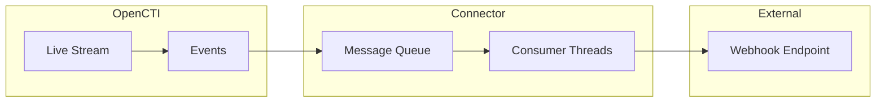

# OpenCTI Webhook Connector

| Status | Date | Comment |
|--------|------|---------|
| Partner Verified | -    | -       |

The Webhook connector streams OpenCTI events to external systems via HTTP POST requests, enabling real-time integration with SOAR platforms, ticketing systems, and other tools.

## Table of Contents

- [OpenCTI Webhook Connector](#opencti-webhook-connector)
  - [Table of Contents](#table-of-contents)
  - [Introduction](#introduction)
  - [Installation](#installation)
    - [Requirements](#requirements)
  - [Configuration variables](#configuration-variables)
    - [OpenCTI environment variables](#opencti-environment-variables)
    - [Base connector environment variables](#base-connector-environment-variables)
    - [Connector extra parameters environment variables](#connector-extra-parameters-environment-variables)
  - [Deployment](#deployment)
    - [Docker Deployment](#docker-deployment)
    - [Manual Deployment](#manual-deployment)
  - [Usage](#usage)
  - [Behavior](#behavior)
  - [Debugging](#debugging)
  - [Additional information](#additional-information)

## Introduction

The Webhook connector is a stream connector that consumes events from an OpenCTI live stream and forwards them to a configurable HTTP endpoint. This enables real-time integration with external systems such as:

- SOAR platforms (Splunk SOAR, Palo Alto XSOAR, etc.)
- Ticketing systems (ServiceNow, Jira, etc.)
- Custom automation workflows
- Event logging and analytics platforms

Key features:
- Multi-threaded consumer for high-throughput processing
- Token-based authentication support
- Prometheus metrics for monitoring
- JSON payload forwarding

## Installation

### Requirements

- OpenCTI Platform >= 6.0.0

## Configuration variables

There are a number of configuration options, which are set either in `docker-compose.yml` (for Docker) or in `config.yml` (for manual deployment).

### OpenCTI environment variables

| Parameter     | config.yml | Docker environment variable | Mandatory | Description                                          |
|---------------|------------|-----------------------------|-----------|------------------------------------------------------|
| OpenCTI URL   | url        | `OPENCTI_URL`               | Yes       | The URL of the OpenCTI platform.                     |
| OpenCTI Token | token      | `OPENCTI_TOKEN`             | Yes       | The default admin token set in the OpenCTI platform. |

### Base connector environment variables

| Parameter                     | config.yml                 | Docker environment variable             | Default | Mandatory | Description                                                                   |
|-------------------------------|----------------------------|-----------------------------------------|---------|-----------|-------------------------------------------------------------------------------|
| Connector ID                  | id                         | `CONNECTOR_ID`                          |         | Yes       | A unique `UUIDv4` identifier for this connector instance.                     |
| Connector Name                | name                       | `CONNECTOR_NAME`                        |         | Yes       | Name of the webhook instance, to identify multiple webhook connectors.        |
| Connector Scope               | scope                      | `CONNECTOR_SCOPE`                       | webhook | Yes       | Must be `webhook`, not used in this connector.                                |
| Confidence Level              | confidence_level           | `CONNECTOR_CONFIDENCE_LEVEL`            |         | Yes       | The default confidence level for created sightings (1-100).                   |
| Log Level                     | log_level                  | `CONNECTOR_LOG_LEVEL`                   | info    | No        | Determines the verbosity of the logs: `debug`, `info`, `warn`, or `error`.    |
| Consumer Count                | consumer_count             | `CONNECTOR_CONSUMER_COUNT`              | 10      | No        | Number of consumer/worker threads that will push data to webhook.             |
| Live Stream Start Timestamp   | live_stream_start_timestamp | `CONNECTOR_LIVE_STREAM_START_TIMESTAMP` |         | No        | Start timestamp used on connector first start.                                |

### Connector extra parameters environment variables

| Parameter        | config.yml       | Docker environment variable | Default | Mandatory | Description                                                    |
|------------------|------------------|------------------------------|---------|-----------|----------------------------------------------------------------|
| Webhook Type     | webhook.type     | `WEBHOOK_TYPE`               |         | Yes       | The type of webhook integration (only `URL` supported now).    |
| Webhook URL      | webhook.url      | `WEBHOOK_URL`                |         | Yes       | The destination URL for webhook POST requests.                 |
| Webhook Token    | webhook.token    | `WEBHOOK_TOKEN`              |         | No        | The authentication token value.                                |
| Webhook Header   | webhook.header   | `WEBHOOK_HEADER`             |         | No        | Header name for the token (when `AUTH_TYPE=TOKEN`).            |
| Auth Type        | webhook.auth_type| `WEBHOOK_AUTH_TYPE`          | NONE    | No        | Authentication type: `NONE` or `TOKEN`.                        |
| Metrics Enable   | metrics.enable   | `METRICS_ENABLE`             | false   | No        | Whether to enable Prometheus metrics.                          |
| Metrics Address  | metrics.addr     | `METRICS_ADDR`               | 0.0.0.0 | No        | Bind IP address for the metrics endpoint.                      |
| Metrics Port     | metrics.port     | `METRICS_PORT`               | 9113    | No        | Port for the metrics endpoint.                                 |

## Deployment

### Docker Deployment

Build the Docker image:

```bash
docker build -t opencti/connector-webhook:latest .
```

Configure the connector in `docker-compose.yml`:

```yaml
  connector-webhook:
    image: opencti/connector-webhook:latest
    environment:
      - OPENCTI_URL=http://localhost
      - OPENCTI_TOKEN=ChangeMe
      - CONNECTOR_ID=ChangeMe
      - CONNECTOR_NAME=Webhook
      - CONNECTOR_SCOPE=webhook
      - CONNECTOR_CONFIDENCE_LEVEL=50
      - CONNECTOR_LOG_LEVEL=info
      - CONNECTOR_CONSUMER_COUNT=10
      - WEBHOOK_TYPE=URL
      - WEBHOOK_URL=https://your-endpoint.com/webhook
      - WEBHOOK_AUTH_TYPE=TOKEN
      - WEBHOOK_HEADER=X-API-Key
      - WEBHOOK_TOKEN=your-api-token
      - METRICS_ENABLE=false
    restart: always
```

Start the connector:

```bash
docker compose up -d
```

### Manual Deployment

1. Create `config.yml` based on `config.yml.sample`.

2. Install dependencies:

```bash
pip3 install -r requirements.txt
```

3. Start the connector from the `src` directory:

```bash
python3 webhook.py
```

## Usage

The connector automatically forwards OpenCTI events to the configured webhook endpoint:

1. Create a Live Stream in OpenCTI (Data Management → Data Sharing → Live Streams)
2. Configure the stream with desired filters (entity types, markings, etc.)
3. Copy the Live Stream ID to the connector configuration
4. Ensure your receiving endpoint is ready to accept POST requests
5. Start the connector

## Behavior

The connector listens to OpenCTI live stream events and forwards them as HTTP POST requests.

### Data Flow



### Event Processing

| Event Type | Action                                |
|------------|---------------------------------------|
| create     | POST new entity data to webhook       |
| update     | POST updated entity data to webhook   |
| delete     | POST delete event to webhook          |

### Request Format

The connector sends HTTP POST requests with:

**Headers:**
```
Content-Type: application/json
Accept: application/json
<Custom-Header>: <Token>  (if AUTH_TYPE=TOKEN)
```

**Body:**
The raw event data from OpenCTI in JSON format, containing the STIX entity and metadata.

### Authentication Options

| Auth Type | Description                                              |
|-----------|----------------------------------------------------------|
| NONE      | No authentication headers sent                           |
| TOKEN     | Custom header with token value (e.g., `X-API-Key: abc123`) |

## Debugging

Enable verbose logging by setting:

```env
CONNECTOR_LOG_LEVEL=debug
```

Log output includes:
- Message processing status
- Consumer thread activity
- Webhook delivery status

### Prometheus Metrics

When enabled, the following metrics are available:

| Metric               | Type    | Description                           |
|----------------------|---------|---------------------------------------|
| processed_messages   | Counter | Number of processed messages by action |
| current_state        | Gauge   | Current connector state (timestamp)   |

### Common Issues

| Issue                    | Solution                                              |
|--------------------------|-------------------------------------------------------|
| Connection refused       | Verify webhook URL is accessible from connector       |
| Authentication failed    | Check token and header configuration                  |
| High latency             | Increase `CONSUMER_COUNT` for more parallelism        |
| Missing Live Stream ID   | Configure `CONNECTOR_LIVE_STREAM_ID` in environment   |

## Additional information

- **Payload Format**: Events are forwarded as-is from OpenCTI's live stream
- **Retry Logic**: No built-in retry; implement retry in your receiving endpoint
- **Rate Limiting**: Adjust `CONSUMER_COUNT` to control throughput
- **SOAR Integration**: Commonly used with Splunk SOAR, XSOAR, TheHive
- **Custom Processing**: Implement endpoint logic to parse and transform events
- **Monitoring**: Enable Prometheus metrics for production deployments
