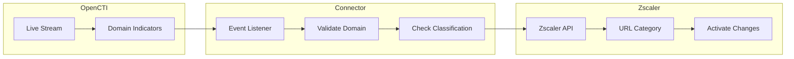

# OpenCTI Zscaler Connector

| Status | Date | Comment |
|--------|------|---------|
| Community | -    | -       |

The Zscaler connector streams OpenCTI domain indicators to Zscaler for URL filtering and blocking.

## Table of Contents

- [OpenCTI Zscaler Connector](#opencti-zscaler-connector)
  - [Table of Contents](#table-of-contents)
  - [Introduction](#introduction)
  - [Installation](#installation)
    - [Requirements](#requirements)
  - [Configuration variables](#configuration-variables)
    - [OpenCTI environment variables](#opencti-environment-variables)
    - [Base connector environment variables](#base-connector-environment-variables)
    - [Connector extra parameters environment variables](#connector-extra-parameters-environment-variables)
  - [Deployment](#deployment)
    - [Docker Deployment](#docker-deployment)
    - [Manual Deployment](#manual-deployment)
  - [Usage](#usage)
  - [Behavior](#behavior)
    - [Dissemination assurance (deployment write-back)](#dissemination-assurance-deployment-write-back)
  - [Debugging](#debugging)
  - [Additional information](#additional-information)

## Introduction

This connector integrates OpenCTI threat intelligence into the Zscaler environment by managing domain indicators in Zscaler URL categories. It focuses on domain-name indicators and automatically adds or removes domains from a configurable blacklist category.

Key features:
- Real-time domain indicator management
- Automatic Zscaler configuration activation
- Domain validation before submission
- Classification lookup before blacklisting
- Rate limit handling with automatic retries
- Duplicate domain detection

## Installation

### Requirements

- OpenCTI Platform >= 6.0.0
- Zscaler account with API access
- Zscaler API key, username, and password

## Configuration variables

There are a number of configuration options, which are set either in `docker-compose.yml` (for Docker) or in `config.yml` (for manual deployment).

### OpenCTI environment variables

| Parameter     | config.yml   | Docker environment variable | Mandatory | Description                                          |
|---------------|--------------|------------------------------|-----------|------------------------------------------------------|
| OpenCTI URL   | url          | `OPENCTI_URL`                | Yes       | The URL of the OpenCTI platform.                     |
| OpenCTI Token | token        | `OPENCTI_TOKEN`              | Yes       | The default admin token set in the OpenCTI platform. |
| SSL Verify    | ssl_verify   | `OPENCTI_SSL_VERIFY`         | No        | Verify SSL certificates (default: false).            |

### Base connector environment variables

| Parameter                      | config.yml                 | Docker environment variable              | Default          | Mandatory | Description                                                                    |
|--------------------------------|----------------------------|------------------------------------------|------------------|-----------|--------------------------------------------------------------------------------|
| Connector ID                   | id                         | `CONNECTOR_ID`                           |                  | Yes       | A unique `UUIDv4` identifier for this connector instance.                      |
| Connector Type                 | type                       | `CONNECTOR_TYPE`                         | STREAM           | Yes       | Should always be set to `STREAM` for this connector.                           |
| Connector Name                 | name                       | `CONNECTOR_NAME`                         | ZscalerConnector | No        | Name of the connector.                                                         |
| Connector Scope                | scope                      | `CONNECTOR_SCOPE`                        | Zscaler          | Yes       | The scope of the connector.                                                    |
| Live Stream ID                 | live_stream_id             | `CONNECTOR_LIVE_STREAM_ID`               |                  | Yes       | The Live Stream ID of the stream created in the OpenCTI interface.             |
| Live Stream Listen Delete      | live_stream_listen_delete  | `CONNECTOR_LIVE_STREAM_LISTEN_DELETE`    | true             | Yes       | Listen to delete events.                                                       |
| Live Stream No Dependencies    | live_stream_no_dependencies| `CONNECTOR_LIVE_STREAM_NO_DEPENDENCIES`  | true             | No        | Set to `true` unless synchronizing between OpenCTI platforms.                  |
| Log Level                      | log_level                  | `CONNECTOR_LOG_LEVEL`                    | info             | No        | Determines the verbosity of the logs.                                          |

### Connector extra parameters environment variables

| Parameter        | config.yml            | Docker environment variable | Default           | Mandatory | Description                                         |
|------------------|----------------------|------------------------------|-------------------|-----------|-----------------------------------------------------|
| Username         | zscaler.username     | `ZSCALER_USERNAME`           |                   | Yes       | Zscaler username for API authentication.            |
| Password         | zscaler.password     | `ZSCALER_PASSWORD`           |                   | Yes       | Zscaler password for API authentication.            |
| API Key          | zscaler.api_key      | `ZSCALER_API_KEY`            |                   | Yes       | Zscaler API key.                                    |
| Blacklist Name   | zscaler.blacklist_name | `ZSCALER_BLACKLIST_NAME`   | BLACK_LIST_DYNDNS | Yes       | Name of the Zscaler URL category to manage.         |

## Deployment

### Docker Deployment

Build the Docker image:

```bash
docker build -t opencti/connector-zscaler:latest .
```

Configure the connector in `docker-compose.yml`:

```yaml
  connector-zscaler:
    image: opencti/connector-zscaler:latest
    environment:
      - OPENCTI_URL=http://localhost
      - OPENCTI_TOKEN=ChangeMe
      - CONNECTOR_ID=ChangeMe
      - CONNECTOR_TYPE=STREAM
      - CONNECTOR_NAME=ZscalerConnector
      - CONNECTOR_SCOPE=Zscaler
      - CONNECTOR_LOG_LEVEL=info
      - CONNECTOR_LIVE_STREAM_ID=ChangeMe
      - CONNECTOR_LIVE_STREAM_LISTEN_DELETE=true
      - CONNECTOR_LIVE_STREAM_NO_DEPENDENCIES=true
      - ZSCALER_USERNAME=ChangeMe
      - ZSCALER_PASSWORD=ChangeMe
      - ZSCALER_API_KEY=ChangeMe
      - ZSCALER_BLACKLIST_NAME=YOUR_CUSTOM_BLACKLIST
    restart: always
    networks:
      - opencti_network

networks:
  opencti_network:
    external: true
```

Start the connector:

```bash
docker compose up -d
```

### Manual Deployment

1. Create `config.yml` based on `config.yml.sample`:

```yaml
opencti:
  url: 'https://your-opencti-instance.com'
  token: 'YOUR_OPENCTI_TOKEN'
  ssl_verify: false

connector:
  name: 'ZscalerConnector'
  id: 'ChangeMe'
  live_stream_id: 'ChangeMe'
  live_stream_listen_delete: true
  scope: 'Zscaler'
  log_level: 'info'

zscaler:
  username: 'YOUR_ZSCALER_USERNAME'
  password: 'YOUR_ZSCALER_PASSWORD'
  api_key: 'YOUR_ZSCALER_API_KEY'
  blacklist_name: 'BLACK_LIST_DYNDNS'
```

2. Install dependencies:

```bash
pip3 install -r requirements.txt
```

3. Start the connector from the `src` directory:

```bash
python3 main.py
```

## Usage

1. Create a Live Stream in OpenCTI (Data Management -> Data Sharing -> Live Streams)
2. Configure the stream to include domain-name indicators
3. Copy the Live Stream ID to the connector configuration
4. Start the connector

The connector will:
- Authenticate with Zscaler API on startup
- Listen for domain indicator create/delete events, and the updates that change their pattern
- Add domains to the specified blacklist category
- Automatically activate changes in Zscaler

## Behavior

The connector listens to OpenCTI live stream events and manages domains in Zscaler URL categories.

### Data Flow


```mermaid
graph LR
    subgraph OpenCTI
        direction TB
        Stream[Live Stream]
        Indicators[Domain Indicators]
    end

    subgraph Connector
        direction LR
        Listen[Event Listener]
        Validate[Validate Domain]
        Check[Check Classification]
    end

    subgraph Zscaler
        direction TB
        API[Zscaler API]
        Category[URL Category]
        Activate[Activate Changes]
    end

    Stream --> Indicators
    Indicators --> Listen
    Listen --> Validate
    Validate --> Check
    Check --> API
    API --> Category
    Category --> Activate
```

### Event Processing

| Event Type | Action                                       |
|------------|----------------------------------------------|
| create     | Adds domain to Zscaler blacklist category    |
| update     | When the pattern changes: removes the former domain (unless another indicator keeps it), then adds the new one |
| delete     | Removes domain from Zscaler blacklist        |

### Domain Processing Flow

1. **Pattern Extraction**: Extract domain from STIX pattern `[domain-name:value = 'example.com']`
2. **Validation**: Verify domain format is valid
3. **Classification Lookup**: Check current Zscaler classification
4. **Membership Check**: Skip the addition of a domain already in the blacklist, and the removal of a domain absent from it
5. **Add/Remove**: Add or remove domain from URL category
6. **Activation**: Activate the Zscaler configuration after each addition or removal (no activation when the blacklist
   did not change): `PENDING` changes are activated and an activation `INPROGRESS` is checked every 5 seconds until the
   configuration is `ACTIVE`. The activation requests renew an expired session and wait out throttling like the other
   requests, and a busy Zscaler (HTTP 503) is asked again after a growing delay; a failed or unfinished activation after
   an addition reports the deployment `failed`

### Dissemination assurance (deployment write-back)

The connector reports to OpenCTI whether each domain indicator is actually in the Zscaler blacklist URL category. The
status is stored on the `deployed-on` relationship between the indicator and the `Zscaler Internet Access` Security
Platform entity (created if it does not exist).

| When                                      | Reported to OpenCTI                                                                                    |
|-------------------------------------------|--------------------------------------------------------------------------------------------------------|
| Domain added (or already listed)          | `deployed`                                                                                             |
| Domain rejected by Zscaler                | `failed`, with a short reason such as "Zscaler refused the blacklist update: permission denied" or "Zscaler did not complete the configuration activation in time" (the Zscaler response is written to the connector log); a malformed URL category read before the update is reported "Zscaler returned an unexpected response to the blacklist read" |
| Invalid domain pattern                    | Nothing: the indicator is never pushed                                                                 |
| Delete event processed                    | `removed` (also when the domain was already absent, or kept for another indicator); nothing when the blacklist or the other indicators cannot be read, or while a former domain kept by a refused removal is still in the blacklist |
| Pattern updated                           | The former domain leaves the blacklist as for a delete, then the new one is reported as for a create; `failed` when the former domain cannot be removed (the new one is not added, and the former domain is kept in the connector state until a later update or delete of the indicator removes it), `removed` when the new pattern holds no valid domain |
| Reconciliation, domain present            | `active`                                                                                               |
| Reconciliation, domain absent             | `removed` (removed from the category outside of OpenCTI)                                               |
| Reconciliation, `pending` (analyst retry) | The domain is added again (or, when already listed, its change activated again) and reported `deployed` or `failed` |
| Reconciliation, withdrawal or expiry      | Revoked, expired or withdrawn indicators still listed are removed from the category and reported `removed` |

- **Reconciliation**: every `DEPLOYMENT_RECONCILIATION_INTERVAL` minutes, the domains of the blacklist URL category are
  read back (`GET /urlCategories/{id}`, one request) once the configuration is `ACTIVE`: pending changes are activated
  first, and the run is skipped while they cannot be, so a domain staged but not enforced is never reported `active`.
  The category does not store the OpenCTI id, so deployments are
  matched by value. A read-back error or a malformed category (an entry of `urls` that is not a non-empty string)
  skips the run: indicators are never reported `removed` from a partial listing. Other entries of the category (URLs
  with a path, wildcard domains, entries added outside OpenCTI) are listed as they are and only matter when they are
  the value of a deployment. Each change made by the reconciliation is activated
  like the stream changes (mind the 400 requests per hour limit).
- **Shared domains**: the category only holds values, so a domain shared by several OpenCTI indicators stays listed
  while one of them still needs it, and the removed indicator is reported `removed` all the same. On a delete event, the
  connector looks for another valid indicator (neither revoked nor expired) with the same
  `[domain-name:value = '...']` pattern in OpenCTI, reading 100 indicators per page and stopping at the first one that
  keeps the domain; when more than 1 000 indicators name the domain and none of them keeps it, the domain is not
  removed and the error is logged, as when OpenCTI cannot be queried. During the reconciliation, a domain is kept while a deployment that
  stays on Zscaler shares it, and a domain several withdrawn or expired deployments share is removed once.
- **Hits**: not reported. The ZIA API exposes no hit of a URL category (web logs are exported through Nanolog Streaming
  Service feeds).
- **IOC validation requests**: OpenAEV runs the benign validation tests requested in OpenCTI and writes their results;
  the requests only target indicators this connector reports `deployed` or `active`. The two analyst requests carried by
  a deployment are handled by the reconciliation: a retry (`pending`) adds the domain again, a withdrawal removes it.
- **Graceful degradation**: on OpenCTI platforms without the deployment write-back API the feature is a no-op (logged
  once). Write-back errors are logged as warnings and never block the dissemination.

#### What you see in OpenCTI

The [Deployments tabs](https://docs.opencti.io/latest/usage/dissemination-assurance/#viewing-deployments) of an
indicator and of the `Zscaler Internet Access` Security Platform show one row per deployment, with its status and the
time of the last report (no hit count: the ZIA API exposes none for a URL category).

- A `failed` deployment shows the reason the connector reported, for example "Zscaler refused the blacklist update:
  permission denied" or "Zscaler did not complete the configuration activation in time"; the HTTP status and the
  Zscaler response are in the connector log.
- **Deploy again** sets the deployment to `pending`: the next reconciliation adds the domain again, activates the change
  and reports `deployed` or `failed`.
- **Remove from this platform** withdraws the indicator: the next reconciliation removes its domain from the category,
  unless a deployment staying on Zscaler shares it, and reports it `removed`.

| Environment variable                 | Default                   | Description                                                                   |
|--------------------------------------|---------------------------|-------------------------------------------------------------------------------|
| `DEPLOYMENT_REPORTING_ENABLED`       | `true`                    | Report the deployment status of the pushed domains.                           |
| `DEPLOYMENT_RECONCILIATION_INTERVAL` | `60`                      | Minutes between two reconciliations, `0` disables the reconciliation.         |
| `SECURITY_PLATFORM_NAME`             | `Zscaler Internet Access` | Name of the Security Platform entity in OpenCTI.                              |
| `SECURITY_PLATFORM_TYPE`             |                           | Type of the Security Platform entity (`security_platform_type_ov`), optional. |
| `SECURITY_PLATFORM_ID`               |                           | Id of an existing Security Platform entity, used instead of the name.         |

### Rate Limiting

The connector handles Zscaler API rate limits:
- Maximum 400 requests per hour
- Automatic retry with exponential backoff
- Respects `Retry-After` headers

## Debugging

Enable verbose logging by setting:

```env
CONNECTOR_LOG_LEVEL=debug
```

### Common Issues

| Issue                          | Solution                                              |
|--------------------------------|-------------------------------------------------------|
| Authentication failed          | Verify username, password, and API key                |
| Domain already in blacklist    | Normal behavior - domain is skipped                   |
| Invalid domain pattern         | Ensure indicator uses STIX pattern format             |
| Rate limit exceeded (429)      | Connector will automatically retry                    |
| Activation failed (503)        | Connector retries with exponential backoff            |

### FAQ

| Question                                | Answer                                              |
|-----------------------------------------|-----------------------------------------------------|
| What if a domain is already blocked?    | The connector checks and skips duplicates           |
| Can I use multiple blacklists?          | No, one blacklist per connector instance            |
| Does it handle rate limits?             | Yes, with automatic retries                         |

## Additional information

- **Supported Indicators**: Only `domain-name` type indicators
- **Pattern Format**: Must use STIX pattern `[domain-name:value = 'example.com']`
- **API Endpoint**: Uses `zsapi.zscalertwo.net` - adjust if using different Zscaler cloud
- **Session Management**: Automatic re-authentication when session expires
- **Activation**: Changes are automatically activated after each operation
