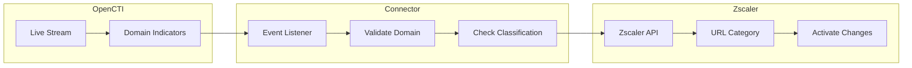

# OpenCTI Zscaler Connector

| Status | Date | Comment |
|--------|------|---------|
| Community | -    | -       |

The Zscaler connector streams OpenCTI domain indicators to Zscaler for URL filtering and blocking.

## Table of Contents

- [OpenCTI Zscaler Connector](#opencti-zscaler-connector)
  - [Table of Contents](#table-of-contents)
  - [Introduction](#introduction)
  - [Installation](#installation)
    - [Requirements](#requirements)
  - [Configuration variables](#configuration-variables)
    - [OpenCTI environment variables](#opencti-environment-variables)
    - [Base connector environment variables](#base-connector-environment-variables)
    - [Connector extra parameters environment variables](#connector-extra-parameters-environment-variables)
  - [Deployment](#deployment)
    - [Docker Deployment](#docker-deployment)
    - [Manual Deployment](#manual-deployment)
  - [Usage](#usage)
  - [Behavior](#behavior)
  - [Debugging](#debugging)
  - [Additional information](#additional-information)
  - [Migrating from the legacy API](#migrating-from-the-legacy-api)

## Introduction

This connector integrates OpenCTI threat intelligence into the Zscaler environment by managing domain indicators in Zscaler URL categories. It focuses on domain-name indicators and automatically adds or removes domains from a configurable blacklist category.

Key features:
- Real-time domain indicator management
- Automatic Zscaler configuration activation
- Domain validation before submission
- Classification lookup before blacklisting
- Rate limit handling with automatic retries
- Duplicate domain detection

## Installation

### Requirements

- OpenCTI Platform >= 6.0.0
- Zscaler tenant migrated to [ZIdentity](https://help.zscaler.com/zidentity/migrating-zscaler-service-admins-zidentity)
- A ZIdentity API client (client ID and client secret) with a ZIA API role allowed to manage URL categories and activate changes

The connector uses [Zscaler OneAPI](https://automate.zscaler.com/docs/api-reference-and-guides/guides/UnderstandingOneAPI)
(OAuth 2.0 client credentials). The legacy ZIA API authentication (username, password and API key) is no longer supported,
see [Migrating from the legacy API](#migrating-from-the-legacy-api).

## Configuration variables

There are a number of configuration options, which are set either in `docker-compose.yml` (for Docker) or in `config.yml` (for manual deployment).

### OpenCTI environment variables

| Parameter     | config.yml   | Docker environment variable | Mandatory | Description                                          |
|---------------|--------------|------------------------------|-----------|------------------------------------------------------|
| OpenCTI URL   | url          | `OPENCTI_URL`                | Yes       | The URL of the OpenCTI platform.                     |
| OpenCTI Token | token        | `OPENCTI_TOKEN`              | Yes       | The default admin token set in the OpenCTI platform. |
| SSL Verify    | ssl_verify   | `OPENCTI_SSL_VERIFY`         | No        | Verify SSL certificates (default: false).            |

### Base connector environment variables

| Parameter                      | config.yml                 | Docker environment variable              | Default          | Mandatory | Description                                                                    |
|--------------------------------|----------------------------|------------------------------------------|------------------|-----------|--------------------------------------------------------------------------------|
| Connector ID                   | id                         | `CONNECTOR_ID`                           |                  | Yes       | A unique `UUIDv4` identifier for this connector instance.                      |
| Connector Type                 | type                       | `CONNECTOR_TYPE`                         | STREAM           | Yes       | Should always be set to `STREAM` for this connector.                           |
| Connector Name                 | name                       | `CONNECTOR_NAME`                         | ZscalerConnector | No        | Name of the connector.                                                         |
| Connector Scope                | scope                      | `CONNECTOR_SCOPE`                        | Zscaler          | Yes       | The scope of the connector.                                                    |
| Live Stream ID                 | live_stream_id             | `CONNECTOR_LIVE_STREAM_ID`               |                  | Yes       | The Live Stream ID of the stream created in the OpenCTI interface.             |
| Live Stream Listen Delete      | live_stream_listen_delete  | `CONNECTOR_LIVE_STREAM_LISTEN_DELETE`    | true             | Yes       | Listen to delete events.                                                       |
| Live Stream No Dependencies    | live_stream_no_dependencies| `CONNECTOR_LIVE_STREAM_NO_DEPENDENCIES`  | true             | No        | Set to `true` unless synchronizing between OpenCTI platforms.                  |
| Log Level                      | log_level                  | `CONNECTOR_LOG_LEVEL`                    | info             | No        | Determines the verbosity of the logs.                                          |

### Connector extra parameters environment variables

| Parameter        | config.yml            | Docker environment variable | Default           | Mandatory | Description                                         |
|------------------|----------------------|------------------------------|-------------------|-----------|-----------------------------------------------------|
| Client ID        | zscaler.client_id      | `ZSCALER_CLIENT_ID`      |                   | Yes       | Client ID of the ZIdentity API client.                                         |
| Client Secret    | zscaler.client_secret  | `ZSCALER_CLIENT_SECRET`  |                   | Yes       | Client secret of the ZIdentity API client.                                     |
| Vanity Domain    | zscaler.vanity_domain  | `ZSCALER_VANITY_DOMAIN`  |                   | Yes       | `<vanity_domain>` part of your ZIdentity URL `https://<vanity_domain>.zslogin.net`. |
| Cloud            | zscaler.cloud          | `ZSCALER_CLOUD`          |                   | No        | Zscaler cloud to target (for example `beta`). Leave empty for production (`api.zsapi.net`). |
| Blacklist Name   | zscaler.blacklist_name | `ZSCALER_BLACKLIST_NAME` | BLACK_LIST_DYNDNS | No        | ID of the Zscaler URL category to manage (for example `CUSTOM_01`), not its display name. |
| SSL Verify       | zscaler.ssl_verify     | `ZSCALER_SSL_VERIFY`     | true              | No        | Verify SSL certificates when calling the Zscaler API.                          |

## Deployment

### Docker Deployment

Build the Docker image:

```bash
docker build -t opencti/connector-zscaler:latest .
```

Configure the connector in `docker-compose.yml`:

```yaml
  connector-zscaler:
    image: opencti/connector-zscaler:latest
    environment:
      - OPENCTI_URL=http://localhost
      - OPENCTI_TOKEN=ChangeMe
      - CONNECTOR_ID=ChangeMe
      - CONNECTOR_TYPE=STREAM
      - CONNECTOR_NAME=ZscalerConnector
      - CONNECTOR_SCOPE=Zscaler
      - CONNECTOR_LOG_LEVEL=info
      - CONNECTOR_LIVE_STREAM_ID=ChangeMe
      - CONNECTOR_LIVE_STREAM_LISTEN_DELETE=true
      - CONNECTOR_LIVE_STREAM_NO_DEPENDENCIES=true
      - ZSCALER_CLIENT_ID=ChangeMe
      - ZSCALER_CLIENT_SECRET=ChangeMe
      - ZSCALER_VANITY_DOMAIN=ChangeMe
      - ZSCALER_BLACKLIST_NAME=CUSTOM_01
    restart: always
    networks:
      - opencti_network

networks:
  opencti_network:
    external: true
```

Start the connector:

```bash
docker compose up -d
```

### Manual Deployment

1. Create `config.yml` based on `config.yml.sample`:

```yaml
opencti:
  url: 'https://your-opencti-instance.com'
  token: 'YOUR_OPENCTI_TOKEN'
  ssl_verify: false

connector:
  name: 'ZscalerConnector'
  id: 'ChangeMe'
  live_stream_id: 'ChangeMe'
  live_stream_listen_delete: true
  scope: 'Zscaler'
  log_level: 'info'

zscaler:
  client_id: 'YOUR_ZIDENTITY_CLIENT_ID'
  client_secret: 'YOUR_ZIDENTITY_CLIENT_SECRET'
  vanity_domain: 'YOUR_VANITY_DOMAIN'
  blacklist_name: 'CUSTOM_01'
```

2. Install dependencies:

```bash
pip3 install -r requirements.txt
```

3. Start the connector from the `src` directory:

```bash
python3 main.py
```

## Usage

1. Create a Live Stream in OpenCTI (Data Management -> Data Sharing -> Live Streams)
2. Configure the stream to include domain-name indicators
3. Copy the Live Stream ID to the connector configuration
4. Start the connector

The connector will:
- Request a Zscaler OneAPI access token on startup
- Listen for domain indicator create/delete events
- Add domains to the specified blacklist category
- Automatically activate changes in Zscaler

## Behavior

The connector listens to OpenCTI live stream events and manages domains in Zscaler URL categories.

### Data Flow


```mermaid
graph LR
    subgraph OpenCTI
        direction TB
        Stream[Live Stream]
        Indicators[Domain Indicators]
    end

    subgraph Connector
        direction LR
        Listen[Event Listener]
        Validate[Validate Domain]
        Check[Check Classification]
    end

    subgraph Zscaler
        direction TB
        API[Zscaler API]
        Category[URL Category]
        Activate[Activate Changes]
    end

    Stream --> Indicators
    Indicators --> Listen
    Listen --> Validate
    Validate --> Check
    Check --> API
    API --> Category
    Category --> Activate
```

### Event Processing

| Event Type | Action                                       |
|------------|----------------------------------------------|
| create     | Adds domain to Zscaler blacklist category    |
| delete     | Removes domain from Zscaler blacklist        |

### Domain Processing Flow

1. **Pattern Extraction**: Extract domain from STIX pattern `[domain-name:value = 'example.com']`
2. **Validation**: Verify domain format is valid
3. **Classification Lookup**: Check current Zscaler classification
4. **Duplicate Check**: Verify domain not already in blacklist
5. **Add/Remove**: Add or remove domain from URL category
6. **Activation**: Automatically activate Zscaler configuration changes

### Rate Limiting

The connector handles Zscaler API rate limits:
- On HTTP 429, waits for the delay given by the `x-ratelimit-reset` header (or `Retry-After`) before retrying
- Retries activation with exponential backoff while another activation is in progress (HTTP 503)

## Debugging

Enable verbose logging by setting:

```env
CONNECTOR_LOG_LEVEL=debug
```

### Common Issues

| Issue                          | Solution                                              |
|--------------------------------|-------------------------------------------------------|
| Authentication failed          | Verify client ID, client secret and vanity domain, and that the API client has a ZIA role |
| HTTP 500 on URL category calls | `ZSCALER_BLACKLIST_NAME` must be a category ID (`CUSTOM_XX`), not a display name |
| Domain already in blacklist    | Normal behavior - domain is skipped                   |
| Invalid domain pattern         | Ensure indicator uses STIX pattern format             |
| Rate limit exceeded (429)      | Connector will automatically retry                    |
| Activation failed (503)        | Connector retries with exponential backoff            |

### FAQ

| Question                                | Answer                                              |
|-----------------------------------------|-----------------------------------------------------|
| What if a domain is already blocked?    | The connector checks and skips duplicates           |
| Can I use multiple blacklists?          | No, one blacklist per connector instance            |
| Does it handle rate limits?             | Yes, with automatic retries                         |

## Additional information

- **Supported Indicators**: Only `domain-name` type indicators
- **Pattern Format**: Must use STIX pattern `[domain-name:value = 'example.com']`
- **API Endpoint**: Uses Zscaler OneAPI, `https://api.zsapi.net/zia/api/v1` (or `api.<cloud>.zsapi.net` when `ZSCALER_CLOUD` is set)
- **Token Management**: The access token is cached and renewed before it expires, or when the API rejects it
- **Activation**: Changes are automatically activated after each successful update

## Migrating from the legacy API

Earlier versions of this connector authenticated against the legacy ZIA API
(`zsapi.zscalertwo.net`) with a username, a password and an API key. Zscaler is
deprecating this authentication method, and the connector now only supports
Zscaler OneAPI.

1. Make sure your tenant is migrated to ZIdentity.
2. In ZIdentity, create an API client and assign it a ZIA API role allowed to
   manage URL categories and activate changes.
3. Replace `ZSCALER_USERNAME`, `ZSCALER_PASSWORD` and `ZSCALER_API_KEY` with
   `ZSCALER_CLIENT_ID`, `ZSCALER_CLIENT_SECRET` and `ZSCALER_VANITY_DOMAIN`.

The legacy variables are ignored: the connector logs a warning if they are still set.
