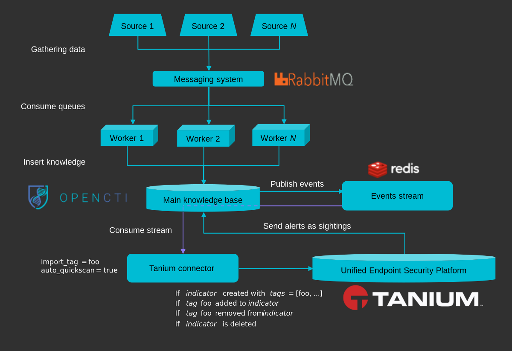

# OpenCTI Tanium Connector

This connector allows organizations to feed the **Tanium platform** using OpenCTI knowledge. 

This connector leverages the OpenCTI *events stream*, so it consumes knowledge in real time and, depending on its settings, create detection and hunting intel pieces in the Tanium platform.

## General overview

OpenCTI data is coming from *import* connectors. Once this data is ingested in OpenCTI, it is pushed to a Redis event stream. This stream is consumed by the Tanium connector to insert intel in the Tanium platform.

## Installation

### Requirements

- OpenCTI Platform >= 4.2.4
- Tanium Threat Response >= 3.X.X
- Tanium Reputation >= 5.X.X

### Configuration

| Parameter                            | Docker envvar                       | Mandatory    | Description                                                                                                                                                |
| ------------------------------------ | ----------------------------------- | ------------ | ---------------------------------------------------------------------------------------------------------------------------------------------------------- |
| `opencti_url`                        | `OPENCTI_URL`                       | Yes          | The URL of the OpenCTI platform.                                                                                                                           |
| `opencti_token`                      | `OPENCTI_TOKEN`                     | Yes          | The default admin token configured in the OpenCTI platform parameters file.                                                                                |
| `connector_id`                       | `CONNECTOR_ID`                      | Yes          | A valid arbitrary `UUIDv4` that must be unique for this connector.                                                                                         |
| `connector_type`                     | `CONNECTOR_TYPE`                    | Yes          | Must be `STREAM` (this is the connector type).                                                                                                             |
| `connector_name`                     | `CONNECTOR_NAME`                    | Yes          | The name of the Tanium instance, to identify it if you have multiple Tanium connectors.                                                                    |
| `connector_scope`                    | `CONNECTOR_SCOPE`                   | Yes          | Must be `tanium`, not used in this connector.                                                                                                              |
| `connector_confidence_level`         | `CONNECTOR_CONFIDENCE_LEVEL`        | Yes          | The default confidence level for created sightings (a number between 1 and 4).                                                                             |
| `connector_log_level`                | `CONNECTOR_LOG_LEVEL`               | Yes          | The log level for this connector, could be `debug`, `info`, `warn` or `error` (less verbose).                                                              |
| `tanium_url`                         | `TANIUM_URL`                        | Yes          | The Tanium instance URL.                                                                                                                                   |
| `tanium_ssl_verify`                  | `TANIUM_SSL_VERIFY`                 | Yes          | Enable the SSL certificate check (default: `true`)                                                                                                         |
| `tanium_login`                       | `TANIUM_LOGIN`                      | Yes          | The Tanium login user.                                                                                                                                     |
| `tanium_password`                    | `TANIUM_PASSWORD`                   | Yes          | The Tanium password.                                                                                                                                       |
| `tanium_indicator_types`             | `TANIUM_INDICATOR_TYPES`            | Yes          | A list of indicator types separated by `,`, could be `stix`, `yara` or `tanium-signal` (cannot be empty).                                                  |
| `tanium_observable_types`            | `TANIUM_OBSERVABLE_TYPES`           | Yes          | A list of observable types separated by `,`, could be `ipv4-addr`, `ipv6-addr`, `domain-name`, `x-opencti-hostname`, `file` or `process` (can be empty).   |
| `tanium_import_label`                | `TANIUM_IMPORT_LABEL`               | Yes          | If this label is added or present, the entity will be imported in Tanium, can be '*' to import everything.                                                 |
| `tanium_import_from_date`            | `TANIUM_IMPORT_FROM_DATE`           | No           | At the very first run, ignore all knowledge event before this date.                                                                                        |
| `tanium_reputation_blacklist_label`  | `TANIUM_REPUTATION_BLACKLIST_LABEL` | No           | If this label is added or present in an entity containing hashes, these hashes will be imported to Tanium reputation (can be '*' to import everything).    |
| `tanium_auto_quickscan`              | `TANIUM_AUTO_QUICKSCAN`             | No           | Trigger a quickscan for each inserted intel document in Tanium.                                                                                            |
| `tanium_computer_groups`             | `TANIUM_COMPUTER_GROUPS  `          | No           | A list of computer groups separated by `,`, which will be the targets of the automatic quickscan the automatic quickscan                                   |

## Launch the connector and test it

After launching the connector, you should be able to see a new Intel source within the Tanium platform:

Then just add the proper label to an indicator (`tanium_import_label`) or to a file observables (`tanium_reputation_blacklist_label`).